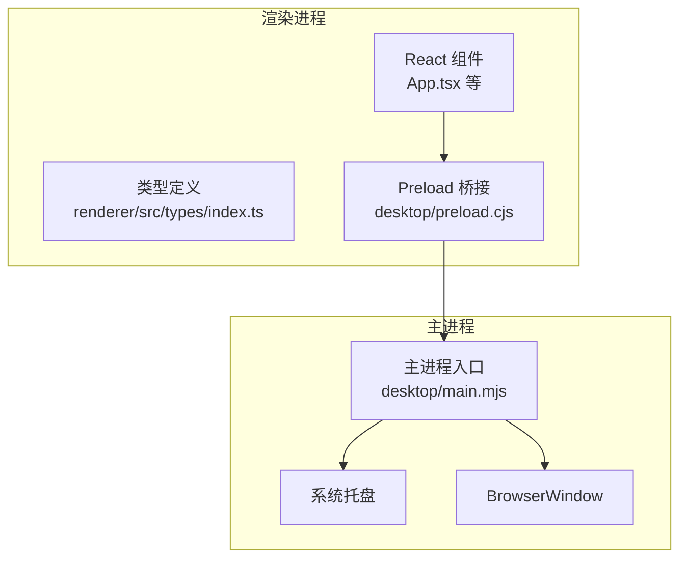
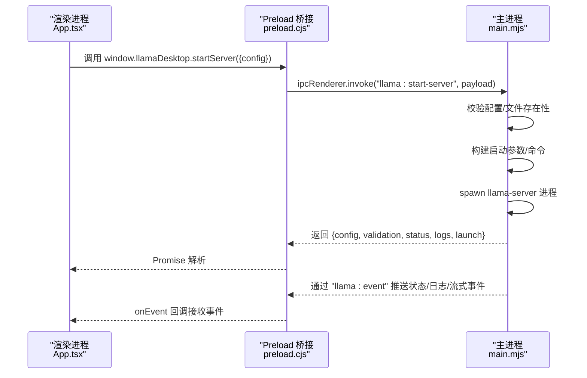
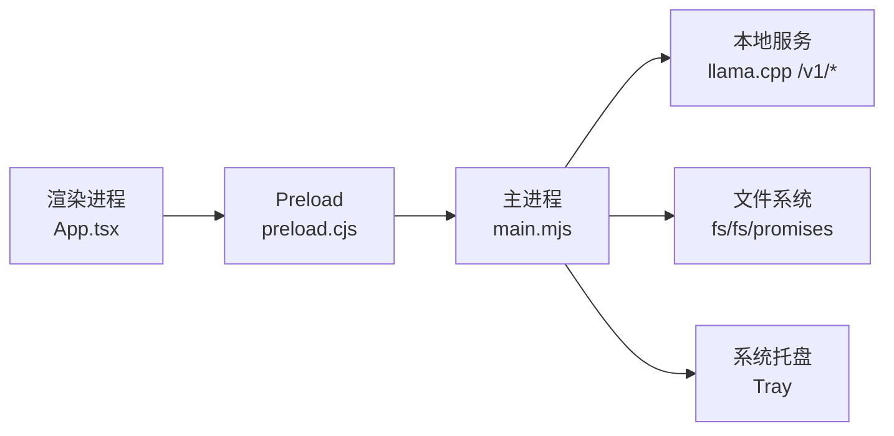

# API 参考

<cite>
**本文引用的文件**
- [desktop/main.mjs](file://desktop/main.mjs)
- [desktop/preload.cjs](file://desktop/preload.cjs)
- [renderer/src/types/index.ts](file://renderer/src/types/index.ts)
- [renderer/src/App.tsx](file://renderer/src/App.tsx)
- [config.toml](file://config.toml)
- [package.json](file://package.json)
- [skills/文本脱敏/SKILL.md](file://skills/文本脱敏/SKILL.md)
- [skills/文章要点总结/SKILL.md](file://skills/文章要点总结/SKILL.md)
</cite>

## 目录
1. [简介](#简介)
2. [项目结构](#项目结构)
3. [核心组件](#核心组件)
4. [架构总览](#架构总览)
5. [详细组件分析](#详细组件分析)
6. [依赖关系分析](#依赖关系分析)
7. [性能考量](#性能考量)
8. [故障排查指南](#故障排查指南)
9. [结论](#结论)
10. [附录](#附录)

## 简介
本文件为 illama-desktop 的完整 API 参考，覆盖 Electron 主进程与渲染进程之间的 IPC 通信接口、OpenAI 兼容 API（通过本地 llama.cpp 服务）、文件系统与附件选择接口、以及技能（Skill）管理接口。文档面向开发者与高级用户，提供参数说明、返回值定义、错误处理、使用示例、性能特性与安全注意事项，并给出最佳实践与常见陷阱提示，确保与实际实现保持同步更新。

## 项目结构
illama-desktop 采用 Electron 架构，主进程负责窗口管理、llama.cpp 服务生命周期、IPC 注册与事件派发；渲染进程负责 UI 与用户交互，通过 preload 暴露受限的 llamaDesktop API。

图表来源
- [desktop/main.mjs](file://desktop/main.mjs)
- [desktop/preload.cjs](file://desktop/preload.cjs)
- [renderer/src/App.tsx](file://renderer/src/App.tsx)
- [renderer/src/types/index.ts](file://renderer/src/types/index.ts)

章节来源
- [desktop/main.mjs](file://desktop/main.mjs)
- [desktop/preload.cjs](file://desktop/preload.cjs)
- [renderer/src/App.tsx](file://renderer/src/App.tsx)
- [renderer/src/types/index.ts](file://renderer/src/types/index.ts)

## 核心组件
- IPC 通信层：主进程集中注册所有 ipcMain.handle 与 ipcMain.on，渲染进程通过 preload 暴露的 window.llamaDesktop 调用。
- OpenAI 兼容 API：通过本地 llama.cpp 服务的 /v1/* 路由提供，主进程转发渲染进程请求并处理流式响应。
- 文件系统与附件：提供文件/目录选择、附件构建、模型/配置文件选择等能力。
- 技能（Skill）管理：基于本地文件系统的技能清单、创建、读取、删除与自动生成。
- 状态与事件：主进程向渲染进程推送状态变更、日志与流式聊天事件。

章节来源
- [desktop/main.mjs](file://desktop/main.mjs)
- [desktop/preload.cjs](file://desktop/preload.cjs)
- [renderer/src/types/index.ts](file://renderer/src/types/index.ts)

## 架构总览
以下序列图展示了渲染进程调用主进程启动本地服务的关键流程。

图表来源
- [desktop/main.mjs](file://desktop/main.mjs)
- [desktop/preload.cjs](file://desktop/preload.cjs)
- [renderer/src/App.tsx](file://renderer/src/App.tsx)

章节来源
- [desktop/main.mjs](file://desktop/main.mjs)
- [desktop/preload.cjs](file://desktop/preload.cjs)
- [renderer/src/App.tsx](file://renderer/src/App.tsx)

## 详细组件分析

### 一、IPC 通信接口（渲染进程 → 主进程）
以下接口均由渲染进程通过 window.llamaDesktop 调用，主进程以 ipcMain.handle 注册。

- llama:get-state
  - 描述：获取应用初始状态（配置、验证、状态、日志、启动详情）
  - 参数：无
  - 返回：包含 config、validation、status、logs、launch 的对象
  - 错误：无（内部错误通过日志体现）

- llama:save-config
  - 描述：保存配置（持久化到桌面状态与 TOML 文件）
  - 参数：{ config: Record<string, unknown> | null }
  - 返回：{ config, validation, status, logs, launch }
  - 错误：配置校验失败或文件写入失败时抛出异常

- llama:start-server
  - 描述：启动本地 llama.cpp 服务（支持 direct/launcher 两种模式）
  - 参数：{ config: Record<string, unknown> | null }
  - 返回：{ config, validation, status, logs, launch }
  - 错误：找不到文件、启动失败、参数非法时抛出异常

- llama:stop-server
  - 描述：停止本地服务（Windows taskkill）
  - 参数：无
  - 返回：{ config, validation, status, logs, launch }
  - 错误：无

- llama:test-health
  - 描述：测试本地服务健康状态
  - 参数：{ config: Record<string, unknown> | null }
  - 返回：{ ok: boolean, url?: string, message?: string }
  - 错误：网络超时/连接失败时返回 ok=false

- llama:get-model-info
  - 描述：查询模型信息（名称、大小、参数量、上下文等）
  - 参数：{ config: Record<string, unknown> | null }
  - 返回：包含模型元数据与属性的对象
  - 错误：服务不可达或解析失败时抛出异常

- llama:chat-completion（非流式）
  - 描述：发送聊天请求（非流式）
  - 参数：{ config: Record<string, unknown> | null; messages: Array<{ role: string; content: string }> }
  - 返回：{ ok: boolean; content: string; raw?: any }
  - 错误：HTTP 非 2xx 或解析失败时抛出异常

- llama:chat-stream（流式）
  - 描述：发送聊天请求（流式，SSE）
  - 参数：{ requestId: string; config: Record<string, unknown> | null; messages: Array<{ role: string; content: string }> }
  - 返回：Promise<{ content: string; raw?: { usage?: { completion_tokens: number; total_tokens: number } } }>
  - 事件：主进程通过 "llama:event" 推送 type='chat-stream'|'chat-stream-done'
  - 错误：HTTP 非 2xx、流式解析失败或中断时抛出异常

- llama:abort-chat
  - 描述：中止当前流式聊天
  - 参数：无
  - 返回：{ ok: true }
  - 错误：无

- llama:pick-attachments
  - 描述：选择附件（按类型过滤）
  - 参数：{ kind: string }（image/text/file）
  - 返回：Attachment[]（含 kind、name、path、size、dataUrl、warning、error）
  - 错误：文件读取/解析失败时在附件对象中标记 error/warning

- llama:pick-file
  - 描述：通用文件选择器
  - 参数：{ properties?: string[]; filters?: Array<{ name: string; extensions: string[] }> } | { properties: ['openDirectory'] }
  - 返回：string | null（所选路径或 null）
  - 错误：无

- llama:skill-list / llama:skill-create / llama:skill-read / llama:skill-delete / llama:skill-generate
  - 描述：技能管理（列出、创建、读取、删除、自动生成）
  - 参数：见下节“技能管理接口”
  - 返回：各接口对应对象或数组
  - 错误：文件不存在、权限不足、生成失败时抛出异常

- 窗口控制
  - llama:window-close / llama:window-minimize / llama:window-maximize / llama:window-is-maximized
  - 描述：窗口最小化/最大化/关闭/查询最大化状态
  - 返回：无/boolean

- 其他
  - llama:set-theme(isDark: boolean)
  - llama:onEvent(handler: (payload: unknown) => void): () => void
  - llama:revealPath(filePath: string)
  - llama:saveFile(payload: Record<string, unknown>)
  - llama:quit()

章节来源
- [desktop/preload.cjs](file://desktop/preload.cjs)
- [desktop/main.mjs](file://desktop/main.mjs)
- [renderer/src/types/index.ts](file://renderer/src/types/index.ts)

### 二、OpenAI 兼容 API（本地 llama.cpp 服务）
illama-desktop 通过本地 llama.cpp 服务提供 OpenAI 兼容的 /v1/* 接口，主进程负责将渲染进程请求转发至本地服务并处理响应。

- 基础地址
  - http://127.0.0.1:8080（默认 host=0.0.0.0 时映射为 127.0.0.1）
  - 可通过 config.toml 的 host/port 调整

- /v1/models
  - 用途：查询可用模型列表
  - 返回：包含 models 或 data[0] 的对象
  - 主进程实现：fetchJson(`${serverUrl}/v1/models`)

- /v1/chat/completions
  - 用途：聊天补全（非流式与流式）
  - 请求体字段（与主进程实现一致）：
    - model: string（默认取 config.model 文件名）
    - messages: Array<{ role: 'user' | 'assistant' | 'system'; content: string | Array<{ type: string; text?: string; image_url?: { url: string } }> }>
    - temperature: number
    - top_p: number
    - max_tokens: number（n_predict=-1 表示不限制）
    - chat_template_kwargs: object（JSON 对象）
    - stream: boolean
  - 非流式返回：choices[0].message.content 或 content
  - 流式返回：SSE，逐行 data: {...}，结束行 [DONE]
  - 主进程实现：非流式与流式分别在 llama:chat-completion 与 llama:chat-stream 中封装

- /v1/embeddings（如启用）
  - 用途：生成嵌入向量
  - 主进程实现：取决于 config.embeddings

- /props
  - 用途：查询服务属性（如模型路径、默认生成设置、槽位数等）
  - 主进程实现：fetchJson(`${serverUrl}/props`)

- /v1
  - 用途：健康检查与基础路由
  - 主进程实现：llama:test-health

章节来源
- [desktop/main.mjs](file://desktop/main.mjs)
- [config.toml](file://config.toml)

### 三、文件系统与附件接口
- 附件类型（Attachment）
  - kind: 'image' | 'audio' | 'text' | 'pdf' | 'system' | 'mcp' | 'file'
  - name/path/size/dataUrl/warning/error

- 附件构建规则（主进程）
  - 文本类：读取文件内容，超过上下文阈值时截断并提示
  - 图片类：若内存允许则转为 dataUrl，否则仅记录路径与警告
  - 其他文件：记录文件名、MIME 与提示/错误信息

- 文件选择器
  - pickAttachments({ kind })：按类型过滤
  - pickFile(options)：通用文件/目录选择
  - select-files/select-model/select-config/select-directory：内部使用

章节来源
- [desktop/main.mjs](file://desktop/main.mjs)

### 四、技能（Skill）管理接口
- 列表：llama:skill-list
  - 返回：Skill[]（dirName, filePath, name, description, whenToUse, argumentHint, allowedTools, body）
- 创建：llama:skill-create
  - 参数：{ name: string; content: string }
  - 返回：{ ok: boolean; dirName: string; filePath: string }
- 读取：llama:skill-read
  - 参数：{ name: string }
  - 返回：Skill + raw
- 删除：llama:skill-delete
  - 参数：{ name: string }
  - 返回：{ ok: boolean }
- 自动生成：llama:skill-generate
  - 参数：{ name: string; description?: string; whenToUse?: string; argumentHint?: string }
  - 返回：{ ok: boolean; content: string }

- 示例技能
  - 文本脱敏：name/description/whenToUse/argumentHint/allowedTools/body
  - 文章要点总结：name/description/whenToUse/allowedTools/body

章节来源
- [desktop/main.mjs](file://desktop/main.mjs)
- [skills/文本脱敏/SKILL.md](file://skills/文本脱敏/SKILL.md)
- [skills/文章要点总结/SKILL.md](file://skills/文章要点总结/SKILL.md)

### 五、事件与状态推送
- 事件通道："llama:event"
  - 类型：
    - status：{ type: 'status'; status: RuntimeStatus }
    - logs：{ type: 'logs'; logs: LogEntry[] }
    - chat-stream：{ type: 'chat-stream'; requestId: string; delta: string }
    - chat-stream-done：{ type: 'chat-stream-done'; requestId: string; done: true; content: string }
- 渲染进程订阅：window.llamaDesktop.onEvent(handler)

章节来源
- [desktop/main.mjs](file://desktop/main.mjs)
- [renderer/src/App.tsx](file://renderer/src/App.tsx)

### 六、类型与配置
- LlamaDesktopAPI（渲染进程暴露的接口集合）
  - 见 [renderer/src/types/index.ts](file://renderer/src/types/index.ts)
- Config（核心配置项）
  - launch_mode、config_path、launcher_path、llama_server_path、llama_bin_dir、model、mmproj、chat_template_kwargs、host、port、ctx_size、n_predict、n_gpu_layers、request_timeout_ms、log_verbosity、verbose、webui、embeddings、continuous_batching、temp、top_k、top_p、min_p、presence_penalty、repeat_penalty、frequency_penalty、repeat_last_n、tfs_z、typical_p、dry_*、threads、threads_batch、batch_size、ubatch_size、split_mode、tensor_split、device、main_gpu、n_cpu_moe、cpu_moe、show_raw_output、show_thinking、expand_thinking、extra_args
- Status/Validation/LogEntry/Skill/Attachment/ChatMessage/Session/AppState 等类型定义
  - 见 [renderer/src/types/index.ts](file://renderer/src/types/index.ts)

章节来源
- [renderer/src/types/index.ts](file://renderer/src/types/index.ts)

### 七、使用示例与调用模式
- 启动服务并获取状态
  - 渲染进程：调用 window.llamaDesktop.startServer({ config })，随后 window.llamaDesktop.getState() 订阅状态变化
  - 参考：[renderer/src/App.tsx](file://renderer/src/App.tsx)，[desktop/preload.cjs](file://desktop/preload.cjs)，[desktop/main.mjs](file://desktop/main.mjs)
- 发送流式聊天请求
  - 渲染进程：准备 messages（可包含附件），调用 window.llamaDesktop.streamChat({ requestId, config, messages })
  - 主进程：解析 SSE，推送 chat-stream 事件，最终推送 chat-stream-done
  - 参考：[renderer/src/App.tsx](file://renderer/src/App.tsx)，[desktop/main.mjs](file://desktop/main.mjs)
- 选择附件并发送
  - 渲染进程：window.llamaDesktop.pickAttachments({ kind })，将返回的附件合并到 messages
  - 参考：[renderer/src/App.tsx](file://renderer/src/App.tsx)，[desktop/main.mjs](file://desktop/main.mjs)
- 技能管理
  - 列表/创建/读取/删除/自动生成
  - 参考：[desktop/main.mjs](file://desktop/main.mjs)，[skills/文本脱敏/SKILL.md](file://skills/文本脱敏/SKILL.md)，[skills/文章要点总结/SKILL.md](file://skills/文章要点总结/SKILL.md)

章节来源
- [renderer/src/App.tsx](file://renderer/src/App.tsx)
- [desktop/preload.cjs](file://desktop/preload.cjs)
- [desktop/main.mjs](file://desktop/main.mjs)

### 八、版本兼容性与废弃策略
- 版本来源：package.json 中的 version 字段
  - 当前版本：见 [package.json](file://package.json)
- 兼容性说明
  - 本项目通过 Electron 与 Node.js 运行时提供稳定 API；主进程与渲染进程间通过 ipcRenderer/ipcMain 严格约定键名与数据结构，建议遵循 types/index.ts 中的接口定义。
  - OpenAI 兼容 API 与 llama.cpp 服务版本相关，建议保持服务与客户端配置一致。
- 废弃策略
  - 未在代码中发现显式标记的废弃接口；新增接口以 llama:* 命名空间扩展，尽量保证向后兼容。

章节来源
- [package.json](file://package.json)
- [renderer/src/types/index.ts](file://renderer/src/types/index.ts)

### 九、性能特性与限制
- 流式响应
  - 主进程以 SSE 方式读取响应，逐行解析 data: JSON，累积增量内容并通过事件推送，最后汇总返回。
  - 参考：[desktop/main.mjs](file://desktop/main.mjs)
- 超时控制
  - 请求超时由 requestTimeoutSignal(config) 控制，默认 600000ms，最小 30000ms。
  - 参考：[desktop/main.mjs](file://desktop/main.mjs)
- 日志压缩
  - 主进程对重复/冗余日志进行压缩，减少 UI 压力。
  - 参考：[desktop/main.mjs](file://desktop/main.mjs)
- 附件大小与上下文限制
  - 文本附件按 ctx_size 动态截断，图片过大时仅记录路径并提示。
  - 参考：[desktop/main.mjs](file://desktop/main.mjs)

章节来源
- [desktop/main.mjs](file://desktop/main.mjs)

### 十、认证与安全
- 本地访问
  - 服务默认绑定到 127.0.0.1，仅本机可访问，不暴露到公网。
  - 参考：[desktop/main.mjs](file://desktop/main.mjs)，[config.toml](file://config.toml)
- 进程隔离
  - preload 通过 contextBridge 仅暴露必要 API，避免直接注入全局对象。
  - 参考：[desktop/preload.cjs](file://desktop/preload.cjs)
- 文件访问
  - 通过 Electron dialog 与 fs/promises 读写，注意权限与路径合法性。
  - 参考：[desktop/main.mjs](file://desktop/main.mjs)

章节来源
- [desktop/main.mjs](file://desktop/main.mjs)
- [desktop/preload.cjs](file://desktop/preload.cjs)
- [config.toml](file://config.toml)

### 十一、最佳实践与常见陷阱
- 最佳实践
  - 使用 requestId 标识流式请求，确保事件匹配与 UI 更新一致性。
  - 在发送前校验附件类型与大小，避免超长文本导致上下文溢出。
  - 合理设置 n_predict、ctx_size、n_gpu_layers，平衡性能与质量。
  - 使用 onEvent 订阅事件，避免阻塞主线程。
- 常见陷阱
  - 忘记配置 mmproj 导致图片无法被普通模型理解。
  - 未处理流式 [DONE] 结束事件，依赖 IPC 返回兜底。
  - 直接将 dataUrl 写入消息可能导致上下文暴涨。
  - 未设置 request_timeout_ms 导致长时间挂起。

章节来源
- [renderer/src/App.tsx](file://renderer/src/App.tsx)
- [desktop/main.mjs](file://desktop/main.mjs)

## 依赖关系分析
- 渲染进程依赖 preload 暴露的 llamaDesktop API
- 主进程集中注册 IPC 处理器，负责与本地服务交互、文件系统操作与系统托盘
- OpenAI 兼容 API 由本地 llama.cpp 服务提供，主进程负责参数规范化与流式解析

图表来源
- [desktop/main.mjs](file://desktop/main.mjs)
- [desktop/preload.cjs](file://desktop/preload.cjs)
- [renderer/src/App.tsx](file://renderer/src/App.tsx)

章节来源
- [desktop/main.mjs](file://desktop/main.mjs)
- [desktop/preload.cjs](file://desktop/preload.cjs)
- [renderer/src/App.tsx](file://renderer/src/App.tsx)

## 性能考量
- 流式传输：SSE 增量推送，降低 UI 响应延迟
- 日志压缩：过滤重复/冗余日志，控制内存占用
- 超时控制：防止长时间阻塞，提升健壮性
- 上下文截断：对长文本附件进行合理截断，避免超出 ctx_size

[本节为通用指导，无需具体文件分析]

## 故障排查指南
- 服务启动失败
  - 检查配置文件、模型文件、启动器是否存在
  - 查看 logs 中的错误信息
  - 参考：[desktop/main.mjs](file://desktop/main.mjs)
- 流式响应异常
  - 确认服务端返回格式正确，关注 [DONE] 结束行
  - 检查 request_timeout_ms 设置
  - 参考：[desktop/main.mjs](file://desktop/main.mjs)
- 附件读取失败
  - 检查文件权限与编码，查看附件对象中的 error/warning
  - 参考：[desktop/main.mjs](file://desktop/main.mjs)
- 技能生成失败
  - 确认本地服务可用，检查生成系统提示词与超时设置
  - 参考：[desktop/main.mjs](file://desktop/main.mjs)

章节来源
- [desktop/main.mjs](file://desktop/main.mjs)

## 结论
illama-desktop 通过清晰的 IPC 分层与本地 OpenAI 兼容 API，提供了稳定的桌面端本地大模型服务体验。其接口设计以类型定义为准绳，配合事件驱动与流式响应机制，兼顾易用性与性能。建议在生产环境中严格遵循配置与超时设置，合理使用附件与上下文截断策略，并通过 onEvent 机制实现可靠的 UI 更新。

[本节为总结性内容，无需具体文件分析]

## 附录
- 配置参考（config.toml）
  - 参考：[config.toml](file://config.toml)
- 版本信息
  - 参考：[package.json](file://package.json)

章节来源
- [config.toml](file://config.toml)
- [package.json](file://package.json)