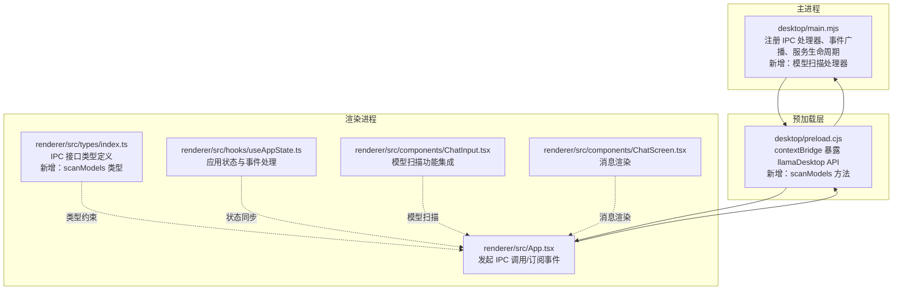
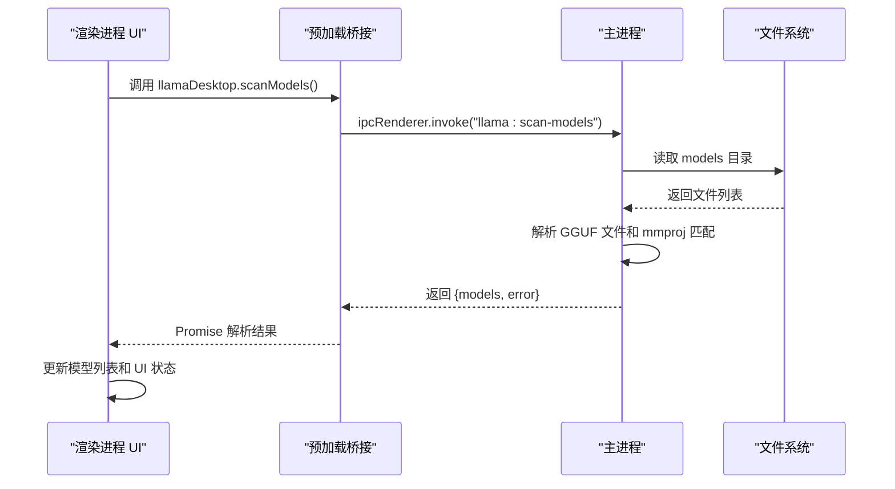
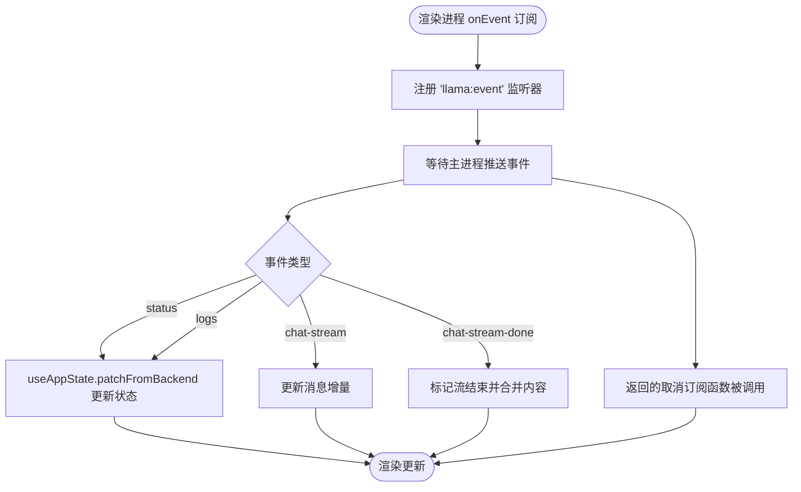
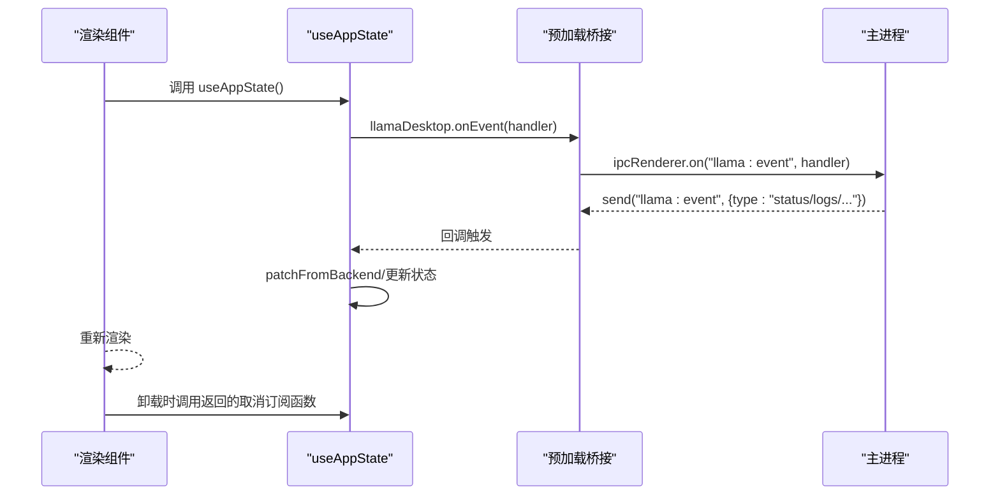
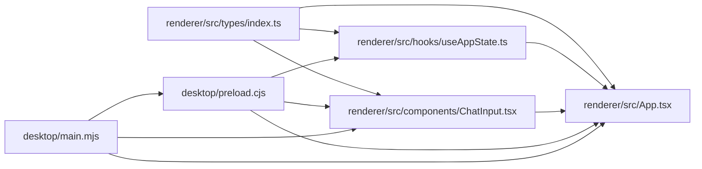

# IPC 通信机制

<cite>
**本文引用的文件**
- [desktop/main.mjs](file://desktop/main.mjs)
- [desktop/preload.cjs](file://desktop/preload.cjs)
- [renderer/src/types/index.ts](file://renderer/src/types/index.ts)
- [renderer/src/hooks/useAppState.ts](file://renderer/src/hooks/useAppState.ts)
- [renderer/src/App.tsx](file://renderer/src/App.tsx)
- [renderer/src/components/ChatInput.tsx](file://renderer/src/components/ChatInput.tsx)
- [renderer/src/components/ChatScreen.tsx](file://renderer/src/components/ChatScreen.tsx)
</cite>

## 更新摘要
**变更内容**
- 新增智能模型扫描功能，包括 `llama:scan-models` IPC 处理器
- 支持自动检测 GGUF 模型文件和 mmproj 投影文件匹配
- 更新预加载桥接层和类型定义以支持新的扫描功能
- 在 ChatInput 组件中集成模型扫描功能

## 目录
1. [简介](#简介)
2. [项目结构](#项目结构)
3. [核心组件](#核心组件)
4. [架构总览](#架构总览)
5. [详细组件分析](#详细组件分析)
6. [依赖关系分析](#依赖关系分析)
7. [性能考量](#性能考量)
8. [故障排查指南](#故障排查指南)
9. [结论](#结论)
10. [附录](#附录)

## 简介
本文件系统性梳理 illama-desktop 的 IPC 通信机制，聚焦主进程与渲染进程之间的事件驱动与消息传递协议。文档覆盖：
- IPC 接口定义（方法签名、参数类型、返回值格式）
- 事件系统实现（注册、监听、触发）
- 典型调用链路与错误处理策略
- 性能优化建议与调试技巧
- 安全考虑与最佳实践
- **新增**：智能模型扫描功能的 IPC 实现

## 项目结构
illama-desktop 采用 Electron 架构，主进程负责窗口管理、llama.cpp 服务生命周期、IPC 注册与事件广播；渲染进程负责 UI 逻辑与用户交互，通过 preload 暴露的 API 与主进程通信。

**图表来源**
- [desktop/main.mjs:1332-1388](file://desktop/main.mjs#L1332-L1388)
- [desktop/preload.cjs:1-32](file://desktop/preload.cjs#L1-L32)
- [renderer/src/App.tsx:241-654](file://renderer/src/App.tsx#L241-L654)
- [renderer/src/types/index.ts:1-44](file://renderer/src/types/index.ts#L1-L44)
- [renderer/src/hooks/useAppState.ts:69-552](file://renderer/src/hooks/useAppState.ts#L69-L552)
- [renderer/src/components/ChatInput.tsx:107-137](file://renderer/src/components/ChatInput.tsx#L107-L137)

**章节来源**
- [desktop/main.mjs:1332-1388](file://desktop/main.mjs#L1332-L1388)
- [desktop/preload.cjs:1-32](file://desktop/preload.cjs#L1-L32)
- [renderer/src/types/index.ts:1-44](file://renderer/src/types/index.ts#L1-L44)

## 核心组件
- 预加载桥接层（preload.cjs）：通过 contextBridge 暴露 llamaDesktop API，统一封装 ipcRenderer.invoke/ipcRenderer.send。**新增**：scanModels 方法用于模型扫描。
- 主进程 IPC 注册（main.mjs）：集中注册 handle/on 处理器，负责业务逻辑、状态维护与事件广播。**新增**：llama:scan-models 处理器实现智能模型扫描。
- 渲染进程 API 类型（types/index.ts）：定义 IPC 方法签名、参数与返回值结构，便于静态校验与 IDE 支持。**新增**：scanModels 接口类型定义。
- 应用状态钩子（useAppState.ts）：管理应用状态、事件回调注册与状态合并。
- 典型 UI 组件（App.tsx、ChatInput.tsx、ChatScreen.tsx）：演示 IPC 调用与事件监听的实际用法。**新增**：ChatInput 集成模型扫描功能。

**章节来源**
- [desktop/preload.cjs:1-32](file://desktop/preload.cjs#L1-L32)
- [desktop/main.mjs:1405-2159](file://desktop/main.mjs#L1405-L2159)
- [renderer/src/types/index.ts:1-44](file://renderer/src/types/index.ts#L1-L44)
- [renderer/src/hooks/useAppState.ts:69-552](file://renderer/src/hooks/useAppState.ts#L69-L552)
- [renderer/src/App.tsx:241-654](file://renderer/src/App.tsx#L241-L654)

## 架构总览
illama-desktop 的 IPC 采用"预加载桥接 + 主进程处理器"的双层设计：
- 预加载层将 ipcRenderer.invoke/ipcRenderer.send 封装为 llamaDesktop API，统一命名空间与参数格式。
- 主进程集中注册 handle/on 处理器，内部完成业务处理、状态更新与事件广播。
- 渲染进程通过 window.llamaDesktop 调用 API，并通过 onEvent 订阅主进程推送的事件。

**图表来源**
- [desktop/preload.cjs:16](file://desktop/preload.cjs#L16)
- [desktop/main.mjs:2165-2225](file://desktop/main.mjs#L2165-L2225)
- [renderer/src/components/ChatInput.tsx:123-136](file://renderer/src/components/ChatInput.tsx#L123-L136)

## 详细组件分析

### 预加载桥接层（llamaDesktop API）
- 暴露方法族：
  - 配置与状态：getState、saveConfig、setTheme
  - 服务控制：startServer、stopServer、testHealth
  - 聊天能力：chatCompletion、streamChat、abortChat
  - 文件与附件：pickFile、pickAttachments、saveFile、revealPath
  - 技能管理：listSkills、createSkill、generateSkillContent、readSkill、deleteSkill
  - **新增**：模型扫描：scanModels
  - 窗口控制：closeWindow、minimizeWindow、maximizeWindow、isWindowMaximized
  - 事件订阅：onEvent(callback) -> 返回取消订阅函数
- 调用方式：
  - invoke：双向调用，等待主进程返回 Promise 结果
  - send：单向事件，不等待结果

**章节来源**
- [desktop/preload.cjs:1-32](file://desktop/preload.cjs#L1-L32)

### 主进程 IPC 注册与事件广播
- 注册点：registerIpc() 统一注册所有 handle/on 处理器
- 事件广播：sendEvent() 将状态变更与日志等推送给渲染进程
- 典型处理器：
  - 配置与状态：llama:get-state、llama:save-config
  - 服务控制：llama:start-server、llama:stop-server、llama:test-health
  - 聊天能力：llama:chat-completion、llama:chat-stream、llama:chat-abort
  - 文件与附件：llama:pick-file、llama:pick-attachments、llama:select-files、llama:select-model、llama:select-config、llama:select-directory
  - 技能管理：llama:skill-list、llama:skill-create、llama:skill-read、llama:skill-delete、llama:skill-generate
  - **新增**：模型扫描：llama:scan-models
  - 窗口控制：llama:window-close、llama:window-minimize、llama:window-maximize、llama:window-is-maximized
- 事件推送：
  - status/logs：状态与日志变更
  - chat-stream/chat-stream-done：流式聊天增量与结束
  - llama:event：统一事件通道

**章节来源**
- [desktop/main.mjs:1405-2159](file://desktop/main.mjs#L1405-L2159)
- [desktop/main.mjs:209-224](file://desktop/main.mjs#L209-L224)

### 渲染进程 API 类型定义
- LlamaDesktopAPI：定义所有 IPC 方法的参数与返回值结构，确保类型安全
- 关键接口：
  - saveConfig、startServer、stopServer、testHealth、getModelInfo
  - pickAttachments、pickFile、streamChat、abortChat、getState
  - listSkills、createSkill、generateSkillContent、readSkill、deleteSkill
  - **新增**：scanModels
  - onEvent、setTheme、chatCompletion、revealPath、saveFile
  - closeWindow、minimizeWindow、maximizeWindow、isWindowMaximized

**章节来源**
- [renderer/src/types/index.ts:1-44](file://renderer/src/types/index.ts#L1-L44)

### 事件系统实现机制
- 事件注册：
  - 预加载层：onEvent(callback) 订阅 "llama:event"
  - 主进程：sendEvent() 统一推送事件
- 事件触发：
  - 状态变更：setStatus() -> sendEvent({type:"status", status})
  - 日志变更：addLog() -> sendEvent({type:"logs", logs})
  - 流式聊天：sendEvent({type:"chat-stream/done", ...})
- 事件监听与解绑：
  - 返回取消订阅函数，避免内存泄漏

**图表来源**
- [desktop/main.mjs:209-224](file://desktop/main.mjs#L209-L224)
- [renderer/src/hooks/useAppState.ts:95-102](file://renderer/src/hooks/useAppState.ts#L95-L102)

**章节来源**
- [desktop/main.mjs:209-224](file://desktop/main.mjs#L209-L224)
- [renderer/src/hooks/useAppState.ts:95-102](file://renderer/src/hooks/useAppState.ts#L95-L102)

### IPC 接口定义与调用示例

#### 1) 流式聊天（推荐用法）
- 渲染进程调用：
  - window.llamaDesktop.streamChat({ requestId, config, messages })
- 主进程处理：
  - 发起 /v1/chat/completions 流式请求
  - 逐行解析 data: 块，增量推送 chat-stream 事件
  - 结束时推送 chat-stream-done
- 渲染进程处理：
  - onEvent 监听 chat-stream/done，更新消息内容
  - 若事件未及时到达，以 IPC 返回值兜底

**章节来源**
- [renderer/src/App.tsx:282-316](file://renderer/src/App.tsx#L282-L316)
- [desktop/main.mjs:1810-1848](file://desktop/main.mjs#L1810-L1848)

#### 2) 中止流式聊天
- 渲染进程调用：window.llamaDesktop.abortChat()
- 主进程处理：触发 AbortController.abort()

**章节来源**
- [desktop/main.mjs:1853-1859](file://desktop/main.mjs#L1853-L1859)

#### 3) 获取应用状态
- 渲染进程调用：window.llamaDesktop.getState()
- 主进程返回：config/validation/status/logs/launch

**章节来源**
- [renderer/src/App.tsx:623-646](file://renderer/src/App.tsx#L623-L646)
- [desktop/main.mjs:1414](file://desktop/main.mjs#L1414)

#### 4) 保存配置
- 渲染进程调用：window.llamaDesktop.saveConfig({ config })
- 主进程返回：config/validation/status/logs/launch

**章节来源**
- [desktop/main.mjs:1419-1429](file://desktop/main.mjs#L1419-L1429)

#### 5) 选择附件与文件
- 渲染进程调用：
  - window.llamaDesktop.pickAttachments({ kind })
  - window.llamaDesktop.pickFile({ properties, filters })
- 主进程处理：弹出系统文件对话框，返回路径或附件元数据

**章节来源**
- [desktop/main.mjs:1889-1911](file://desktop/main.mjs#L1889-L1911)
- [desktop/main.mjs:1970-1977](file://desktop/main.mjs#L1970-L1977)

#### 6) 技能管理
- 渲染进程调用：
  - listSkills()/createSkill()/readSkill()/deleteSkill()/generateSkillContent()
- 主进程处理：读写 skills 目录，解析 SKILL.md

**章节来源**
- [desktop/main.mjs:2030-2157](file://desktop/main.mjs#L2030-L2157)

#### 7) 窗口控制
- 渲染进程调用：
  - closeWindow()/minimizeWindow()/maximizeWindow()
  - isWindowMaximized()
- 主进程处理：BrowserWindow 操作

**章节来源**
- [desktop/main.mjs:1988-2006](file://desktop/main.mjs#L1988-L2006)
- [desktop/preload.cjs:22-25](file://desktop/preload.cjs#L22-L25)

#### 8) **新增**：智能模型扫描
- 渲染进程调用：window.llamaDesktop.scanModels()
- 主进程处理：
  - 检查 models 目录是否存在
  - 扫描 .gguf 文件并解析模型信息
  - 自动匹配 mmproj 投影文件
  - 返回模型列表和错误信息
- 渲染进程处理：
  - 显示加载状态
  - 处理扫描结果和错误
  - 更新模型选择界面

**章节来源**
- [desktop/main.mjs:2165-2225](file://desktop/main.mjs#L2165-L2225)
- [desktop/preload.cjs:16](file://desktop/preload.cjs#L16)
- [renderer/src/types/index.ts:15-16](file://renderer/src/types/index.ts#L15-L16)
- [renderer/src/components/ChatInput.tsx:107-137](file://renderer/src/components/ChatInput.tsx#L107-L137)

### 事件系统的完整流程
- 订阅：渲染进程在组件挂载时注册 onEvent，返回取消订阅函数
- 推送：主进程在状态变更、日志更新、流式聊天等场景调用 sendEvent
- 处理：渲染进程根据事件类型更新状态或 UI
- 解绑：组件卸载时调用取消订阅函数

**图表来源**
- [desktop/preload.cjs:26-30](file://desktop/preload.cjs#L26-L30)
- [desktop/main.mjs:209-224](file://desktop/main.mjs#L209-L224)
- [renderer/src/hooks/useAppState.ts:95-102](file://renderer/src/hooks/useAppState.ts#L95-L102)

## 依赖关系分析
- 预加载桥接依赖 Electron 的 contextBridge/ipcRenderer
- 主进程依赖 Electron 的 ipcMain、BrowserWindow、dialog、child_process 等
- 渲染进程依赖预加载桥接暴露的 API 与类型定义
- 事件依赖关系：主进程 sendEvent -> 预加载 on -> 渲染进程回调
- **新增**：模型扫描依赖 Node.js 文件系统模块

**图表来源**
- [renderer/src/types/index.ts:1-44](file://renderer/src/types/index.ts#L1-L44)
- [renderer/src/App.tsx:241-654](file://renderer/src/App.tsx#L241-L654)
- [renderer/src/hooks/useAppState.ts:69-552](file://renderer/src/hooks/useAppState.ts#L69-L552)
- [renderer/src/components/ChatInput.tsx:107-137](file://renderer/src/components/ChatInput.tsx#L107-L137)
- [desktop/preload.cjs:1-32](file://desktop/preload.cjs#L1-L32)
- [desktop/main.mjs:1405-2159](file://desktop/main.mjs#L1405-L2159)

**章节来源**
- [renderer/src/types/index.ts:1-44](file://renderer/src/types/index.ts#L1-L44)
- [desktop/preload.cjs:1-32](file://desktop/preload.cjs#L1-L32)
- [desktop/main.mjs:1405-2159](file://desktop/main.mjs#L1405-L2159)

## 性能考量
- 流式渲染优化
  - 使用 memo 与浅比较减少消息组件重渲染（ChatScreen）
  - 仅在必要时更新非流式消息，避免频繁重绘
- 事件节流与去抖
  - 日志压缩与去重（compactLogLine），降低事件风暴
  - 限制日志数量（保留最近 1200 条）
- IPC 调用优化
  - 优先使用 invoke（有返回值）与 send（无返回值）区分场景
  - 合理拆分大对象，避免传输冗余字段
- 资源释放
  - 取消订阅事件，防止内存泄漏
  - 中止流式请求时及时释放 AbortController
- **新增**：模型扫描优化
  - 异步扫描避免阻塞 UI
  - 文件系统操作使用异步 API
  - 错误处理确保扫描失败不影响其他功能

**章节来源**
- [renderer/src/components/ChatScreen.tsx:38-98](file://renderer/src/components/ChatScreen.tsx#L38-L98)
- [desktop/main.mjs:245-291](file://desktop/main.mjs#L245-L291)
- [renderer/src/hooks/useAppState.ts:505-512](file://renderer/src/hooks/useAppState.ts#L505-L512)
- [desktop/main.mjs:1853-1859](file://desktop/main.mjs#L1853-L1859)

## 故障排查指南
- 无法收到事件
  - 确认 onEvent 已注册且未被提前取消
  - 检查主进程 sendEvent 是否被调用
- 流式聊天未结束
  - 确认主进程正确解析 SSE 行并推送 chat-stream-done
  - 渲染进程兜底逻辑：若事件未到达，以 IPC 返回值更新消息
- 服务启动失败
  - 查看 addLog 输出的错误信息
  - 检查配置路径、模型路径与权限
- 中止无效
  - 确认 AbortController 实例存在且未被复用
- 类型不匹配
  - 检查 types/index.ts 中的接口定义与实际调用是否一致
- **新增**：模型扫描问题
  - 确认 models 目录存在且可访问
  - 检查 .gguf 文件格式是否正确
  - 验证 mmproj 文件命名规范
  - 查看扫描错误信息和日志输出

**章节来源**
- [desktop/main.mjs:1810-1848](file://desktop/main.mjs#L1810-L1848)
- [renderer/src/App.tsx:282-316](file://renderer/src/App.tsx#L282-L316)
- [desktop/main.mjs:245-291](file://desktop/main.mjs#L245-L291)
- [desktop/main.mjs:1504-1521](file://desktop/main.mjs#L1504-L1521)

## 结论
illama-desktop 的 IPC 通信以预加载桥接为核心，通过统一的命名空间与类型定义，实现了主/渲染进程间稳定、可扩展的事件驱动与消息传递。结合事件压缩、流式渲染优化与完善的错误兜底，整体具备良好的可用性与性能表现。**新增的智能模型扫描功能进一步增强了用户体验，通过自动检测和匹配 GGUF 模型文件及 mmproj 投影文件，简化了模型配置流程。**后续可在以下方面持续改进：
- 增强 IPC 调用的幂等性与重试策略
- 引入更细粒度的事件过滤与批量推送
- 完善日志与指标采集，提升可观测性
- **新增**：优化模型扫描性能，支持缓存和增量扫描

## 附录

### IPC 接口一览（方法签名、参数类型、返回值格式）
- 配置与状态
  - saveConfig({ config }): Promise<{ ok; config; validation; status; logs; launch }>
  - startServer({ config }): Promise<{ ok; config; validation; status; logs; launch; url }>
  - stopServer(): Promise<{ ok; config; validation; status; logs; launch }>
  - testHealth({ config }): Promise<{ ok; url; message }>
  - getModelInfo({ config }): Promise<Record>
  - getState(): Promise<{ config; validation; status; logs; launch }>
- 聊天能力
  - chatCompletion({ config; messages }): Promise<unknown>
  - streamChat({ requestId; config; messages }): Promise<{ content; raw?.usage }>（流式结束后返回）
  - abortChat(): Promise<void>
- 文件与附件
  - pickAttachments({ kind }): Promise<Attachment[]>
  - pickFile({ properties; filters }): Promise<string|null>
  - saveFile(payload): Promise<unknown>
  - revealPath(filePath): Promise<void>
- 技能管理
  - listSkills(): Promise<Skill[]>
  - createSkill({ name; content }): Promise<{ ok; name }>
  - generateSkillContent({ name; description; whenToUse; argumentHint }): Promise<{ ok; content }>
  - readSkill({ name }): Promise<Skill & { raw: string }>
  - deleteSkill({ name }): Promise<{ ok }>
- **新增**：模型扫描
  - scanModels(): Promise<{ models: Array<{ name: string; path: string; mmprojPath: string | null; hasVision: boolean }>; error: string | null }>
- 窗口控制
  - closeWindow(): void
  - minimizeWindow(): void
  - maximizeWindow(): void
  - isWindowMaximized(): Promise<boolean>
- 事件订阅
  - onEvent(handler): () => void

**章节来源**
- [renderer/src/types/index.ts:1-44](file://renderer/src/types/index.ts#L1-L44)
- [desktop/preload.cjs:1-32](file://desktop/preload.cjs#L1-L32)

### 典型调用示例（路径指引）
- 渲染进程发起流式聊天
  - [renderer/src/App.tsx:282-316](file://renderer/src/App.tsx#L282-L316)
- 渲染进程订阅事件
  - [desktop/preload.cjs:26-30](file://desktop/preload.cjs#L26-L30)
- 主进程处理流式聊天并推送事件
  - [desktop/main.mjs:1810-1848](file://desktop/main.mjs#L1810-L1848)
- 渲染进程初始化并获取状态
  - [renderer/src/App.tsx:623-646](file://renderer/src/App.tsx#L623-L646)
- **新增**：渲染进程调用模型扫描
  - [renderer/src/components/ChatInput.tsx:123-136](file://renderer/src/components/ChatInput.tsx#L123-L136)
- **新增**：主进程处理模型扫描
  - [desktop/main.mjs:2165-2225](file://desktop/main.mjs#L2165-L2225)

### 模型扫描功能详细说明
- 功能概述：自动扫描 models 目录，检测 GGUF 模型文件并匹配相应的 mmproj 投影文件
- 扫描规则：
  - 检查 models 目录是否存在
  - 过滤 .gguf 文件扩展名
  - 识别 mmproj 文件（包含 "mmproj" 字样）
  - 去除量化级别后缀（如 -f16, -f32, -bf16, -q4_k_m 等）
  - 自动匹配主模型和投影文件
- 返回数据结构：
  - models: 模型数组，每个元素包含 name、path、mmprojPath、hasVision
  - error: 错误信息或 null
- UI 集成：在模型选择界面显示扫描结果，支持一键选择模型和自动匹配投影文件

**章节来源**
- [desktop/main.mjs:2165-2225](file://desktop/main.mjs#L2165-L2225)
- [renderer/src/components/ChatInput.tsx:107-165](file://renderer/src/components/ChatInput.tsx#L107-L165)