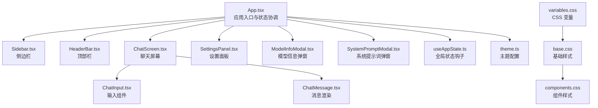
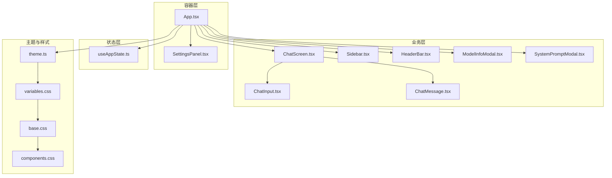
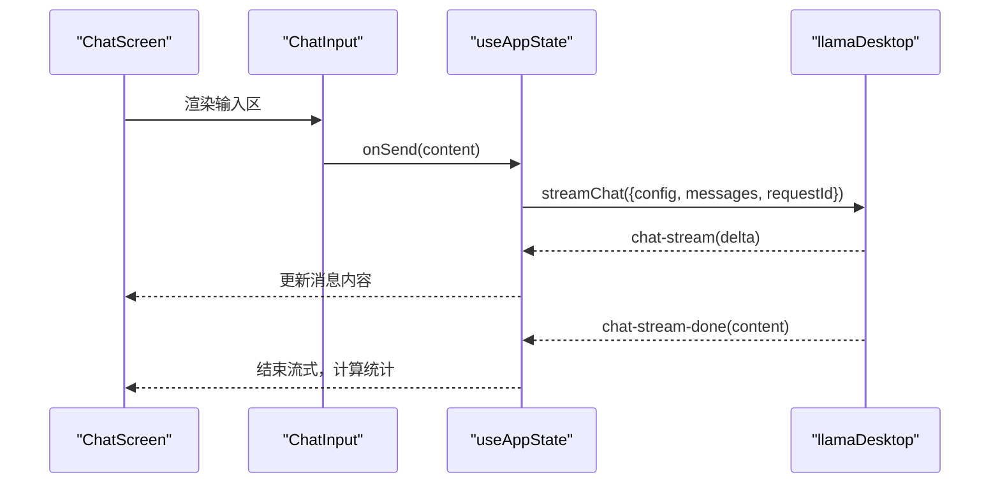
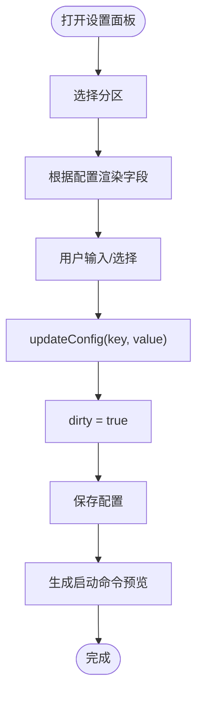
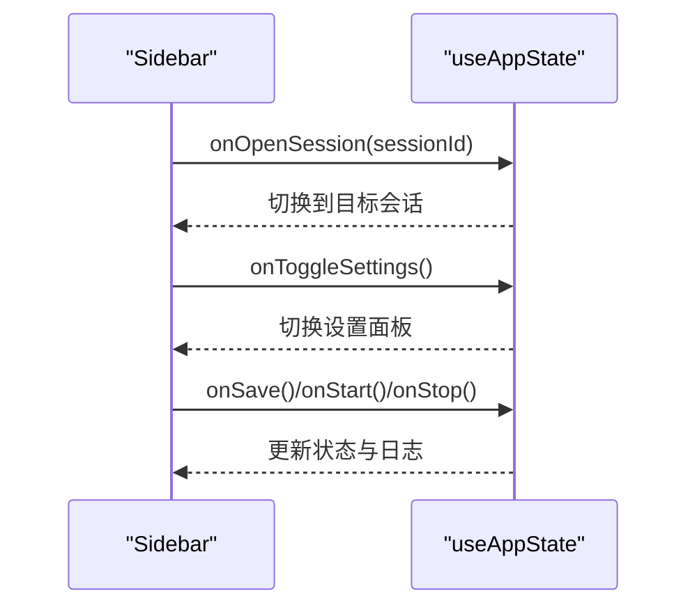
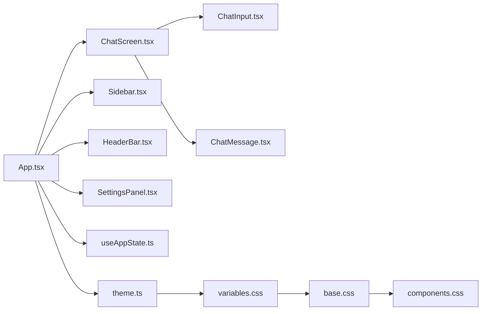

# UI 组件系统

<cite>
**本文档引用的文件**
- [App.tsx](file://renderer/src/App.tsx)
- [theme.ts](file://renderer/src/theme.ts)
- [ChatScreen.tsx](file://renderer/src/components/ChatScreen.tsx)
- [SettingsPanel.tsx](file://renderer/src/components/SettingsPanel.tsx)
- [Sidebar.tsx](file://renderer/src/components/Sidebar.tsx)
- [HeaderBar.tsx](file://renderer/src/components/HeaderBar.tsx)
- [ChatMessage.tsx](file://renderer/src/components/ChatMessage.tsx)
- [ChatInput.tsx](file://renderer/src/components/ChatInput.tsx)
- [ModelInfoModal.tsx](file://renderer/src/components/ModelInfoModal.tsx)
- [SystemPromptModal.tsx](file://renderer/src/components/SystemPromptModal.tsx)
- [index.ts](file://renderer/src/types/index.ts)
- [useAppState.ts](file://renderer/src/hooks/useAppState.ts)
- [variables.css](file://renderer/styles/variables.css)
- [base.css](file://renderer/styles/base.css)
- [components.css](file://renderer/styles/components.css)
- [index.html](file://renderer/index.html)
</cite>

## 目录
1. [简介](#简介)
2. [项目结构](#项目结构)
3. [核心组件](#核心组件)
4. [架构总览](#架构总览)
5. [详细组件分析](#详细组件分析)
6. [依赖关系分析](#依赖关系分析)
7. [性能考量](#性能考量)
8. [故障排除指南](#故障排除指南)
9. [结论](#结论)
10. [附录](#附录)

## 简介
本文件系统性梳理 illama-desktop 的 UI 组件体系，围绕可复用性、可组合性与可扩展性三大设计原则，全面解析 ChatScreen、SettingsPanel、Sidebar、HeaderBar 等核心组件的视觉外观、行为模式与交互流程，并文档化属性接口、事件处理与状态管理机制。同时覆盖主题系统、样式定制、响应式设计、无障碍与跨浏览器兼容性，以及组件开发最佳实践。

## 项目结构
渲染层采用 React + TypeScript 构建，配合 Ant Design X 生态与自定义样式变量，形成统一的主题与组件风格。应用入口负责整合各功能模块并通过全局状态钩子协调业务逻辑。

**图表来源**
- [App.tsx:731-783](file://renderer/src/App.tsx#L731-L783)
- [Sidebar.tsx:48-227](file://renderer/src/components/Sidebar.tsx#L48-L227)
- [HeaderBar.tsx:8-77](file://renderer/src/components/HeaderBar.tsx#L8-L77)
- [ChatScreen.tsx:100-376](file://renderer/src/components/ChatScreen.tsx#L100-L376)
- [SettingsPanel.tsx:299-778](file://renderer/src/components/SettingsPanel.tsx#L299-L778)
- [ChatInput.tsx:25-243](file://renderer/src/components/ChatInput.tsx#L25-L243)
- [ChatMessage.tsx:10-237](file://renderer/src/components/ChatMessage.tsx#L10-L237)
- [useAppState.ts:69-552](file://renderer/src/hooks/useAppState.ts#L69-L552)
- [theme.ts:3-24](file://renderer/src/theme.ts#L3-L24)
- [variables.css:33-71](file://renderer/styles/variables.css#L33-L71)
- [base.css:1-105](file://renderer/styles/base.css#L1-L105)
- [components.css:1-356](file://renderer/styles/components.css#L1-L356)

**章节来源**
- [App.tsx:21-810](file://renderer/src/App.tsx#L21-L810)
- [index.html](file://renderer/index.html)

## 核心组件
- ChatScreen：负责消息列表渲染、输入区集成、滚动行为与流式输出优化，提供消息变体切换、复制、编辑、重试、删除等交互。
- SettingsPanel：提供多分区设置面板，涵盖概览、展示、技能、采样与惩罚、MCP、开发者、日志等，支持动态生成与校验。
- Sidebar：管理会话历史、搜索、状态卡片与动作按钮，支持折叠与展开。
- HeaderBar：窗口控制与侧边栏切换，提供拖拽区域与窗口按钮。
- ChatInput：消息输入、附件与技能选择菜单、系统提示词集成、模型信息触发。
- ChatMessage：消息内容渲染、元信息展示（Token、延迟、速度、上下文使用率）、操作按钮。
- ModelInfoModal/SystemPromptModal：模型信息查看与系统提示词设置弹窗。
- useAppState：全局状态管理与持久化，封装会话、消息、附件、配置等状态操作。
- theme/variables/base/components：主题与样式体系，支持深浅主题切换与响应式布局。

**章节来源**
- [ChatScreen.tsx:13-376](file://renderer/src/components/ChatScreen.tsx#L13-L376)
- [SettingsPanel.tsx:7-778](file://renderer/src/components/SettingsPanel.tsx#L7-L778)
- [Sidebar.tsx:8-228](file://renderer/src/components/Sidebar.tsx#L8-L228)
- [HeaderBar.tsx:3-77](file://renderer/src/components/HeaderBar.tsx#L3-L77)
- [ChatInput.tsx:7-243](file://renderer/src/components/ChatInput.tsx#L7-L243)
- [ChatMessage.tsx:10-237](file://renderer/src/components/ChatMessage.tsx#L10-L237)
- [ModelInfoModal.tsx:5-98](file://renderer/src/components/ModelInfoModal.tsx#L5-L98)
- [SystemPromptModal.tsx:5-60](file://renderer/src/components/SystemPromptModal.tsx#L5-L60)
- [useAppState.ts:69-552](file://renderer/src/hooks/useAppState.ts#L69-L552)
- [theme.ts:3-24](file://renderer/src/theme.ts#L3-L24)
- [variables.css:33-71](file://renderer/styles/variables.css#L33-L71)
- [base.css:1-105](file://renderer/styles/base.css#L1-L105)
- [components.css:1-356](file://renderer/styles/components.css#L1-L356)

## 架构总览
应用采用“容器组件 + 业务组件 + 样式体系”的分层架构。容器组件（App、SettingsPanel）负责数据与行为编排，业务组件（ChatScreen、Sidebar、HeaderBar、ChatInput、ChatMessage）专注 UI 与交互，样式体系通过 CSS 变量与 Ant Design X 主题实现一致的视觉语言。

**图表来源**
- [App.tsx:731-783](file://renderer/src/App.tsx#L731-L783)
- [ChatScreen.tsx:100-376](file://renderer/src/components/ChatScreen.tsx#L100-L376)
- [SettingsPanel.tsx:299-778](file://renderer/src/components/SettingsPanel.tsx#L299-L778)
- [Sidebar.tsx:48-227](file://renderer/src/components/Sidebar.tsx#L48-L227)
- [HeaderBar.tsx:8-77](file://renderer/src/components/HeaderBar.tsx#L8-L77)
- [ChatInput.tsx:25-243](file://renderer/src/components/ChatInput.tsx#L25-L243)
- [ChatMessage.tsx:10-237](file://renderer/src/components/ChatMessage.tsx#L10-L237)
- [ModelInfoModal.tsx:59-98](file://renderer/src/components/ModelInfoModal.tsx#L59-L98)
- [SystemPromptModal.tsx:12-60](file://renderer/src/components/SystemPromptModal.tsx#L12-L60)
- [useAppState.ts:69-552](file://renderer/src/hooks/useAppState.ts#L69-L552)
- [theme.ts:3-24](file://renderer/src/theme.ts#L3-L24)
- [variables.css:33-71](file://renderer/styles/variables.css#L33-L71)
- [base.css:1-105](file://renderer/styles/base.css#L1-L105)
- [components.css:1-356](file://renderer/styles/components.css#L1-L356)

## 详细组件分析

### ChatScreen 组件分析
- 功能特性
  - 消息列表渲染：使用记忆化组件避免流式输出时重复渲染已生成消息。
  - 输入区集成：与 ChatInput 组件解耦，支持附件、技能、系统提示词、模型信息触发。
  - 滚动行为：自动滚动到底部、拖拽滚动条时暂停自动滚动、滚动到最新按钮。
  - 空状态：提供提示词引导与快捷入口。
- 属性接口
  - chatMessages: ChatMessage[]
  - chatInput: string
  - attachments: Attachment[]
  - chatBusy: boolean
  - config: Record<string, unknown> | null
  - onInputChange/onSend/onAbort/onPickAttachment/onPickSkill/onRemoveSkill/onRemoveAttachment/onOpenModelInfo/onCopyMessage/onEditMessage/onRetryMessage/onDeleteMessage/onPrevVariant/onNextVariant/systemPrompt/onOpenSystemPromptModal
- 事件处理
  - 流式事件监听与即时更新，完成后计算 Token、延迟、速度并持久化。
  - 滚动事件与拖拽检测，保证用户体验。
- 状态管理
  - 通过 useAppState 提供的回调更新全局状态，ChatScreen 仅负责渲染与交互。
- 性能优化
  - 使用 memo 与自定义比较函数，避免非必要重渲染。
  - requestAnimationFrame 控制滚动，减少主线程阻塞。

**图表来源**
- [ChatScreen.tsx:100-376](file://renderer/src/components/ChatScreen.tsx#L100-L376)
- [ChatInput.tsx:25-243](file://renderer/src/components/ChatInput.tsx#L25-L243)
- [useAppState.ts:395-434](file://renderer/src/hooks/useAppState.ts#L395-L434)
- [App.tsx:209-320](file://renderer/src/App.tsx#L209-L320)

**章节来源**
- [ChatScreen.tsx:13-376](file://renderer/src/components/ChatScreen.tsx#L13-L376)
- [ChatInput.tsx:7-243](file://renderer/src/components/ChatInput.tsx#L7-L243)
- [useAppState.ts:395-434](file://renderer/src/hooks/useAppState.ts#L395-L434)
- [App.tsx:209-320](file://renderer/src/App.tsx#L209-L320)

### SettingsPanel 组件分析
- 功能特性
  - 多分区设置：概览、展示、技能、采样与惩罚、MCP、开发者、日志。
  - 动态生成：根据配置项类型渲染输入、选择、开关、文本域等控件。
  - 技能管理：新建、修改、删除技能，支持 AI 自动生成 SKILL.md。
  - 启动命令预览与复制。
- 属性接口
  - settingsOpen/active/config/validation/status/logs/dirty/launch/onClose/onSelectSection/onUpdateConfig/onPickFile/onCopyLaunchCommand
- 事件处理
  - 字段变更回调、文件选择、复制命令、技能 CRUD。
- 状态管理
  - 通过 useAppState.updateConfig 与全局状态联动，dirty 标记提示保存。
- 可扩展性
  - 通过配置项枚举与渲染函数，新增设置项只需扩展配置类型与渲染逻辑。

**图表来源**
- [SettingsPanel.tsx:299-778](file://renderer/src/components/SettingsPanel.tsx#L299-L778)
- [useAppState.ts:364-370](file://renderer/src/hooks/useAppState.ts#L364-L370)

**章节来源**
- [SettingsPanel.tsx:7-778](file://renderer/src/components/SettingsPanel.tsx#L7-L778)
- [useAppState.ts:364-370](file://renderer/src/hooks/useAppState.ts#L364-L370)

### Sidebar 组件分析
- 功能特性
  - 会话历史列表：分组显示今日/昨日/上周/更早，支持搜索过滤。
  - 动作按钮：新聊天、搜索对话、终端日志、设置、服务状态卡片。
  - 服务状态控制：根据状态执行启动/停止，结合 busy 状态禁用。
- 属性接口
  - sessions/currentSessionId/historySearch/historyMenuId/sidebarCollapsed/view/chatMessages/status/settingsOpen/busy + 各种回调
- 事件处理
  - 会话切换、菜单操作（编辑/导出/删除）、搜索变更、设置开关、服务启停。
- 可组合性
  - 使用 Ant Design X 的 Conversations 组件，易于替换与扩展。

**图表来源**
- [Sidebar.tsx:48-227](file://renderer/src/components/Sidebar.tsx#L48-L227)
- [useAppState.ts:210-266](file://renderer/src/hooks/useAppState.ts#L210-L266)

**章节来源**
- [Sidebar.tsx:8-228](file://renderer/src/components/Sidebar.tsx#L8-L228)
- [useAppState.ts:210-266](file://renderer/src/hooks/useAppState.ts#L210-L266)

### HeaderBar 组件分析
- 功能特性
  - 侧边栏切换：根据 sidebarCollapsed 状态切换图标与提示。
  - 窗口控制：最小化、最大化/还原、关闭。
  - 拖拽区域：支持窗口拖拽。
- 属性接口
  - sidebarCollapsed/onToggleSidebar
- 事件处理
  - 调用 window.llamaDesktop API 执行窗口操作。
- 可复用性
  - 无副作用依赖，适合在不同布局中复用。

**章节来源**
- [HeaderBar.tsx:3-77](file://renderer/src/components/HeaderBar.tsx#L3-L77)

### ChatInput 组件分析
- 功能特性
  - 输入区：支持多行输入、发送/中止、提示语与快捷键。
  - 附件菜单：图片、文本文件等。
  - 技能菜单：动态加载技能列表，支持选择与移除。
  - 系统提示词：显示/编辑当前会话提示词。
  - 模型信息：触发模型信息弹窗。
- 属性接口
  - chatInput/attachments/chatBusy/config + 各种回调
- 事件处理
  - 菜单定位、点击外部关闭、技能/附件选择、系统提示词编辑、模型信息打开。

**章节来源**
- [ChatInput.tsx:7-243](file://renderer/src/components/ChatInput.tsx#L7-L243)

### ChatMessage 组件分析
- 功能特性
  - 内容渲染：流式输出使用纯文本，完成后使用 Markdown 渲染。
  - 元信息：模型、Token、延迟、速度、上下文使用率环形指示。
  - 操作按钮：复制、编辑（用户消息）、重试（助手消息）、删除、变体切换。
- 性能优化
  - 流式生成时避免昂贵的 Markdown 解析，完成后一次性渲染。
  - 上下文使用率环形图按需渲染，避免频繁重绘。

**章节来源**
- [ChatMessage.tsx:10-237](file://renderer/src/components/ChatMessage.tsx#L10-L237)

### ModelInfoModal 与 SystemPromptModal
- ModelInfoModal：展示模型详细信息，支持加载中、错误与空状态。
- SystemPromptModal：设置/编辑当前会话系统提示词，支持清空。

**章节来源**
- [ModelInfoModal.tsx:5-98](file://renderer/src/components/ModelInfoModal.tsx#L5-L98)
- [SystemPromptModal.tsx:5-60](file://renderer/src/components/SystemPromptModal.tsx#L5-L60)

## 依赖关系分析
- 组件耦合
  - App 作为顶层容器，聚合 Sidebar、HeaderBar、ChatScreen、SettingsPanel、弹窗组件。
  - ChatScreen 依赖 ChatInput 与 ChatMessage，形成清晰的父子关系。
  - SettingsPanel 依赖 useAppState 的配置更新能力。
- 外部依赖
  - Ant Design X 与 Ant Design Icons 提供 UI 基础与图标。
  - window.llamaDesktop API 提供后端通信与系统交互。
- 主题与样式
  - theme.ts 与 variables.css/components.css/base.css 形成主题与样式链路。

**图表来源**
- [App.tsx:731-783](file://renderer/src/App.tsx#L731-L783)
- [ChatScreen.tsx:100-376](file://renderer/src/components/ChatScreen.tsx#L100-L376)
- [Sidebar.tsx:48-227](file://renderer/src/components/Sidebar.tsx#L48-L227)
- [HeaderBar.tsx:8-77](file://renderer/src/components/HeaderBar.tsx#L8-L77)
- [SettingsPanel.tsx:299-778](file://renderer/src/components/SettingsPanel.tsx#L299-L778)
- [ChatInput.tsx:25-243](file://renderer/src/components/ChatInput.tsx#L25-L243)
- [ChatMessage.tsx:10-237](file://renderer/src/components/ChatMessage.tsx#L10-L237)
- [useAppState.ts:69-552](file://renderer/src/hooks/useAppState.ts#L69-L552)
- [theme.ts:3-24](file://renderer/src/theme.ts#L3-L24)
- [variables.css:33-71](file://renderer/styles/variables.css#L33-L71)
- [base.css:1-105](file://renderer/styles/base.css#L1-L105)
- [components.css:1-356](file://renderer/styles/components.css#L1-L356)

**章节来源**
- [App.tsx:731-783](file://renderer/src/App.tsx#L731-L783)
- [useAppState.ts:69-552](file://renderer/src/hooks/useAppState.ts#L69-L552)
- [theme.ts:3-24](file://renderer/src/theme.ts#L3-L24)
- [variables.css:33-71](file://renderer/styles/variables.css#L33-L71)
- [base.css:1-105](file://renderer/styles/base.css#L1-L105)
- [components.css:1-356](file://renderer/styles/components.css#L1-L356)

## 性能考量
- 渲染优化
  - ChatScreen 使用 memo 与自定义比较函数，避免流式输出时的全量重渲染。
  - ChatMessage 在流式阶段使用轻量渲染，完成后一次性 Markdown 渲染。
- 滚动与动画
  - requestAnimationFrame 控制滚动，减少主线程阻塞。
  - 滚动条拖拽检测，避免自动滚动干扰用户操作。
- 状态与持久化
  - useAppState 将会话历史持久化至 localStorage，减少刷新丢失。
- 网络与事件
  - 流式事件采用防抖保存策略，避免频繁写入。

[本节为通用指导，无需具体文件引用]

## 故障排除指南
- 常见错误与提示
  - 友好错误提示：对超时、上下文超限、JSON 校验失败等进行中文提示与简化描述。
  - 日志过滤：压缩冗余日志，突出关键信息，便于定位问题。
- 会话与消息
  - 重试机制：支持对特定助手消息进行重试并保存变体，便于对比与选择。
  - 变体切换：通过 prevVariant/nextVariant 在多个回复变体间切换。
- 系统提示词
  - 会话级提示词优先级高于技能，支持设置与清除。

**章节来源**
- [utils/index.ts:50-66](file://renderer/src/utils/index.ts#L50-L66)
- [utils/index.ts:110-137](file://renderer/src/utils/index.ts#L110-L137)
- [App.tsx:337-477](file://renderer/src/App.tsx#L337-L477)
- [SystemPromptModal.tsx:12-60](file://renderer/src/components/SystemPromptModal.tsx#L12-L60)

## 结论
illama-desktop 的 UI 组件系统以 React + Ant Design X 为基础，通过清晰的容器-业务分层、稳定的主题与样式体系、完善的全局状态管理，实现了高可复用性、可组合性与可扩展性。核心组件在交互体验、性能优化与错误处理方面均有良好设计，适合在桌面端本地 AI 服务场景中稳定运行与持续演进。

[本节为总结性内容，无需具体文件引用]

## 附录

### 主题系统与样式定制
- 主题配置
  - theme.ts 提供 Ant Design X 主题配置，包含色彩、圆角、字体等。
  - App.tsx 将 themeConfig 与 antdTheme.defaultAlgorithm 组合注入 XProvider。
- CSS 变量与样式
  - variables.css 定义全局 CSS 变量，base.css 提供基础样式与滚动条样式，components.css 提供组件级样式。
- 响应式设计
  - 通过 CSS Grid/Flex 与媒体查询适配不同窗口尺寸。
- 无障碍与兼容性
  - 使用语义化标签与可访问性属性，确保键盘导航与屏幕阅读器友好。
  - 通过 Ant Design 组件与 CSS 变量提升跨浏览器一致性。

**章节来源**
- [theme.ts:3-24](file://renderer/src/theme.ts#L3-L24)
- [variables.css:33-71](file://renderer/styles/variables.css#L33-L71)
- [base.css:1-105](file://renderer/styles/base.css#L1-L105)
- [components.css:1-356](file://renderer/styles/components.css#L1-L356)
- [App.tsx:60-64](file://renderer/src/App.tsx#L60-L64)

### 组件使用示例与自定义配置
- ChatScreen
  - 接收消息列表、输入内容、附件、配置与回调，内部负责渲染与交互。
  - 自定义：可通过扩展 ChatMessage 渲染逻辑或引入新的消息类型。
- SettingsPanel
  - 通过 onUpdateConfig 动态更新配置，支持新增设置项与校验。
  - 自定义：扩展配置类型与渲染函数，即可快速添加新分区。
- Sidebar
  - 通过 onOpenSession/onEditSession/onExportSession/onDeleteSession 等回调与业务层对接。
  - 自定义：替换 Conversations 组件或扩展菜单项。
- HeaderBar
  - 通过 onToggleSidebar 与 App 状态联动，支持不同布局下的复用。
- ChatInput
  - 通过 onPickSkill/onRemoveSkill 与技能系统集成，支持动态菜单。
- ChatMessage
  - 通过 renderMessageContent/renderMessageMeta/renderMessageActions 实现可插拔渲染。
- ModelInfoModal/SystemPromptModal
  - 作为弹窗组件，可被任意容器组件调用，支持自定义字段与顺序。

**章节来源**
- [ChatScreen.tsx:13-376](file://renderer/src/components/ChatScreen.tsx#L13-L376)
- [SettingsPanel.tsx:299-778](file://renderer/src/components/SettingsPanel.tsx#L299-L778)
- [Sidebar.tsx:48-227](file://renderer/src/components/Sidebar.tsx#L48-L227)
- [HeaderBar.tsx:8-77](file://renderer/src/components/HeaderBar.tsx#L8-L77)
- [ChatInput.tsx:25-243](file://renderer/src/components/ChatInput.tsx#L25-L243)
- [ChatMessage.tsx:10-237](file://renderer/src/components/ChatMessage.tsx#L10-L237)
- [ModelInfoModal.tsx:59-98](file://renderer/src/components/ModelInfoModal.tsx#L59-L98)
- [SystemPromptModal.tsx:12-60](file://renderer/src/components/SystemPromptModal.tsx#L12-L60)

### 最佳实践与设计模式
- 设计模式
  - 容器-展示分离：App/SettingsPanel 负责编排，业务组件专注 UI。
  - 钩子抽象：useAppState 将状态与副作用封装，组件只关心输入与输出。
  - 组合优于继承：通过 props 与 children 组合组件，避免复杂继承层次。
- 可复用性
  - 无副作用组件优先，通过属性传递行为。
  - 使用 CSS 变量与主题配置，统一视觉风格。
- 可扩展性
  - 类型驱动：通过 types/index.ts 明确接口契约，便于扩展。
  - 插件化：SettingsPanel 的字段渲染与技能系统体现插件化思想。
- 性能
  - 使用 memo 与不可变更新，避免不必要的重渲染。
  - 流式事件采用防抖与批量保存策略。
- 无障碍与兼容性
  - 使用语义化标签与可访问性属性，确保键盘与屏幕阅读器可用。
  - 通过 Ant Design 组件与 CSS 变量提升跨浏览器一致性。

**章节来源**
- [useAppState.ts:69-552](file://renderer/src/hooks/useAppState.ts#L69-L552)
- [types/index.ts:1-222](file://renderer/src/types/index.ts#L1-L222)
- [ChatScreen.tsx:38-98](file://renderer/src/components/ChatScreen.tsx#L38-L98)
- [ChatMessage.tsx:38-68](file://renderer/src/components/ChatMessage.tsx#L38-L68)
- [App.tsx:624-728](file://renderer/src/App.tsx#L624-L728)