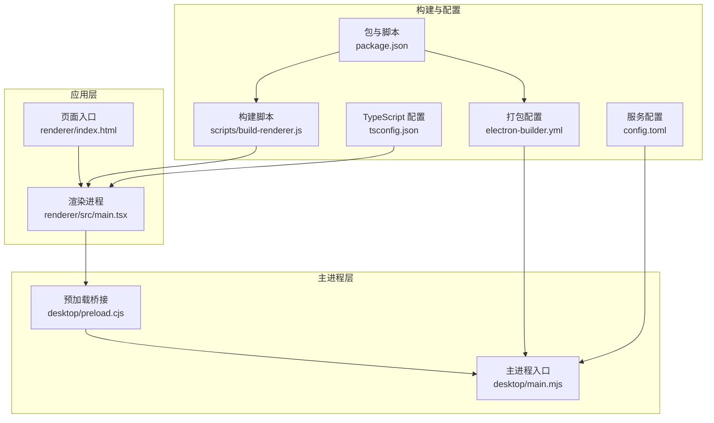
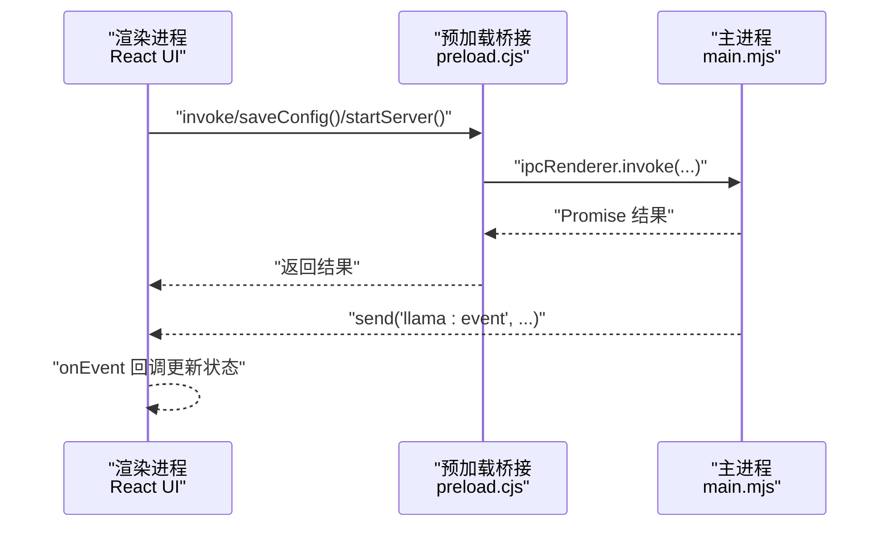
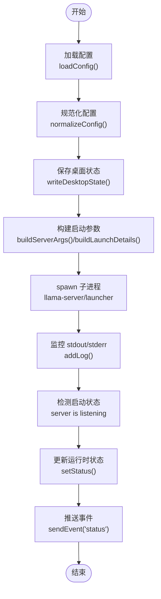
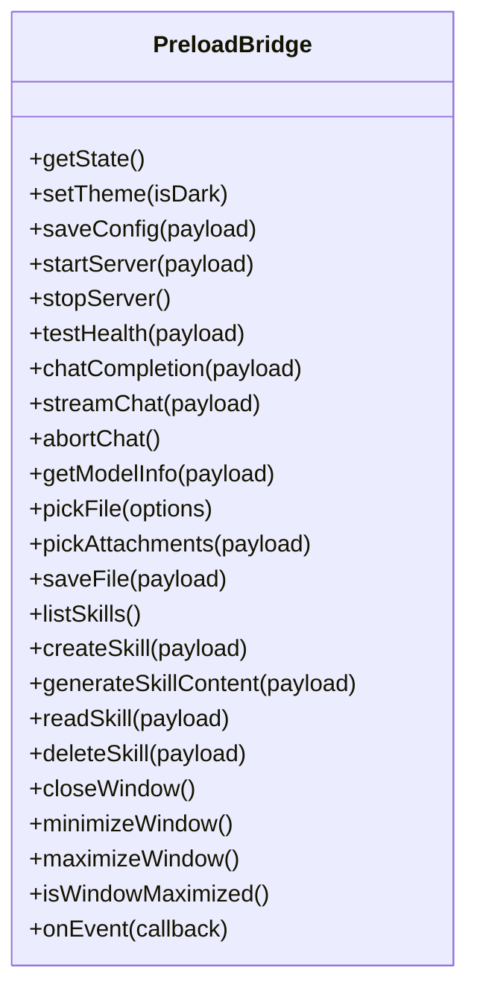
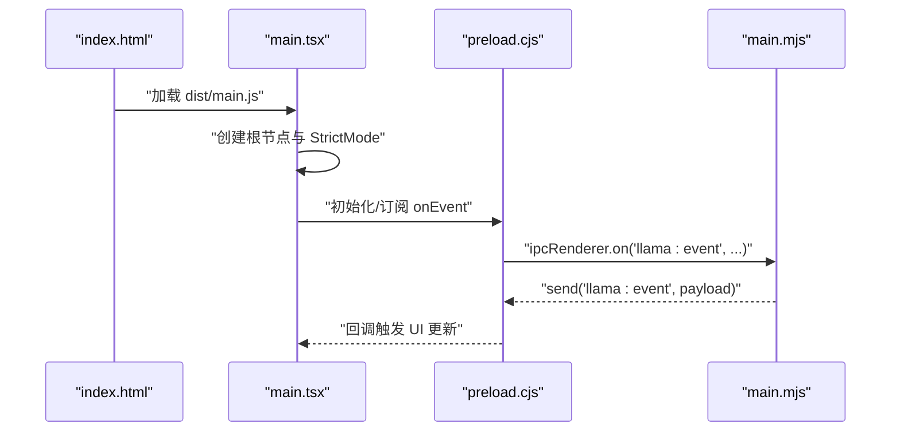
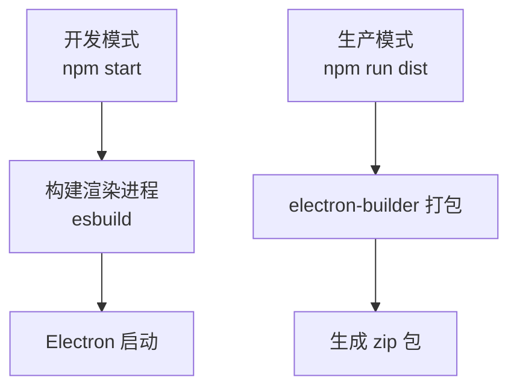
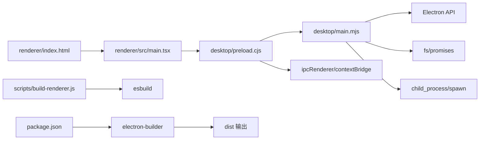

# 开发工作流程

<cite>
**本文引用的文件**
- [package.json](file://package.json)
- [electron-builder.yml](file://electron-builder.yml)
- [config.toml](file://config.toml)
- [desktop/main.mjs](file://desktop/main.mjs)
- [desktop/preload.cjs](file://desktop/preload.cjs)
- [renderer/src/main.tsx](file://renderer/src/main.tsx)
- [renderer/index.html](file://renderer/index.html)
- [scripts/build-renderer.js](file://scripts/build-renderer.js)
- [tsconfig.json](file://tsconfig.json)
</cite>

## 目录
1. [简介](#简介)
2. [项目结构](#项目结构)
3. [核心组件](#核心组件)
4. [架构总览](#架构总览)
5. [详细组件分析](#详细组件分析)
6. [依赖关系分析](#依赖关系分析)
7. [性能考虑](#性能考虑)
8. [故障排查指南](#故障排查指南)
9. [结论](#结论)
10. [附录](#附录)

## 简介
本指南面向 illama-desktop 的日常开发工作流，覆盖以下主题：
- 开发与调试：代码编写、热重载、断点与变量检查、性能分析
- 模式差异：开发模式与生产模式的构建命令与行为差异
- 测试策略：单元测试、集成测试与端到端测试的组织方式
- 质量保障：提交前检查清单与自动化质量控制建议

本项目基于 Electron + React + TypeScript 技术栈，主进程负责窗口、托盘、llama.cpp 服务生命周期管理；渲染进程承载 UI 与交互。

## 项目结构
项目采用“主进程 + 渲染进程 + 资源脚本”的分层组织：
- desktop：Electron 主进程与预加载脚本
- renderer：React 应用与样式资源
- scripts：构建脚本（esbuild）
- tests：测试目录占位（当前未包含具体实现）
- 配置：package.json、electron-builder.yml、tsconfig.json、config.toml

图表来源
- [renderer/src/main.tsx:1-34](file://renderer/src/main.tsx#L1-L34)
- [renderer/index.html:1-29](file://renderer/index.html#L1-L29)
- [desktop/main.mjs:1-80](file://desktop/main.mjs#L1-L80)
- [desktop/preload.cjs:1-32](file://desktop/preload.cjs#L1-L32)
- [scripts/build-renderer.js:1-20](file://scripts/build-renderer.js#L1-L20)
- [tsconfig.json:1-18](file://tsconfig.json#L1-L18)
- [package.json:1-51](file://package.json#L1-L51)
- [electron-builder.yml:1-17](file://electron-builder.yml#L1-L17)
- [config.toml:1-27](file://config.toml#L1-L27)

章节来源
- [package.json:1-51](file://package.json#L1-L51)
- [electron-builder.yml:1-17](file://electron-builder.yml#L1-L17)
- [tsconfig.json:1-18](file://tsconfig.json#L1-L18)
- [scripts/build-renderer.js:1-20](file://scripts/build-renderer.js#L1-L20)
- [renderer/src/main.tsx:1-34](file://renderer/src/main.tsx#L1-L34)
- [renderer/index.html:1-29](file://renderer/index.html#L1-L29)
- [desktop/main.mjs:1-80](file://desktop/main.mjs#L1-L80)
- [desktop/preload.cjs:1-32](file://desktop/preload.cjs#L1-L32)
- [config.toml:1-27](file://config.toml#L1-L27)

## 核心组件
- 主进程（desktop/main.mjs）
  - 负责窗口管理、系统托盘、IPC 通信、llama.cpp 服务启动/停止、状态与日志管理
  - 提供配置加载/保存、URL 构建、TOML 解析与生成、命令行参数构建等能力
- 预加载脚本（desktop/preload.cjs）
  - 通过 contextBridge 暴露受限 API 到渲染进程，封装 IPC 调用
- 渲染进程（renderer/src/main.tsx）
  - React 应用入口，挂载 Ant Design 样式缓存与 StrictMode 包装
- 构建与打包
  - esbuild 构建渲染进程产物，electron-builder 打包应用
- 配置
  - config.toml 控制 llama.cpp 启动参数与行为开关
  - package.json 定义开发与构建脚本

章节来源
- [desktop/main.mjs:1-80](file://desktop/main.mjs#L1-L80)
- [desktop/preload.cjs:1-32](file://desktop/preload.cjs#L1-L32)
- [renderer/src/main.tsx:1-34](file://renderer/src/main.tsx#L1-L34)
- [scripts/build-renderer.js:1-20](file://scripts/build-renderer.js#L1-L20)
- [electron-builder.yml:1-17](file://electron-builder.yml#L1-L17)
- [config.toml:1-27](file://config.toml#L1-L27)
- [package.json:23-27](file://package.json#L23-L27)

## 架构总览
Electron 双进程架构：主进程负责系统与服务，渲染进程负责 UI。IPC 通过预加载桥接实现安全调用。

图表来源
- [desktop/preload.cjs:3-31](file://desktop/preload.cjs#L3-L31)
- [desktop/main.mjs:209-224](file://desktop/main.mjs#L209-L224)
- [renderer/src/main.tsx:10-33](file://renderer/src/main.tsx#L10-L33)

## 详细组件分析

### 主进程（desktop/main.mjs）
- 关键职责
  - 窗口与托盘管理、系统事件处理
  - llama.cpp 服务生命周期：启动、停止、健康检查、流式聊天中断
  - 配置系统：默认配置、TOML 解析/生成、规范化、持久化
  - 日志系统：ANSI 去噪、重复压缩、截断、状态检测
  - IPC 事件：状态变更、日志推送、托盘菜单更新
- 数据与状态
  - 运行时状态 runtimeStatus（state/message/pid/url/startedAt）
  - 日志缓冲 logs（最多 1200 条）
- 关键流程
  - 配置加载与保存：loadConfig → normalizeConfig → buildToml → writeDesktopState
  - 服务启动：buildLaunchDetails → spawn 子进程 → stdout/stderr 监听 → 状态与日志更新
  - IPC 注册：ipcMain.handle/ipcMain.on 与渲染进程方法一一对应

图表来源
- [desktop/main.mjs:676-710](file://desktop/main.mjs#L676-L710)
- [desktop/main.mjs:797-886](file://desktop/main.mjs#L797-L886)
- [desktop/main.mjs:298-326](file://desktop/main.mjs#L298-L326)
- [desktop/main.mjs:220-224](file://desktop/main.mjs#L220-L224)

章节来源
- [desktop/main.mjs:676-710](file://desktop/main.mjs#L676-L710)
- [desktop/main.mjs:797-886](file://desktop/main.mjs#L797-L886)
- [desktop/main.mjs:298-326](file://desktop/main.mjs#L298-L326)
- [desktop/main.mjs:220-224](file://desktop/main.mjs#L220-L224)

### 预加载桥接（desktop/preload.cjs）
- 职责
  - 通过 contextBridge.exposeInMainWorld 暴露受限 API
  - 统一封装 invoke/send，提供 onEvent 订阅回调与解绑
- 方法映射
  - 状态与配置：getState、saveConfig、setTheme
  - 服务控制：startServer、stopServer、testHealth
  - 聊天接口：chatCompletion、streamChat、abortChat
  - 文件与技能：pickFile、pickAttachments、saveFile、listSkills、createSkill、generateSkillContent、readSkill、deleteSkill
  - 窗口操作：closeWindow、minimizeWindow、maximizeWindow、isWindowMaximized

图表来源
- [desktop/preload.cjs:3-31](file://desktop/preload.cjs#L3-L31)

章节来源
- [desktop/preload.cjs:1-32](file://desktop/preload.cjs#L1-L32)

### 渲染进程（renderer/src/main.tsx）
- 职责
  - 初始化 React 根节点，启用 StrictMode 与 Ant Design 样式缓存
  - 错误兜底与日志输出，确保渲染链路健壮
- 与主进程交互
  - 通过 window.llamaDesktop API 调用主进程能力
  - 订阅 onEvent 接收状态与日志事件

图表来源
- [renderer/index.html:26-28](file://renderer/index.html#L26-L28)
- [renderer/src/main.tsx:10-33](file://renderer/src/main.tsx#L10-L33)
- [desktop/preload.cjs:26-31](file://desktop/preload.cjs#L26-L31)
- [desktop/main.mjs:209-224](file://desktop/main.mjs#L209-L224)

章节来源
- [renderer/index.html:1-29](file://renderer/index.html#L1-L29)
- [renderer/src/main.tsx:1-34](file://renderer/src/main.tsx#L1-L34)
- [desktop/preload.cjs:1-32](file://desktop/preload.cjs#L1-L32)
- [desktop/main.mjs:209-224](file://desktop/main.mjs#L209-L224)

### 构建与打包（scripts/build-renderer.js、electron-builder.yml、package.json）
- 渲染进程构建
  - 使用 esbuild，入口 renderer/src/main.tsx，输出 renderer/dist/main.js
  - 启用最小化、SourceMap、Tree Shaking，目标浏览器版本与 TSX 支持
- 应用打包
  - electron-builder 配置 appId/productName、输出目录、文件包含规则
  - Windows 平台打包为 zip，ASAR 启用，压缩等级 normal
- 开发与构建脚本
  - npm start：先构建渲染进程，再以 Electron 启动
  - npm run build：仅构建渲染进程
  - npm run dist：构建并使用 electron-builder 打包

图表来源
- [scripts/build-renderer.js:3-18](file://scripts/build-renderer.js#L3-L18)
- [package.json:23-27](file://package.json#L23-L27)
- [electron-builder.yml:3-16](file://electron-builder.yml#L3-L16)

章节来源
- [scripts/build-renderer.js:1-20](file://scripts/build-renderer.js#L1-L20)
- [electron-builder.yml:1-17](file://electron-builder.yml#L1-L17)
- [package.json:23-27](file://package.json#L23-L27)

## 依赖关系分析
- 主进程依赖
  - Node child_process/spawn 管理子进程
  - fs/promises 读写配置与状态文件
  - Electron API：app、BrowserWindow、Menu、Tray、ipcMain、nativeImage、shell
- 预加载依赖
  - contextBridge、ipcRenderer 与主进程 IPC
- 渲染进程依赖
  - React、ReactDOM、Ant Design cssinjs
  - 通过 window.llamaDesktop 调用主进程能力
- 构建依赖
  - esbuild、electron、electron-builder、TypeScript

图表来源
- [desktop/main.mjs:6-11](file://desktop/main.mjs#L6-L11)
- [desktop/preload.cjs:1](file://desktop/preload.cjs#L1)
- [renderer/src/main.tsx:1-4](file://renderer/src/main.tsx#L1-L4)
- [renderer/index.html:27](file://renderer/index.html#L27)
- [scripts/build-renderer.js:1](file://scripts/build-renderer.js#L1)
- [package.json:28-49](file://package.json#L28-L49)
- [electron-builder.yml:3-9](file://electron-builder.yml#L3-L9)

章节来源
- [desktop/main.mjs:6-11](file://desktop/main.mjs#L6-L11)
- [desktop/preload.cjs:1-32](file://desktop/preload.cjs#L1-L32)
- [renderer/src/main.tsx:1-4](file://renderer/src/main.tsx#L1-L4)
- [renderer/index.html:27](file://renderer/index.html#L27)
- [scripts/build-renderer.js:1](file://scripts/build-renderer.js#L1)
- [package.json:28-49](file://package.json#L28-L49)
- [electron-builder.yml:3-9](file://electron-builder.yml#L3-L9)

## 性能考虑
- 渲染进程构建
  - 启用最小化与 Tree Shaking，减少包体体积
  - SourceMap 便于调试但影响体积，发布前可按需关闭
- 主进程日志
  - 日志压缩与去噪，避免冗余输出影响性能
  - 限制日志缓冲数量，防止内存增长
- 服务启动参数
  - 合理设置 ctx_size、n_gpu_layers、threads 等参数，平衡性能与显存占用
- 托盘与窗口
  - 避免频繁重建窗口与托盘菜单，减少 IPC 压力

## 故障排查指南
- 启动失败
  - 检查 config.toml 中 llama_server_path 与 model 路径是否存在
  - 查看主进程日志中“server is listening”与错误信息
- IPC 调用异常
  - 确认预加载桥接已正确暴露 API
  - 在渲染进程检查 window.llamaDesktop 是否可用
- 窗口与托盘问题
  - 检查主进程窗口与托盘初始化逻辑
  - 确保事件订阅与解绑正确
- 构建问题
  - 确认 esbuild 版本与 tsconfig.json 配置一致
  - 检查入口文件与输出路径

章节来源
- [desktop/main.mjs:298-326](file://desktop/main.mjs#L298-L326)
- [desktop/preload.cjs:3-31](file://desktop/preload.cjs#L3-L31)
- [renderer/src/main.tsx:10-33](file://renderer/src/main.tsx#L10-L33)
- [config.toml:4-6](file://config.toml#L4-L6)

## 结论
本指南提供了 illama-desktop 的开发工作流全景：从项目结构、核心组件到架构与流程图解，并结合构建与打包配置给出开发/生产的差异化要点。建议在日常开发中遵循“先构建渲染进程、再以 Electron 启动”的流程，配合主进程日志与预加载桥接进行调试，确保配置与服务参数合理，以获得稳定高效的开发体验。

## 附录

### 开发模式与生产模式
- 开发模式
  - 使用 npm start：自动执行渲染进程构建后启动 Electron
  - 适合快速迭代与调试
- 生产模式
  - 使用 npm run dist：构建渲染进程并调用 electron-builder 打包
  - 适合发布与分发

章节来源
- [package.json:23-27](file://package.json#L23-L27)
- [scripts/build-renderer.js:3-18](file://scripts/build-renderer.js#L3-L18)
- [electron-builder.yml:10-16](file://electron-builder.yml#L10-L16)

### 代码编辑与调试最佳实践
- 断点设置
  - 在 desktop/main.mjs 的关键流程（配置加载、服务启动、日志处理）设置断点
  - 在 renderer/src/main.tsx 的渲染入口与 onEvent 回调处设置断点
- 变量检查
  - 关注 runtimeStatus、logs、config 对象的状态变化
  - 检查 IPC 返回值与错误信息
- 性能分析
  - 使用 Electron DevTools 分析渲染进程性能
  - 在主进程日志中观察启动耗时与高频日志

章节来源
- [desktop/main.mjs:220-224](file://desktop/main.mjs#L220-L224)
- [desktop/main.mjs:298-326](file://desktop/main.mjs#L298-L326)
- [renderer/src/main.tsx:10-33](file://renderer/src/main.tsx#L10-L33)

### 功能测试与集成测试
- 单元测试
  - 建议针对工具函数（如 TOML 解析、参数构建、日志压缩）编写单元测试
- 集成测试
  - 通过模拟主进程 IPC 与预加载桥接，验证渲染进程与主进程交互
- 端到端测试
  - 使用现有测试目录结构，补充 e2e 场景（窗口生命周期、服务启动/停止、聊天流）

章节来源
- [desktop/preload.cjs:3-31](file://desktop/preload.cjs#L3-L31)
- [desktop/main.mjs:209-224](file://desktop/main.mjs#L209-L224)

### 提交前检查清单与质量保证
- 代码规范
  - TypeScript 编译通过（tsconfig.json）
  - 无 ESLint/风格检查警告
- 构建与打包
  - npm run build 成功
  - npm run dist 生成预期产物
- 功能验证
  - 启动应用，确认窗口、托盘、日志正常
  - 验证配置加载/保存、服务启动/停止、聊天流
- 自动化
  - 如有 CI，建议加入构建与测试步骤

章节来源
- [tsconfig.json:1-18](file://tsconfig.json#L1-L18)
- [package.json:23-27](file://package.json#L23-L27)
- [electron-builder.yml:10-16](file://electron-builder.yml#L10-L16)