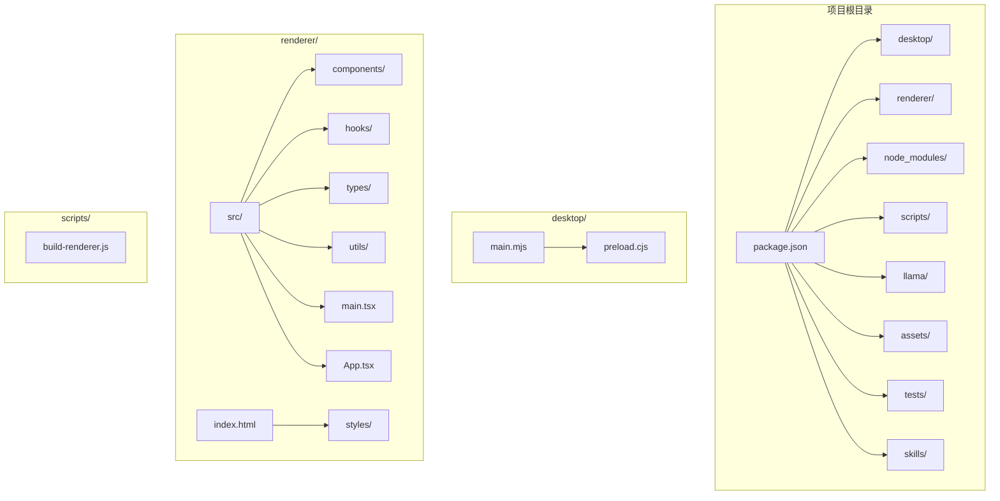

# 开发环境搭建

<cite>
**本文档引用的文件**
- [package.json](file://package.json)
- [tsconfig.json](file://tsconfig.json)
- [electron-builder.yml](file://electron-builder.yml)
- [config.toml](file://config.toml)
- [desktop/main.mjs](file://desktop/main.mjs)
- [scripts/build-renderer.js](file://scripts/build-renderer.js)
- [renderer/src/main.tsx](file://renderer/src/main.tsx)
- [renderer/src/App.tsx](file://renderer/src/App.tsx)
- [README.md](file://README.md)
- [.github/workflows/release.yml](file://.github/workflows/release.yml)
</cite>

## 目录
1. [简介](#简介)
2. [系统要求](#系统要求)
3. [项目结构](#项目结构)
4. [依赖安装](#依赖安装)
5. [TypeScript 配置](#typescript-配置)
6. [开发工具推荐](#开发工具推荐)
7. [开发环境验证](#开发环境验证)
8. [常见问题解决](#常见问题解决)
9. [总结](#总结)

## 简介

illama-desktop 是一个基于 Electron 和 React 的 Windows 桌面应用程序，用于运行和管理本地 llama.cpp 服务器。该项目提供了完整的聊天界面、OpenAI 兼容 API、系统托盘后台运行等功能。本文档将详细介绍如何搭建开发环境，包括系统要求、依赖安装、配置设置和开发工具推荐。

## 系统要求

根据项目文档和配置文件分析，开发环境需要满足以下要求：

### 操作系统兼容性
- **Windows 10/11 (64 位)** - 项目明确支持 Windows 平台
- **Windows Server** - 也可用于开发和测试

### Node.js 版本要求
- **Node.js >= 18.0.0** - 项目要求最低 Node.js 版本
- **推荐使用 LTS 版本** - 为了更好的稳定性和长期支持

### 硬件要求
- **内存建议 >= 16GB** - 具体需求取决于所使用的模型大小
- **GPU 可选** - 支持 CUDA/Vulkan 加速，但不是必需的

### 其他依赖
- **Git** - 用于代码版本控制
- **Python 3.x** - 用于编译某些原生模块（如果需要）
- **Visual Studio Build Tools** - Windows 平台的 C++ 编译工具

**章节来源**
- [README.md:62-70](file://README.md#L62-L70)
- [README.md:62-70](file://README.md#L62-L70)

## 项目结构

项目采用典型的 Electron + React 架构，主要目录结构如下：



**图表来源**
- [package.json:1-51](file://package.json#L1-L51)
- [README.md:152-201](file://README.md#L152-L201)

**章节来源**
- [README.md:152-201](file://README.md#L152-L201)

## 依赖安装

### 1. 克隆项目

```bash
git clone https://github.com/linkin770/illama-cpp-desktop.git
cd illama-cpp-desktop
```

### 2. 安装 Node.js 依赖

```bash
npm install
```

这个命令会安装所有必要的开发和运行时依赖，包括：
- **Electron 41.1.1** - 跨平台桌面应用框架
- **React 19.2.6** - UI 框架
- **TypeScript 6.0.3** - 类型安全
- **Ant Design X 2.7.0** - UI 组件库
- **esbuild 0.28.0** - 渲染进程构建工具
- **electron-builder 26.8.1** - 打包工具

### 3. llama.cpp 依赖准备

由于 llama.cpp 体积较大，项目不包含编译产物，需要手动下载：

1. 访问 [llama.cpp 官方发布页面](https://github.com/ggml-org/llama.cpp/releases)
2. 下载 Windows 版本的发布包（如 `llama.cpp-win-cuda.zip`）
3. 解压后将所有文件复制到项目的 `llama/` 文件夹中

确保 `llama/` 文件夹包含以下关键文件：
- `llama-server.exe` - 主服务程序
- `llama.dll` - 核心推理库
- `ggml*.dll` - ggml 推理库
- `cublas*.dll` / `cudart*.dll` - CUDA 支持库（GPU 版本）

### 4. 验证依赖安装

```bash
# 检查 Node.js 版本
node --version

# 检查 npm 版本
npm --version

# 验证依赖安装
npm list electron react typescript
```

**章节来源**
- [README.md:100-113](file://README.md#L100-L113)
- [README.md:75-91](file://README.md#L75-L91)
- [package.json:28-49](file://package.json#L28-L49)

## TypeScript 配置

项目使用 TypeScript 进行类型安全检查，配置文件位于 `tsconfig.json`：

### 编译选项配置

| 选项 | 值 | 说明 |
|------|-----|------|
| `target` | ES2020 | 目标 JavaScript 版本 |
| `module` | ESNext | 模块系统 |
| `moduleResolution` | bundler | 模块解析策略 |
| `jsx` | react-jsx | JSX 处理方式 |
| `strict` | true | 启用严格模式 |
| `esModuleInterop` | true | ES 模块互操作性 |
| `skipLibCheck` | true | 跳过库文件检查 |
| `forceConsistentCasingInFileNames` | true | 文件名大小写一致性 |
| `resolveJsonModule` | true | 支持 JSON 模块 |
| `isolatedModules` | true | 隔离模块 |
| `noEmit` | true | 不生成输出文件 |
| `lib` | ES2020, DOM, DOM.Iterable | 支持的库 |

### 编译范围

配置文件指定只编译 `renderer/src/**/*` 目录下的文件，排除 `node_modules`。

### 类型检查命令

```bash
# 运行类型检查
npx tsc --noEmit

# 或者使用 npm 脚本
npm run typecheck
```

**章节来源**
- [tsconfig.json:1-18](file://tsconfig.json#L1-L18)

## 开发工具推荐

### 1. IDE/编辑器

**推荐使用 VS Code**，因为它提供了最佳的 TypeScript 和 React 开发体验：

#### 必装扩展
- **ESLint** - 代码质量检查
- **Prettier** - 代码格式化
- **TypeScript Importer** - 自动导入
- **Bracket Pair Colorizer** - 括号配色
- **Auto Rename Tag** - HTML 标签自动重命名

#### VS Code 设置
```json
{
    "editor.formatOnSave": true,
    "editor.codeActionsOnSave": {
        "source.fixAll.eslint": true
    },
    "typescript.preferences.importModuleSpecifier": "relative",
    "typescript.preferences.importModuleSpecifierEnding": "js",
    "emmet.includeLanguages": {
        "typescript": "javascript"
    }
}
```

### 2. 调试配置

#### VS Code 调试配置文件 `.vscode/launch.json`

```json
{
    "version": "0.2.0",
    "configurations": [
        {
            "name": "Debug Desktop Main Process",
            "type": "node",
            "request": "launch",
            "cwd": "${workspaceFolder}",
            "program": "${workspaceFolder}/desktop/main.mjs",
            "env": {
                "NODE_ENV": "development"
            },
            "console": "integratedTerminal"
        },
        {
            "name": "Debug Renderer Process",
            "type": "chrome",
            "request": "launch",
            "url": "http://localhost:3000",
            "webRoot": "${workspaceFolder}/renderer/src",
            "sourceMapPathOverrides": {
                "webpack:///src/*": "${workspaceFolder}/renderer/src/*"
            }
        },
        {
            "name": "Debug Electron App",
            "type": "node",
            "request": "launch",
            "cwd": "${workspaceFolder}",
            "program": "${workspaceFolder}/node_modules/.bin/electron",
            "args": ["."],
            "env": {
                "ELECTRON_RUN_AS_NODE": "1",
                "NODE_ENV": "development"
            },
            "console": "integratedTerminal"
        }
    ]
}
```

### 3. 浏览器开发者工具

- **Chrome DevTools** - 调试渲染进程
- **Edge DevTools** - 替代选择
- **React Developer Tools** - React 组件调试
- **Redux DevTools** - 状态管理调试

### 4. 其他推荐工具

- **Postman** - API 测试
- **Git Extensions** - Git 图形界面
- **Process Monitor** - 系统监控
- **Resource Monitor** - 资源使用情况

**章节来源**
- [package.json:23-27](file://package.json#L23-L27)

## 开发环境验证

### 1. 启动开发模式

```bash
# 启动开发模式（构建 + 启动 Electron）
npm start
```

这个命令会执行以下步骤：
1. 构建渲染进程（esbuild）
2. 启动 Electron 应用

### 2. 仅构建渲染进程

```bash
# 仅构建渲染进程
npm run build
```

### 3. 验证构建结果

构建完成后，检查以下文件是否存在：
- `renderer/dist/main.js` - 构建后的 JavaScript 文件
- `renderer/index.html` - HTML 入口文件

### 4. 验证 TypeScript 编译

```bash
# 运行类型检查
npx tsc --noEmit
```

### 5. 验证 Electron 启动

启动后，应该看到以下界面：
- 主窗口标题：`illama Desktop`
- 应用图标：`assets/llama-cpp.ico`
- 聊天界面：React 组件渲染
- 系统托盘：应用状态指示

### 6. 验证 API 功能

在浏览器中访问以下 URL 验证 API：
- `http://127.0.0.1:8080/v1/models` - 获取模型列表
- `http://127.0.0.1:8080/v1/chat/completions` - 聊天接口

### 7. 验证配置文件

检查 `config.toml` 文件是否正确生成和读取：
- 默认端口：8080
- 默认上下文大小：32768
- 默认 GPU 层数：99

**章节来源**
- [README.md:217-234](file://README.md#L217-L234)
- [config.toml:1-27](file://config.toml#L1-L27)

## 常见问题解决

### 1. Node.js 版本不兼容

**问题**：`Error: Cannot find module 'electron'`

**解决方案**：
```bash
# 检查 Node.js 版本
node --version

# 如果版本过低，升级到推荐版本
# 使用 nvm 管理 Node.js 版本
nvm install --lts
nvm use --lts
```

### 2. 依赖安装失败

**问题**：npm install 失败

**解决方案**：
```bash
# 清理缓存
npm cache clean --force

# 删除 node_modules 和 package-lock.json
rm -rf node_modules package-lock.json

# 重新安装
npm install --legacy-peer-deps
```

### 3. esbuild 构建错误

**问题**：构建时报错

**解决方案**：
```bash
# 检查 esbuild 版本
npm list esbuild

# 更新到兼容版本
npm install esbuild@^0.28.0

# 清理构建缓存
rm -rf renderer/dist
```

### 4. Electron 启动失败

**问题**：应用启动后立即崩溃

**解决方案**：
```bash
# 检查 Electron 版本
npm list electron

# 更新到兼容版本
npm install electron@41.1.1

# 检查配置文件路径
node -e "console.log(require('path').resolve('./llama'))"
```

### 5. llama.cpp 服务启动失败

**问题**：无法启动 llama-server.exe

**解决方案**：
```bash
# 检查 llama.cpp 文件完整性
ls -la llama/

# 验证可执行文件权限
chmod +x llama/llama-server.exe

# 检查依赖 DLL 文件
ls -la llama/*.dll

# 手动启动服务验证
./llama/llama-server.exe --help
```

### 6. 端口占用问题

**问题**：端口 8080 被占用

**解决方案**：
```bash
# 修改 config.toml 中的端口
# 或者释放端口
netstat -ano | findstr :8080
taskkill /PID <PID> /F

# 在代码中修改默认端口
# desktop/main.mjs 第 96 行
```

### 7. TypeScript 类型错误

**问题**：类型检查失败

**解决方案**：
```bash
# 运行类型检查
npx tsc --noEmit --skipLibCheck

# 检查 tsconfig.json 配置
# 确保 include 路径正确
```

### 8. 资源文件加载失败

**问题**：图标或样式文件无法加载

**解决方案**：
```bash
# 检查文件路径
ls -la assets/

# 验证路径配置
# desktop/main.mjs 中的图标路径
```

**章节来源**
- [README.md:62-70](file://README.md#L62-L70)
- [desktop/main.mjs:13-25](file://desktop/main.mjs#L13-L25)

## 总结

通过以上步骤，您已经成功搭建了 illama-desktop 的开发环境。以下是关键要点：

### 已完成的设置
- ✅ Node.js 环境配置（>= 18.0.0）
- ✅ 项目依赖安装
- ✅ llama.cpp 依赖准备
- ✅ TypeScript 配置验证
- ✅ 开发工具配置
- ✅ 环境功能验证

### 后续开发建议
1. **熟悉项目架构** - 了解 Electron + React 的双进程架构
2. **学习配置系统** - 掌握 TOML 配置文件的使用
3. **理解 IPC 通信** - 学习主进程与渲染进程的通信机制
4. **掌握构建流程** - 了解 esbuild 和 electron-builder 的使用
5. **测试驱动开发** - 利用现有测试框架进行单元测试

### 故障排查清单
- [ ] Node.js 版本检查
- [ ] 依赖完整性验证
- [ ] 构建流程测试
- [ ] API 功能验证
- [ ] 配置文件检查
- [ ] 资源文件验证

现在您可以开始进行功能开发和调试了。如果遇到任何问题，请参考相应的章节和错误信息进行排查。