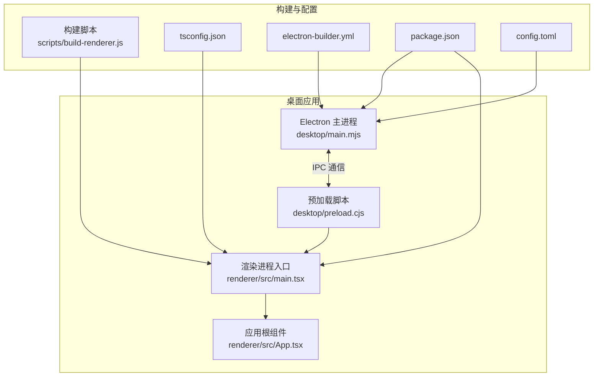
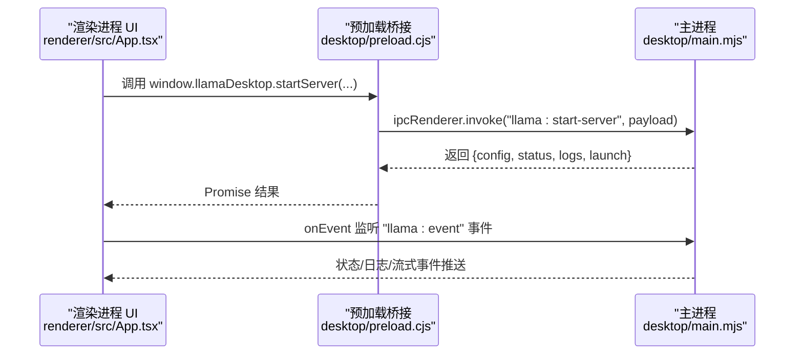
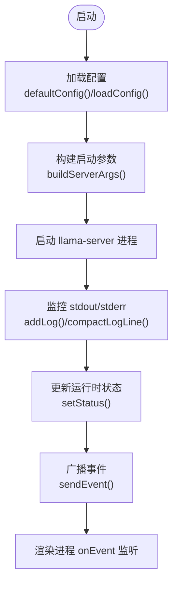
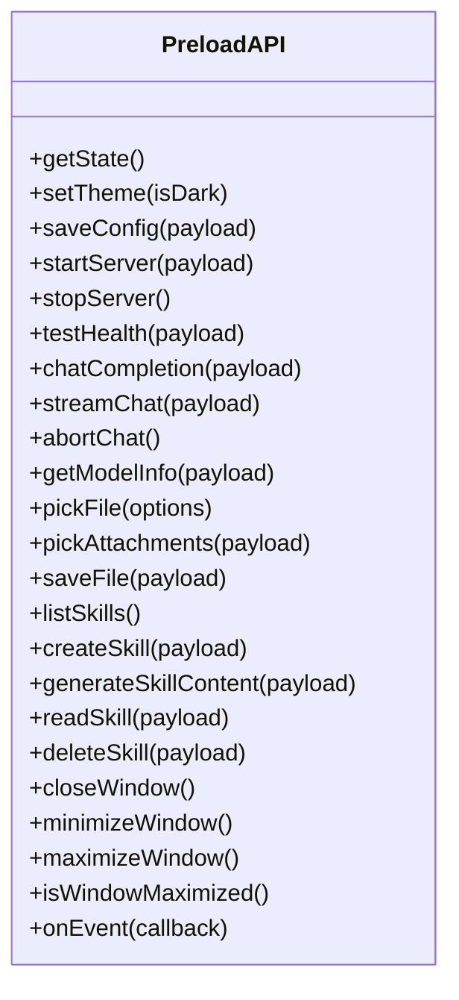
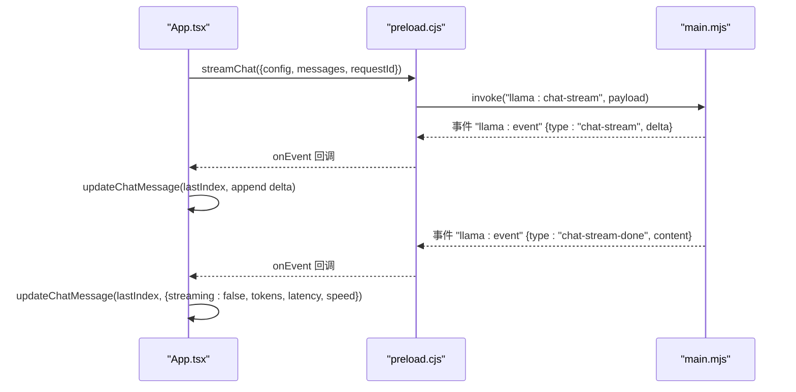
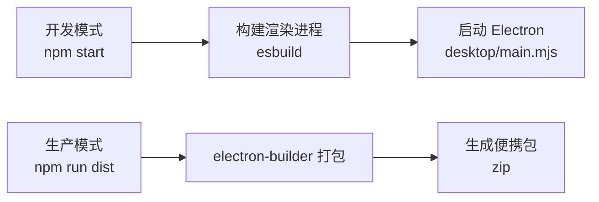
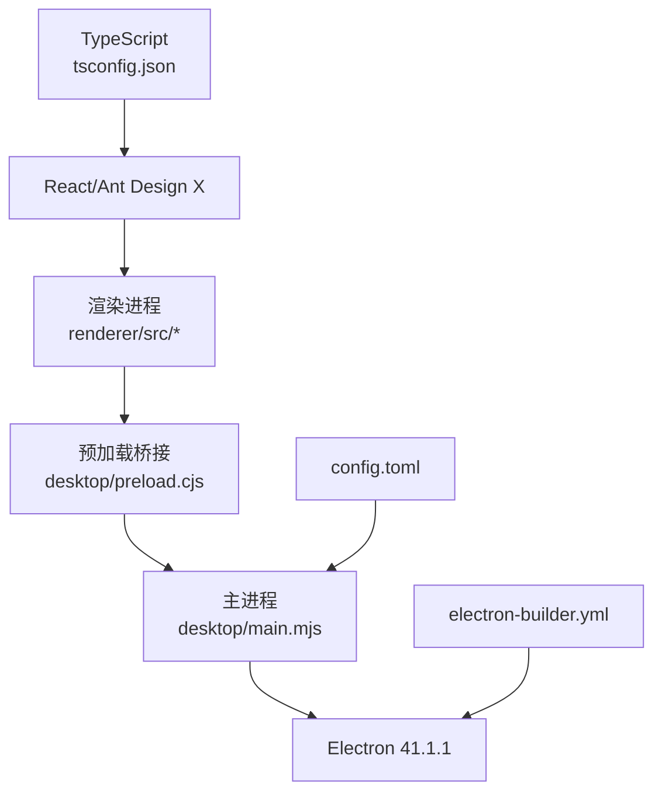

# 开发者指南

<cite>
**本文引用的文件**
- [package.json](file://package.json)
- [tsconfig.json](file://tsconfig.json)
- [electron-builder.yml](file://electron-builder.yml)
- [config.toml](file://config.toml)
- [desktop/main.mjs](file://desktop/main.mjs)
- [desktop/preload.cjs](file://desktop/preload.cjs)
- [scripts/build-renderer.js](file://scripts/build-renderer.js)
- [renderer/src/main.tsx](file://renderer/src/main.tsx)
- [renderer/src/App.tsx](file://renderer/src/App.tsx)
- [README.md](file://README.md)
</cite>

## 目录
1. [简介](#简介)
2. [项目结构](#项目结构)
3. [核心组件](#核心组件)
4. [架构总览](#架构总览)
5. [详细组件分析](#详细组件分析)
6. [依赖关系分析](#依赖关系分析)
7. [性能考虑](#性能考虑)
8. [故障排查指南](#故障排查指南)
9. [结论](#结论)
10. [附录](#附录)

## 简介
本指南面向希望参与 illama-desktop 开发的贡献者，涵盖开发环境搭建、代码结构与组织原则、开发工作流程、构建与打包流程、测试策略、代码质量保障、贡献与发布流程等内容。项目基于 Electron + React + TypeScript，提供本地 llama.cpp 服务的桌面控制面板，并通过 OpenAI 兼容接口对外提供能力。

## 项目结构
项目采用“主进程 + 渲染进程 + 资源与脚本”的分层组织方式：
- desktop：Electron 主进程与预加载脚本，负责窗口、IPC、服务生命周期、配置与日志等
- renderer：React 前端应用，包含组件、Hooks、类型与样式
- scripts：构建脚本（esbuild）
- 根目录配置：package.json、tsconfig.json、electron-builder.yml、config.toml 等
- assets：图标与静态资源
- llama：llama.cpp 编译产物（需自行下载）
- skills：技能文件存储目录
- tests：测试目录（包含 main、preload、renderer、unit、mocks）

图表来源
- [desktop/main.mjs](file://desktop/main.mjs)
- [desktop/preload.cjs](file://desktop/preload.cjs)
- [renderer/src/main.tsx](file://renderer/src/main.tsx)
- [renderer/src/App.tsx](file://renderer/src/App.tsx)
- [scripts/build-renderer.js](file://scripts/build-renderer.js)
- [tsconfig.json](file://tsconfig.json)
- [electron-builder.yml](file://electron-builder.yml)
- [package.json](file://package.json)
- [config.toml](file://config.toml)

章节来源
- [README.md: 项目结构与技术栈](file://README.md)
- [package.json: 入口与脚本](file://package.json)
- [tsconfig.json: TypeScript 编译配置](file://tsconfig.json)
- [electron-builder.yml: 打包配置](file://electron-builder.yml)
- [config.toml: 默认配置](file://config.toml)

## 核心组件
- Electron 主进程：负责窗口管理、llama.cpp 服务启动/停止、IPC 事件、系统托盘、状态与日志管理、TOML 配置解析与生成、命令行参数构建等
- 预加载脚本：通过 contextBridge 暴露受控 API 到渲染进程，封装 IPC 调用
- 渲染进程：React 应用，包含聊天界面、侧边栏、设置面板、终端日志、模型信息弹窗、系统提示词弹窗、Toast 提示等
- 构建脚本：使用 esbuild 对渲染进程进行打包（bundle/minify/sourcemap/tree-shaking）
- 配置系统：TOML 配置文件与桌面状态文件协同，支持直接模式与启动器模式

章节来源
- [desktop/main.mjs: 主进程核心逻辑](file://desktop/main.mjs)
- [desktop/preload.cjs: 预加载桥接](file://desktop/preload.cjs)
- [renderer/src/App.tsx: 应用根组件与业务流程](file://renderer/src/App.tsx)
- [scripts/build-renderer.js: 渲染进程构建](file://scripts/build-renderer.js)

## 架构总览
应用采用典型的 Electron 架构：主进程集中管理服务与系统资源，渲染进程专注 UI 与用户交互，通过预加载脚本建立安全的 IPC 通道。

图表来源
- [renderer/src/App.tsx](file://renderer/src/App.tsx)
- [desktop/preload.cjs](file://desktop/preload.cjs)
- [desktop/main.mjs](file://desktop/main.mjs)

## 详细组件分析

### 主进程（desktop/main.mjs）
- 职责
  - 窗口与托盘管理、系统事件处理
  - llama.cpp 服务启动/停止、健康检查、日志采集与压缩
  - TOML 配置解析与规范化、配置文件生成与保存
  - 命令行参数构建、URL 与参数工具函数
  - 与渲染进程的 IPC 事件通信与状态广播
- 关键点
  - 运行时状态与日志队列维护，支持流式事件与状态变更
  - 配置归一化与持久化，支持直接模式与启动器模式
  - 安全日志过滤与截断，避免噪声与内存膨胀
- 依赖
  - Electron API（app、BrowserWindow、ipcMain、Tray 等）
  - child_process、fs/promises、path、url 等 Node 内置模块

图表来源
- [desktop/main.mjs](file://desktop/main.mjs)

章节来源
- [desktop/main.mjs](file://desktop/main.mjs)

### 预加载脚本（desktop/preload.cjs）
- 职责
  - 通过 contextBridge.exposeInMainWorld 暴露受限 API
  - 统一封装 ipcRenderer.invoke/send，提供类型安全的调用入口
- 关键点
  - 事件订阅与解绑（onEvent 回调管理）
  - 文件选择、附件选择、技能 CRUD、窗口控制等 API

图表来源
- [desktop/preload.cjs](file://desktop/preload.cjs)

章节来源
- [desktop/preload.cjs](file://desktop/preload.cjs)

### 渲染进程（renderer/src/App.tsx 与 main.tsx）
- 职责
  - React 应用入口与根组件，整合聊天界面、侧边栏、设置面板、终端日志、模型信息弹窗、系统提示词弹窗、Toast 提示
  - 通过 window.llamaDesktop 调用主进程能力
  - 状态管理与事件监听，流式聊天处理与消息持久化
- 关键点
  - 流式事件处理：即时增量更新 + 完成后补全统计
  - 会话与系统提示词管理、技能注入、附件处理
  - 配置保存、服务启停、模型信息查询

图表来源
- [renderer/src/App.tsx](file://renderer/src/App.tsx)
- [desktop/preload.cjs](file://desktop/preload.cjs)
- [desktop/main.mjs](file://desktop/main.mjs)

章节来源
- [renderer/src/App.tsx](file://renderer/src/App.tsx)
- [renderer/src/main.tsx](file://renderer/src/main.tsx)

### 构建与打包（scripts/build-renderer.js、electron-builder.yml、package.json）
- 开发模式
  - npm start：先构建渲染进程，再启动 Electron
  - 渲染进程构建：esbuild 打包 main.tsx，启用 minify、sourcemap、tree-shaking
- 生产模式
  - npm run dist：构建渲染进程后，使用 electron-builder 打包为便携 zip
  - 打包配置：输出目录、包含文件、Windows 图标、asar、压缩等级、制品命名规则
- TypeScript 类型检查
  - 通过 npx tsc --noEmit 进行类型检查（见 README 开发命令）

图表来源
- [scripts/build-renderer.js](file://scripts/build-renderer.js)
- [electron-builder.yml](file://electron-builder.yml)
- [package.json](file://package.json)
- [README.md: 开发命令](file://README.md)

章节来源
- [scripts/build-renderer.js](file://scripts/build-renderer.js)
- [electron-builder.yml](file://electron-builder.yml)
- [package.json](file://package.json)
- [README.md: 开发命令](file://README.md)

## 依赖关系分析
- 语言与框架
  - TypeScript（严格模式、ESNext 模块、DOM/Iterable 库）
  - React 19 + Ant Design X（UI 组件与主题）
- 构建与打包
  - esbuild（渲染进程打包）
  - electron-builder（应用打包）
- 运行时
  - Electron 41.1.1（主进程与渲染进程）
  - Node.js（主进程使用 ES 模块与 fs/path/url 等内置模块）
- 配置与数据
  - TOML 配置文件（config.toml）与桌面状态文件（desktop-state.json）

图表来源
- [tsconfig.json](file://tsconfig.json)
- [package.json](file://package.json)
- [electron-builder.yml](file://electron-builder.yml)
- [desktop/main.mjs](file://desktop/main.mjs)
- [config.toml](file://config.toml)

章节来源
- [tsconfig.json](file://tsconfig.json)
- [package.json](file://package.json)
- [electron-builder.yml](file://electron-builder.yml)
- [desktop/main.mjs](file://desktop/main.mjs)
- [config.toml](file://config.toml)

## 性能考虑
- 渲染进程构建
  - 启用 minify、tree-shaking、sourcemap，平衡体积与调试成本
- 主进程日志
  - 过滤重复例行日志、ANSI 转义清理、长日志截断，限制日志队列长度
- 流式聊天
  - 事件驱动增量更新，定期保存会话，避免频繁 IO
- 打包策略
  - asar 启用、压缩等级 normal，兼顾安全性与体积

章节来源
- [scripts/build-renderer.js](file://scripts/build-renderer.js)
- [desktop/main.mjs](file://desktop/main.mjs)
- [electron-builder.yml](file://electron-builder.yml)

## 故障排查指南
- 启动服务失败
  - 检查 config.toml 中模型路径、llama.cpp 目录、端口占用
  - 查看终端日志面板中的错误信息
- 流式输出异常
  - 确认主进程事件推送与渲染进程 onEvent 处理链路
  - 检查 requestId 一致性与消息索引更新
- 配置保存无效
  - 确认桌面状态文件与 TOML 文件写入路径
  - 校验配置归一化与字段类型
- 打包产物缺失
  - 确认 electron-builder 配置的 files/include 与输出目录

章节来源
- [desktop/main.mjs](file://desktop/main.mjs)
- [renderer/src/App.tsx](file://renderer/src/App.tsx)
- [config.toml](file://config.toml)
- [electron-builder.yml](file://electron-builder.yml)

## 结论
illama-desktop 以 Electron 为基础，结合 React 与 TypeScript，提供了本地 llama.cpp 服务的完整桌面控制面板。通过清晰的主/渲染进程职责划分、严格的配置与日志管理、完善的构建与打包流程，项目具备良好的可维护性与扩展性。建议贡献者在开发前熟悉上述架构与流程，按规范进行测试与提交。

## 附录

### 开发环境搭建
- 系统要求
  - Windows 10/11（64 位），Node.js >= 18.0.0
- 步骤
  - 克隆仓库并安装依赖
  - 下载并放置 llama.cpp 编译产物到 llama/ 目录
  - 启动开发模式：npm start
- 参考
  - README 的“系统要求”、“前置准备”、“快速开始”

章节来源
- [README.md: 系统要求与快速开始](file://README.md)

### 代码结构与组织原则
- 主进程：集中管理服务、IPC、状态与日志
- 预加载：最小权限 API 暴露，统一 IPC 调用
- 渲染进程：组件化、Hook 管理状态、事件驱动更新
- 配置：TOML 与桌面状态协同，支持直接/启动器两种模式

章节来源
- [desktop/main.mjs](file://desktop/main.mjs)
- [desktop/preload.cjs](file://desktop/preload.cjs)
- [renderer/src/App.tsx](file://renderer/src/App.tsx)
- [config.toml](file://config.toml)

### 开发工作流程
- 编写与调试
  - 修改渲染进程组件或主进程逻辑后，使用 npm start 热更新
  - 使用渲染进程 Console 与主进程日志面板定位问题
- 测试
  - 项目包含 tests 目录（main、preload、renderer、unit、mocks），建议按目录组织单元与集成测试
- 提交与审查
  - 遵循项目贡献流程（见贡献指南）

章节来源
- [README.md: 开发命令与测试](file://README.md)
- [tests/](file://tests)

### 构建与打包流程
- 开发模式
  - npm start：构建渲染进程 + 启动 Electron
- 生产模式
  - npm run dist：构建渲染进程 + electron-builder 打包 zip
- TypeScript 检查
  - npx tsc --noEmit

章节来源
- [README.md: 开发命令](file://README.md)
- [scripts/build-renderer.js](file://scripts/build-renderer.js)
- [electron-builder.yml](file://electron-builder.yml)
- [package.json](file://package.json)

### 测试策略与框架
- 单元测试：针对渲染进程组件与工具函数
- 集成测试：覆盖主进程 IPC、服务生命周期、配置读写
- Mock：使用 mocks 目录模拟文件系统与网络请求
- 执行：npm test（参考 README 开发命令）

章节来源
- [tests/](file://tests)
- [README.md: 开发命令](file://README.md)

### 代码质量保证
- TypeScript：严格模式、ESNext 模块、DOM/Iterable 库
- esbuild：构建时进行最小化与树摇
- electron-builder：打包时启用 asar 与压缩
- 建议：在 CI 中增加类型检查与测试覆盖率统计

章节来源
- [tsconfig.json](file://tsconfig.json)
- [scripts/build-renderer.js](file://scripts/build-renderer.js)
- [electron-builder.yml](file://electron-builder.yml)
- [package.json](file://package.json)

### 贡献指南与 Pull Request 流程
- Fork 仓库并创建分支
- 提交前执行类型检查与测试
- 提交 PR 并关联 Issue
- 维护者审核与合并

章节来源
- [README.md: 开发命令与贡献相关说明](file://README.md)

### 发布流程与版本管理
- 版本号
  - package.json 中 version 字段，格式为语义化版本
- 发布
  - 使用 npm run dist 生成便携包
  - 可在 CI 中配置发布策略（参考 .github/workflows/release.yml）
- 配置
  - electron-builder.yml 控制输出目录、图标、目标格式与制品命名

章节来源
- [package.json](file://package.json)
- [.github/workflows/release.yml](file://.github/workflows/release.yml)
- [electron-builder.yml](file://electron-builder.yml)