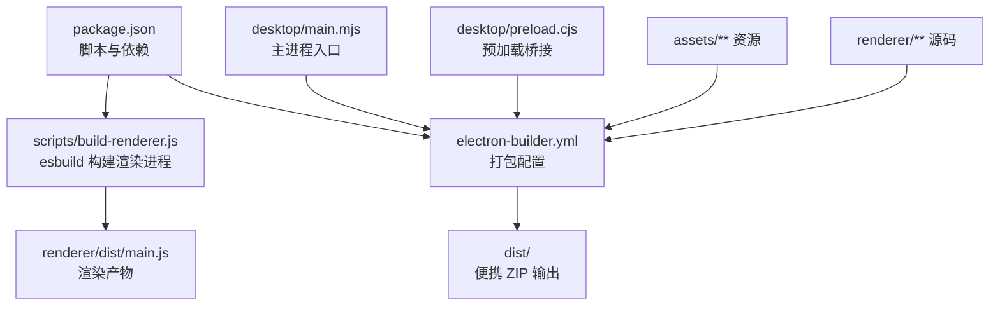
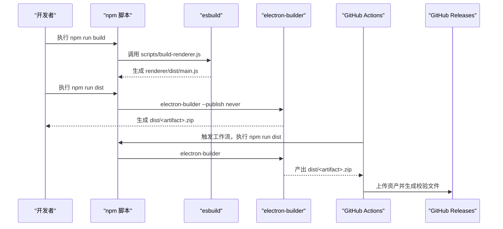
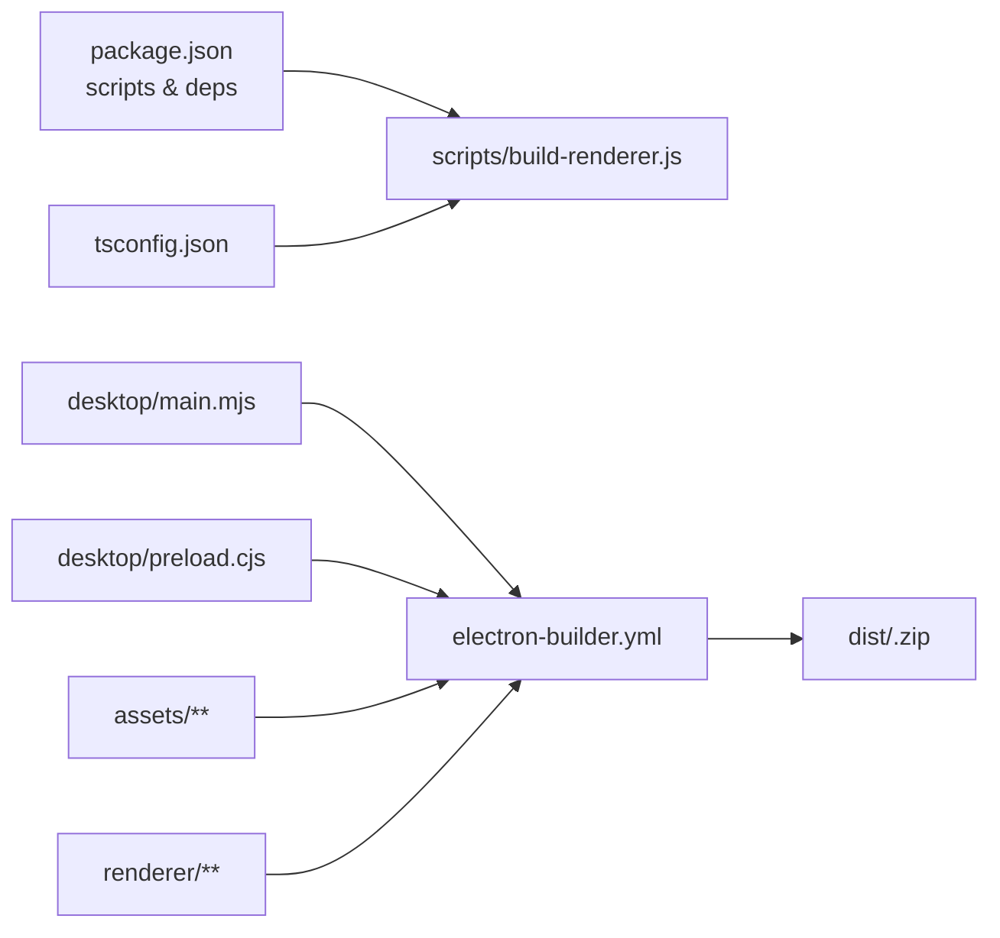

# 构建与打包

<cite>
**本文引用的文件**
- [electron-builder.yml](file://electron-builder.yml)
- [package.json](file://package.json)
- [scripts/build-renderer.js](file://scripts/build-renderer.js)
- [.github/workflows/release.yml](file://.github/workflows/release.yml)
- [tsconfig.json](file://tsconfig.json)
- [desktop/main.mjs](file://desktop/main.mjs)
- [desktop/preload.cjs](file://desktop/preload.cjs)
- [config.toml](file://config.toml)
- [scripts/create-icon.ps1](file://scripts/create-icon.ps1)
- [README.md](file://README.md)
</cite>

## 目录
1. [简介](#简介)
2. [项目结构](#项目结构)
3. [核心组件](#核心组件)
4. [架构总览](#架构总览)
5. [详细组件分析](#详细组件分析)
6. [依赖关系分析](#依赖关系分析)
7. [性能考量](#性能考量)
8. [故障排查指南](#故障排查指南)
9. [结论](#结论)
10. [附录](#附录)

## 简介
本指南面向 illama-desktop 的构建与打包，涵盖开发构建与生产构建的差异、electron-builder 的配置与使用、目标平台与输出格式、签名配置建议、自动发布流程与 GitHub Actions 工作流、构建优化技巧以及常见问题的解决方案。文档以仓库现有配置为基础，结合主进程、预加载脚本、打包配置与 CI 工作流进行系统化说明，帮助开发者在不同平台上稳定产出可分发的便携版应用。

## 项目结构
illama-desktop 采用 Electron + React 的桌面应用架构，构建流程主要涉及：
- 渲染进程构建：使用 esbuild 对 React 源码进行打包，输出到 renderer/dist/main.js
- 主进程与资源打包：使用 electron-builder 将主进程、预加载脚本、渲染产物与资源打包为便携 ZIP

图表来源
- [package.json:23-27](file://package.json#L23-L27)
- [scripts/build-renderer.js:1-20](file://scripts/build-renderer.js#L1-L20)
- [electron-builder.yml:3-9](file://electron-builder.yml#L3-L9)

章节来源
- [package.json:1-51](file://package.json#L1-L51)
- [electron-builder.yml:1-17](file://electron-builder.yml#L1-L17)
- [scripts/build-renderer.js:1-20](file://scripts/build-renderer.js#L1-L20)

## 核心组件
- 渲染进程构建脚本：通过 esbuild 将 React 源码打包为浏览器可执行的单一 JS 文件，并启用最小化、SourceMap 与 Tree Shaking，提升加载速度与安全性。
- 主进程与预加载：主进程负责窗口、服务管理、IPC 与系统托盘；预加载脚本通过 contextBridge 暴露受控 API 给渲染进程。
- 打包配置：electron-builder 定义了应用标识、产品名、输出目录、打包文件集合、Windows 平台目标与图标、便携 ZIP 输出命名规则、asar 压缩与压缩等级等。
- CI 自动发布：GitHub Actions 在推送以 v 开头的标签时触发，使用 Windows runner 构建便携版并上传到 GitHub Releases，同时生成 SHA256 校验文件。

章节来源
- [scripts/build-renderer.js:1-20](file://scripts/build-renderer.js#L1-L20)
- [desktop/main.mjs:1-800](file://desktop/main.mjs#L1-L800)
- [desktop/preload.cjs:1-32](file://desktop/preload.cjs#L1-L32)
- [electron-builder.yml:1-17](file://electron-builder.yml#L1-L17)
- [.github/workflows/release.yml:1-61](file://.github/workflows/release.yml#L1-L61)

## 架构总览
构建与打包的关键流程如下：

图表来源
- [package.json:23-27](file://package.json#L23-L27)
- [scripts/build-renderer.js:1-20](file://scripts/build-renderer.js#L1-L20)
- [electron-builder.yml:10-16](file://electron-builder.yml#L10-L16)
- [.github/workflows/release.yml:26-30](file://.github/workflows/release.yml#L26-L30)

## 详细组件分析

### 渲染进程构建（esbuild）
- 目标：将 renderer/src/main.tsx 打包为浏览器可执行的单一 JS 文件，启用最小化、SourceMap 与 Tree Shaking。
- 关键点：入口、输出、目标浏览器版本、TSX 加载器、解析扩展名、TypeScript 配置等。
- 影响：影响应用启动速度、包体大小与调试体验。

章节来源
- [scripts/build-renderer.js:1-20](file://scripts/build-renderer.js#L1-L20)
- [tsconfig.json:1-18](file://tsconfig.json#L1-L18)

### 主进程与预加载（IPC 桥接）
- 主进程职责：窗口管理、llama.cpp 服务启动/停止、IPC 通信、系统托盘、状态与日志管理、TOML 配置读写与生成。
- 预加载脚本：通过 contextBridge 暴露受限 API，供渲染进程调用，避免直接访问 Node/Electron API。
- 关键点：IPC 通道命名、事件广播、状态同步、日志压缩与过滤。

章节来源
- [desktop/main.mjs:1-800](file://desktop/main.mjs#L1-L800)
- [desktop/preload.cjs:1-32](file://desktop/preload.cjs#L1-L32)

### electron-builder 配置与使用
- 应用标识与产品名：用于安装与系统识别。
- 输出目录与打包文件：指定 dist 为输出目录，files 列表包含 assets、desktop、renderer、package.json。
- Windows 目标与图标：win 段落定义 zip 目标与图标路径。
- 输出命名：artifactName 使用变量模板生成带版本号的便携包名。
- ASAR 与压缩：开启 asar 与 normal 压缩等级。
- 发布策略：npm 脚本 dist 使用 --publish never，CI 工作流中使用软链接方式上传资产。

章节来源
- [electron-builder.yml:1-17](file://electron-builder.yml#L1-L17)
- [package.json:23-27](file://package.json#L23-L27)
- [.github/workflows/release.yml:38-60](file://.github/workflows/release.yml#L38-L60)

### 自动发布流程与 GitHub Actions 工作流
- 触发条件：推送以 v 开头的标签。
- 运行环境：windows-latest，Node.js 22，缓存 npm。
- 步骤：检出代码、安装依赖、构建便携包、生成 SHA256 校验文件、发布到 GitHub Releases。
- 权限：contents: write，允许创建 Release 与上传资产。

章节来源
- [.github/workflows/release.yml:1-61](file://.github/workflows/release.yml#L1-L61)

### 不同平台的打包步骤与注意事项
- Windows 便携 ZIP（当前配置）
  - 目标：win.zip
  - 注意事项：确保 assets/llama-cpp.ico 存在；llama.cpp 二进制与依赖 DLL 已放置在 llama/ 目录；config.toml 指向正确的 llama-server.exe 路径。
- macOS/Linux（建议扩展）
  - 目标：mac/dmg、linux/appimage 等
  - 注意事项：根据平台调整图标格式与权限；签名与公证（macOS）或签名（Linux）需在 CI 中配置密钥；asar 与压缩策略可按需调整。
- 便携版注意事项
  - 便携版不写注册表，适合个人使用与分发；若需安装包，请在 electron-builder 中添加对应 target。

章节来源
- [electron-builder.yml:10-16](file://electron-builder.yml#L10-L16)
- [config.toml:1-27](file://config.toml#L1-L27)
- [scripts/create-icon.ps1:1-105](file://scripts/create-icon.ps1#L1-L105)

### 构建优化技巧
- 渲染进程
  - 启用最小化与 Tree Shaking，减少包体。
  - 保留 SourceMap 便于调试，但注意发布前移除或限制公开范围。
  - 使用 esbuild 的 target 与 loader 保证 TSX 正确解析。
- 主进程与打包
  - 使用 asar 压缩提升安全性与加载效率。
  - files 列表只包含必要资源，避免打包无关文件。
  - 便携 ZIP 适合快速分发，若需安装体验可增加安装包 target。
- CI/CD
  - 使用 Node.js 缓存加速依赖安装。
  - 生成 SHA256 校验文件，提高分发可信度。
  - 仅在标签分支触发发布，避免误发布。

章节来源
- [scripts/build-renderer.js:1-20](file://scripts/build-renderer.js#L1-L20)
- [electron-builder.yml:15-16](file://electron-builder.yml#L15-L16)
- [.github/workflows/release.yml:20-30](file://.github/workflows/release.yml#L20-L30)

## 依赖关系分析
构建链路的依赖关系如下：

图表来源
- [package.json:23-27](file://package.json#L23-L27)
- [scripts/build-renderer.js:1-20](file://scripts/build-renderer.js#L1-L20)
- [tsconfig.json:1-18](file://tsconfig.json#L1-L18)
- [electron-builder.yml:3-9](file://electron-builder.yml#L3-L9)

章节来源
- [package.json:1-51](file://package.json#L1-L51)
- [electron-builder.yml:1-17](file://electron-builder.yml#L1-L17)

## 性能考量
- 渲染进程包体与加载时间
  - 通过最小化与 Tree Shaking 控制包体大小。
  - SourceMap 有助于调试，但应避免在生产分发中泄露。
- 主进程与打包
  - asar 压缩可减少文件数量，提升加载效率。
  - files 列表精简可缩短打包时间。
- CI 构建时间
  - 使用 npm 缓存与 Node.js 版本固定，减少重复安装时间。
  - 仅在标签触发发布，避免频繁构建。

章节来源
- [scripts/build-renderer.js:1-20](file://scripts/build-renderer.js#L1-L20)
- [electron-builder.yml:15-16](file://electron-builder.yml#L15-L16)
- [.github/workflows/release.yml:20-25](file://.github/workflows/release.yml#L20-L25)

## 故障排查指南
- 渲染进程构建失败
  - 检查 tsconfig.json 的 compilerOptions 与 include 范围。
  - 确认 esbuild 的 loader 与 resolveExtensions 能正确解析 TS/TSX。
- 打包产物缺失或不完整
  - 检查 electron-builder.yml 的 files 列表是否包含所需资源。
  - 确认 dist 输出目录存在且权限正确。
- Windows 便携包无法运行
  - 确认 assets/llama-cpp.ico 存在且路径正确。
  - 确认 llama/ 目录包含 llama-server.exe 与依赖 DLL。
  - 检查 config.toml 的 llama_server_path 与 model 路径。
- CI 发布失败
  - 检查 GitHub Actions 的 permissions 与 secrets（如需签名）。
  - 确认标签命名符合 v* 规则。
  - 校验 dist/<artifact>.zip 是否存在且可上传。

章节来源
- [tsconfig.json:1-18](file://tsconfig.json#L1-L18)
- [scripts/build-renderer.js:1-20](file://scripts/build-renderer.js#L1-L20)
- [electron-builder.yml:1-17](file://electron-builder.yml#L1-L17)
- [config.toml:1-27](file://config.toml#L1-L27)
- [.github/workflows/release.yml:1-61](file://.github/workflows/release.yml#L1-L61)

## 结论
illama-desktop 的构建与打包以 esbuild 与 electron-builder 为核心，配合 GitHub Actions 实现自动化发布。当前配置专注于 Windows 便携 ZIP，具备良好的可移植性与分发便利性。建议在保持现有流程的基础上，逐步完善多平台目标、签名与公证、以及更细粒度的 CI 缓存与校验策略，以进一步提升稳定性与安全性。

## 附录

### 开发构建与生产构建对比
- 开发构建
  - 使用 npm start 启动 Electron，先执行构建脚本再启动应用。
  - 渲染进程构建通常不启用最小化，便于调试。
- 生产构建
  - 使用 npm run dist 生成便携包，启用最小化与 SourceMap（可选）。
  - electron-builder 生成 asar 并输出到 dist 目录。

章节来源
- [package.json:23-27](file://package.json#L23-L27)
- [scripts/build-renderer.js:1-20](file://scripts/build-renderer.js#L1-L20)
- [electron-builder.yml:15-16](file://electron-builder.yml#L15-L16)

### electron-builder 配置要点清单
- 应用标识与产品名：用于系统识别与安装显示。
- 输出目录：dist。
- 打包文件集合：assets/**、desktop/**、renderer/**、package.json。
- Windows 目标：zip。
- 图标：assets/llama-cpp.ico。
- 输出命名：artifactName 使用版本变量。
- ASAR 与压缩：开启 asar 与 normal 压缩。

章节来源
- [electron-builder.yml:1-17](file://electron-builder.yml#L1-L17)

### CI 工作流关键步骤
- 触发：推送 v* 标签。
- 环境：windows-latest，Node.js 22，npm 缓存。
- 步骤：检出、安装依赖、构建、生成 SHA256、发布到 Releases。

章节来源
- [.github/workflows/release.yml:1-61](file://.github/workflows/release.yml#L1-L61)