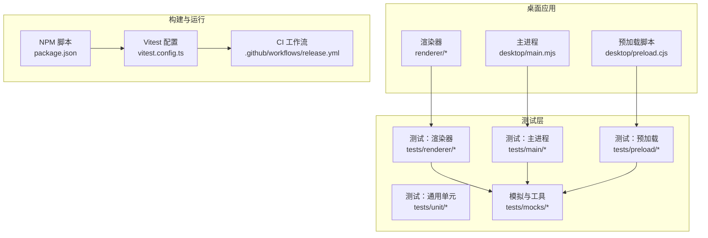
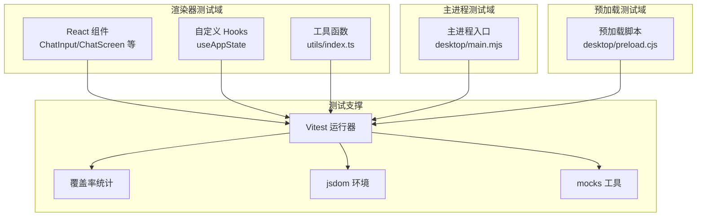
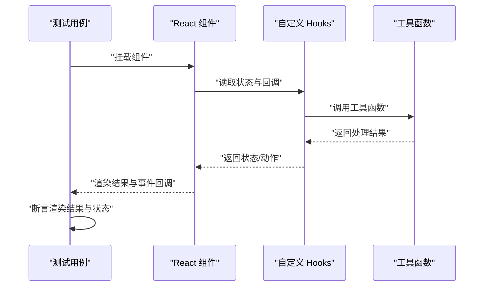
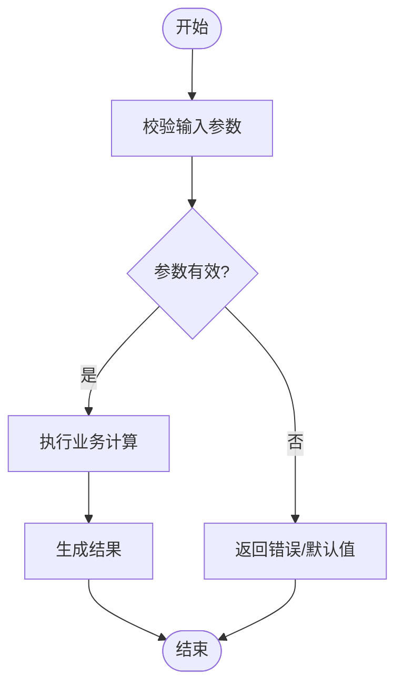
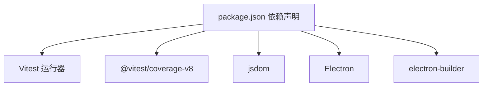

# 测试指南

<cite>
**本文引用的文件**
- [package.json](file://package.json)
- [vitest.config.ts](file://vitest.config.ts)
- [.github/workflows/release.yml](file://.github/workflows/release.yml)
- [renderer/src/App.tsx](file://renderer/src/App.tsx)
- [renderer/src/components/ChatInput.tsx](file://renderer/src/components/ChatInput.tsx)
- [renderer/src/hooks/useAppState.ts](file://renderer/src/hooks/useAppState.ts)
- [renderer/src/utils/index.ts](file://renderer/src/utils/index.ts)
- [desktop/main.mjs](file://desktop/main.mjs)
- [desktop/preload.cjs](file://desktop/preload.cjs)
- [tests/mocks/index.ts](file://tests/mocks/index.ts)
</cite>

## 目录
1. [简介](#简介)
2. [项目结构](#项目结构)
3. [核心组件](#核心组件)
4. [架构总览](#架构总览)
5. [详细组件分析](#详细组件分析)
6. [依赖分析](#依赖分析)
7. [性能考虑](#性能考虑)
8. [故障排查指南](#故障排查指南)
9. [结论](#结论)
10. [附录](#附录)

## 简介
本测试指南面向 illama-desktop 项目，系统性介绍基于 Vitest 的测试体系与最佳实践，覆盖单元测试、集成测试与端到端测试的编写与执行方法；同时提供 UI 测试与 API 测试策略、覆盖率要求以及在 CI 中的配置建议。由于仓库中未发现明确的 Vitest 配置文件与测试目录结构，本指南以现有依赖与 Electron 渲染器/主进程结构为依据，给出可落地的测试方案与实施步骤。

## 项目结构
illama-desktop 采用 Electron 架构，前端位于 renderer 目录，后端逻辑位于 desktop 目录，测试相关资源位于 tests 目录。当前仓库未包含 tests/unit、tests/renderer、tests/main、tests/preload 等子目录及对应配置文件，但已安装 Vitest 与覆盖率工具，具备搭建测试体系的基础。

图表来源
- [package.json:23-27](file://package.json#L23-L27)
- [vitest.config.ts](file://vitest.config.ts)
- [.github/workflows/release.yml](file://.github/workflows/release.yml)

章节来源
- [package.json:1-51](file://package.json#L1-L51)

## 核心组件
- 测试运行器与覆盖率
  - 使用 Vitest 作为测试运行器，配合 @vitest/coverage-v8 实现覆盖率统计。
  - 通过 jsdom 提供 DOM 环境，满足渲染器侧测试需求。
- Electron 三段式测试域
  - 主进程（desktop/main.mjs）
  - 预加载脚本（desktop/preload.cjs）
  - 渲染器（renderer/*）：React 组件、Hooks、工具函数等
- 模拟与辅助
  - tests/mocks 提供跨域测试场景下的模拟对象与工具函数

章节来源
- [package.json:28-37](file://package.json#L28-L37)
- [tests/mocks/index.ts](file://tests/mocks/index.ts)

## 架构总览
下图展示测试在项目中的定位与交互关系，强调“渲染器-主进程-预加载”的三层测试边界与协作方式。

图表来源
- [renderer/src/components/ChatInput.tsx](file://renderer/src/components/ChatInput.tsx)
- [renderer/src/hooks/useAppState.ts](file://renderer/src/hooks/useAppState.ts)
- [renderer/src/utils/index.ts](file://renderer/src/utils/index.ts)
- [desktop/main.mjs](file://desktop/main.mjs)
- [desktop/preload.cjs](file://desktop/preload.cjs)
- [vitest.config.ts](file://vitest.config.ts)

## 详细组件分析

### 测试分类与编写方法
- 单元测试（Unit Tests）
  - 面向纯函数、工具函数与 Hooks 的行为验证，确保输入输出与边界条件正确。
  - 建议优先覆盖渲染器侧的工具函数与业务逻辑，减少外部依赖耦合。
- 集成测试（Integration Tests）
  - 关注模块间协作，如渲染器组件与 Hooks 的组合行为、主进程与预加载脚本的 IPC 交互。
  - 可通过 jsdom 模拟浏览器环境，结合 mock 对外部服务进行隔离。
- 端到端测试（E2E）
  - 在真实 Electron 环境下验证完整用户流程，如启动、会话切换、消息发送等。
  - 当前仓库未包含 E2E 配置，可在 CI 中引入 Playwright 或类似工具进行补充。

章节来源
- [renderer/src/utils/index.ts](file://renderer/src/utils/index.ts)
- [renderer/src/hooks/useAppState.ts](file://renderer/src/hooks/useAppState.ts)
- [desktop/main.mjs](file://desktop/main.mjs)
- [desktop/preload.cjs](file://desktop/preload.cjs)

### UI 测试策略
- 组件测试
  - 使用 jsdom 提供的 DOM 环境，对 React 组件进行快照与交互验证。
  - 关注 props 变化、状态切换、事件回调触发等关键路径。
- Hooks 测试
  - 对自定义 Hooks 的返回值与副作用进行断言，确保状态管理逻辑正确。
- 用户交互模拟
  - 通过事件模拟与状态变更，验证组件在不同输入下的表现一致性。

章节来源
- [renderer/src/components/ChatInput.tsx](file://renderer/src/components/ChatInput.tsx)
- [renderer/src/hooks/useAppState.ts](file://renderer/src/hooks/useAppState.ts)

### API 测试策略
- 渲染器侧 API
  - 对与后端或本地服务交互的接口进行隔离测试，使用 mock 替代真实请求。
- 主进程与预加载脚本
  - 验证 IPC 通道的调用约定、参数传递与错误处理。
- 覆盖率要求
  - 建议为关键路径设置阈值，如语句覆盖率≥80%、分支覆盖率≥70%、函数覆盖率≥85%、行覆盖率≥80%。

章节来源
- [desktop/main.mjs](file://desktop/main.mjs)
- [desktop/preload.cjs](file://desktop/preload.cjs)

### 测试用例编写规范与最佳实践
- 命名规范
  - 使用动宾结构命名测试用例，清晰表达意图与预期结果。
- 断言风格
  - 优先使用明确的断言方法，避免模糊判断。
- Mock 策略
  - 将外部依赖替换为可控的 mock，确保测试稳定与可重复。
- 数据与状态
  - 为边界条件与异常路径准备充分的数据集，覆盖空值、非法值与极端值。
- 可维护性
  - 将公共的 setup、teardown 与辅助函数集中管理，减少重复代码。

### 测试运行与覆盖率配置
- 运行命令
  - 使用 npm 脚本启动测试与覆盖率统计，具体命令需在 package.json 的 scripts 字段中定义。
- 覆盖率统计
  - 通过 @vitest/coverage-v8 生成报告，支持多种格式导出，便于 CI 集成。
- 环境准备
  - jsdom 提供浏览器环境，满足渲染器侧测试需求；主进程与预加载脚本可在 Node 环境中直接测试。

章节来源
- [package.json:23-27](file://package.json#L23-L27)
- [package.json:31](file://package.json#L31)
- [package.json:35](file://package.json#L35)

### 示例测试流程（序列图）
以下序列图展示一个典型 UI 测试流程：组件渲染、交互触发、状态更新与断言。

图表来源
- [renderer/src/components/ChatInput.tsx](file://renderer/src/components/ChatInput.tsx)
- [renderer/src/hooks/useAppState.ts](file://renderer/src/hooks/useAppState.ts)
- [renderer/src/utils/index.ts](file://renderer/src/utils/index.ts)

### 复杂逻辑流程（流程图）
以下流程图展示一个典型的业务流程：输入校验、状态计算与结果输出。

图表来源
- [renderer/src/utils/index.ts](file://renderer/src/utils/index.ts)

## 依赖分析
- 测试相关依赖
  - Vitest：测试运行器与断言库
  - @vitest/coverage-v8：覆盖率统计
  - jsdom：DOM 环境模拟
- 应用与构建
  - Electron、electron-builder：桌面应用打包与分发
  - TypeScript：类型安全与开发体验

图表来源
- [package.json:28-37](file://package.json#L28-L37)

章节来源
- [package.json:28-37](file://package.json#L28-L37)

## 性能考虑
- 测试执行效率
  - 合理拆分测试套件，避免单个文件过大；优先执行独立的单元测试。
- 覆盖率与性能平衡
  - 在保证关键路径覆盖率的前提下，避免过度测试导致 CI 时间过长。
- 并行与隔离
  - 利用 Vitest 的并发能力与 jsdom 的轻量级环境，提升整体测试吞吐。

## 故障排查指南
- 环境缺失
  - 若缺少 jsdom 或 DOM API，渲染器测试可能失败。请确认 jsdom 已安装并在测试环境中可用。
- 路径与导入
  - 确保测试文件与被测模块的导入路径一致，避免相对路径错误导致的模块解析失败。
- Mock 不生效
  - 检查 mock 的作用域与时机，确保在被测模块导入前完成替换。
- 覆盖率不更新
  - 确认 @vitest/coverage-v8 已正确配置并启用；检查输出目录权限与 CI 缓存策略。

## 结论
本指南基于现有依赖与 Electron 架构，给出了 illama-desktop 的测试策略与实施建议。尽管当前仓库未包含完整的测试目录与配置文件，但已具备使用 Vitest 进行单元、集成与端到端测试的基础。建议尽快完善测试目录结构与配置文件，并在 CI 中引入覆盖率与 E2E 测试，以保障代码质量与交付稳定性。

## 附录
- 快速开始步骤
  - 安装依赖：使用包管理器安装所有依赖项。
  - 创建测试目录：在 tests 下按域划分目录（unit、renderer、main、preload、mocks）。
  - 配置 Vitest：新增 vitest.config.ts，设置环境、覆盖率与别名映射。
  - 编写首个测试：从工具函数或 Hooks 开始，逐步扩展到组件与主进程。
  - 运行测试：通过 npm 脚本执行测试与覆盖率统计。
  - 集成 CI：在 release.yml 中添加测试与覆盖率步骤。
- 推荐覆盖率阈值
  - 语句覆盖率：≥80%
  - 分支覆盖率：≥70%
  - 函数覆盖率：≥85%
  - 行覆盖率：≥80%