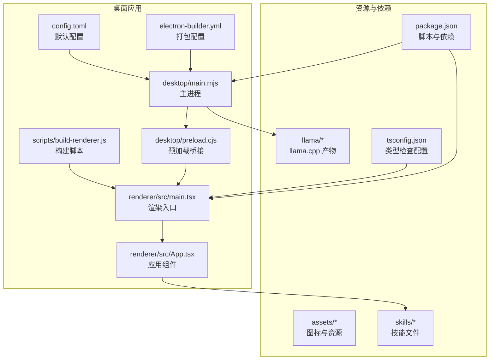
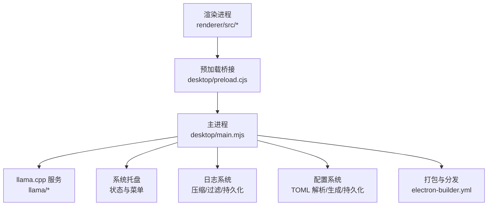
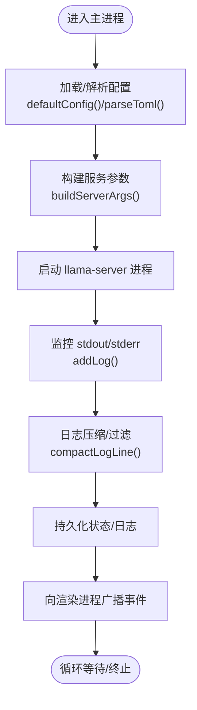
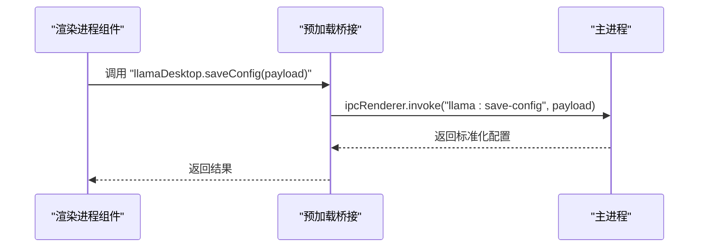
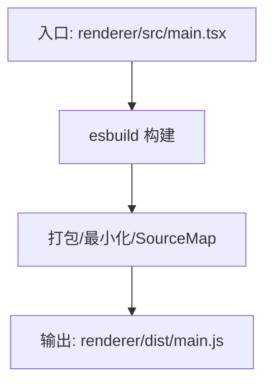
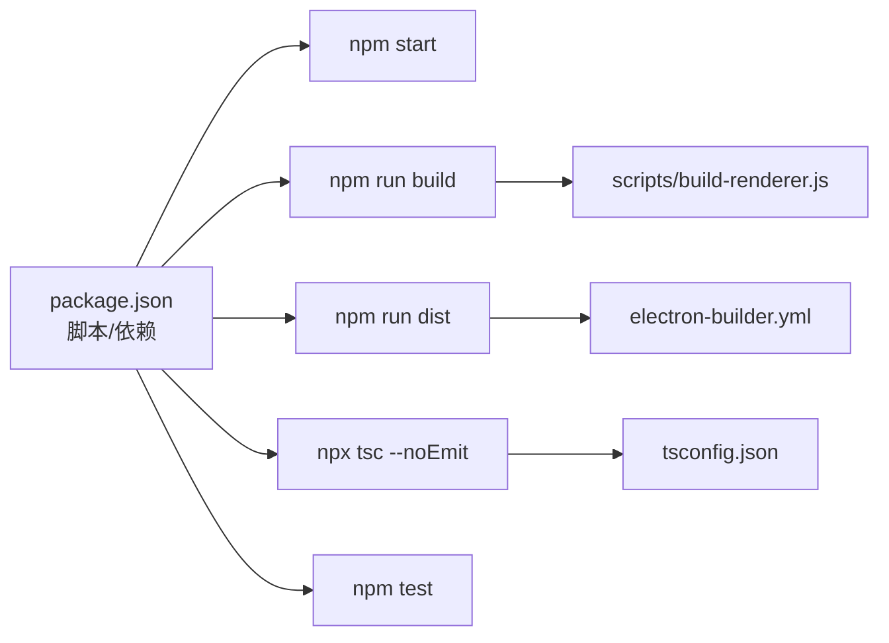

# 贡献指南

<cite>
**本文引用的文件**   
- [package.json](file://package.json)
- [README.md](file://README.md)
- [.github/workflows/release.yml](file://.github/workflows/release.yml)
- [tsconfig.json](file://tsconfig.json)
- [desktop/main.mjs](file://desktop/main.mjs)
- [desktop/preload.cjs](file://desktop/preload.cjs)
- [scripts/build-renderer.js](file://scripts/build-renderer.js)
- [electron-builder.yml](file://electron-builder.yml)
- [config.toml](file://config.toml)
</cite>

## 目录
1. [简介](#简介)
2. [项目结构](#项目结构)
3. [核心组件](#核心组件)
4. [架构总览](#架构总览)
5. [详细组件分析](#详细组件分析)
6. [依赖关系分析](#依赖关系分析)
7. [性能考虑](#性能考虑)
8. [故障排查指南](#故障排查指南)
9. [结论](#结论)
10. [附录](#附录)

## 简介
本贡献指南面向希望参与 illama-desktop 项目的开发者，提供从 Fork 项目、创建分支、提交代码到创建与审查 Pull Request 的完整流程说明；同时给出代码风格与提交信息规范、Bug 报告与功能请求流程、社区行为准则与沟通渠道，以及新贡献者的入门指导与常见问题解答。项目采用 Electron + React + TypeScript 技术栈，提供本地 llama.cpp 服务的桌面控制面板，并支持 OpenAI 兼容接口与多模态能力。

## 项目结构
illama-desktop 采用“主进程 + 渲染进程 + 资源与脚本”的分层组织方式：
- desktop：Electron 主进程与预加载脚本，负责窗口、IPC、服务生命周期与配置管理
- renderer：React + TypeScript 前端，包含组件、Hooks、样式与入口
- scripts：构建脚本（esbuild 渲染进程打包）
- assets：图标与静态资源
- llama：llama.cpp 编译产物（需自行下载）
- skills：技能文件存储目录
- tests：测试相关目录
- 配置与打包：package.json、tsconfig.json、electron-builder.yml、config.toml

图表来源
- [desktop/main.mjs:1-120](file://desktop/main.mjs#L1-L120)
- [desktop/preload.cjs:1-32](file://desktop/preload.cjs#L1-L32)
- [scripts/build-renderer.js:1-20](file://scripts/build-renderer.js#L1-L20)
- [electron-builder.yml:1-17](file://electron-builder.yml#L1-L17)
- [config.toml:1-27](file://config.toml#L1-L27)
- [package.json:1-51](file://package.json#L1-L51)
- [tsconfig.json:1-18](file://tsconfig.json#L1-L18)

章节来源
- [README.md:150-201](file://README.md#L150-L201)
- [package.json:1-51](file://package.json#L1-L51)

## 核心组件
- 主进程（desktop/main.mjs）
  - 负责窗口管理、系统托盘、llama.cpp 服务启动/停止、IPC 事件与状态广播、日志压缩与过滤、TOML 配置解析与生成、路径与状态持久化等
- 预加载桥接（desktop/preload.cjs）
  - 通过 contextBridge 暴露安全的 API 给渲染进程，封装 IPC 调用（如配置保存、服务启停、聊天流、文件选择等）
- 渲染进程（renderer/src）
  - React + TypeScript 前端，包含聊天界面、设置面板、终端日志、组件化 UI 与状态 Hook
- 构建与打包
  - esbuild 构建渲染进程，electron-builder 打包 Windows 便携包
- 配置与脚本
  - package.json 定义开发与构建脚本；tsconfig.json 控制类型检查；config.toml 为默认配置模板

章节来源
- [desktop/main.mjs:1-136](file://desktop/main.mjs#L1-L136)
- [desktop/preload.cjs:1-32](file://desktop/preload.cjs#L1-L32)
- [scripts/build-renderer.js:1-20](file://scripts/build-renderer.js#L1-L20)
- [electron-builder.yml:1-17](file://electron-builder.yml#L1-L17)
- [config.toml:1-27](file://config.toml#L1-L27)
- [package.json:23-27](file://package.json#L23-L27)
- [tsconfig.json:1-18](file://tsconfig.json#L1-L18)

## 架构总览
下图展示了主进程与渲染进程之间的交互，以及关键职责划分：

图表来源
- [desktop/main.mjs:1-120](file://desktop/main.mjs#L1-L120)
- [desktop/preload.cjs:1-32](file://desktop/preload.cjs#L1-L32)
- [electron-builder.yml:1-17](file://electron-builder.yml#L1-L17)

## 详细组件分析

### 主进程（desktop/main.mjs）
- 职责
  - 窗口与托盘管理、IPC 事件分发、服务生命周期控制、日志处理、配置解析与生成、路径与状态持久化
- 关键点
  - 默认配置对象与参数规范化
  - TOML 注释剥离、值解析与字符串化
  - 日志压缩策略（过滤例行信息、截断过长行）
  - 服务启动参数构建与命令行解析
- 性能与健壮性
  - 事件与状态更新通过统一通道广播，避免重复渲染
  - 日志缓冲上限与错误检测，保障 UI 流畅

图表来源
- [desktop/main.mjs:86-136](file://desktop/main.mjs#L86-L136)
- [desktop/main.mjs:328-413](file://desktop/main.mjs#L328-L413)
- [desktop/main.mjs:293-327](file://desktop/main.mjs#L293-L327)
- [desktop/main.mjs:797-800](file://desktop/main.mjs#L797-L800)

章节来源
- [desktop/main.mjs:86-136](file://desktop/main.mjs#L86-L136)
- [desktop/main.mjs:328-413](file://desktop/main.mjs#L328-L413)
- [desktop/main.mjs:293-327](file://desktop/main.mjs#L293-L327)
- [desktop/main.mjs:797-800](file://desktop/main.mjs#L797-L800)

### 预加载桥接（desktop/preload.cjs）
- 职责
  - 通过 contextBridge 暴露受限 API 给渲染进程，封装 IPC 调用，统一事件订阅与取消
- 关键点
  - 暴露配置、服务启停、聊天流、文件选择、技能 CRUD、窗口控制等 API
  - 事件回调注册与注销，避免内存泄漏

图表来源
- [desktop/preload.cjs:1-32](file://desktop/preload.cjs#L1-L32)
- [desktop/main.mjs:676-710](file://desktop/main.mjs#L676-L710)

章节来源
- [desktop/preload.cjs:1-32](file://desktop/preload.cjs#L1-L32)

### 渲染进程构建（scripts/build-renderer.js）
- 职责
  - 使用 esbuild 构建渲染进程入口，启用最小化、SourceMap 与 Tree Shaking
- 关键点
  - 输出到 renderer/dist/main.js，目标浏览器版本与 TSX 加载器配置

图表来源
- [scripts/build-renderer.js:1-20](file://scripts/build-renderer.js#L1-L20)

章节来源
- [scripts/build-renderer.js:1-20](file://scripts/build-renderer.js#L1-L20)

### 打包与分发（electron-builder.yml）
- 职责
  - 定义打包产物、目标平台、图标、归档命名与 ASAR 压缩
- 关键点
  - Windows zip 便携包，artifactName 使用版本变量

章节来源
- [electron-builder.yml:1-17](file://electron-builder.yml#L1-L17)

### 配置系统（config.toml 与主进程）
- 职责
  - 提供默认配置模板，主进程负责解析、规范化与生成 TOML
- 关键点
  - 注释剥离、字符串转义、数值与布尔值解析
  - 配置持久化到用户数据目录与桌面状态文件

章节来源
- [config.toml:1-27](file://config.toml#L1-L27)
- [desktop/main.mjs:328-413](file://desktop/main.mjs#L328-L413)
- [desktop/main.mjs:676-710](file://desktop/main.mjs#L676-L710)

## 依赖关系分析
- 开发与运行时依赖
  - Electron、React、TypeScript、Ant Design X、esbuild、electron-builder 等
- 构建与测试
  - npm 脚本定义了 start、build、dist、类型检查与测试命令
- 类型检查
  - tsconfig.json 严格模式、DOM 与 ES2020 库、JSX 与 bundler 解析

图表来源
- [package.json:23-27](file://package.json#L23-L27)
- [scripts/build-renderer.js:1-20](file://scripts/build-renderer.js#L1-L20)
- [electron-builder.yml:1-17](file://electron-builder.yml#L1-L17)
- [tsconfig.json:1-18](file://tsconfig.json#L1-L18)

章节来源
- [package.json:23-27](file://package.json#L23-L27)
- [tsconfig.json:1-18](file://tsconfig.json#L1-L18)

## 性能考虑
- 渲染进程构建
  - 启用最小化与 Tree Shaking，减少包体与加载时间
- 日志处理
  - 过滤例行日志、截断过长行、限制缓冲数量，降低 UI 卡顿
- 事件与状态
  - 统一事件通道与状态更新，避免重复渲染与内存泄漏
- 打包策略
  - ASAR 压缩与便携包分发，便于分发与安装

章节来源
- [scripts/build-renderer.js:1-20](file://scripts/build-renderer.js#L1-L20)
- [desktop/main.mjs:245-291](file://desktop/main.mjs#L245-L291)
- [desktop/main.mjs:220-224](file://desktop/main.mjs#L220-L224)
- [electron-builder.yml:15-17](file://electron-builder.yml#L15-L17)

## 故障排查指南
- 启动服务失败
  - 检查 llama.cpp 目录与可执行文件是否存在，确认配置路径与权限
  - 查看终端日志面板中的错误信息，关注启动监听与错误关键字
- 聊天流异常
  - 确认服务 URL 与端口配置，检查网络连通性与超时设置
  - 若出现卡顿，检查日志压缩与 UI 更新频率
- 打包产物问题
  - 确认 electron-builder 配置与依赖安装，检查 artifact 名称与校验和生成

章节来源
- [desktop/main.mjs:315-326](file://desktop/main.mjs#L315-L326)
- [desktop/main.mjs:180-188](file://desktop/main.mjs#L180-L188)
- [electron-builder.yml:1-17](file://electron-builder.yml#L1-17)

## 结论
illama-desktop 以清晰的主/渲染进程分离、严格的类型检查与高效的构建流程为基础，提供了完整的本地 LLM 服务控制面板。贡献者可依据本文档的流程与规范，高效参与功能开发、缺陷修复与文档改进。

## 附录

### 如何参与贡献（Fork → 分支 → 提交 → PR → 审查）
- Fork 项目
  - 在 GitHub 上 Fork 仓库到个人账号
- 创建分支
  - 建议使用功能/修复/文档类前缀命名，例如 feature/xxx、fix/xxx、docs/xxx
- 提交代码
  - 遵循代码风格与提交信息规范（见下节）
  - 运行类型检查与测试，确保构建通过
- 创建 Pull Request
  - 在 GitHub 上发起 PR，填写变更说明与关联 Issue
  - 保持分支整洁，必要时进行 rebase
- 审查与合并
  - 维护者将进行代码审查，按反馈修改后合并

### 代码风格与提交信息规范
- 代码风格
  - TypeScript 严格模式，使用 React + Ant Design X 组件
  - 统一使用 JSX/TSX，遵循 tsconfig.json 配置
- 提交信息
  - 建议采用“类型(范围): 描述”格式，例如 feat(renderer): 新增聊天输入组件
  - 说明变更动机与影响范围，必要时附带截图或日志

章节来源
- [tsconfig.json:1-18](file://tsconfig.json#L1-L18)
- [package.json:23-27](file://package.json#L23-L27)

### Bug 报告与功能请求
- Bug 报告
  - 提供环境信息（操作系统、Node.js 版本、llama.cpp 版本）
  - 复现步骤、期望行为与实际行为
  - 日志片段与截图
- 功能请求
  - 描述使用场景与预期效果
  - 如涉及 UI，可附上草图或参考实现

### 社区行为准则与沟通渠道
- 行为准则
  - 尊重他人，避免人身攻击与歧视性言论
  - 基于事实与证据进行讨论
- 沟通渠道
  - GitHub Issues 用于 Bug 与需求跟踪
  - GitHub Discussions 用于一般性讨论与建议

### 新贡献者入门指导
- 环境准备
  - 安装 Node.js（满足系统要求），克隆仓库并安装依赖
  - 下载并放置 llama.cpp 编译产物到 llama/ 目录
- 快速运行
  - 使用 npm start 启动开发模式
  - 使用 npm run build 构建渲染进程
  - 使用 npm run dist 打包便携包
- 调试与测试
  - 使用类型检查与测试命令，确保改动无误
- 提交与 PR
  - 保持小步提交，编写清晰的提交信息与 PR 描述

章节来源
- [README.md:73-113](file://README.md#L73-L113)
- [README.md:150-234](file://README.md#L150-L234)
- [package.json:23-27](file://package.json#L23-L27)

### 常见问题解答
- 为什么找不到 llama.cpp 的编译产物？
  - 项目不包含二进制文件，请从官方发布页面下载并放入 llama/ 目录
- 服务启动后无法访问？
  - 检查 host/port 配置与防火墙设置，确认端口未被占用
- 打包后无法运行？
  - 确认依赖安装与 electron-builder 配置，检查便携包完整性

章节来源
- [README.md:77-91](file://README.md#L77-L91)
- [README.md:254-257](file://README.md#L254-L257)
- [.github/workflows/release.yml:29-30](file://.github/workflows/release.yml#L29-L30)