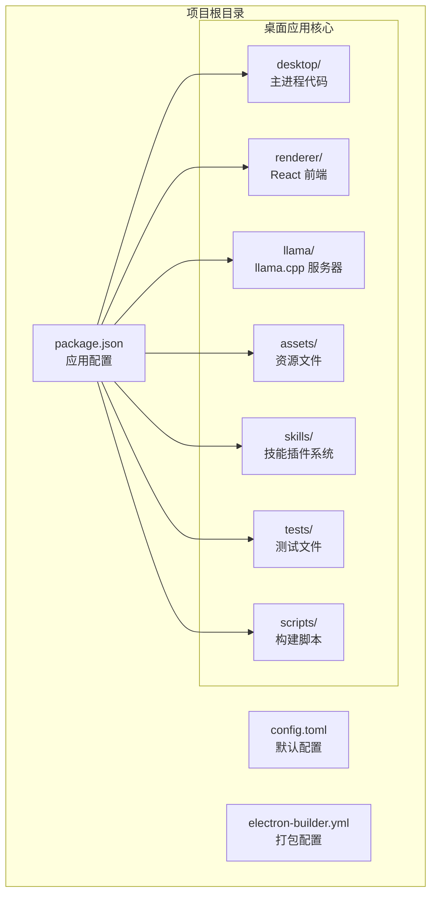
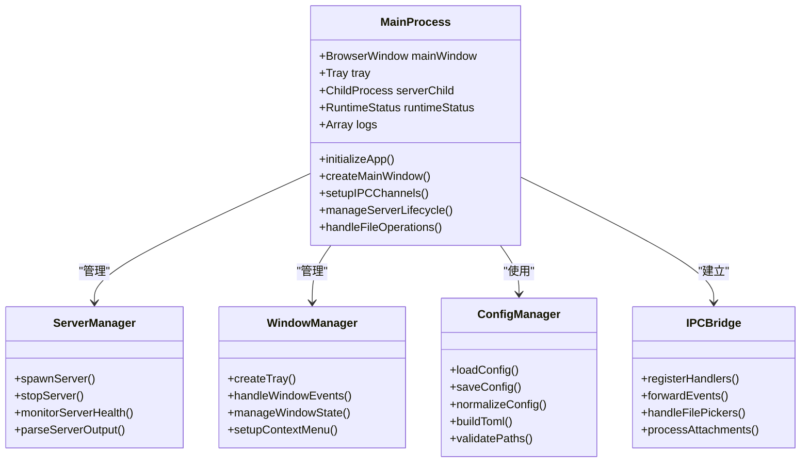
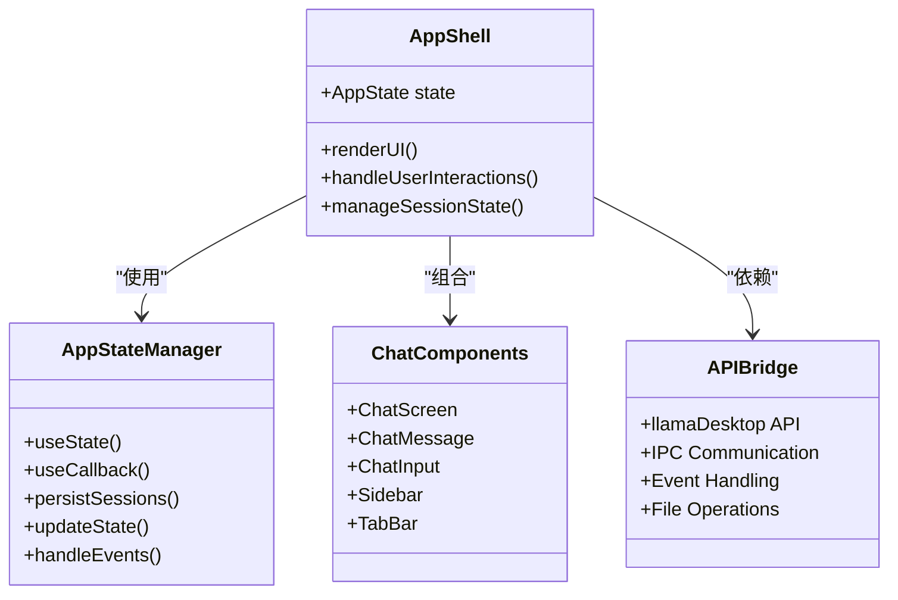
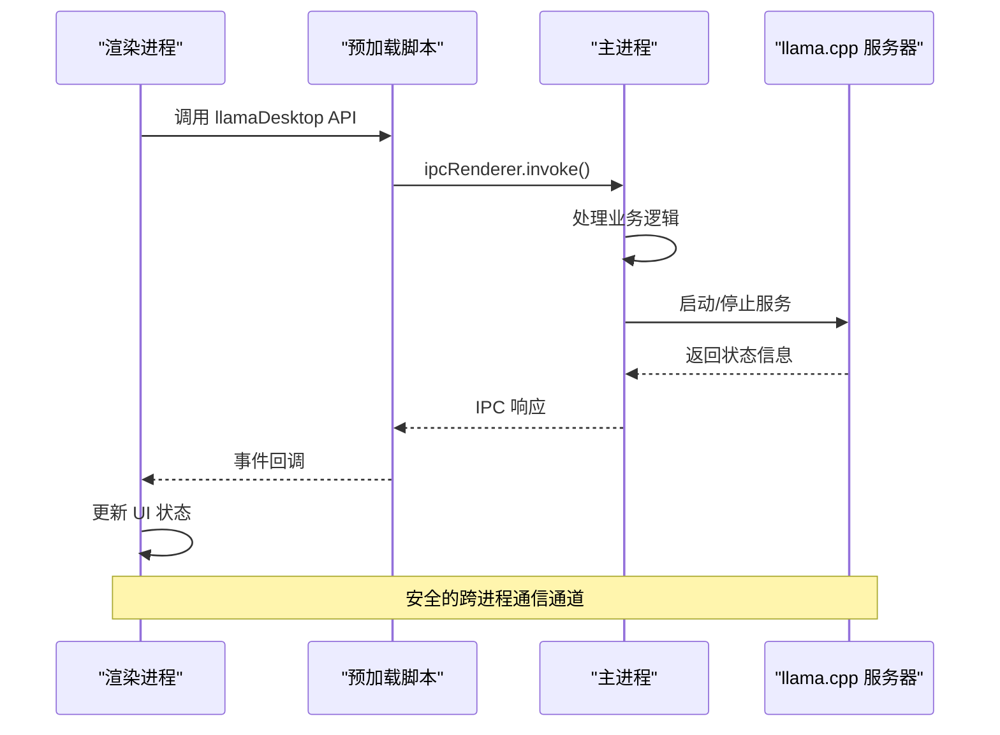
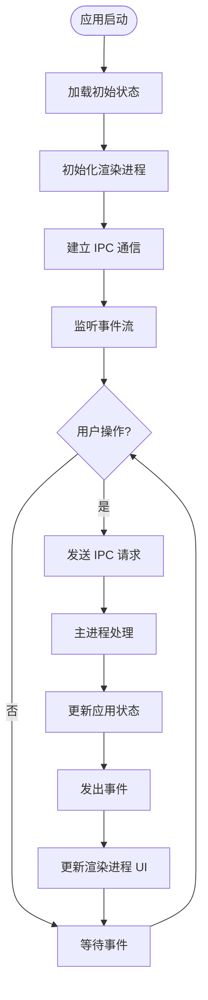
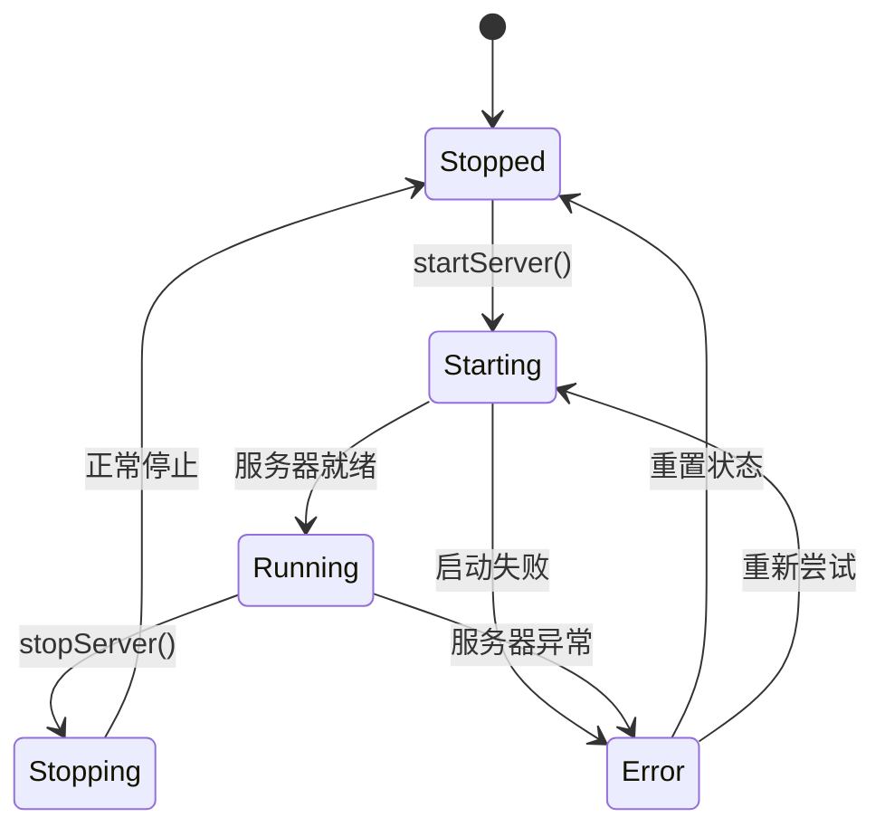
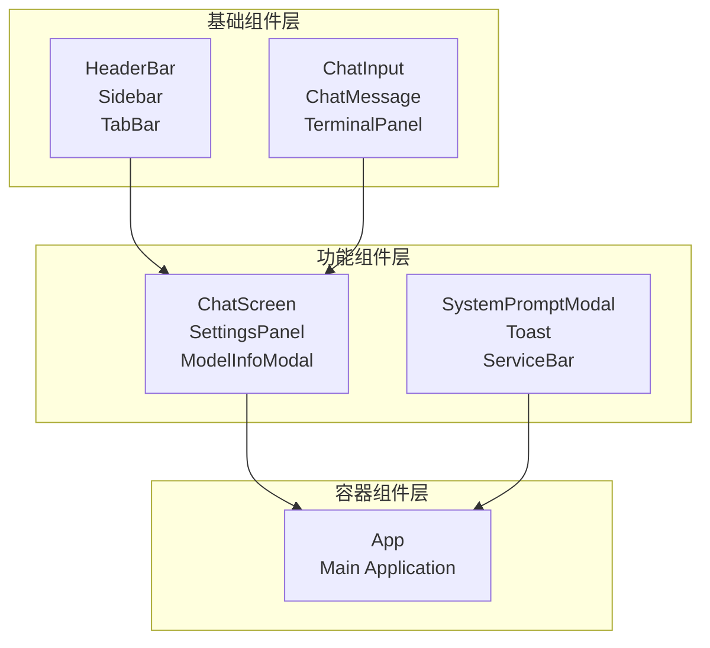
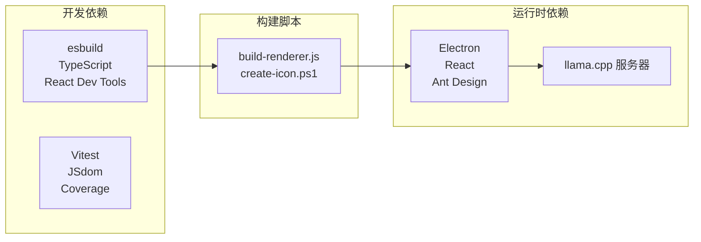

# 项目结构说明

<cite>
**本文档引用的文件**
- [package.json](file://package.json)
- [desktop/main.mjs](file://desktop/main.mjs)
- [desktop/preload.cjs](file://desktop/preload.cjs)
- [renderer/src/main.tsx](file://renderer/src/main.tsx)
- [renderer/src/App.tsx](file://renderer/src/App.tsx)
- [renderer/index.html](file://renderer/index.html)
- [renderer/src/hooks/useAppState.ts](file://renderer/src/hooks/useAppState.ts)
- [renderer/src/types/index.ts](file://renderer/src/types/index.ts)
- [renderer/src/utils/index.ts](file://renderer/src/utils/index.ts)
- [config.toml](file://config.toml)
- [scripts/build-renderer.js](file://scripts/build-renderer.js)
</cite>

## 目录
1. [简介](#简介)
2. [项目结构概览](#项目结构概览)
3. [核心组件分析](#核心组件分析)
4. [架构总览](#架构总览)
5. [详细组件分析](#详细组件分析)
6. [依赖关系分析](#依赖关系分析)
7. [性能考虑](#性能考虑)
8. [故障排除指南](#故障排除指南)
9. [结论](#结论)

## 简介
illama-desktop 是一个基于 Electron 的 Windows 桌面应用，提供本地 llama.cpp 服务的完整控制面板。该应用采用主进程与渲染进程分离的设计，结合 React 前端界面，支持 OpenAI 兼容 API、多会话标签页、系统托盘后台运行等功能。

## 项目结构概览
项目采用模块化目录结构，主要分为以下核心目录：



**图表来源**
- [package.json:1-51](file://package.json#L1-L51)
- [desktop/main.mjs:1-800](file://desktop/main.mjs#L1-L800)
- [renderer/index.html:1-29](file://renderer/index.html#L1-L29)

### 目录功能说明

**desktop/** - Electron 主进程目录
- 包含主进程入口文件和预加载脚本
- 负责窗口管理、llama.cpp 服务生命周期、IPC 通信等核心功能

**renderer/** - React 前端应用目录
- 包含完整的前端应用代码、样式文件和静态资源
- 采用模块化组件架构，支持多会话管理和实时聊天

**llama/** - llama.cpp 服务器文件
- 存放 llama.cpp 相关的可执行文件和服务程序
- 支持直接启动模式和启动器模式两种运行方式

**assets/** - 资源文件目录
- 包含应用图标、托盘图标等视觉资源
- 为桌面应用提供统一的视觉标识

**skills/** - 技能插件系统
- 提供可扩展的技能插件机制
- 支持技能的创建、管理和内容生成

**tests/** - 测试文件目录
- 包含主进程、预加载脚本、渲染进程等各模块的测试用例
- 确保应用功能的稳定性和可靠性

**scripts/** - 构建脚本目录
- 提供前端资源构建和图标生成等自动化脚本
- 支持开发环境和生产环境的不同构建需求

**图表来源**
- [desktop/main.mjs:13-25](file://desktop/main.mjs#L13-L25)
- [renderer/index.html:1-29](file://renderer/index.html#L1-L29)

**章节来源**
- [package.json:1-51](file://package.json#L1-L51)
- [desktop/main.mjs:1-800](file://desktop/main.mjs#L1-L800)
- [renderer/index.html:1-29](file://renderer/index.html#L1-L29)

## 核心组件分析

### Electron 主进程架构
主进程采用模块化设计，将不同功能职责分离到独立的模块中：



**图表来源**
- [desktop/main.mjs:26-42](file://desktop/main.mjs#L26-L42)
- [desktop/main.mjs:676-710](file://desktop/main.mjs#L676-L710)

### React 前端应用架构
前端采用 Hooks + 组件化的架构模式，通过集中状态管理实现复杂的状态同步：



**图表来源**
- [renderer/src/App.tsx:21-53](file://renderer/src/App.tsx#L21-L53)
- [renderer/src/hooks/useAppState.ts:68-79](file://renderer/src/hooks/useAppState.ts#L68-L79)

**章节来源**
- [desktop/main.mjs:1-800](file://desktop/main.mjs#L1-L800)
- [renderer/src/App.tsx:1-800](file://renderer/src/App.tsx#L1-L800)
- [renderer/src/hooks/useAppState.ts:1-555](file://renderer/src/hooks/useAppState.ts#L1-L555)

## 架构总览

### 通信架构设计
应用采用 IPC（进程间通信）实现主进程与渲染进程的安全通信：



**图表来源**
- [desktop/preload.cjs:3-31](file://desktop/preload.cjs#L3-L31)
- [desktop/main.mjs:209-224](file://desktop/main.mjs#L209-L224)

### 状态管理模式
应用采用集中式状态管理，通过事件驱动的方式保持前后端状态同步：



**图表来源**
- [renderer/src/App.tsx:624-646](file://renderer/src/App.tsx#L624-L646)
- [renderer/src/hooks/useAppState.ts:95-102](file://renderer/src/hooks/useAppState.ts#L95-L102)

**章节来源**
- [desktop/preload.cjs:1-32](file://desktop/preload.cjs#L1-L32)
- [renderer/src/App.tsx:656-728](file://renderer/src/App.tsx#L656-L728)

## 详细组件分析

### 主进程核心功能模块

#### 服务器管理模块
主进程负责 llama.cpp 服务器的完整生命周期管理：



**图表来源**
- [desktop/main.mjs:33-39](file://desktop/main.mjs#L33-L39)
- [desktop/main.mjs:92-112](file://desktop/main.mjs#L92-L112)

#### 配置管理系统
应用支持多种配置来源和格式：

| 配置来源 | 优先级 | 格式 | 用途 |
|---------|--------|------|------|
| 桌面状态文件 | 最高 | JSON | 用户偏好设置 |
| TOML 配置文件 | 中等 | TOML | 服务器参数 |
| 默认配置 | 最低 | JavaScript | 基础参数 |

**章节来源**
- [desktop/main.mjs:676-710](file://desktop/main.mjs#L676-L710)
- [config.toml:1-27](file://config.toml#L1-L27)

### 渲染进程组件体系

#### 状态管理组件
应用状态通过自定义 Hook 实现集中管理：

```mermaid
classDiagram
class useAppState {
+state : AppState
+setToast()
+patchFromBackend()
+saveCurrentSession()
+openSession()
+closeTab()
+startFreshSession()
+renameSession()
+deleteSession()
+updateConfig()
+updateChatInput()
+addAttachments()
+removeAttachment()
+clearAttachments()
+addChatMessage()
+updateChatMessage()
+setChatMessages()
+setChatBusy()
+setStreamRequestId()
+setView()
+setActive()
+setSettingsOpen()
+setSidebarCollapsed()
+setHistorySearch()
+setHistoryMenuId()
+setAttachmentMenuOpen()
+setModelInfo()
+setModelInfoOpen()
+setDirty()
+setBusy()
+setStatus()
+setLogs()
}
class AppState {
+active : string
+config : Config
+validation : Validation
+launch : Record
+status : Status
+logs : LogEntry[]
+view : 'chat' | 'terminal'
+sidebarPanel : string
+sidebarCollapsed : boolean
+sessions : Session[]
+currentSessionId : string
+openTabs : string[]
+historySearch : string
+historyMenuId : string
+historyDialog : null | Record
+chatMessages : ChatMessage[]
+chatInput : string
+attachments : Attachment[]
+attachmentMenuOpen : boolean
+attachmentMenuPosition : null | {left, top}
+streamRequestId : string
+preview : null | Record
+modelInfo : null | {loading?, error?} | Record
+modelInfoOpen : boolean
+chatBusy : boolean
+dirty : boolean
+busy : boolean
+settingsOpen : boolean
+toast : string
+stickToBottom : boolean
}
useAppState --> AppState : "管理"
```

**图表来源**
- [renderer/src/hooks/useAppState.ts:68-552](file://renderer/src/hooks/useAppState.ts#L68-L552)
- [renderer/src/types/index.ts:187-219](file://renderer/src/types/index.ts#L187-L219)

#### 组件层次结构
前端采用分层组件架构，从基础到高级组件逐层组合：



**图表来源**
- [renderer/src/App.tsx:7-16](file://renderer/src/App.tsx#L7-L16)
- [renderer/src/App.tsx:731-783](file://renderer/src/App.tsx#L731-L783)

**章节来源**
- [renderer/src/hooks/useAppState.ts:1-555](file://renderer/src/hooks/useAppState.ts#L1-L555)
- [renderer/src/App.tsx:1-800](file://renderer/src/App.tsx#L1-L800)

### 预加载脚本与安全桥接

#### API 暴露机制
预加载脚本通过 contextBridge 安全地向渲染进程暴露 API：

| API 方法 | 功能描述 | IPC 通道 |
|---------|----------|----------|
| getState | 获取应用状态 | llama:get-state |
| saveConfig | 保存配置 | llama:save-config |
| startServer | 启动服务器 | llama:start-server |
| stopServer | 停止服务器 | llama:stop-server |
| streamChat | 流式聊天 | llama:chat-stream |
| onEvent | 事件监听 | llama:event |

**章节来源**
- [desktop/preload.cjs:3-31](file://desktop/preload.cjs#L3-L31)

## 依赖关系分析

### 构建流程依赖
应用采用现代化的构建工具链，确保开发和生产环境的一致性：



**图表来源**
- [package.json:28-49](file://package.json#L28-L49)
- [scripts/build-renderer.js:1-20](file://scripts/build-renderer.js#L1-L20)

### 文件组织原则
项目遵循清晰的文件命名约定和代码组织原则：

**目录命名约定**
- `desktop/` - Electron 主进程代码
- `renderer/` - React 前端应用
- `llama/` - 服务器相关文件
- `assets/` - 静态资源文件
- `skills/` - 插件系统
- `tests/` - 测试用例
- `scripts/` - 构建脚本

**文件命名规范**
- 主进程文件使用 `.mjs` 扩展名
- 预加载脚本使用 `.cjs` 扩展名
- React 组件使用 `.tsx` 扩展名
- 样式文件使用 `.css` 扩展名
- 配置文件使用 `.toml` 扩展名

**章节来源**
- [package.json:23-27](file://package.json#L23-L27)
- [scripts/build-renderer.js:1-20](file://scripts/build-renderer.js#L1-L20)

## 性能考虑

### 内存管理策略
应用采用多项内存优化策略以确保长时间运行的稳定性：

1. **日志压缩机制** - 过滤重复的例行日志，保留最近 1200 条日志条目
2. **状态持久化** - 会话历史保存到 localStorage，限制最多 80 条记录
3. **流式处理** - 聊天消息采用流式渲染，避免一次性渲染大量 DOM 节点
4. **事件去抖** - 会话保存采用定时器去抖，每 2 秒保存一次

### 启动性能优化
- **延迟加载** - 非关键功能按需加载
- **预编译构建** - 使用 esbuild 进行快速构建
- **缓存策略** - 配置文件和状态信息本地缓存

## 故障排除指南

### 常见问题诊断

**服务器启动失败**
1. 检查模型文件路径配置
2. 验证 GPU 驱动和 CUDA 环境
3. 查看详细日志输出
4. 确认端口未被占用

**聊天功能异常**
1. 检查网络连接状态
2. 验证请求超时设置
3. 确认上下文大小配置合理
4. 查看浏览器控制台错误信息

**界面显示问题**
1. 清除浏览器缓存
2. 检查 CSS 文件加载情况
3. 验证 Ant Design 组件版本兼容性

**章节来源**
- [renderer/src/utils/index.ts:50-66](file://renderer/src/utils/index.ts#L50-L66)
- [desktop/main.mjs:298-326](file://desktop/main.mjs#L298-L326)

## 结论
illama-desktop 项目展现了现代桌面应用开发的最佳实践，通过 Electron 的主渲染分离架构、React 的组件化设计以及完善的 IPC 通信机制，实现了功能丰富且用户体验优秀的本地 AI 应用。项目结构清晰、模块职责明确，为后续的功能扩展和维护提供了良好的基础。

通过本文档的详细分析，开发者可以快速理解项目的整体架构、核心组件功能以及代码组织原则，为参与项目开发或进行二次开发提供全面的技术指导。