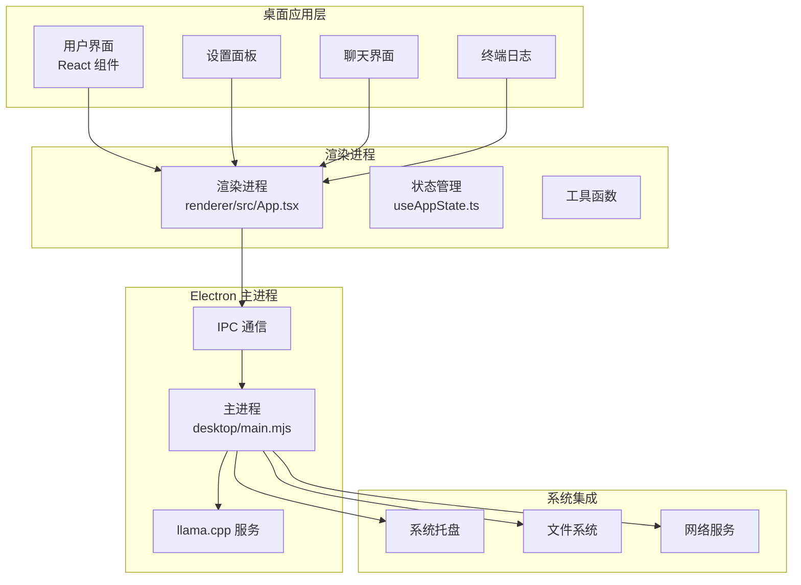
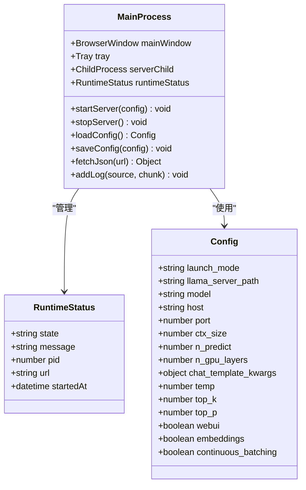
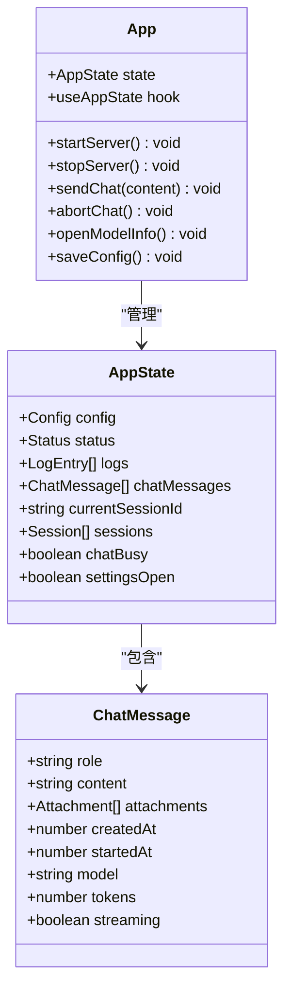
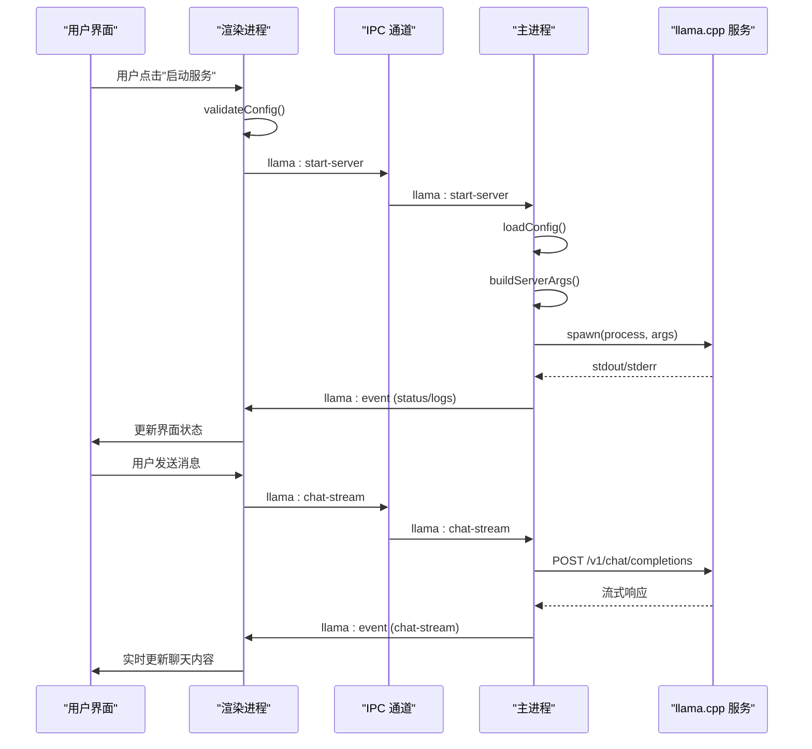
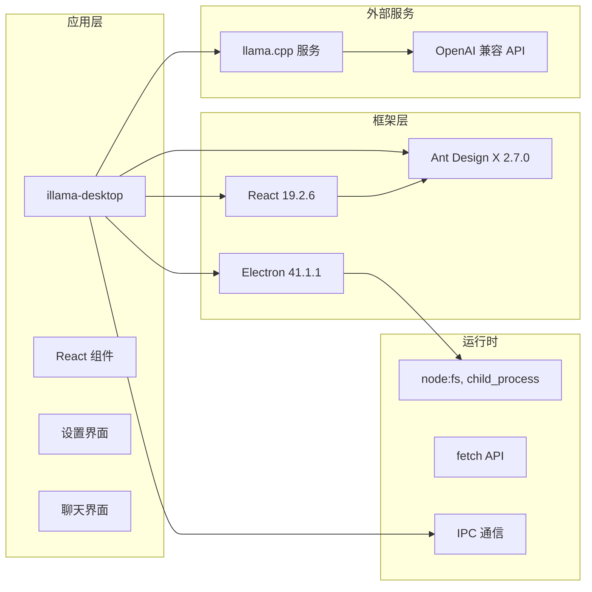

# 快速开始

<cite>
**本文引用的文件**
- [README.md](file://README.md)
- [package.json](file://package.json)
- [config.toml](file://config.toml)
- [desktop/main.mjs](file://desktop/main.mjs)
- [desktop/preload.cjs](file://desktop/preload.cjs)
- [renderer/src/App.tsx](file://renderer/src/App.tsx)
- [renderer/src/hooks/useAppState.ts](file://renderer/src/hooks/useAppState.ts)
- [renderer/src/utils/index.ts](file://renderer/src/utils/index.ts)
- [scripts/build-renderer.js](file://scripts/build-renderer.js)
</cite>

## 目录
1. [简介](#简介)
2. [系统要求](#系统要求)
3. [安装步骤](#安装步骤)
4. [初始配置](#初始配置)
5. [基本使用](#基本使用)
6. [架构概览](#架构概览)
7. [详细组件分析](#详细组件分析)
8. [依赖关系分析](#依赖关系分析)
9. [性能考虑](#性能考虑)
10. [故障排除指南](#故障排除指南)
11. [结论](#结论)

## 简介

illama-desktop 是一个基于 Electron 的 Windows 桌面应用程序，提供了完整的本地 llama.cpp 服务管理功能。该项目集成了 OpenAI 兼容的 API 接口，拥有内置的聊天界面、系统托盘后台运行、多模态支持等功能。

该应用的核心优势在于：
- 无需命令行即可管理本地 AI 服务
- OpenAI 兼容接口，可接入各类客户端
- 内置聊天界面，支持流式回复和多模态输入
- 系统托盘后台运行，窗口最小化后服务继续运行
- 完整的 llama.cpp 集成，支持模型配置和参数调优

## 系统要求

### 操作系统要求
- Windows 10/11 (64 位)

### 硬件要求
- 内存：建议 >= 16GB（具体取决于模型大小）
- GPU：可选，支持 CUDA/Vulkan 加速

### 软件要求
- Node.js：>= 18.0.0
- Electron：41.1.1

## 安装步骤

### 方式一：直接使用预编译版本
1. 从官方发布页面下载 Windows 版本的发布包
2. 解压后运行 `Llama.cpp Desktop.exe`
3. 在设置中选择 GGUF 模型文件
4. 点击「启动服务」
5. 使用内置聊天界面或接入 OpenAI 兼容客户端

### 方式二：源码安装和运行
```powershell
# 克隆项目
git clone https://github.com/linkin770/illama-cpp-desktop.git
cd illama-cpp-desktop

# 安装依赖
npm install

# 启动开发模式
npm start
```

### 构建渲染进程
```powershell
# 仅构建渲染进程
npm run build
```

## 初始配置

### llama.cpp 服务器准备
由于 llama.cpp 体积较大，项目不包含编译产物。需要手动下载并放置：

1. 访问 [llama.cpp 官方发布页面](https://github.com/ggml-org/llama.cpp/releases)
2. 下载 Windows 版本发布包（如 `llama.cpp-win-cuda.zip`）
3. 解压后将所有文件复制到项目的 `llama/` 文件夹中

确保 `llama/` 文件夹包含以下关键文件：
- `llama-server.exe` — 主服务程序
- `llama.dll` — 核心推理库
- `ggml*.dll` — ggml 推理库
- `cublas*.dll` / `cudart*.dll` — CUDA 支持库（GPU 版本）

### 配置文件设置
项目使用 TOML 格式的配置文件 `config.toml`，主要参数包括：

| 参数 | 说明 | 默认值 |
|------|------|--------|
| `host` | 服务绑定地址 | 0.0.0.0 |
| `port` | 服务端口 | 8080 |
| `ctx_size` | 上下文窗口大小 | 32768 |
| `n_predict` | 最大输出 tokens | -1（无限制） |
| `n_gpu_layers` | GPU 加速层数 | 99 |
| `temp` | 温度参数 | 0.8 |
| `top_p` | Top-P 采样 | 0.95 |
| `top_k` | Top-K 采样 | 20 |

### 启动模式
- **Direct 模式**：直接启动 llama-server.exe（推荐）
- **Launcher 模式**：通过启动器启动（兼容旧版配置）

## 基本使用

### 启动服务流程
1. 确保已配置模型路径和 llama.cpp 目录
2. 点击底部「启动服务」
3. 等待加载（约几秒到几十秒，取决于模型大小）
4. 状态变为「运行中」后即可开始聊天

### 配置模型参数
1. 点击侧边栏「设置」
2. 在「模型与模板」选项卡中选择 GGUF 模型文件
3. （可选）配置 mmproj 投影文件（用于视觉模型）
4. 调整上下文长度、GPU 层数、采样参数等
5. 点击「保存配置」

### 进行第一次聊天对话
1. 在聊天输入框中输入消息
2. 点击发送按钮或按回车键
3. 查看流式回复效果
4. 使用系统托盘图标监控服务状态

### 接入外部客户端
将以下 URL 配置到支持 OpenAI API 的客户端中：
- **Base URL**: `http://127.0.0.1:8080/v1`
- **API Key**: 任意字符串（本地服务无需验证）

## 架构概览

illama-desktop 采用 Electron + React 的双进程架构：



**图表来源**
- [desktop/main.mjs:1-80](file://desktop/main.mjs#L1-L80)
- [renderer/src/App.tsx:1-80](file://renderer/src/App.tsx#L1-L80)
- [desktop/preload.cjs:1-32](file://desktop/preload.cjs#L1-L32)

## 详细组件分析

### 主进程组件分析

主进程负责核心功能管理，包括窗口管理、服务启动/停止、IPC 通信等：



**图表来源**
- [desktop/main.mjs:26-136](file://desktop/main.mjs#L26-L136)

### 渲染进程组件分析

渲染进程使用 React 构建用户界面，提供完整的聊天和设置功能：



**图表来源**
- [renderer/src/App.tsx:21-53](file://renderer/src/App.tsx#L21-L53)
- [renderer/src/hooks/useAppState.ts:6-37](file://renderer/src/hooks/useAppState.ts#L6-L37)

### API 调用流程

应用通过 IPC 通道与主进程通信，实现服务管理和聊天功能：



**图表来源**
- [desktop/preload.cjs:3-31](file://desktop/preload.cjs#L3-L31)
- [desktop/main.mjs:1470-1524](file://desktop/main.mjs#L1470-L1524)

## 依赖关系分析

### 核心依赖关系



**图表来源**
- [package.json:39-49](file://package.json#L39-L49)
- [README.md:203-216](file://README.md#L203-L216)

### 开发依赖分析

项目使用现代化的开发工具链：

| 组件 | 版本 | 用途 |
|------|------|------|
| Electron | 41.1.1 | 跨平台桌面应用框架 |
| React | ^19.2.6 | UI 框架 |
| TypeScript | ^6.0.3 | 类型安全 |
| Ant Design X | ^2.7.0 | 对话 UI 组件库 |
| esbuild | ^0.28.0 | 渲染进程构建工具 |
| electron-builder | 26.8.1 | 打包工具 |

**章节来源**
- [package.json:28-49](file://package.json#L28-L49)
- [README.md:203-234](file://README.md#L203-L234)

## 性能考虑

### 内存和显存优化
- GPU 层数设置：`n_gpu_layers` 建议根据显存大小调整
- 上下文窗口：`ctx_size` 过大会增加内存占用
- 输出长度：`n_predict` 设置合理上限避免过度计算

### 启动性能优化
- 直接启动模式比启动器模式更快
- 预热模型：首次启动后服务会保持运行
- 系统托盘：最小化后继续运行，避免重复启动开销

### 网络性能
- 连续批处理：`continuous_batching` 提升并发性能
- 超时设置：合理配置 `request_timeout_ms`
- 日志过滤：自动过滤重复和冗余日志

## 故障排除指南

### 常见启动问题

**问题：找不到 llama-server.exe**
- 检查 `llama/` 目录是否包含 `llama-server.exe`
- 验证 `llama_server_path` 配置路径
- 确认文件权限和完整性

**问题：端口被占用**
- 修改 `port` 参数为其他可用端口
- 检查系统中是否有其他服务占用 8080 端口
- 使用 `netstat` 命令排查端口占用

**问题：模型文件加载失败**
- 确认模型文件格式为 GGUF
- 检查模型文件完整性
- 验证模型与硬件兼容性

### 聊天功能问题

**问题：请求超时**
- 增加 `request_timeout_ms` 值
- 降低 `ctx_size` 或 `n_predict`
- 检查网络连接稳定性

**问题：上下文超出限制**
- 减少 `ctx_size` 设置
- 精简对话历史
- 优化提示词长度

**问题：流式输出卡顿**
- 检查系统资源使用率
- 调整 `threads` 和 `batch_size` 参数
- 关闭不必要的后台应用

### 系统托盘问题

**问题：托盘图标不显示**
- 确认系统托盘区域有足够的空间
- 重启应用尝试重新注册托盘
- 检查系统通知设置

**问题：最小化后服务停止**
- 检查设置中"最小化时继续运行"选项
- 验证系统电源管理设置
- 重新安装应用

### 日志和诊断

**查看详细日志**
1. 切换到终端面板
2. 查看 `stdout` 和 `stderr` 输出
3. 关注错误信息和警告
4. 搜索 "server is listening" 确认服务状态

**性能监控**
- 监控内存使用情况
- 检查 GPU 利用率
- 观察磁盘 I/O 活动

**章节来源**
- [renderer/src/utils/index.ts:50-66](file://renderer/src/utils/index.ts#L50-L66)
- [desktop/main.mjs:245-291](file://desktop/main.mjs#L245-L291)

## 结论

illama-desktop 为 Windows 用户提供了一个功能完整、易于使用的本地 AI 聊天应用。通过合理的系统要求、清晰的安装步骤和完善的配置选项，用户可以在 15 分钟内成功运行第一个本地 AI 聊天会话。

关键优势：
- **零门槛使用**：无需命令行知识，提供直观的图形界面
- **高性能运行**：支持 GPU 加速和多种优化参数
- **开放兼容**：完全兼容 OpenAI API 接口
- **稳定可靠**：系统托盘后台运行，支持热重启

建议的最佳实践：
1. 根据硬件配置合理设置参数
2. 定期备份配置文件
3. 利用系统托盘监控服务状态
4. 结合外部客户端扩展功能

通过遵循本指南，新用户可以快速上手 illama-desktop，并充分利用其强大的本地 AI 能力。