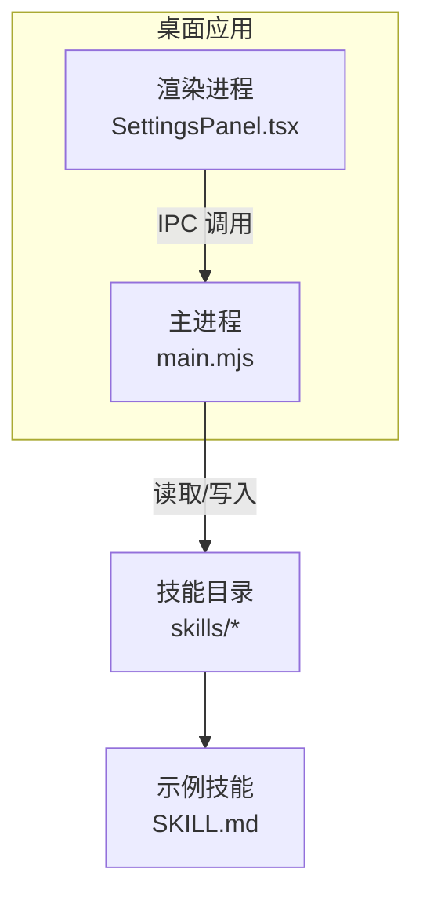
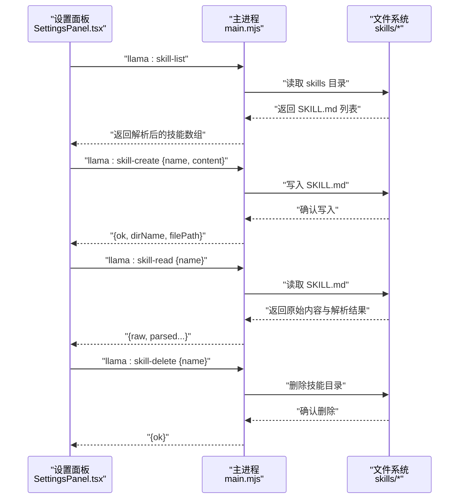
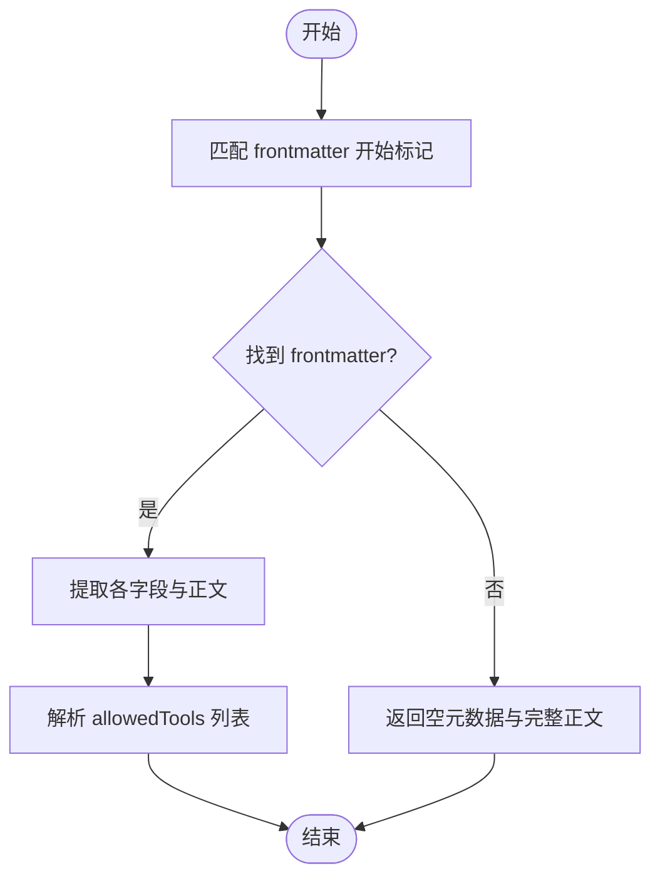
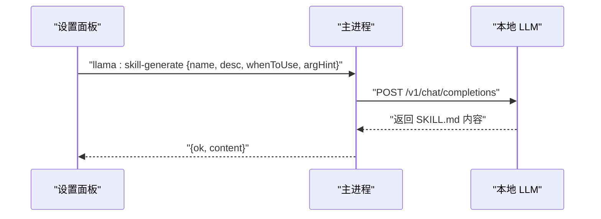
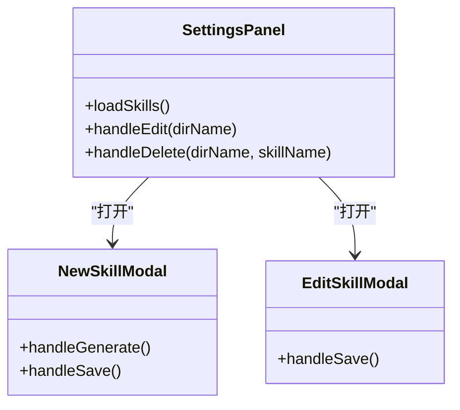
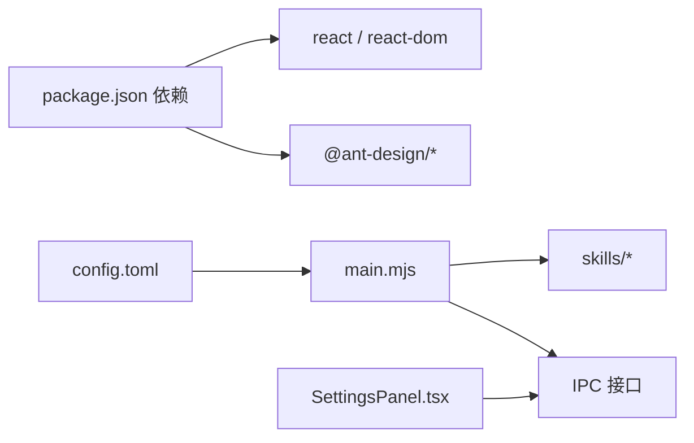

# 技能开发指南

<cite>
**本文引用的文件**
- [skills/文本脱敏/SKILL.md](file://skills/文本脱敏/SKILL.md)
- [skills/文章要点总结/SKILL.md](file://skills/文章要点总结/SKILL.md)
- [.codeartsdoer/AGENTS.md](file://.codeartsdoer/AGENTS.md)
- [desktop/main.mjs](file://desktop/main.mjs)
- [renderer/src/components/SettingsPanel.tsx](file://renderer/src/components/SettingsPanel.tsx)
- [config.toml](file://config.toml)
- [package.json](file://package.json)
</cite>

## 目录
1. [简介](#简介)
2. [项目结构](#项目结构)
3. [核心组件](#核心组件)
4. [架构总览](#架构总览)
5. [详细组件分析](#详细组件分析)
6. [依赖关系分析](#依赖关系分析)
7. [性能考量](#性能考量)
8. [故障排查指南](#故障排查指南)
9. [结论](#结论)
10. [附录](#附录)

## 简介
本指南面向希望在桌面应用中开发与管理“技能”的开发者，系统讲解技能插件的目录结构、配置文件格式、接口规范与最佳实践，并结合仓库中的现有实现，给出从创建到测试、调试、安全与性能优化的完整开发流程。技能以“技能提示词”形式存在，采用 YAML 风格的 Markdown 前言块（frontmatter）定义元数据，配合主体内容构成完整的技能定义。

## 项目结构
技能相关能力主要分布在以下位置：
- 技能示例：skills/文本脱敏、skills/文章要点总结
- 技能管理与解析：desktop/main.mjs 中的技能目录扫描、解析与 IPC 接口
- 技能 UI 管理：renderer/src/components/SettingsPanel.tsx 中的“新建/编辑/删除/列表”界面
- 工程上下文：.codeartsdoer/AGENTS.md
- 应用配置：config.toml
- 项目依赖：package.json

图表来源
- [desktop/main.mjs:2008-2088](file://desktop/main.mjs#L2008-L2088)
- [renderer/src/components/SettingsPanel.tsx:521-601](file://renderer/src/components/SettingsPanel.tsx#L521-L601)

章节来源
- [desktop/main.mjs:2008-2088](file://desktop/main.mjs#L2008-L2088)
- [renderer/src/components/SettingsPanel.tsx:521-601](file://renderer/src/components/SettingsPanel.tsx#L521-L601)

## 核心组件
- 技能目录与文件
  - 每个技能对应一个目录，目录内包含 SKILL.md 文件作为技能定义
  - 示例见 skills/文本脱敏/SKILL.md 与 skills/文章要点总结/SKILL.md
- 技能元数据字段
  - name：技能名称
  - description：技能描述
  - whenToUse：触发条件
  - argumentHint：参数提示（可选）
  - allowedTools：允许的工具集合（Read/Write）
  - 主体内容：技能系统提示词正文
- 解析与管理
  - 主进程负责扫描 skills 目录，解析 SKILL.md 的 frontmatter 与正文
  - 提供 IPC 接口用于列出、创建、读取、删除、生成技能内容

章节来源
- [skills/文本脱敏/SKILL.md:1-11](file://skills/文本脱敏/SKILL.md#L1-L11)
- [skills/文章要点总结/SKILL.md:1-13](file://skills/文章要点总结/SKILL.md#L1-L13)
- [desktop/main.mjs:2008-2088](file://desktop/main.mjs#L2008-L2088)

## 架构总览
技能开发与运行涉及三层交互：前端 UI、主进程 IPC、文件系统。

图表来源
- [desktop/main.mjs:2008-2088](file://desktop/main.mjs#L2008-L2088)
- [renderer/src/components/SettingsPanel.tsx:521-601](file://renderer/src/components/SettingsPanel.tsx#L521-L601)

## 详细组件分析

### 技能目录与文件规范
- 目录命名
  - 使用安全的目录名（过滤非法字符），避免空名称
- 文件命名
  - 每个技能目录必须包含 SKILL.md
- 前言块（frontmatter）
  - 必填字段：name、description、whenToUse
  - 可选字段：argumentHint
  - 工具权限：allowedTools（至少包含 Read/Write）
- 主体内容
  - 技能系统提示词正文，指导 AI 如何执行任务

章节来源
- [desktop/main.mjs:2008-2088](file://desktop/main.mjs#L2008-L2088)
- [skills/文本脱敏/SKILL.md:1-11](file://skills/文本脱敏/SKILL.md#L1-L11)
- [skills/文章要点总结/SKILL.md:1-13](file://skills/文章要点总结/SKILL.md#L1-L13)

### 技能解析器（parseSkillMarkdown）
- 功能
  - 提取 frontmatter 字段：name/description/whenToUse/argumentHint
  - 解析 allowedTools 列表
  - 返回解析后的对象与正文内容
- 边界处理
  - 若无 frontmatter，返回空元数据与完整正文
  - allowedTools 缺失时为空数组

图表来源
- [desktop/main.mjs:2012-2028](file://desktop/main.mjs#L2012-L2028)

章节来源
- [desktop/main.mjs:2012-2028](file://desktop/main.mjs#L2012-L2028)

### 技能管理 IPC 接口
- 列出技能
  - 路径：llama:skill-list
  - 行为：扫描 skills 目录，读取每个 SKILL.md 并解析
- 创建技能
  - 路径：llama:skill-create
  - 输入：{ name, content }
  - 行为：创建目录与 SKILL.md，返回目录名与文件路径
- 读取技能
  - 路径：llama:skill-read
  - 输入：{ name }
  - 行为：读取原始内容与解析结果
- 删除技能
  - 路径：llama:skill-delete
  - 输入：{ name }
  - 行为：删除技能目录
- 自动生成 SKILL.md
  - 路径：llama:skill-generate
  - 输入：{ name, description, whenToUse, argumentHint }
  - 行为：调用本地 LLM 生成完整 SKILL.md 内容

图表来源
- [desktop/main.mjs:2080-2157](file://desktop/main.mjs#L2080-L2157)

章节来源
- [desktop/main.mjs:2008-2088](file://desktop/main.mjs#L2008-L2088)
- [desktop/main.mjs:2080-2157](file://desktop/main.mjs#L2080-L2157)

### UI 管理组件（SettingsPanel）
- 技能列表展示
  - 加载技能列表，显示名称、描述、触发条件
- 新建技能
  - 填写基本信息后，调用生成接口，预览 SKILL.md，保存到文件系统
- 编辑技能
  - 读取 SKILL.md，更新元数据与正文
- 删除技能
  - 确认后调用删除接口

图表来源
- [renderer/src/components/SettingsPanel.tsx:521-601](file://renderer/src/components/SettingsPanel.tsx#L521-L601)
- [renderer/src/components/SettingsPanel.tsx:35-181](file://renderer/src/components/SettingsPanel.tsx#L35-L181)
- [renderer/src/components/SettingsPanel.tsx:183-200](file://renderer/src/components/SettingsPanel.tsx#L183-L200)

章节来源
- [renderer/src/components/SettingsPanel.tsx:521-601](file://renderer/src/components/SettingsPanel.tsx#L521-L601)
- [renderer/src/components/SettingsPanel.tsx:35-181](file://renderer/src/components/SettingsPanel.tsx#L35-L181)
- [renderer/src/components/SettingsPanel.tsx:183-200](file://renderer/src/components/SettingsPanel.tsx#L183-L200)

### 示例技能参考
- 文本脱敏
  - 元数据：name、description、whenToUse、argumentHint、allowedTools
  - 主体内容：指导如何识别并替换 PII 为占位符
- 文章要点总结
  - 元数据：name、description、whenToUse、allowedTools
  - 主体内容：指导如何提炼核心观点、关键论据与独到洞察

章节来源
- [skills/文本脱敏/SKILL.md:1-11](file://skills/文本脱敏/SKILL.md#L1-L11)
- [skills/文章要点总结/SKILL.md:1-13](file://skills/文章要点总结/SKILL.md#L1-L13)

## 依赖关系分析
- 技术栈
  - 前端：React + TypeScript
  - 后端：Electron 主进程（Node.js）
  - 配置：TOML（config.toml）
- 关键依赖
  - 本地 LLM：通过 /v1/chat/completions 接口生成 SKILL.md
  - 文件系统：读写 skills 目录
  - IPC：渲染进程与主进程通信

图表来源
- [package.json:1-51](file://package.json#L1-L51)
- [config.toml:1-27](file://config.toml#L1-L27)
- [desktop/main.mjs:2008-2088](file://desktop/main.mjs#L2008-L2088)
- [renderer/src/components/SettingsPanel.tsx:521-601](file://renderer/src/components/SettingsPanel.tsx#L521-L601)

章节来源
- [package.json:1-51](file://package.json#L1-L51)
- [config.toml:1-27](file://config.toml#L1-L27)
- [desktop/main.mjs:2008-2088](file://desktop/main.mjs#L2008-L2088)
- [renderer/src/components/SettingsPanel.tsx:521-601](file://renderer/src/components/SettingsPanel.tsx#L521-L601)

## 性能考量
- 目录扫描与解析
  - 建议限制 skills 目录规模，避免大量文件导致 IO 压力
  - 解析 frontmatter 使用正则与一次性读取，注意内存占用
- IPC 调用
  - 自动生成 SKILL.md 会发起网络请求，建议设置合理超时与重试策略
- UI 渲染
  - 技能列表按需渲染，避免一次性加载过多卡片

## 故障排查指南
- 无法列出技能
  - 检查 skills 目录是否存在且包含 SKILL.md
  - 查看主进程错误日志（skill-list 错误捕获）
- 生成失败
  - 确认本地 LLM 服务可用，检查 /v1/chat/completions 返回状态
  - 检查输入参数（name/description/whenToUse/argumentHint）
- 保存失败
  - 检查目录名合法性（过滤非法字符）
  - 确认目标路径可写
- 删除失败
  - 确认技能目录存在，检查权限与并发访问

章节来源
- [desktop/main.mjs:2030-2088](file://desktop/main.mjs#L2030-L2088)
- [desktop/main.mjs:2080-2157](file://desktop/main.mjs#L2080-L2157)

## 结论
本指南基于现有实现，给出了技能插件的目录结构、配置格式、接口规范与开发流程。通过主进程解析与 UI 管理，开发者可以高效创建、编辑、删除与自动生成技能定义。建议在实际项目中遵循字段约束、工具权限声明与安全命名规范，并结合性能与故障排查建议提升稳定性与体验。

## 附录

### 技能开发模板（步骤指引）
- 创建目录
  - 在 skills 下创建以技能名命名的目录（仅允许安全字符）
- 编写 SKILL.md
  - 前言块：name、description、whenToUse、argumentHint（可选）、allowedTools（至少包含 Read/Write）
  - 主体内容：技能系统提示词正文
- 生成与保存
  - 在设置面板中填写基本信息，点击“自动生成 SKILL.md”
  - 预览并编辑后保存至文件系统
- 测试与调试
  - 列表中查看技能是否加载成功
  - 编辑与删除验证 IPC 接口
  - 观察主进程日志定位问题

章节来源
- [renderer/src/components/SettingsPanel.tsx:35-181](file://renderer/src/components/SettingsPanel.tsx#L35-L181)
- [desktop/main.mjs:2008-2088](file://desktop/main.mjs#L2008-L2088)

### 工程上下文与背景
- 工程语言与架构栈
  - TS/TS_Strict/TS_ESM 与 React
- 应用配置
  - config.toml 提供本地服务参数（如端口、上下文大小、采样参数等）

章节来源
- [.codeartsdoer/AGENTS.md:1-14](file://.codeartsdoer/AGENTS.md#L1-L14)
- [config.toml:1-27](file://config.toml#L1-L27)