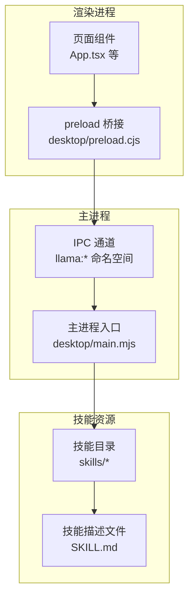
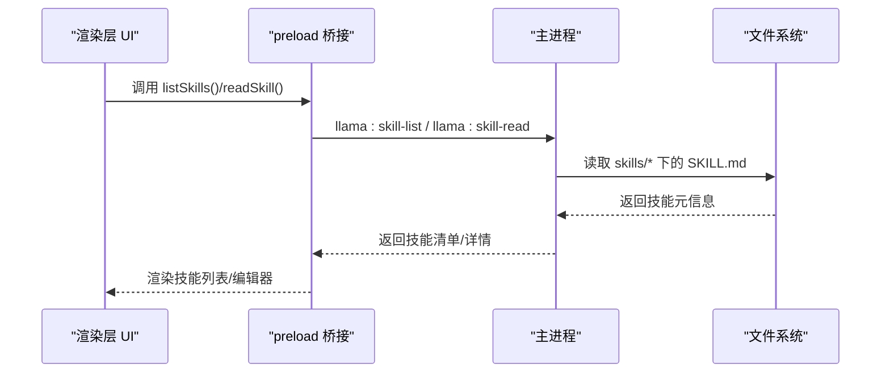
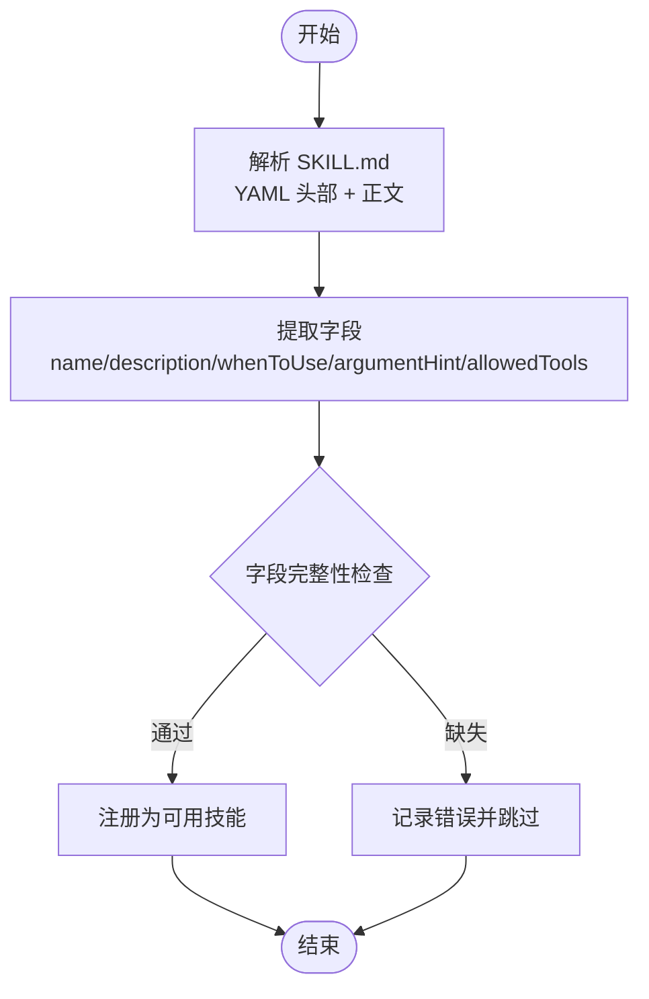
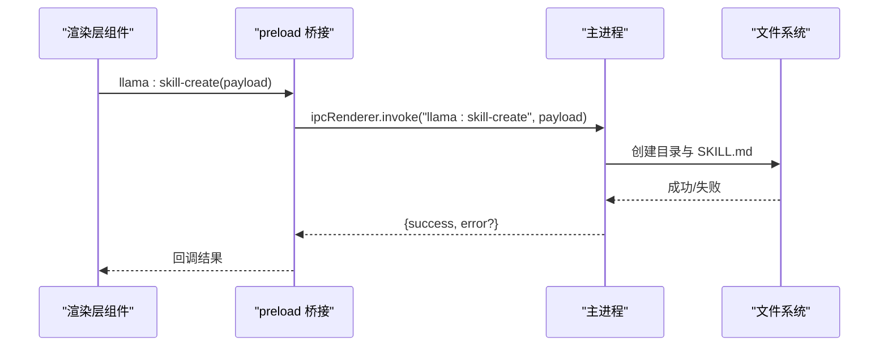
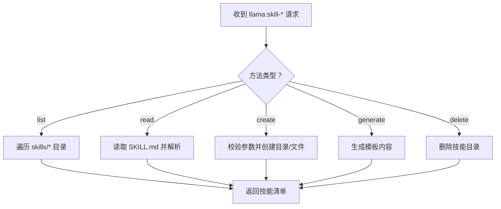
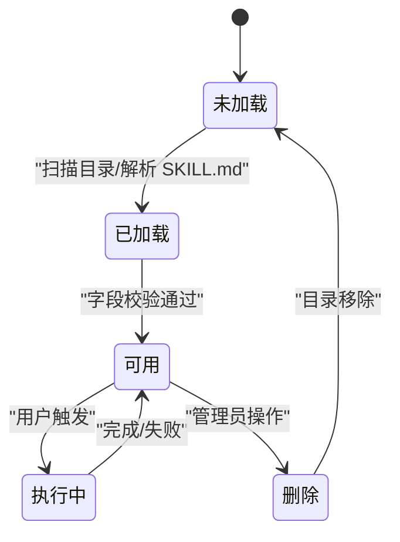
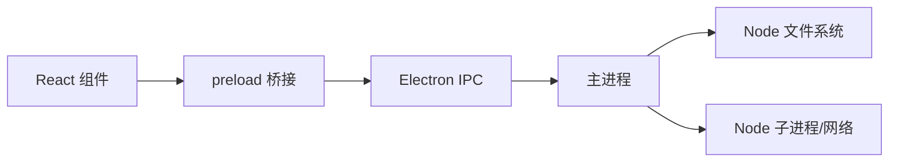

# 技能系统

<cite>
**本文引用的文件**
- [desktop/main.mjs](file://desktop/main.mjs)
- [desktop/preload.cjs](file://desktop/preload.cjs)
- [skills/文本脱敏/SKILL.md](file://skills/文本脱敏/SKILL.md)
- [skills/文章要点总结/SKILL.md](file://skills/文章要点总结/SKILL.md)
- [.codeartsdoer/AGENTS.md](file://.codeartsdoer/AGENTS.md)
- [package.json](file://package.json)
</cite>

## 目录
1. [简介](#简介)
2. [项目结构](#项目结构)
3. [核心组件](#核心组件)
4. [架构总览](#架构总览)
5. [详细组件分析](#详细组件分析)
6. [依赖关系分析](#依赖关系分析)
7. [性能考量](#性能考量)
8. [故障排查指南](#故障排查指南)
9. [结论](#结论)
10. [附录](#附录)

## 简介
本文件面向 illama-desktop 的“技能系统”开发与集成，目标是提供一套可扩展、可动态加载、可安全执行的技能框架。基于仓库现有能力，技能系统以“技能描述文件 + IPC 接口 + 渲染层调用”的方式组织，支持通过 UI 列表、创建、生成、读取、删除技能，并与后端主进程交互完成技能生命周期管理。本文档将从设计理念、架构原理、接口规范、生命周期、安全与沙箱、配置与参数传递等方面进行系统化说明，并结合现有技能示例进行实现分析与最佳实践指导。

## 项目结构
技能系统相关的关键位置与职责如下：
- desktop/main.mjs：Electron 主进程，负责窗口、服务、IPC 事件与状态管理；当前已暴露技能相关的 IPC 注册点（见后续章节）。
- desktop/preload.cjs：渲染进程桥接，向页面公开 llamaDesktop API，包含技能相关方法（如列出、创建、生成、读取、删除）。
- skills/*：技能描述文件（SKILL.md）存放处，每个技能以独立目录呈现，包含技能元信息与提示词。
- .codeartsdoer/AGENTS.md：工程语言与架构上下文说明，有助于理解前端技术栈与开发环境。
- package.json：项目依赖与入口配置，体现 Electron 应用的模块化与打包策略。

图表来源
- [desktop/preload.cjs:1-32](file://desktop/preload.cjs#L1-L32)
- [desktop/main.mjs:1-800](file://desktop/main.mjs#L1-L800)
- [skills/文本脱敏/SKILL.md:1-11](file://skills/文本脱敏/SKILL.md#L1-L11)
- [skills/文章要点总结/SKILL.md:1-13](file://skills/文章要点总结/SKILL.md#L1-L13)

章节来源
- [desktop/preload.cjs:1-32](file://desktop/preload.cjs#L1-L32)
- [desktop/main.mjs:1-800](file://desktop/main.mjs#L1-L800)
- [skills/文本脱敏/SKILL.md:1-11](file://skills/文本脱敏/SKILL.md#L1-L11)
- [skills/文章要点总结/SKILL.md:1-13](file://skills/文章要点总结/SKILL.md#L1-L13)
- [.codeartsdoer/AGENTS.md:1-14](file://.codeartsdoer/AGENTS.md#L1-L14)
- [package.json:1-51](file://package.json#L1-L51)

## 核心组件
- 渲染层技能 API（preload 暴露）：提供 list、create、generate、read、delete 等方法，用于技能资源的浏览与操作。
- 主进程 IPC 处理：接收来自渲染层的技能请求，执行文件系统读写与技能元数据解析，返回结果或错误。
- 技能描述文件（SKILL.md）：标准化技能元信息（名称、描述、使用时机、参数提示、允许工具等），作为技能注册与调用的契约。
- Electron 应用入口与打包：通过 package.json 的入口与脚本，构建渲染层与主进程的运行环境。

章节来源
- [desktop/preload.cjs:17-21](file://desktop/preload.cjs#L17-L21)
- [desktop/main.mjs:1-800](file://desktop/main.mjs#L1-L800)
- [skills/文本脱敏/SKILL.md:1-11](file://skills/文本脱敏/SKILL.md#L1-L11)
- [skills/文章要点总结/SKILL.md:1-13](file://skills/文章要点总结/SKILL.md#L1-L13)
- [package.json:1-51](file://package.json#L1-L51)

## 架构总览
技能系统采用“描述即接口”的设计：技能以文件形式存在，描述文件承担接口契约；渲染层通过 preload 暴露的 API 发起 IPC 请求；主进程负责解析与执行，返回统一结构化的结果。该架构具备以下优势：
- 可扩展：新增技能仅需新增目录与描述文件，无需修改主进程核心逻辑。
- 可动态：通过 list/read 接口动态发现与加载技能元信息。
- 可组合：多个技能可按顺序或条件组合使用，形成复杂工作流。

图表来源
- [desktop/preload.cjs:17-21](file://desktop/preload.cjs#L17-L21)
- [desktop/main.mjs:1-800](file://desktop/main.mjs#L1-L800)

## 详细组件分析

### 组件一：技能描述文件（SKILL.md）
- 设计理念：以 Markdown + YAML Front Matter 的形式描述技能，便于人类阅读与机器解析。
- 关键字段：
  - name：技能名称
  - description：技能描述
  - whenToUse：使用场景与触发条件
  - argumentHint：参数说明（必填/可选、类型、默认值）
  - allowedTools：允许的工具集合（如 Read/Write）
- 示例分析：
  - 文本脱敏：明确输入参数 input、output_format、preserve_types；允许读写工具；强调隐私保护与合规。
  - 文章要点总结：聚焦输入文本与输出格式（Markdown）；允许读写工具；强调结构化摘要。

图表来源
- [skills/文本脱敏/SKILL.md:1-11](file://skills/文本脱敏/SKILL.md#L1-L11)
- [skills/文章要点总结/SKILL.md:1-13](file://skills/文章要点总结/SKILL.md#L1-L13)

章节来源
- [skills/文本脱敏/SKILL.md:1-11](file://skills/文本脱敏/SKILL.md#L1-L11)
- [skills/文章要点总结/SKILL.md:1-13](file://skills/文章要点总结/SKILL.md#L1-L13)

### 组件二：渲染层技能 API（preload 暴露）
- 暴露方法：
  - listSkills：枚举技能目录下的可用技能
  - createSkill：创建新技能（目录+描述文件）
  - generateSkillContent：根据模板生成技能内容
  - readSkill：读取指定技能的描述文件
  - deleteSkill：删除技能目录
- 调用链路：渲染层调用 -> preload 桥接 -> 主进程 IPC 处理 -> 文件系统操作 -> 结果回传

图表来源
- [desktop/preload.cjs:17-21](file://desktop/preload.cjs#L17-L21)
- [desktop/main.mjs:1-800](file://desktop/main.mjs#L1-L800)

章节来源
- [desktop/preload.cjs:17-21](file://desktop/preload.cjs#L17-L21)
- [desktop/main.mjs:1-800](file://desktop/main.mjs#L1-L800)

### 组件三：主进程 IPC 与文件系统交互
- 已知能力：主进程已实现大量 IPC 与系统功能，技能相关 IPC 方法已在 preload 中暴露，主进程侧需要完成对应处理逻辑（读写文件、解析 TOML/MD、返回结构化结果）。
- 建议实现要点：
  - listSkills：扫描 skills/* 目录，读取每个子目录的 SKILL.md，解析 YAML 头部，返回技能清单。
  - readSkill：读取指定技能的 SKILL.md，返回元信息与正文。
  - createSkill：校验参数，创建目录与 SKILL.md，必要时生成默认模板。
  - generateSkillContent：根据模板生成 SKILL.md 内容（可结合 AI 服务或预设模板）。
  - deleteSkill：删除技能目录及其内容，注意权限与异常处理。

图表来源
- [desktop/preload.cjs:17-21](file://desktop/preload.cjs#L17-L21)
- [desktop/main.mjs:1-800](file://desktop/main.mjs#L1-L800)

章节来源
- [desktop/preload.cjs:17-21](file://desktop/preload.cjs#L17-L21)
- [desktop/main.mjs:1-800](file://desktop/main.mjs#L1-L800)

### 组件四：现有技能实现分析
- 文本脱敏
  - 参数约定：input（必填）、output_format（可选，默认 ***）、preserve_types（可选，列表）
  - 使用时机：PII 识别与替换，输出统一占位符
  - 工具权限：Read/Write
- 文章要点总结
  - 参数约定：输入文章文本
  - 输出格式：Markdown（核心观点、关键论据、独到洞察）
  - 工具权限：Read/Write

章节来源
- [skills/文本脱敏/SKILL.md:1-11](file://skills/文本脱敏/SKILL.md#L1-L11)
- [skills/文章要点总结/SKILL.md:1-13](file://skills/文章要点总结/SKILL.md#L1-L13)

### 组件五：技能生命周期管理
- 加载：启动时扫描 skills/*，解析 SKILL.md，建立内存索引
- 初始化：校验字段完整性，建立默认模板（如需要）
- 执行：根据 whenToUse 与参数 hint，组装提示词并调用模型服务
- 卸载：关闭应用时清理缓存与临时文件（如有）

图表来源
- [skills/文本脱敏/SKILL.md:1-11](file://skills/文本脱敏/SKILL.md#L1-L11)
- [skills/文章要点总结/SKILL.md:1-13](file://skills/文章要点总结/SKILL.md#L1-L13)

章节来源
- [skills/文本脱敏/SKILL.md:1-11](file://skills/文本脱敏/SKILL.md#L1-L11)
- [skills/文章要点总结/SKILL.md:1-13](file://skills/文章要点总结/SKILL.md#L1-L13)

### 组件六：安全与沙箱执行机制
- 文件访问控制：仅允许在 skills/* 目录内进行读写，避免越权访问
- 工具权限约束：通过 allowedTools 字段限制技能可使用的工具（如 Read/Write），防止任意文件操作
- 输入校验：对参数进行类型与范围校验，拒绝非法输入
- 沙箱建议：可引入受限执行环境（如子进程隔离、白名单工具集、超时与资源限制），以降低风险

章节来源
- [skills/文本脱敏/SKILL.md:6-8](file://skills/文本脱敏/SKILL.md#L6-L8)
- [skills/文章要点总结/SKILL.md:6-8](file://skills/文章要点总结/SKILL.md#L6-L8)

### 组件七：配置管理与参数传递
- 配置来源：TOML 配置文件与桌面状态文件，主进程负责解析与规范化
- 参数传递：preload 暴露的 API 以 invoke 形式传递参数，主进程解析后执行相应操作
- 建议：将技能相关配置项纳入统一配置体系，如技能启用开关、默认参数、工具权限等

章节来源
- [desktop/main.mjs:676-710](file://desktop/main.mjs#L676-L710)
- [desktop/preload.cjs:17-21](file://desktop/preload.cjs#L17-L21)

## 依赖关系分析
- 技术栈：React（前端 UI）、Electron（桌面应用）、TypeScript（类型支持）
- 依赖关系：preload 依赖 Electron 的 contextBridge/ipcRenderer；主进程依赖 Node 的 fs/path/spawn 等模块；渲染层依赖 React 组件体系

图表来源
- [package.json:1-51](file://package.json#L1-L51)
- [desktop/preload.cjs:1-32](file://desktop/preload.cjs#L1-L32)
- [desktop/main.mjs:1-800](file://desktop/main.mjs#L1-L800)

章节来源
- [package.json:1-51](file://package.json#L1-L51)
- [desktop/preload.cjs:1-32](file://desktop/preload.cjs#L1-L32)
- [desktop/main.mjs:1-800](file://desktop/main.mjs#L1-L800)

## 性能考量
- I/O 优化：批量读取与缓存 SKILL.md，减少频繁文件访问
- 渲染层节流：对技能列表与搜索进行防抖与分页
- 执行并发：对多技能组合执行进行队列化与限速，避免资源争用
- 资源回收：及时释放临时文件与缓存，避免内存泄漏

## 故障排查指南
- 技能无法加载：检查 skills/* 目录是否存在、SKILL.md 是否存在且格式正确
- IPC 调用失败：确认 preload 是否正确暴露方法，主进程是否注册对应 IPC 处理
- 参数错误：核对 argumentHint 与实际传参，确保必填项齐全、类型匹配
- 工具权限不足：检查 allowedTools 与实际操作是否一致

章节来源
- [desktop/preload.cjs:17-21](file://desktop/preload.cjs#L17-L21)
- [desktop/main.mjs:1-800](file://desktop/main.mjs#L1-L800)
- [skills/文本脱敏/SKILL.md:5](file://skills/文本脱敏/SKILL.md#L5)
- [skills/文章要点总结/SKILL.md:5](file://skills/文章要点总结/SKILL.md#L5)

## 结论
illama-desktop 的技能系统以“描述即接口”的思想实现了可扩展、可动态、可组合的能力框架。通过 SKILL.md 的标准化描述与 preload 暴露的 IPC API，系统能够在不改动核心逻辑的前提下持续扩展技能生态。建议在主进程侧完善技能 IPC 处理逻辑，并强化安全与性能保障，以支撑更复杂的业务场景。

## 附录

### 开发规范与最佳实践
- 描述文件规范
  - 必填字段：name、description、whenToUse、argumentHint、allowedTools
  - 可选字段：示例参数、默认值、输出格式说明
- 参数约定
  - 必填参数必须在 argumentHint 中明确标注
  - 可选参数提供合理默认值
  - 输出格式建议在 whenToUse 或正文中标明
- 工具权限
  - 严格遵循 allowedTools，避免越权操作
  - 对 Write 权限进行二次确认与审计
- 生命周期
  - 加载阶段：字段校验、模板生成（如需要）
  - 执行阶段：参数校验、提示词组装、调用模型、结果处理
  - 卸载阶段：清理临时文件、释放资源
- 安全与沙箱
  - 文件访问限定在 skills/* 目录
  - 工具权限白名单
  - 输入参数严格校验与转义
  - 可选引入子进程隔离与资源限制

章节来源
- [skills/文本脱敏/SKILL.md:1-11](file://skills/文本脱敏/SKILL.md#L1-L11)
- [skills/文章要点总结/SKILL.md:1-13](file://skills/文章要点总结/SKILL.md#L1-L13)