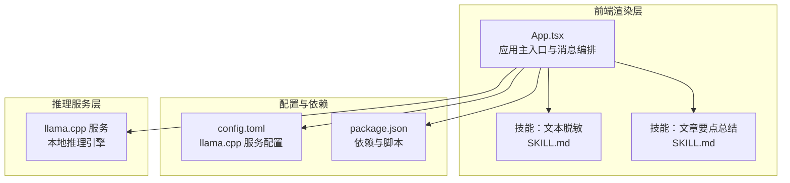
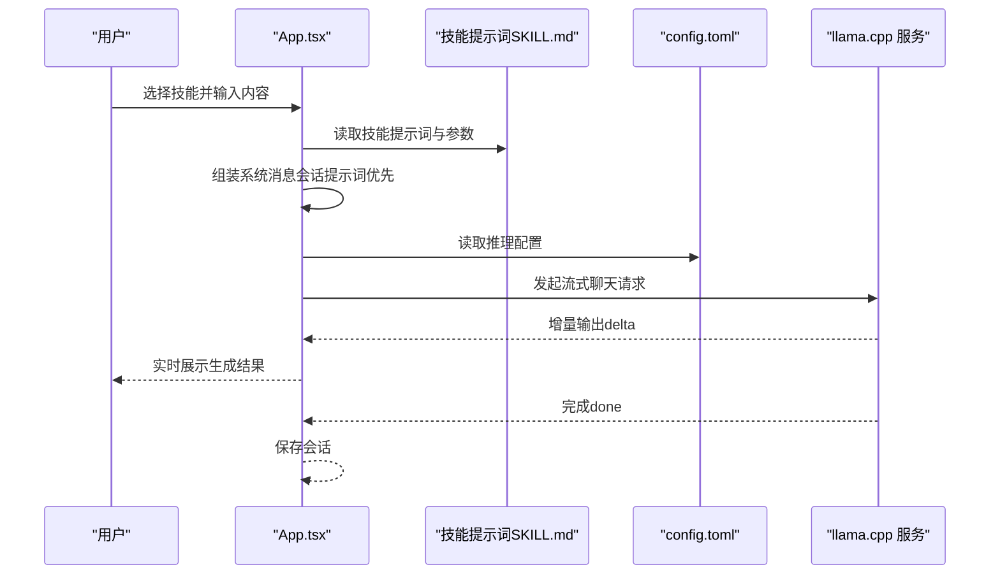
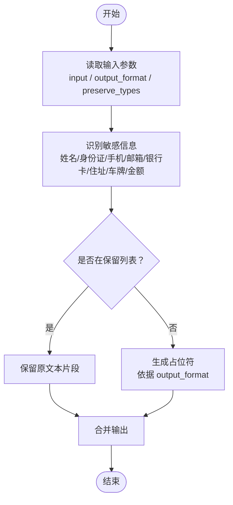
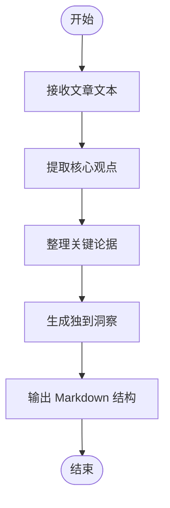
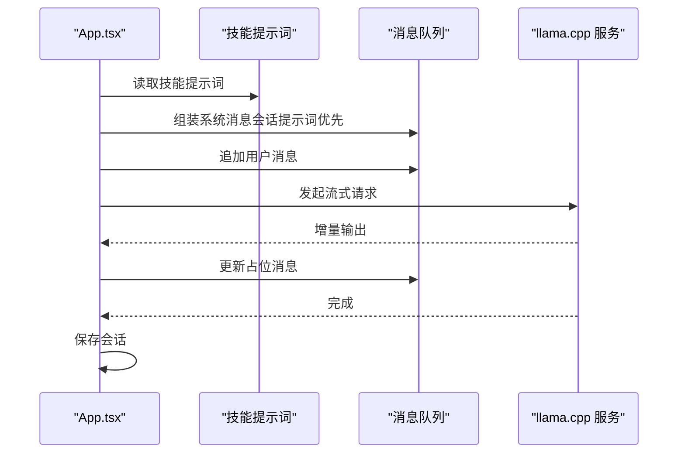
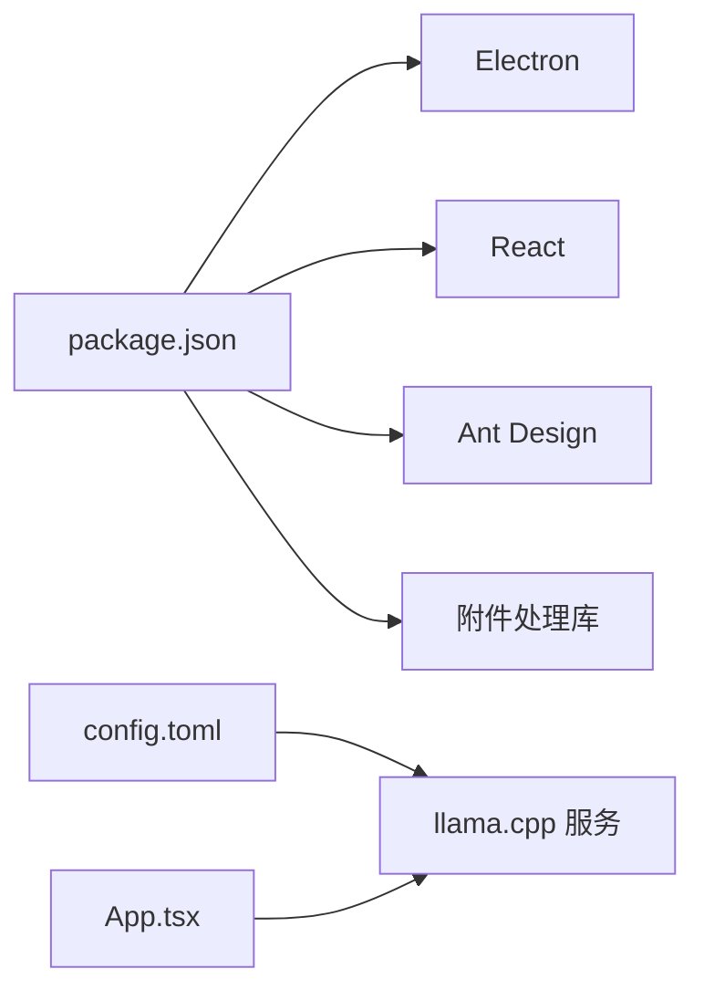

# 现有技能分析

<cite>
**本文引用的文件**
- [skills/文本脱敏/SKILL.md](file://skills/文本脱敏/SKILL.md)
- [skills/文章要点总结/SKILL.md](file://skills/文章要点总结/SKILL.md)
- [renderer/src/App.tsx](file://renderer/src/App.tsx)
- [config.toml](file://config.toml)
- [package.json](file://package.json)
</cite>

## 目录
1. [引言](#引言)
2. [项目结构](#项目结构)
3. [核心组件](#核心组件)
4. [架构总览](#架构总览)
5. [详细组件分析](#详细组件分析)
6. [依赖关系分析](#依赖关系分析)
7. [性能考量](#性能考量)
8. [故障排查指南](#故障排查指南)
9. [结论](#结论)
10. [附录](#附录)

## 引言
本文件针对仓库中现有的两个技能插件进行系统性分析，重点覆盖以下方面：
- 文本脱敏技能：敏感信息识别算法、占位符替换机制、参数处理逻辑
- 文章要点总结技能：摘要生成算法、关键信息提取方法、输出格式控制
- 对比两个技能插件的实现差异（技术架构、性能特点、适用场景）
- 提供使用示例与最佳实践
- 分析扩展可能性与局限性

说明：当前仓库中技能插件以“技能描述文件（SKILL.md）”形式存在，未包含具体实现代码。因此本文基于描述文件与前端应用的消息编排流程，给出可落地的实现建议与对比分析。

## 项目结构
该项目采用 Electron + React 的桌面应用架构，技能通过“系统提示词（System Prompt）”注入到对话流程中，由本地 llama.cpp 服务提供推理能力。技能本身不包含独立后端实现，而是通过前端在发送消息前拼装系统提示词与用户输入，再调用流式聊天接口。

图示来源
- [renderer/src/App.tsx](file://renderer/src/App.tsx)
- [config.toml](file://config.toml)
- [package.json](file://package.json)

章节来源
- [renderer/src/App.tsx](file://renderer/src/App.tsx)
- [config.toml](file://config.toml)
- [package.json](file://package.json)

## 核心组件
- 技能描述文件（SKILL.md）
  - 文本脱敏：定义输入参数、占位符格式、保留类型等
  - 文章要点总结：定义摘要输出结构（核心观点、关键论据、独到洞察）
- 前端应用（App.tsx）
  - 负责将“技能提示词”与“用户输入”组合为系统消息，发起流式聊天请求
  - 支持会话级系统提示词优先于技能提示词
- 配置文件（config.toml）
  - 指定本地推理服务路径、网络监听地址、上下文长度、采样参数等

章节来源
- [skills/文本脱敏/SKILL.md](file://skills/文本脱敏/SKILL.md)
- [skills/文章要点总结/SKILL.md](file://skills/文章要点总结/SKILL.md)
- [renderer/src/App.tsx](file://renderer/src/App.tsx)
- [config.toml](file://config.toml)

## 架构总览
技能插件在当前实现中属于“提示词驱动型”。前端在发送消息前，依据所选技能动态生成系统提示词，并将用户输入作为普通用户消息追加。推理服务负责执行生成任务，前端通过事件流接收增量输出并最终落盘保存。

图示来源
- [renderer/src/App.tsx](file://renderer/src/App.tsx)
- [skills/文本脱敏/SKILL.md](file://skills/文本脱敏/SKILL.md)
- [skills/文章要点总结/SKILL.md](file://skills/文章要点总结/SKILL.md)
- [config.toml](file://config.toml)

## 详细组件分析

### 文本脱敏技能
- 功能概述
  - 自动识别并替换文本中的个人身份信息（PII），包括姓名、身份证号、手机号码、邮箱地址、银行卡号、详细住址、车牌号、金额等，统一替换为占位符（如“***”或“[类型]”）
  - 输出符合隐私保护与数据安全规范
- 参数与行为
  - 输入参数
    - input：待脱敏的原始文本（字符串）
    - output_format：占位符格式，支持“***”、“[类型]”、“<类型>”，默认为“***”
    - preserve_types：需要保留不脱敏的敏感类型列表，默认为全部脱敏
  - 处理流程（基于提示词的实现思路）
    - 解析 input 文本
    - 识别各类 PII（姓名、身份证、手机、邮箱、银行卡、住址、车牌、金额等）
    - 根据 output_format 生成占位符
    - 依据 preserve_types 过滤保留类型
    - 输出脱敏后的文本
- 关键实现点（建议）
  - 敏感信息识别：正则表达式集合 + 规则过滤（如校验位验证）
  - 占位符替换：按匹配区间替换，保持原文档结构
  - 参数解析：严格校验 output_format 与 preserve_types 类型
  - 性能优化：分段扫描、缓存常用规则、批量替换
- 输出格式控制
  - 默认“***”适合通用场景
  - “[类型]”便于审计追踪
  - “<类型>”适合富文本编辑器

图示来源
- [skills/文本脱敏/SKILL.md](file://skills/文本脱敏/SKILL.md)

章节来源
- [skills/文本脱敏/SKILL.md](file://skills/文本脱敏/SKILL.md)

### 文章要点总结技能
- 功能概述
  - 基于给定文章内容，提炼核心观点、关键论据与独到洞察
  - 输出使用 Markdown 格式，包含“核心观点、关键论据、独到洞察”三部分
- 参数与行为
  - 输入参数：文章文本（通过“${ARGUMENTS}”注入）
  - 输出格式：Markdown 结构化摘要
- 关键实现点（建议）
  - 结构化解析：先提取核心观点，再组织关键论据，最后提出独到洞察
  - 上下文管理：控制摘要长度与关键句权重
  - 输出一致性：固定标题层级与段落格式
- 适用场景
  - 快速掌握文章主旨
  - 提取支撑论证链条
  - 发现独特视角与洞见

图示来源
- [skills/文章要点总结/SKILL.md](file://skills/文章要点总结/SKILL.md)

章节来源
- [skills/文章要点总结/SKILL.md](file://skills/文章要点总结/SKILL.md)

### 前端消息编排与技能集成
- 技能提示词注入
  - 若存在会话级系统提示词，则优先使用
  - 否则使用所选技能的 body，并将“${ARGUMENTS}”替换为用户输入
- 流式聊天
  - 前端维护占位消息，实时接收增量输出并更新
  - 完成后计算耗时、速度与 token 数量
- 会话持久化
  - 定期保存会话，避免丢失生成结果

图示来源
- [renderer/src/App.tsx](file://renderer/src/App.tsx)

章节来源
- [renderer/src/App.tsx](file://renderer/src/App.tsx)

## 依赖关系分析
- 应用依赖
  - Electron 与 React：桌面应用框架
  - Ant Design：UI 组件库
  - 附加库：pdf-parse、word-extractor、xlsx 等（用于附件处理）
- 推理服务依赖
  - llama.cpp 服务：本地推理引擎
  - 配置项：主机、端口、上下文大小、采样参数等

图示来源
- [package.json](file://package.json)
- [config.toml](file://config.toml)
- [renderer/src/App.tsx](file://renderer/src/App.tsx)

章节来源
- [package.json](file://package.json)
- [config.toml](file://config.toml)
- [renderer/src/App.tsx](file://renderer/src/App.tsx)

## 性能考量
- 上下文长度与预测步数
  - ctx_size 决定最大上下文长度，影响长文本处理能力
  - n_predict 控制生成长度，过大可能导致延迟增加
- 采样参数
  - temp、top_k、top_p、min_p、presence_penalty 等影响生成多样性与稳定性
- GPU 加速与批处理
  - n_gpu_layers 与 continuous_batching 可提升吞吐
- 前端性能
  - 流式增量渲染减少卡顿
  - 会话定期保存降低丢失风险

章节来源
- [config.toml](file://config.toml)

## 故障排查指南
- 服务未启动
  - 检查 llama_server_path 是否正确指向可执行文件
  - 查看日志与状态，确认端口占用与权限
- 图片无法识别
  - 未配置 mmproj 时，普通文本模型可能无法理解图片
- 生成为空或异常
  - 检查会话提示词与技能提示词冲突
  - 调整采样参数与上下文长度
- 会话未保存
  - 确认保存定时器触发条件与网络状态

章节来源
- [renderer/src/App.tsx](file://renderer/src/App.tsx)
- [config.toml](file://config.toml)

## 结论
- 当前技能以“提示词驱动”的方式实现，无需额外后端服务，部署与维护成本低
- 文本脱敏强调“占位符策略与保留类型控制”，适合合规与隐私保护场景
- 文章要点总结强调“结构化输出”，适合知识提炼与快速阅读
- 建议后续引入独立后端以增强可扩展性与性能，并完善参数校验与错误处理

## 附录

### 使用示例与最佳实践
- 文本脱敏
  - 示例输入：包含姓名、身份证、手机号、邮箱、银行卡、住址、车牌、金额的混合文本
  - 参数建议：
    - output_format：默认“***”，若需审计可改为“[类型]”
    - preserve_types：如需保留金额，传入["金额"]
  - 最佳实践：
    - 在导入外部数据前统一执行脱敏
    - 对保留类型建立白名单并定期审核
- 文章要点总结
  - 示例输入：一篇包含多个论点与结论的文章
  - 参数建议：直接将文章全文作为输入
  - 最佳实践：
    - 对长文本分段处理，避免超出上下文限制
    - 结合会话提示词引导模型聚焦特定维度（如商业价值、技术难点）

章节来源
- [skills/文本脱敏/SKILL.md](file://skills/文本脱敏/SKILL.md)
- [skills/文章要点总结/SKILL.md](file://skills/文章要点总结/SKILL.md)

### 对比分析：技术架构、性能与适用场景
- 技术架构
  - 文本脱敏：前端正则/规则 + 占位符替换（建议引入后端以提升鲁棒性）
  - 文章要点总结：提示词驱动的抽取式摘要（建议引入后端以支持更复杂的结构化输出）
- 性能特点
  - 两者均依赖本地 llama.cpp 服务，受 ctx_size 与采样参数影响显著
  - 文本脱敏偏向确定性替换，延迟较低
  - 文章要点总结偏向生成式摘要，质量与稳定性取决于提示词设计
- 适用场景
  - 文本脱敏：合规审查、数据导出、日志清洗
  - 文章要点总结：知识检索、报告预览、学习笔记

章节来源
- [renderer/src/App.tsx](file://renderer/src/App.tsx)
- [config.toml](file://config.toml)

### 扩展可能性与局限性
- 扩展可能性
  - 引入独立后端：统一处理敏感信息识别与摘要生成，便于版本演进与监控
  - 插件化：将识别规则与摘要模板抽象为可配置模块
  - 多模态：结合 OCR 与表格解析，提升附件处理能力
- 局限性
  - 当前为纯提示词方案，缺乏细粒度控制与可观测性
  - 依赖本地资源，跨平台兼容与硬件要求较高
  - 错误处理与参数校验有待加强

章节来源
- [renderer/src/App.tsx](file://renderer/src/App.tsx)
- [config.toml](file://config.toml)