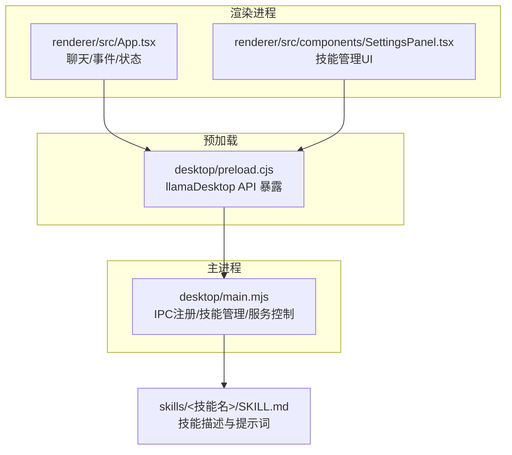
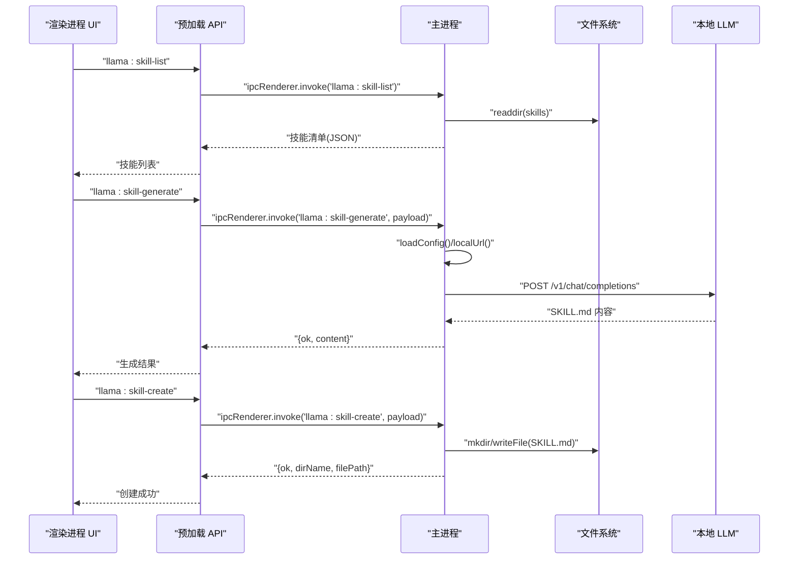
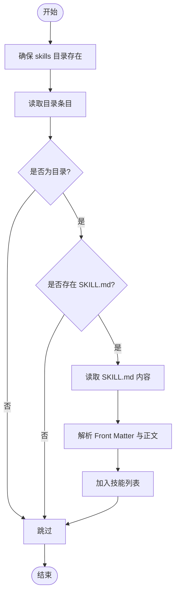
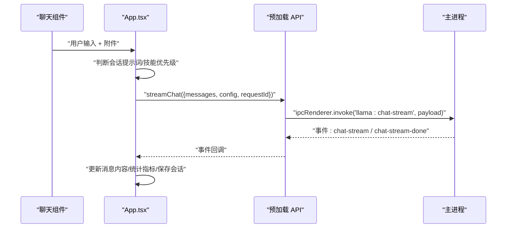
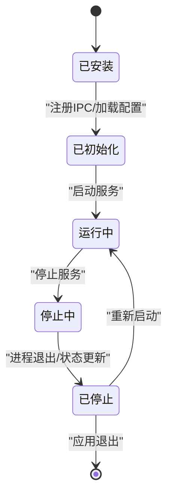
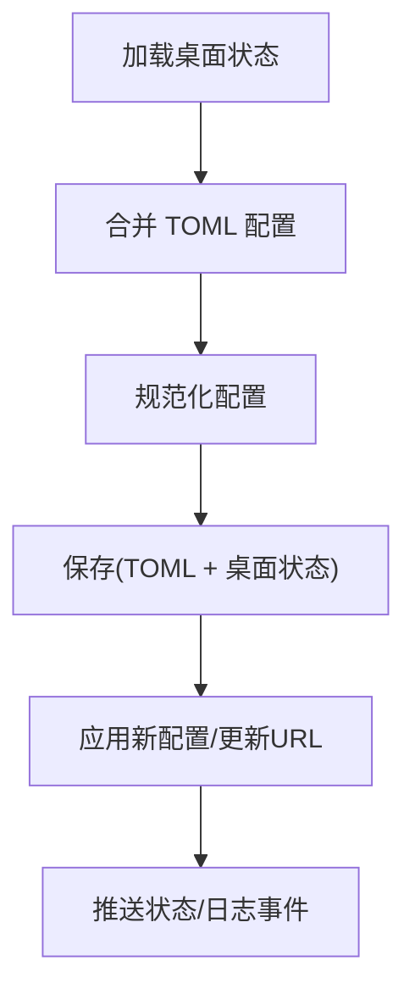
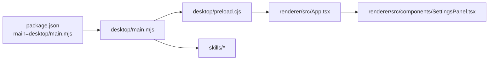

# 系统集成机制

<cite>
**本文引用的文件**
- [desktop/main.mjs](file://desktop/main.mjs)
- [desktop/preload.cjs](file://desktop/preload.cjs)
- [renderer/src/App.tsx](file://renderer/src/App.tsx)
- [renderer/src/components/SettingsPanel.tsx](file://renderer/src/components/SettingsPanel.tsx)
- [config.toml](file://config.toml)
- [skills/文本脱敏/SKILL.md](file://skills/文本脱敏/SKILL.md)
- [skills/文章要点总结/SKILL.md](file://skills/文章要点总结/SKILL.md)
- [package.json](file://package.json)
</cite>

## 目录
1. [简介](#简介)
2. [项目结构](#项目结构)
3. [核心组件](#核心组件)
4. [架构总览](#架构总览)
5. [详细组件分析](#详细组件分析)
6. [依赖关系分析](#依赖关系分析)
7. [性能考量](#性能考量)
8. [故障排查指南](#故障排查指南)
9. [结论](#结论)
10. [附录](#附录)

## 简介
本技术文档聚焦于技能系统集成机制，围绕以下目标展开：技能插件的发现与动态加载、与主应用的IPC集成、状态同步与错误处理、生命周期管理、配置管理与热重载、扩展接口与自定义开发指南，以及性能监控与调试方法。通过主进程、预加载脚本与渲染进程三者协作，技能系统以“技能目录 + Markdown 描述”的轻量方案实现即插即用的能力，并通过本地 LLM 辅助生成 SKILL.md 内容，提升开发效率与一致性。

## 项目结构
- 主进程负责服务生命周期、IPC 注册、日志与状态管理、配置持久化与生成、技能目录扫描与 LLM 生成。
- 预加载脚本暴露受限 API 给渲染进程，统一封装 IPC 调用与事件订阅。
- 渲染进程负责 UI 交互、状态驱动、事件监听、技能选择与会话提示词注入。
- 技能资源位于 skills 目录，每个技能以独立子目录存放 SKILL.md，采用 YAML 风格 Front Matter 描述元数据。

图表来源
- [desktop/main.mjs](file://desktop/main.mjs)
- [desktop/preload.cjs](file://desktop/preload.cjs)
- [renderer/src/App.tsx](file://renderer/src/App.tsx)
- [renderer/src/components/SettingsPanel.tsx](file://renderer/src/components/SettingsPanel.tsx)

章节来源
- [desktop/main.mjs](file://desktop/main.mjs)
- [desktop/preload.cjs](file://desktop/preload.cjs)
- [renderer/src/App.tsx](file://renderer/src/App.tsx)
- [renderer/src/components/SettingsPanel.tsx](file://renderer/src/components/SettingsPanel.tsx)

## 核心组件
- 技能目录与发现
  - 主进程扫描 skills 目录，遍历子目录并读取 SKILL.md，解析 Front Matter 元数据，返回技能清单。
- 技能 CRUD 与生成
  - 支持创建、读取、删除、列出技能；提供基于本地 LLM 的 SKILL.md 自动生成能力。
- IPC 通道
  - 预加载脚本集中暴露 llamaDesktop.* API，渲染进程通过 invoke/send 调用主进程能力。
- 状态同步与事件
  - 主进程通过事件通道向渲染进程推送状态、日志与流式聊天事件，渲染侧按需更新 UI。
- 配置与热重载
  - TOML 配置解析与规范化，保存时写入 TOML 并持久化桌面状态；变更后即时生效。

章节来源
- [desktop/main.mjs](file://desktop/main.mjs)
- [desktop/preload.cjs](file://desktop/preload.cjs)
- [renderer/src/App.tsx](file://renderer/src/App.tsx)
- [config.toml](file://config.toml)

## 架构总览
技能系统以“主进程 + 预加载 + 渲染进程”的分层架构实现：
- 主进程承担技能目录管理、TOML 解析与生成、IPC 注册、服务生命周期与事件广播。
- 预加载脚本提供受控 API，屏蔽底层 IPC 细节，统一错误与回调。
- 渲染进程负责用户交互、状态驱动、事件订阅与技能选择注入。

图表来源
- [desktop/main.mjs](file://desktop/main.mjs)
- [desktop/preload.cjs](file://desktop/preload.cjs)
- [renderer/src/components/SettingsPanel.tsx](file://renderer/src/components/SettingsPanel.tsx)

## 详细组件分析

### 技能发现与解析
- 目录结构
  - skills/<技能名>/SKILL.md，每个技能独立目录，便于扩展与版本管理。
- 解析规则
  - 采用 Front Matter（三短横线包裹）解析 name/description/whenToUse/argumentHint/allowedTools 等字段；正文作为技能提示词主体。
- 列表构建
  - 主进程递归扫描目录，读取每个 SKILL.md，解析并组装技能对象数组返回。

图表来源
- [desktop/main.mjs](file://desktop/main.mjs)

章节来源
- [desktop/main.mjs](file://desktop/main.mjs)
- [skills/文本脱敏/SKILL.md](file://skills/文本脱敏/SKILL.md)
- [skills/文章要点总结/SKILL.md](file://skills/文章要点总结/SKILL.md)

### 动态加载与执行调度
- 动态加载
  - 技能内容以 SKILL.md 文本形式存在于内存，渲染侧在发送消息前拼接系统提示词。
- 执行调度
  - 渲染侧根据会话提示词优先级决定是否注入技能提示词；若无会话提示词则使用所选技能的 body。
- 事件驱动
  - 主进程通过事件通道推送 status/logs/chat-stream 等，渲染侧在事件回调中即时更新 UI。

图表来源
- [renderer/src/App.tsx](file://renderer/src/App.tsx)
- [desktop/preload.cjs](file://desktop/preload.cjs)
- [desktop/main.mjs](file://desktop/main.mjs)

章节来源
- [renderer/src/App.tsx](file://renderer/src/App.tsx)
- [desktop/preload.cjs](file://desktop/preload.cjs)
- [desktop/main.mjs](file://desktop/main.mjs)

### IPC 通信与状态同步
- 预加载 API
  - 暴露 getState/setTheme/saveConfig/startServer/stopServer/streamChat/abortChat/listSkills/createSkill/generateSkillContent/readSkill/deleteSkill 等。
- 事件订阅
  - onEvent 回调统一接收主进程推送的 status/logs/chat-stream 等事件，渲染侧按类型处理。
- 错误处理
  - 渲染侧捕获异常并友好提示；主进程在启动/停止/技能操作中捕获错误并更新状态。

章节来源
- [desktop/preload.cjs](file://desktop/preload.cjs)
- [renderer/src/App.tsx](file://renderer/src/App.tsx)
- [desktop/main.mjs](file://desktop/main.mjs)

### 生命周期管理
- 加载
  - 应用 ready 时注册 IPC；技能列表在设置面板首次打开时加载。
- 初始化
  - 读取桌面状态与 TOML 配置，合并默认值并规范化；计算本地 URL。
- 执行
  - 渲染侧发起流式聊天；主进程转发至本地服务；事件回传渲染侧。
- 卸载/停止
  - 应用退出前终止服务进程；停止服务时更新状态并清理资源。

图表来源
- [desktop/main.mjs](file://desktop/main.mjs)

章节来源
- [desktop/main.mjs](file://desktop/main.mjs)

### 配置管理机制
- 配置来源
  - 桌面状态文件与 TOML 文件双轨存储；桌面状态优先用于启动参数与上次配置路径。
- 解析与规范化
  - TOML 解析器支持字符串/布尔/数字；规范化函数合并默认值并校验数值范围。
- 生成与保存
  - 保存时生成 TOML 文本并写入配置路径；同时更新桌面状态文件。
- 热重载
  - 保存后立即应用新配置并更新本地 URL；渲染侧通过事件同步状态。

图表来源
- [desktop/main.mjs](file://desktop/main.mjs)
- [config.toml](file://config.toml)

章节来源
- [desktop/main.mjs](file://desktop/main.mjs)
- [config.toml](file://config.toml)

### 扩展接口与自定义开发指南
- 技能开发
  - 在 skills/<技能名>/SKILL.md 中编写 Front Matter 与提示词正文；支持 allowedTools 列表。
- 自动生成
  - 通过 SettingsPanel 的“自动生成 SKILL.md”功能，向本地 LLM 提交模板与用户输入，获得完整 SKILL.md。
- CRUD 操作
  - 通过 llamaDesktop.createSkill/readSkill/deleteSkill/listSkills 管理技能；渲染侧提供 UI 与交互。
- 集成方式
  - 渲染侧在发送消息前，将技能提示词注入到系统消息中；若会话设置了系统提示词，则优先使用会话提示词。

章节来源
- [renderer/src/components/SettingsPanel.tsx](file://renderer/src/components/SettingsPanel.tsx)
- [desktop/main.mjs](file://desktop/main.mjs)
- [skills/文本脱敏/SKILL.md](file://skills/文本脱敏/SKILL.md)
- [skills/文章要点总结/SKILL.md](file://skills/文章要点总结/SKILL.md)

## 依赖关系分析
- 应用入口与依赖
  - package.json 指定主进程入口为 desktop/main.mjs；Electron 版本与构建工具在 devDependencies 中声明。
- 技能系统依赖
  - 主进程依赖 Node fs/fs/promises 与 path；IPC 依赖 Electron ipcMain/ipcRenderer；渲染侧依赖 React 与 Ant Design。

图表来源
- [package.json](file://package.json)
- [desktop/main.mjs](file://desktop/main.mjs)
- [desktop/preload.cjs](file://desktop/preload.cjs)
- [renderer/src/App.tsx](file://renderer/src/App.tsx)
- [renderer/src/components/SettingsPanel.tsx](file://renderer/src/components/SettingsPanel.tsx)

章节来源
- [package.json](file://package.json)
- [desktop/main.mjs](file://desktop/main.mjs)
- [desktop/preload.cjs](file://desktop/preload.cjs)
- [renderer/src/App.tsx](file://renderer/src/App.tsx)
- [renderer/src/components/SettingsPanel.tsx](file://renderer/src/components/SettingsPanel.tsx)

## 性能考量
- 日志压缩与过滤
  - 主进程对 stdout/stderr/desktop 日志进行 ANSI 去除、重复行过滤与截断，减少冗余输出。
- 流式传输优化
  - 渲染侧按事件增量更新消息内容，并定期保存会话，降低磁盘 IO 压力。
- 进程管理
  - 启动/停止使用子进程与任务管理器，确保资源回收与状态一致。
- 配置解析
  - TOML 解析与规范化在保存时一次性完成，避免运行时重复计算。

章节来源
- [desktop/main.mjs](file://desktop/main.mjs)
- [renderer/src/App.tsx](file://renderer/src/App.tsx)

## 故障排查指南
- 技能列表为空
  - 检查 skills 目录是否存在且每个子目录包含 SKILL.md；确认 Front Matter 格式正确。
- 自动生成失败
  - 确认本地服务已启动且可访问；检查网络超时与返回状态；查看日志面板中的错误信息。
- 保存配置失败
  - 检查配置路径权限与 TOML 语法；查看桌面状态文件是否可写。
- 事件不同步
  - 确认 onEvent 订阅有效；检查渲染侧事件处理逻辑与请求 ID 匹配。

章节来源
- [desktop/main.mjs](file://desktop/main.mjs)
- [renderer/src/App.tsx](file://renderer/src/App.tsx)
- [renderer/src/components/SettingsPanel.tsx](file://renderer/src/components/SettingsPanel.tsx)

## 结论
该技能系统通过“轻量文件 + 前端生成 + 主进程管理”的组合，实现了低门槛、高扩展性的技能集成机制。借助 IPC 与事件驱动，渲染侧能够以最小耦合接入技能提示词注入；主进程负责配置、服务与技能的全生命周期管理。建议在团队内统一 SKILL.md 模板与命名规范，结合本地 LLM 自动生成能力，持续提升技能质量与复用效率。

## 附录
- 关键文件索引
  - 主进程入口与 IPC：desktop/main.mjs
  - 预加载 API 暴露：desktop/preload.cjs
  - 应用主组件与事件处理：renderer/src/App.tsx
  - 技能管理 UI：renderer/src/components/SettingsPanel.tsx
  - 默认配置模板：config.toml
  - 示例技能：skills/文本脱敏/SKILL.md、skills/文章要点总结/SKILL.md
  - 应用依赖与入口：package.json