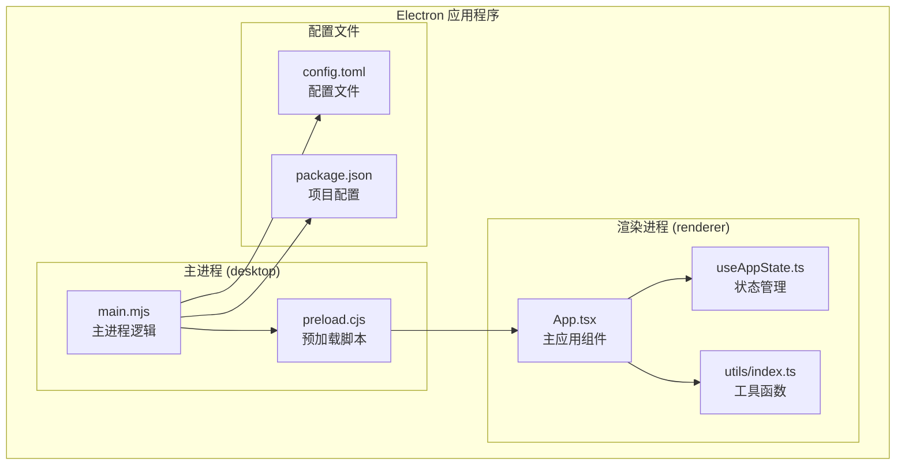
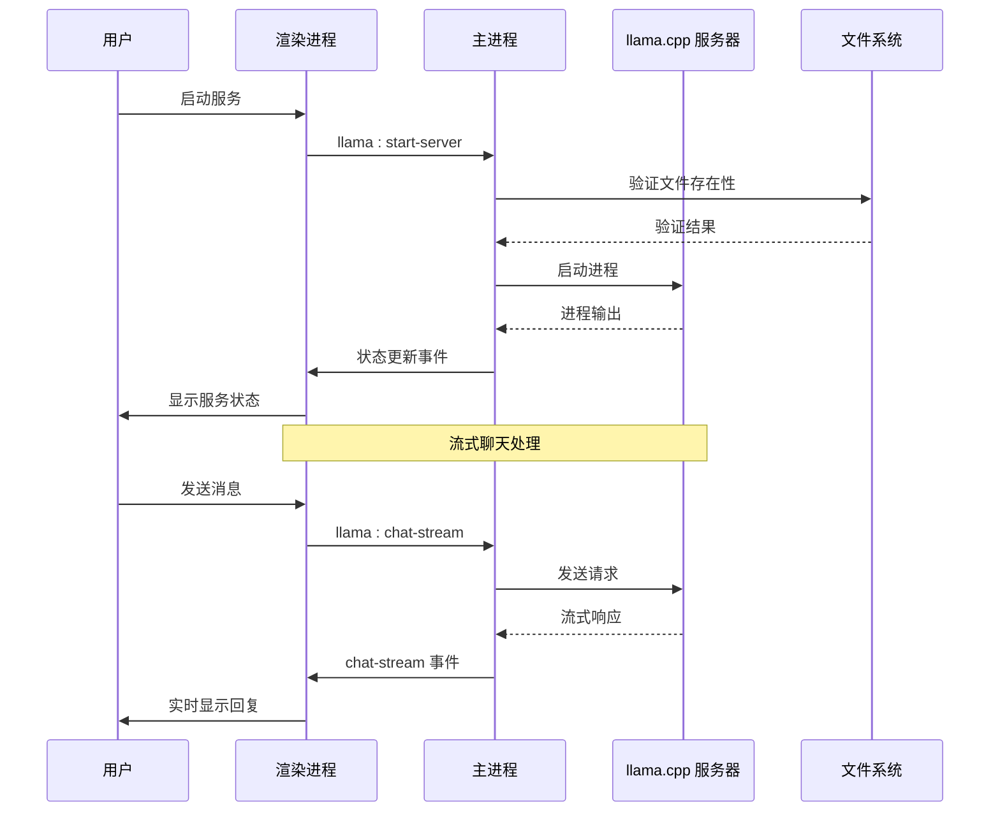
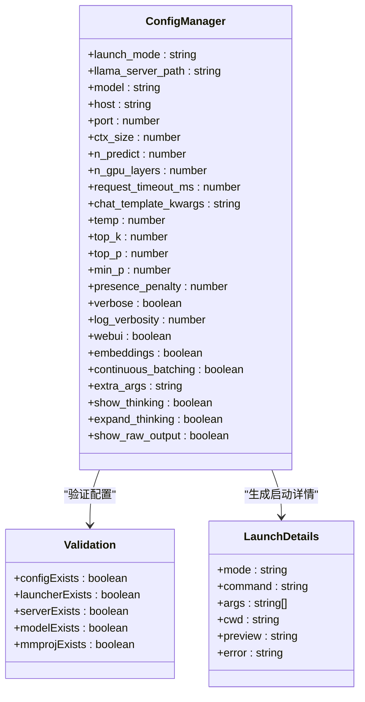
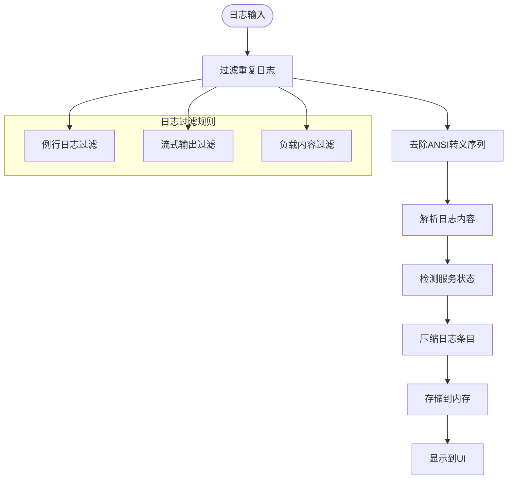
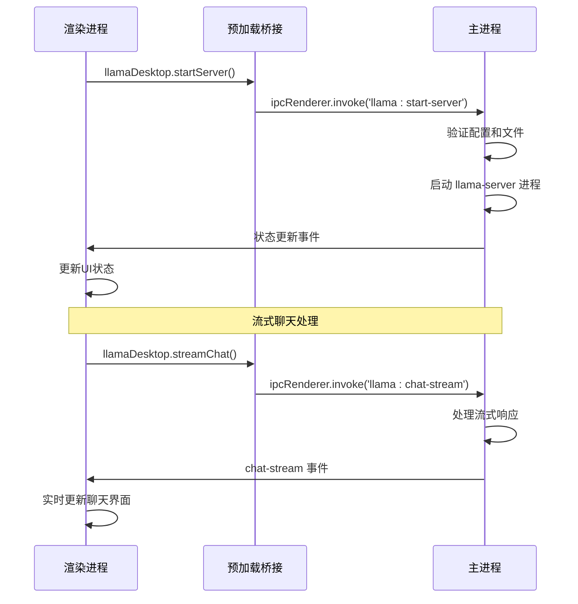
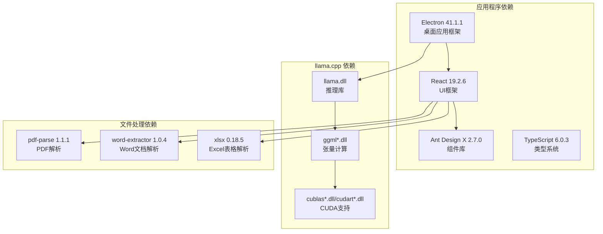

# 故障排除

<cite>
**本文档引用的文件**
- [package.json](file://package.json)
- [config.toml](file://config.toml)
- [desktop/main.mjs](file://desktop/main.mjs)
- [desktop/preload.cjs](file://desktop/preload.cjs)
- [renderer/src/App.tsx](file://renderer/src/App.tsx)
- [renderer/src/hooks/useAppState.ts](file://renderer/src/hooks/useAppState.ts)
- [renderer/src/utils/index.ts](file://renderer/src/utils/index.ts)
- [README.md](file://README.md)
</cite>

## 目录
1. [简介](#简介)
2. [项目结构](#项目结构)
3. [核心组件](#核心组件)
4. [架构概览](#架构概览)
5. [详细组件分析](#详细组件分析)
6. [依赖关系分析](#依赖关系分析)
7. [性能考虑](#性能考虑)
8. [故障排除指南](#故障排除指南)
9. [结论](#结论)
10. [附录](#附录)

## 简介

illama-desktop 是一个基于 Electron 的桌面应用程序，提供了完整的 llama.cpp 本地 AI 服务管理功能。该项目集成了 OpenAI 兼容的 API 接口、内置聊天界面、系统托盘后台运行等功能，为用户提供了一个完整的本地 AI 服务控制面板。

本故障排除指南旨在帮助用户诊断和解决在使用 illama-desktop 过程中可能遇到的各种问题，包括 llama.cpp 服务器启动失败、内存不足、模型加载错误等问题的诊断和修复方法。

## 项目结构

illama-desktop 采用典型的 Electron 应用程序结构，分为主进程（desktop/main.mjs）和渲染进程（renderer/）两个主要部分：



**图表来源**
- [desktop/main.mjs:1-50](file://desktop/main.mjs#L1-L50)
- [desktop/preload.cjs:1-32](file://desktop/preload.cjs#L1-L32)
- [renderer/src/App.tsx:1-50](file://renderer/src/App.tsx#L1-L50)

**章节来源**
- [README.md:150-201](file://README.md#L150-L201)
- [package.json:1-51](file://package.json#L1-L51)

## 核心组件

### 主进程组件

主进程负责应用程序的核心功能，包括：

- **llama.cpp 服务器管理**：启动、停止、监控 llama-server 进程
- **IPC 通信**：处理渲染进程与主进程之间的通信
- **系统托盘管理**：提供后台运行和状态显示
- **文件系统操作**：配置文件读写、模型文件管理
- **日志系统**：收集和管理应用程序日志

### 渲染进程组件

渲染进程提供用户界面和交互功能：

- **聊天界面**：支持流式回复、Markdown 渲染
- **设置面板**：配置 llama.cpp 参数、模型路径等
- **状态管理**：使用自定义 Hook 管理应用状态
- **附件处理**：支持图片、PDF、文档等文件上传

**章节来源**
- [desktop/main.mjs:86-136](file://desktop/main.mjs#L86-L136)
- [renderer/src/App.tsx:21-54](file://renderer/src/App.tsx#L21-L54)

## 架构概览

illama-desktop 采用了分层架构设计，实现了清晰的关注点分离：



**图表来源**
- [desktop/main.mjs:1434-1524](file://desktop/main.mjs#L1434-L1524)
- [renderer/src/App.tsx:92-112](file://renderer/src/App.tsx#L92-L112)

## 详细组件分析

### 配置管理系统

配置系统是应用程序的核心组件之一，负责管理 llama.cpp 服务器的各种参数：



**图表来源**
- [desktop/main.mjs:86-136](file://desktop/main.mjs#L86-L136)
- [desktop/main.mjs:977-985](file://desktop/main.mjs#L977-L985)
- [desktop/main.mjs:863-886](file://desktop/main.mjs#L863-L886)

### 日志管理系统

应用程序实现了多层次的日志记录系统，用于诊断和问题排查：



**图表来源**
- [desktop/main.mjs:226-327](file://desktop/main.mjs#L226-L327)
- [renderer/src/utils/index.ts:109-165](file://renderer/src/utils/index.ts#L109-L165)

**章节来源**
- [desktop/main.mjs:226-327](file://desktop/main.mjs#L226-L327)
- [desktop/main.mjs:1225-1238](file://desktop/main.mjs#L1225-L1238)

### IPC 通信机制

应用程序使用 IPC（进程间通信）机制实现主进程和渲染进程之间的数据交换：



**图表来源**
- [desktop/preload.cjs:3-31](file://desktop/preload.cjs#L3-L31)
- [desktop/main.mjs:1410-1524](file://desktop/main.mjs#L1410-L1524)

**章节来源**
- [desktop/preload.cjs:3-31](file://desktop/preload.cjs#L3-L31)
- [renderer/src/App.tsx:92-112](file://renderer/src/App.tsx#L92-L112)

## 依赖关系分析

应用程序的依赖关系相对简单，主要依赖于 Electron 和相关的前端技术栈：



**图表来源**
- [package.json:39-49](file://package.json#L39-L49)
- [README.md:203-216](file://README.md#L203-L216)

**章节来源**
- [package.json:39-49](file://package.json#L39-L49)
- [README.md:203-216](file://README.md#L203-L216)

## 性能考虑

### 内存使用优化

应用程序实现了多项内存使用优化策略：

- **日志压缩**：过滤重复的例行日志，减少内存占用
- **流式处理**：使用流式 API 处理大型响应，避免一次性加载到内存
- **图像处理**：对大图片进行 Base64 编码，限制文件大小
- **会话管理**：使用 localStorage 限制会话数量，避免内存泄漏

### CPU 占用优化

为了优化 CPU 使用率，应用程序采用了以下策略：

- **智能采样参数**：提供合理的默认采样参数，平衡性能和质量
- **GPU 加速**：支持 CUDA 和 Vulkan 加速，充分利用硬件资源
- **批处理优化**：启用连续批处理功能，提高推理效率
- **线程配置**：允许用户配置线程数，适应不同的硬件配置

### 响应时间优化

应用程序通过多种方式优化响应时间：

- **超时控制**：提供请求超时配置，避免长时间阻塞
- **缓存机制**：缓存模型信息和配置，减少重复查询
- **异步处理**：使用异步 API 处理文件上传和解析
- **UI 优化**：使用虚拟滚动和懒加载，提升界面响应速度

## 故障排除指南

### llama.cpp 服务器启动失败

#### 常见症状
- 服务状态显示为 "需要处理"
- 启动后立即退出
- 控制台显示 "找不到 llama-server.exe"
- 配置验证失败

#### 诊断步骤

1. **验证文件存在性**
   ```bash
   # 检查 llama-server.exe 是否存在
   ls -la llama/llama-server.exe
   
   # 检查必要的 DLL 文件
   ls -la llama/*.dll
   ```

2. **检查配置文件**
   - 确认 `config.toml` 中的路径配置正确
   - 验证 `llama_server_path` 指向正确的可执行文件
   - 检查 `model` 路径是否有效

3. **查看启动日志**
   - 在终端面板中查看详细的启动日志
   - 注意任何错误信息和警告
   - 关注内存不足或权限相关的问题

#### 解决方案

1. **修复文件路径**
   - 确保 `llama/` 目录包含所有必需的文件
   - 检查路径中是否包含特殊字符或空格
   - 验证文件权限是否正确

2. **调整内存设置**
   - 降低 `ctx_size` 参数（上下文大小）
   - 减少 `n_gpu_layers`（GPU 分层数）
   - 调整 `batch_size` 和 `ubatch_size`

3. **检查系统要求**
   - 确保有足够的可用内存
   - 验证 GPU 驱动程序版本
   - 检查操作系统兼容性

**章节来源**
- [desktop/main.mjs:1434-1524](file://desktop/main.mjs#L1434-L1524)
- [desktop/main.mjs:977-985](file://desktop/main.mjs#L977-L985)
- [config.toml:1-27](file://config.toml#L1-L27)

### 内存不足问题

#### 常见症状
- 服务器启动后立即崩溃
- 进程被系统终止
- 内存使用率达到 100%
- 应用程序无响应

#### 诊断步骤

1. **监控内存使用**
   - 使用任务管理器监控内存使用情况
   - 查看应用程序日志中的内存相关错误
   - 检查系统可用内存

2. **分析模型大小**
   - 查看模型文件的实际大小
   - 评估模型参数量对内存的需求
   - 考虑模型的量化级别

#### 解决方案

1. **降低内存需求**
   ```toml
   # 在 config.toml 中调整以下参数
   ctx_size = 8192      # 减少上下文大小
   n_gpu_layers = 10    # 减少 GPU 分层数
   batch_size = 512     # 减小批处理大小
   ubatch_size = 512    # 减小微批处理大小
   ```

2. **优化模型配置**
   - 使用更小的模型文件
   - 选择更低量化级别的模型
   - 考虑使用 CPU 推理而非 GPU

3. **系统层面优化**
   - 关闭不必要的应用程序释放内存
   - 增加虚拟内存大小
   - 重启系统释放内存碎片

**章节来源**
- [config.toml:9-11](file://config.toml#L9-L11)
- [desktop/main.mjs:803-842](file://desktop/main.mjs#L803-L842)

### 模型加载错误

#### 常见症状
- "找不到模型文件" 错误
- "模型格式不支持" 错误
- 加载后立即报错
- 服务器启动但无法处理请求

#### 诊断步骤

1. **验证模型文件**
   - 检查 `.gguf` 文件格式
   - 确认模型文件完整性
   - 验证模型与硬件兼容性

2. **检查模型路径**
   - 确保路径中没有特殊字符
   - 验证文件权限设置
   - 检查文件是否被其他程序占用

#### 解决方案

1. **修复模型路径**
   - 使用绝对路径而不是相对路径
   - 确保路径中没有空格或特殊字符
   - 验证文件存在性和可访问性

2. **重新下载模型**
   - 从官方源重新下载模型文件
   - 验证文件完整性（MD5/SHA 哈希）
   - 检查模型版本兼容性

3. **调整模型参数**
   ```toml
   # 根据模型特性调整参数
   model = "path/to/your/model.gguf"
   n_gpu_layers = 0    # 如果使用 CPU 推理
   temp = 0.7          # 调整采样温度
   top_p = 0.9         # 调整 Top-P 采样
   ```

**章节来源**
- [desktop/main.mjs:1444-1452](file://desktop/main.mjs#L1444-L1452)
- [config.toml:6](file://config.toml#L6)

### 网络连接问题

#### 常见症状
- 无法连接到本地服务
- 请求超时错误
- 端口被占用
- 防火墙阻止连接

#### 诊断步骤

1. **检查服务状态**
   - 验证服务是否正在运行
   - 检查端口监听状态
   - 确认绑定地址配置

2. **测试网络连接**
   ```bash
   # 测试本地连接
   curl http://127.0.0.1:8080/v1/models
   
   # 检查端口占用
   netstat -ano | findstr :8080
   ```

#### 解决方案

1. **调整网络配置**
   ```toml
   # 在 config.toml 中调整网络设置
   host = "127.0.0.1"    # 绑定到本地回环地址
   port = 8080          # 确保端口未被占用
   request_timeout_ms = 60000  # 增加请求超时时间
   ```

2. **防火墙配置**
   - 在 Windows Defender 中添加例外
   - 允许应用程序通过防火墙
   - 检查企业防火墙策略

3. **代理设置**
   - 检查系统代理设置
   - 验证代理配置是否影响本地连接
   - 考虑使用本地代理绕过限制

**章节来源**
- [config.toml:7-8](file://config.toml#L7-L8)
- [desktop/main.mjs:1541-1550](file://desktop/main.mjs#L1541-L1550)

### 性能问题识别和优化

#### 性能问题识别

1. **响应时间过长**
   - 检查 `latencyMs` 和 `speed` 指标
   - 监控 CPU 和内存使用率
   - 分析日志中的性能瓶颈

2. **吞吐量不足**
   - 监控并发请求处理能力
   - 检查批处理配置
   - 评估硬件资源利用率

#### 优化策略

1. **硬件优化**
   ```toml
   # GPU 优化配置
   n_gpu_layers = 99    # 使用尽可能多的 GPU 层数
   device = "cuda"      # 指定 GPU 设备
   threads = 8          # 调整线程数
   batch_size = 512     # 优化批处理大小
   ```

2. **软件优化**
   - 启用连续批处理 (`continuous_batching = true`)
   - 调整采样参数以平衡质量和性能
   - 优化上下文大小 (`ctx_size`)

3. **系统优化**
   - 关闭不必要的后台程序
   - 确保足够的系统资源
   - 定期清理临时文件

**章节来源**
- [config.toml:13-23](file://config.toml#L13-L23)
- [desktop/main.mjs:832-842](file://desktop/main.mjs#L832-L842)

### 配置错误的常见症状和修复

#### 常见配置错误

1. **路径配置错误**
   - 模型路径包含空格或特殊字符
   - llama-server.exe 路径不正确
   - 相对路径导致的问题

2. **参数配置错误**
   - 数值参数超出有效范围
   - 字符串参数格式不正确
   - JSON 参数解析错误

3. **文件权限问题**
   - 模型文件权限不足
   - 配置文件写入权限问题
   - 目录访问权限限制

#### 修复步骤

1. **验证配置文件**
   ```bash
   # 检查 TOML 语法
   python -m tomlkit config.toml
   
   # 验证路径有效性
   ls -la "/path/to/your/model.gguf"
   ```

2. **重置配置**
   - 删除损坏的配置文件
   - 使用默认配置重新开始
   - 逐步添加配置项进行测试

3. **检查权限**
   - 确保应用程序有足够权限
   - 验证文件系统权限设置
   - 检查防病毒软件的干扰

**章节来源**
- [desktop/main.mjs:328-484](file://desktop/main.mjs#L328-L484)
- [desktop/main.mjs:977-985](file://desktop/main.mjs#L977-L985)

### 调试工具使用指南

#### 内置调试工具

1. **日志系统**
   - 使用终端面板查看实时日志
   - 过滤特定类型的日志信息
   - 导出日志文件进行分析

2. **状态监控**
   - 查看服务状态和 PID
   - 监控内存和 CPU 使用率
   - 跟踪请求处理时间

3. **配置验证**
   - 使用验证功能检查配置
   - 查看启动详情预览
   - 测试健康状态

#### 第三方调试工具

1. **系统监控**
   - 使用任务管理器监控资源使用
   - 使用性能监视器跟踪系统指标
   - 分析内存转储文件

2. **网络调试**
   - 使用 Wireshark 分析网络流量
   - 检查端口监听状态
   - 验证防火墙配置

3. **日志分析**
   - 使用日志分析工具
   - 过滤和搜索特定信息
   - 生成性能报告

**章节来源**
- [renderer/src/utils/index.ts:109-165](file://renderer/src/utils/index.ts#L109-L165)
- [desktop/main.mjs:1225-1238](file://desktop/main.mjs#L1225-L1238)

### 问题报告标准流程

#### 信息收集要求

1. **基本系统信息**
   - 操作系统版本和架构
   - 硬件配置（CPU、内存、GPU）
   - 驱动程序版本

2. **应用程序信息**
   - illama-desktop 版本
   - Electron 版本
   - Node.js 版本

3. **配置信息**
   - 完整的 config.toml 内容
   - llama.cpp 版本和构建信息
   - 模型文件规格

4. **日志信息**
   - 完整的应用程序日志
   - llama.cpp 服务器日志
   - 错误发生时的系统状态

#### 报告模板

```markdown
## 问题报告

### 基本信息
- **问题描述**: [简要描述问题]
- **重现步骤**: [详细的操作步骤]
- **期望结果**: [预期的行为]
- **实际结果**: [实际发生的情况]

### 系统环境
- **操作系统**: [Windows 版本]
- **硬件配置**: [CPU/GPU/内存]
- **驱动程序**: [GPU 驱动版本]

### 配置信息
- **llama.cpp 配置**: [config.toml 内容]
- **模型规格**: [模型文件信息]
- **应用程序版本**: [illama-desktop 版本]

### 日志信息
- **应用程序日志**: [粘贴相关日志片段]
- **服务器日志**: [粘贴服务器日志]
- **系统日志**: [相关系统信息]

### 附加信息
- [其他相关信息]
```

#### 提交渠道

1. **GitHub Issues**
   - 访问项目 GitHub 页面
   - 创建新的 Issue
   - 选择合适的模板
   - 详细描述问题

2. **邮件支持**
   - 发送邮件到维护者邮箱
   - 提供完整的诊断信息
   - 等待回复和解决方案

3. **社区支持**
   - 在相关论坛发帖
   - 提供详细的日志和配置
   - 参考社区最佳实践

**章节来源**
- [README.md:480-493](file://README.md#L480-L493)

## 结论

illama-desktop 提供了一个功能完整、易于使用的本地 AI 服务管理平台。通过本文档提供的故障排除指南，用户可以有效地诊断和解决在使用过程中遇到的各种问题。

关键的成功因素包括：
- 正确的配置文件设置
- 合理的硬件资源配置
- 适当的性能优化策略
- 有效的日志分析方法

建议用户在遇到问题时，按照本文档的诊断步骤逐步排查，并参考相应的解决方案。对于复杂问题，建议收集完整的诊断信息并提交到项目维护团队。

## 附录

### 常用命令参考

```bash
# 启动开发模式
npm start

# 构建渲染进程
npm run build

# 打包应用程序
npm run dist

# 类型检查
npx tsc --noEmit

# 运行测试
npm test
```

### 支持资源

- **官方文档**: [项目 README](file://README.md)
- **GitHub 仓库**: [项目主页](https://github.com/linkin770/illama-cpp-desktop)
- **问题报告**: [GitHub Issues](https://github.com/linkin770/illama-cpp-desktop/issues)
- **社区支持**: [相关论坛和讨论区]