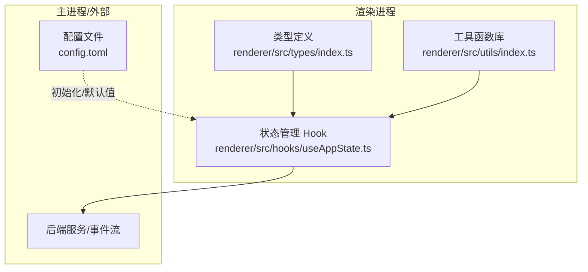
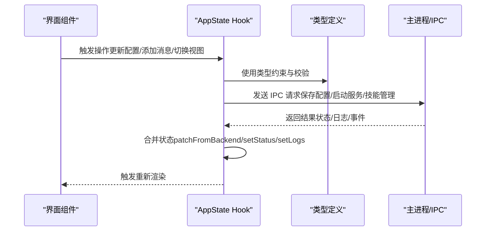
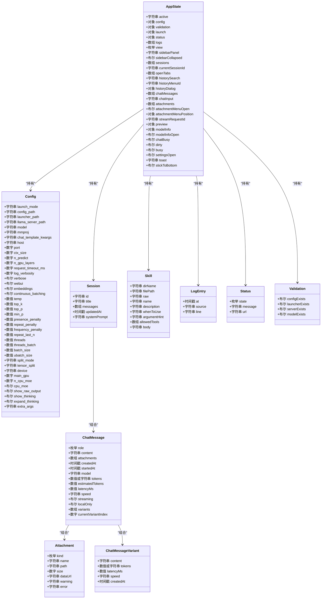
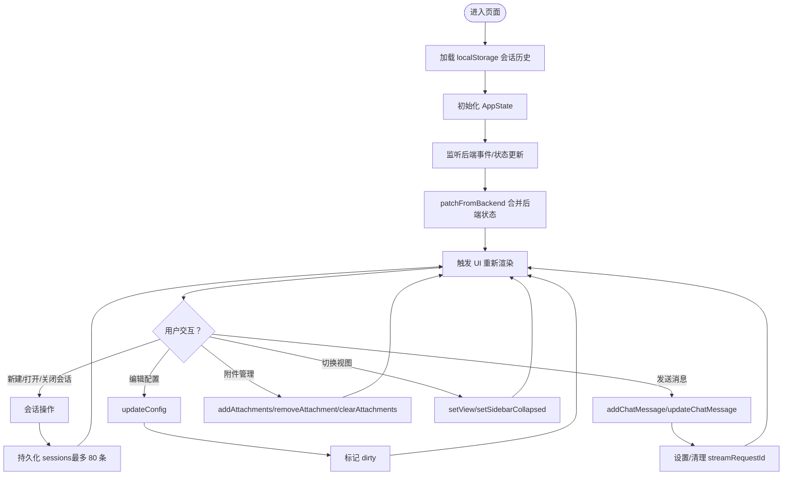
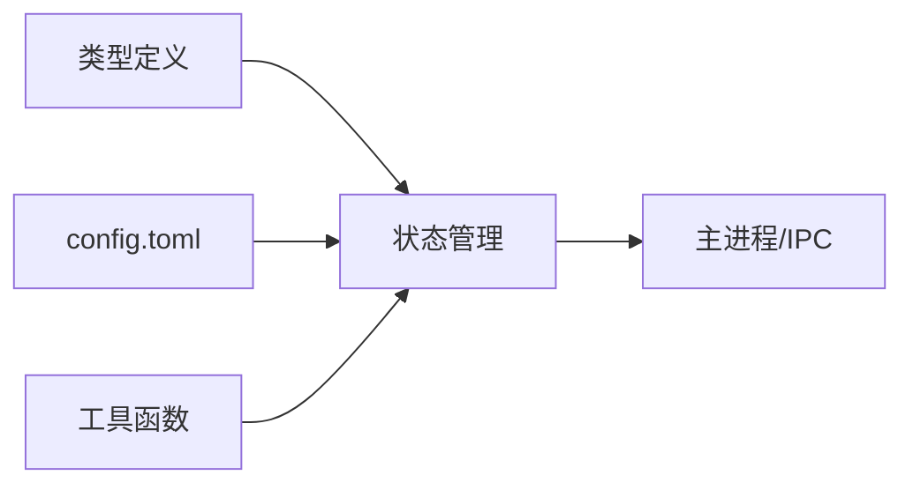

# 数据模型

<cite>
**本文引用的文件**
- [renderer/src/types/index.ts](file://renderer/src/types/index.ts)
- [renderer/src/hooks/useAppState.ts](file://renderer/src/hooks/useAppState.ts)
- [renderer/src/utils/index.ts](file://renderer/src/utils/index.ts)
- [config.toml](file://config.toml)
- [package.json](file://package.json)
</cite>

## 目录
1. [简介](#简介)
2. [项目结构](#项目结构)
3. [核心组件](#核心组件)
4. [架构总览](#架构总览)
5. [详细组件分析](#详细组件分析)
6. [依赖分析](#依赖分析)
7. [性能考量](#性能考量)
8. [故障排查指南](#故障排查指南)
9. [结论](#结论)
10. [附录](#附录)

## 简介
本文件系统性梳理 illama-desktop 的数据模型，聚焦渲染进程中的核心类型与状态管理，覆盖以下关键实体：Config、ChatMessage、Session、Skill、Attachment、LogEntry、Status、Validation、AppState 等。文档从数据结构定义、字段类型与约束、实体间关系、验证与业务规则、序列化与反序列化、状态流与更新机制、演进与兼容性、最佳实践与性能优化等方面进行深入说明，并提供可视化图示帮助开发者快速理解与正确使用。

## 项目结构
本项目采用前端 TypeScript + React + Electron 架构，数据模型主要集中在渲染进程的类型定义与状态管理 Hook 中；配置以 TOML 形式存在，用于初始化与持久化部分参数。

图表来源
- [renderer/src/types/index.ts:1-222](file://renderer/src/types/index.ts#L1-L222)
- [renderer/src/hooks/useAppState.ts:1-555](file://renderer/src/hooks/useAppState.ts#L1-L555)
- [renderer/src/utils/index.ts:1-165](file://renderer/src/utils/index.ts#L1-L165)
- [config.toml:1-27](file://config.toml#L1-L27)

章节来源
- [renderer/src/types/index.ts:1-222](file://renderer/src/types/index.ts#L1-L222)
- [renderer/src/hooks/useAppState.ts:1-555](file://renderer/src/hooks/useAppState.ts#L1-L555)
- [renderer/src/utils/index.ts:1-165](file://renderer/src/utils/index.ts#L1-L165)
- [config.toml:1-27](file://config.toml#L1-L27)

## 核心组件
本节对关键数据模型进行逐项解析，明确字段、类型、约束与典型用途。

- Config（配置）
  - 作用：承载 llama-server 与应用运行所需的全部参数，既作为启动参数传递，也作为 UI 设置项集合。
  - 关键字段与类型（节选）：launch_mode、config_path、launcher_path、llama_server_path、model、mmproj、host、port、ctx_size、n_predict、n_gpu_layers、request_timeout_ms、log_verbosity、verbose、webui、embeddings、continuous_batching、temp、top_k、top_p、min_p、presence_penalty、repeat_penalty、frequency_penalty、repeat_last_n、threads、threads_batch、batch_size、ubatch_size、split_mode、tensor_split、device、main_gpu、n_cpu_moe、cpu_moe、show_raw_output、show_thinking、expand_thinking、extra_args 等。
  - 约束与规则：
    - host/port 组合构成服务访问地址，需保证唯一且可绑定。
    - ctx_size、n_predict 等影响上下文与生成长度，过大可能触发“超出上下文”错误。
    - request_timeout_ms 控制请求超时，过小可能导致频繁超时。
    - show_thinking、expand_thinking 控制思考过程展示策略。
    - extra_args 允许追加命令行参数，需确保与 llama.cpp 兼容。
  - 持久化：初始值来源于 config.toml，运行中通过 AppState.updateConfig 动态更新。
  - 参考路径：[renderer/src/types/index.ts:54-103](file://renderer/src/types/index.ts#L54-L103)，[config.toml:1-27](file://config.toml#L1-L27)

- ChatMessage（聊天消息）
  - 作用：表示一次完整的对话条目，支持多模态附件与流式生成状态。
  - 关键字段与类型：role（'user' | 'assistant' | 'system'）、content、attachments、createdAt、startedAt、model、tokens、estimatedTokens、latencyMs、speed、streaming、localOnly、variants、currentVariantIndex。
  - 约束与规则：
    - role 必须为受控枚举值；system 消息通常要求置于请求最前。
    - attachments 支持 image/audio/text/pdf/system/mcp/file 等类型，含路径、大小、dataUrl 等。
    - streaming 标记流式生成过程；variants 支持多候选回复及其统计指标。
    - tokens/estimatedTokens 用于计费与性能监控。
  - 参考路径：[renderer/src/types/index.ts:152-176](file://renderer/src/types/index.ts#L152-L176)

- Session（会话）
  - 作用：封装一次或多轮对话的历史记录与元信息。
  - 关键字段与类型：id、title、messages（ChatMessage[]）、updatedAt、systemPrompt（可选）。
  - 约束与规则：
    - id 唯一标识；title 由首条有效用户消息推导，长度与格式受控。
    - systemPrompt 为会话级系统提示词，可为空。
    - messages 与 AppState.chatMessages 同步，支持增删改。
  - 参考路径：[renderer/src/types/index.ts:179-185](file://renderer/src/types/index.ts#L179-L185)

- Skill（技能）
  - 作用：内置或自定义技能的元数据与内容载体。
  - 关键字段与类型：dirName、filePath、raw（原始内容）、name、description、whenToUse、argumentHint、allowedTools、body。
  - 约束与规则：
    - name/description 等为展示与检索字段；body 为技能实现内容。
    - allowedTools 限定可用工具集。
  - 参考路径：[renderer/src/types/index.ts:128-138](file://renderer/src/types/index.ts#L128-L138)

- Attachment（附件）
  - 作用：多模态输入附件的统一抽象。
  - 关键字段与类型：kind（'image' | 'audio' | 'text' | 'pdf' | 'system' | 'mcp' | 'file'）、name、path、size、dataUrl、warning、error。
  - 约束与规则：
    - dataUrl 用于内联图片预览；path 与 size 用于文件型附件。
    - warning/error 用于提示与错误状态。
  - 参考路径：[renderer/src/types/index.ts:141-149](file://renderer/src/types/index.ts#L141-L149)

- LogEntry（日志条目）
  - 作用：统一的日志结构，便于 UI 展示与过滤。
  - 关键字段与类型：at（时间戳）、source（stdout/stderr/desktop/chat）、line（日志内容）。
  - 约束与规则：
    - source 用于区分来源；line 可能被压缩或过滤。
  - 参考路径：[renderer/src/types/index.ts:121-125](file://renderer/src/types/index.ts#L121-L125)

- Status（服务状态）
  - 作用：描述 llama-server 的生命周期状态与可达性。
  - 关键字段与类型：state（'stopped' | 'starting' | 'running' | 'stopping' | 'error'）、message、url。
  - 约束与规则：
    - state 为受控枚举；url 与 host/port 对应。
  - 参考路径：[renderer/src/types/index.ts:106-110](file://renderer/src/types/index.ts#L106-L110)

- Validation（验证状态）
  - 作用：检查关键文件是否存在（配置、启动器、服务器、模型）。
  - 关键字段与类型：configExists、launcherExists、serverExists、modelExists。
  - 约束与规则：
    - 任一缺失都会导致启动失败，需在 UI 中提示修复。
  - 参考路径：[renderer/src/types/index.ts:113-118](file://renderer/src/types/index.ts#L113-L118)

- AppState（应用全局状态）
  - 作用：集中管理 UI 与业务状态，驱动渲染层行为。
  - 关键字段与类型（节选）：active、config、validation、launch、status、logs、view、sidebarPanel、sidebarCollapsed、sessions、currentSessionId、openTabs、historySearch、historyMenuId、historyDialog、chatMessages、chatInput、attachments、attachmentMenuOpen、attachmentMenuPosition、streamRequestId、preview、modelInfo、modelInfoOpen、chatBusy、dirty、busy、settingsOpen、toast、stickToBottom。
  - 约束与规则：
    - sessions 通过 localStorage 持久化，上限 80 条；currentSessionId 与 openTabs 保持一致。
    - chatBusy/streamRequestId 用于流式生成的并发控制。
    - dirty 标识配置变更但未保存。
  - 参考路径：[renderer/src/types/index.ts:188-219](file://renderer/src/types/index.ts#L188-L219)

章节来源
- [renderer/src/types/index.ts:54-103](file://renderer/src/types/index.ts#L54-L103)
- [renderer/src/types/index.ts:106-110](file://renderer/src/types/index.ts#L106-L110)
- [renderer/src/types/index.ts:113-118](file://renderer/src/types/index.ts#L113-L118)
- [renderer/src/types/index.ts:121-125](file://renderer/src/types/index.ts#L121-L125)
- [renderer/src/types/index.ts:128-138](file://renderer/src/types/index.ts#L128-L138)
- [renderer/src/types/index.ts:141-149](file://renderer/src/types/index.ts#L141-L149)
- [renderer/src/types/index.ts:152-176](file://renderer/src/types/index.ts#L152-L176)
- [renderer/src/types/index.ts:179-185](file://renderer/src/types/index.ts#L179-L185)
- [renderer/src/types/index.ts:188-219](file://renderer/src/types/index.ts#L188-L219)

## 架构总览
渲染进程通过类型定义与状态 Hook 组织数据模型，与主进程通过 IPC 接口交互，实现配置保存、服务启停、模型信息查询、技能管理、日志与事件推送等功能。

图表来源
- [renderer/src/types/index.ts:2-44](file://renderer/src/types/index.ts#L2-L44)
- [renderer/src/hooks/useAppState.ts:96-102](file://renderer/src/hooks/useAppState.ts#L96-L102)

章节来源
- [renderer/src/types/index.ts:2-44](file://renderer/src/types/index.ts#L2-L44)
- [renderer/src/hooks/useAppState.ts:96-102](file://renderer/src/hooks/useAppState.ts#L96-L102)

## 详细组件分析

### 类型关系与依赖
以下类图展示了核心数据模型之间的组合与依赖关系。

图表来源
- [renderer/src/types/index.ts:54-103](file://renderer/src/types/index.ts#L54-L103)
- [renderer/src/types/index.ts:121-125](file://renderer/src/types/index.ts#L121-L125)
- [renderer/src/types/index.ts:128-138](file://renderer/src/types/index.ts#L128-L138)
- [renderer/src/types/index.ts:141-149](file://renderer/src/types/index.ts#L141-L149)
- [renderer/src/types/index.ts:152-176](file://renderer/src/types/index.ts#L152-L176)
- [renderer/src/types/index.ts:179-185](file://renderer/src/types/index.ts#L179-L185)
- [renderer/src/types/index.ts:188-219](file://renderer/src/types/index.ts#L188-L219)

章节来源
- [renderer/src/types/index.ts:54-103](file://renderer/src/types/index.ts#L54-L103)
- [renderer/src/types/index.ts:106-110](file://renderer/src/types/index.ts#L106-L110)
- [renderer/src/types/index.ts:113-118](file://renderer/src/types/index.ts#L113-L118)
- [renderer/src/types/index.ts:121-125](file://renderer/src/types/index.ts#L121-L125)
- [renderer/src/types/index.ts:128-138](file://renderer/src/types/index.ts#L128-L138)
- [renderer/src/types/index.ts:141-149](file://renderer/src/types/index.ts#L141-L149)
- [renderer/src/types/index.ts:152-176](file://renderer/src/types/index.ts#L152-L176)
- [renderer/src/types/index.ts:179-185](file://renderer/src/types/index.ts#L179-L185)
- [renderer/src/types/index.ts:188-219](file://renderer/src/types/index.ts#L188-L219)

### 状态管理与数据流
AppState Hook 负责应用状态的集中管理与更新，包含以下关键流程：

- 初始化与持久化
  - 从 localStorage 加载 sessions 并生成初始 currentSessionId/openTabs。
  - 参考路径：[renderer/src/hooks/useAppState.ts:69-79](file://renderer/src/hooks/useAppState.ts#L69-L79)，[renderer/src/hooks/useAppState.ts:42-55](file://renderer/src/hooks/useAppState.ts#L42-L55)，[renderer/src/hooks/useAppState.ts:57-66](file://renderer/src/hooks/useAppState.ts#L57-L66)

- 会话生命周期
  - 新建/打开/关闭/删除会话；自动保存当前会话；维护 openTabs 与 currentSessionId。
  - 参考路径：[renderer/src/hooks/useAppState.ts:269-303](file://renderer/src/hooks/useAppState.ts#L269-L303)，[renderer/src/hooks/useAppState.ts:211-266](file://renderer/src/hooks/useAppState.ts#L211-L266)，[renderer/src/hooks/useAppState.ts:138-208](file://renderer/src/hooks/useAppState.ts#L138-L208)，[renderer/src/hooks/useAppState.ts:317-339](file://renderer/src/hooks/useAppState.ts#L317-L339)

- 消息与附件
  - 添加/更新/移除消息；批量管理附件；流式请求 ID 管理。
  - 参考路径：[renderer/src/hooks/useAppState.ts:395-424](file://renderer/src/hooks/useAppState.ts#L395-L424)，[renderer/src/hooks/useAppState.ts:378-393](file://renderer/src/hooks/useAppState.ts#L378-L393)，[renderer/src/hooks/useAppState.ts:431-434](file://renderer/src/hooks/useAppState.ts#L431-L434)

- 后端状态同步
  - patchFromBackend 合并后端返回的 config/validation/status/logs/launch。
  - 参考路径：[renderer/src/hooks/useAppState.ts:96-102](file://renderer/src/hooks/useAppState.ts#L96-L102)

- UI 状态与视图
  - 切换视图、侧边栏、设置面板、模型信息面板、粘性滚动等。
  - 参考路径：[renderer/src/hooks/useAppState.ts:437-449](file://renderer/src/hooks/useAppState.ts#L437-L449)，[renderer/src/hooks/useAppState.ts:451-454](file://renderer/src/hooks/useAppState.ts#L451-L454)，[renderer/src/hooks/useAppState.ts:476-483](file://renderer/src/hooks/useAppState.ts#L476-L483)，[renderer/src/hooks/useAppState.ts:538-540](file://renderer/src/hooks/useAppState.ts#L538-L540)

图表来源
- [renderer/src/hooks/useAppState.ts:69-79](file://renderer/src/hooks/useAppState.ts#L69-L79)
- [renderer/src/hooks/useAppState.ts:96-102](file://renderer/src/hooks/useAppState.ts#L96-L102)
- [renderer/src/hooks/useAppState.ts:364-370](file://renderer/src/hooks/useAppState.ts#L364-L370)
- [renderer/src/hooks/useAppState.ts:395-424](file://renderer/src/hooks/useAppState.ts#L395-L424)
- [renderer/src/hooks/useAppState.ts:378-393](file://renderer/src/hooks/useAppState.ts#L378-L393)
- [renderer/src/hooks/useAppState.ts:437-454](file://renderer/src/hooks/useAppState.ts#L437-L454)
- [renderer/src/hooks/useAppState.ts:431-434](file://renderer/src/hooks/useAppState.ts#L431-L434)

章节来源
- [renderer/src/hooks/useAppState.ts:69-79](file://renderer/src/hooks/useAppState.ts#L69-L79)
- [renderer/src/hooks/useAppState.ts:96-102](file://renderer/src/hooks/useAppState.ts#L96-L102)
- [renderer/src/hooks/useAppState.ts:364-370](file://renderer/src/hooks/useAppState.ts#L364-L370)
- [renderer/src/hooks/useAppState.ts:395-424](file://renderer/src/hooks/useAppState.ts#L395-L424)
- [renderer/src/hooks/useAppState.ts:378-393](file://renderer/src/hooks/useAppState.ts#L378-L393)
- [renderer/src/hooks/useAppState.ts:431-434](file://renderer/src/hooks/useAppState.ts#L431-L434)
- [renderer/src/hooks/useAppState.ts:437-454](file://renderer/src/hooks/useAppState.ts#L437-L454)

### 数据验证与业务规则
- 配置校验
  - 通过 Validation 结构检查关键文件存在性；若缺失，UI 应提示修复。
  - 参考路径：[renderer/src/types/index.ts:113-118](file://renderer/src/types/index.ts#L113-L118)

- 消息角色与顺序
  - system 消息必须位于请求最前；错误消息包含特定关键字时需友好提示。
  - 参考路径：[renderer/src/utils/index.ts:50-66](file://renderer/src/utils/index.ts#L50-L66)

- 上下文与生成长度
  - ctx_size 与 n_predict 过大可能触发“超出上下文”错误；可通过增大 ctx_size 或减少附件缓解。
  - 参考路径：[renderer/src/utils/index.ts:62-63](file://renderer/src/utils/index.ts#L62-L63)

- 日志过滤与压缩
  - visibleLogs/compactLogLineForDisplay/visibleTerminalLogs 用于提升可读性与性能。
  - 参考路径：[renderer/src/utils/index.ts:110-165](file://renderer/src/utils/index.ts#L110-L165)

章节来源
- [renderer/src/types/index.ts:113-118](file://renderer/src/types/index.ts#L113-L118)
- [renderer/src/utils/index.ts:50-66](file://renderer/src/utils/index.ts#L50-L66)
- [renderer/src/utils/index.ts:62-63](file://renderer/src/utils/index.ts#L62-L63)
- [renderer/src/utils/index.ts:110-165](file://renderer/src/utils/index.ts#L110-L165)

### 序列化与反序列化
- 会话持久化
  - sessions 通过 JSON 序列化写入 localStorage，上限 80 条；加载时进行数组校验与异常兜底。
  - 参考路径：[renderer/src/hooks/useAppState.ts:42-55](file://renderer/src/hooks/useAppState.ts#L42-L55)，[renderer/src/hooks/useAppState.ts:52-55](file://renderer/src/hooks/useAppState.ts#L52-L55)

- 配置与状态
  - Config 与 AppState 在运行中以对象形式传递；与主进程交互时通过 IPC 序列化为 JSON。
  - 参考路径：[renderer/src/types/index.ts:54-103](file://renderer/src/types/index.ts#L54-L103)，[renderer/src/types/index.ts:188-219](file://renderer/src/types/index.ts#L188-L219)

章节来源
- [renderer/src/hooks/useAppState.ts:42-55](file://renderer/src/hooks/useAppState.ts#L42-L55)
- [renderer/src/hooks/useAppState.ts:52-55](file://renderer/src/hooks/useAppState.ts#L52-L55)
- [renderer/src/types/index.ts:54-103](file://renderer/src/types/index.ts#L54-L103)
- [renderer/src/types/index.ts:188-219](file://renderer/src/types/index.ts#L188-L219)

### 演进历史与版本兼容性
- 版本号
  - 项目版本号遵循形如 v1.0.yyyy.mm.dd 的格式，便于追踪构建日期与功能迭代。
  - 参考路径：[package.json:1-51](file://package.json#L1-L51)

- 配置兼容性
  - config.toml 中新增参数需在类型定义中同步扩展；旧版参数变更需向后兼容或提供迁移提示。
  - 参考路径：[config.toml:1-27](file://config.toml#L1-L27)，[renderer/src/types/index.ts:54-103](file://renderer/src/types/index.ts#L54-L103)

- 类型演进
  - ChatMessage.variants/currentVariantIndex 为新引入的多候选回复能力；需在 UI 与后端共同演进。
  - 参考路径：[renderer/src/types/index.ts:169-176](file://renderer/src/types/index.ts#L169-L176)

章节来源
- [package.json:1-51](file://package.json#L1-L51)
- [config.toml:1-27](file://config.toml#L1-L27)
- [renderer/src/types/index.ts:54-103](file://renderer/src/types/index.ts#L54-L103)
- [renderer/src/types/index.ts:169-176](file://renderer/src/types/index.ts#L169-L176)

## 依赖分析
- 组件耦合
  - AppState 对 Config/Validation/Status/LogEntry/Skill/Session/ChatMessage 等具有强依赖；各模块职责清晰，耦合度适中。
- 外部依赖
  - 通过 IPC 接口与主进程交互；日志与事件由后端推送至前端。
- 潜在循环依赖
  - 类型定义与状态管理相互独立，无循环依赖风险。

图表来源
- [renderer/src/types/index.ts:1-222](file://renderer/src/types/index.ts#L1-L222)
- [renderer/src/hooks/useAppState.ts:1-555](file://renderer/src/hooks/useAppState.ts#L1-L555)
- [renderer/src/utils/index.ts:1-165](file://renderer/src/utils/index.ts#L1-L165)
- [config.toml:1-27](file://config.toml#L1-L27)

章节来源
- [renderer/src/types/index.ts:1-222](file://renderer/src/types/index.ts#L1-L222)
- [renderer/src/hooks/useAppState.ts:1-555](file://renderer/src/hooks/useAppState.ts#L1-L555)
- [renderer/src/utils/index.ts:1-165](file://renderer/src/utils/index.ts#L1-L165)
- [config.toml:1-27](file://config.toml#L1-L27)

## 性能考量
- 会话持久化上限
  - sessions 最多保留 80 条，避免 localStorage 过载；建议定期清理历史。
  - 参考路径：[renderer/src/hooks/useAppState.ts:52-55](file://renderer/src/hooks/useAppState.ts#L52-L55)

- 日志过滤与压缩
  - visibleLogs/compactLogLineForDisplay/visibleTerminalLogs 减少 DOM 渲染压力与内存占用。
  - 参考路径：[renderer/src/utils/index.ts:110-165](file://renderer/src/utils/index.ts#L110-L165)

- Token 估算
  - estimateTokens 用于预估消耗，辅助 UI 提示与资源规划。
  - 参考路径：[renderer/src/utils/index.ts:20-34](file://renderer/src/utils/index.ts#L20-L34)

- 流式生成
  - streamRequestId 与 chatBusy 协同控制并发与 UI 状态，避免重复请求与闪烁。
  - 参考路径：[renderer/src/hooks/useAppState.ts:427-434](file://renderer/src/hooks/useAppState.ts#L427-L434)，[renderer/src/hooks/useAppState.ts:426-429](file://renderer/src/hooks/useAppState.ts#L426-L429)

章节来源
- [renderer/src/hooks/useAppState.ts:52-55](file://renderer/src/hooks/useAppState.ts#L52-L55)
- [renderer/src/utils/index.ts:110-165](file://renderer/src/utils/index.ts#L110-L165)
- [renderer/src/utils/index.ts:20-34](file://renderer/src/utils/index.ts#L20-L34)
- [renderer/src/hooks/useAppState.ts:426-434](file://renderer/src/hooks/useAppState.ts#L426-L434)

## 故障排查指南
- 常见错误与提示
  - “系统消息必须位于最前”：自动整理历史消息后重试。
  - “请求超时”：增大 request_timeout_ms 或降低 ctx_size/n_predict。
  - “Chat Template Kwargs 不是合法 JSON”：修正为有效 JSON。
  - “超出上下文”：增大 ctx_size 或减少附件大小。
  - 参考路径：[renderer/src/utils/index.ts:50-66](file://renderer/src/utils/index.ts#L50-L66)

- 日志可观测性
  - 使用 visibleLogs/visibleTerminalLogs 过滤噪声；关注 server is listening/model loaded 等关键行。
  - 参考路径：[renderer/src/utils/index.ts:110-165](file://renderer/src/utils/index.ts#L110-L165)

- 状态诊断
  - 通过 Status.state 与 Status.message 快速定位服务状态；必要时重试启动或检查 host/port。
  - 参考路径：[renderer/src/types/index.ts:106-110](file://renderer/src/types/index.ts#L106-L110)

章节来源
- [renderer/src/utils/index.ts:50-66](file://renderer/src/utils/index.ts#L50-L66)
- [renderer/src/utils/index.ts:110-165](file://renderer/src/utils/index.ts#L110-L165)
- [renderer/src/types/index.ts:106-110](file://renderer/src/types/index.ts#L106-L110)

## 结论
illama-desktop 的数据模型以类型安全为核心，结合 AppState Hook 实现了高内聚、低耦合的状态管理。通过明确的字段约束、严格的验证规则与完善的日志过滤机制，系统在易用性与稳定性之间取得平衡。建议在后续版本中持续完善类型定义与后端协议的一致性，强化配置迁移与向后兼容策略。

## 附录
- 最佳实践
  - 使用类型定义约束所有输入输出，避免运行期类型错误。
  - 对外暴露的 IPC 接口应严格校验 payload 结构与字段范围。
  - 会话与配置变更需及时持久化并设置 dirty 标识，便于用户感知。
  - 对于大文本与附件，优先采用流式处理与懒加载策略。
- 性能优化建议
  - 控制 sessions 与 logs 的容量，定期清理。
  - 合理使用 token 估算与上下文裁剪，避免越界。
  - 在 UI 层对高频更新进行节流/防抖，减少重渲染。