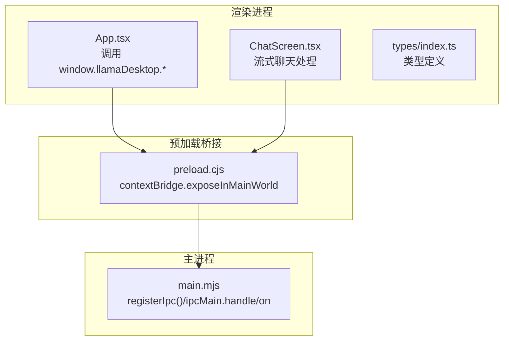
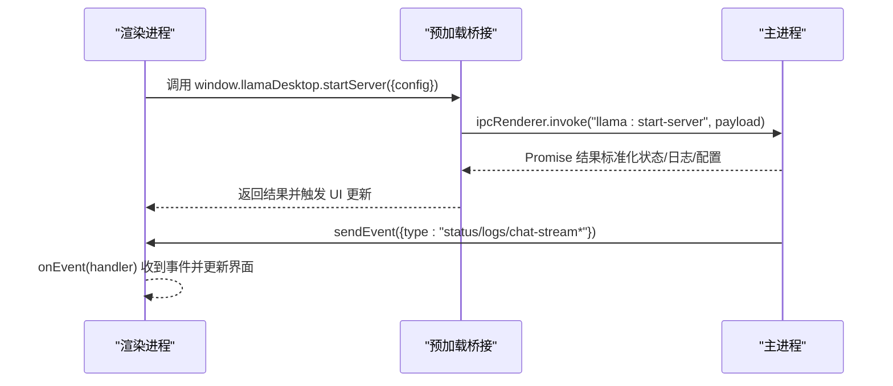
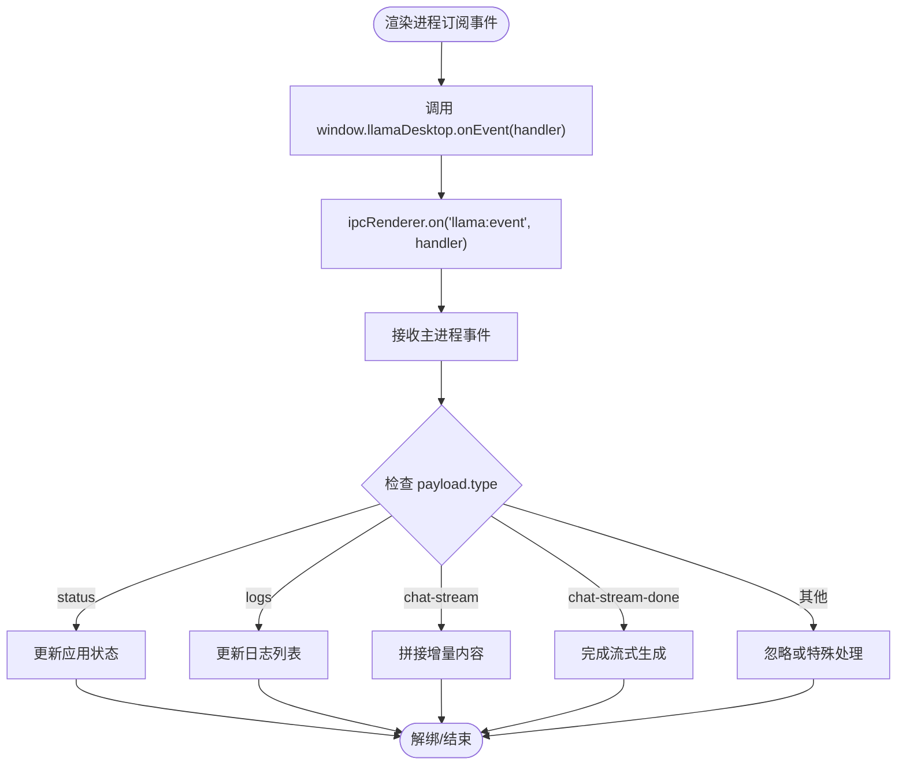
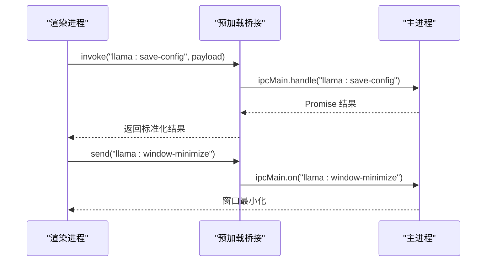
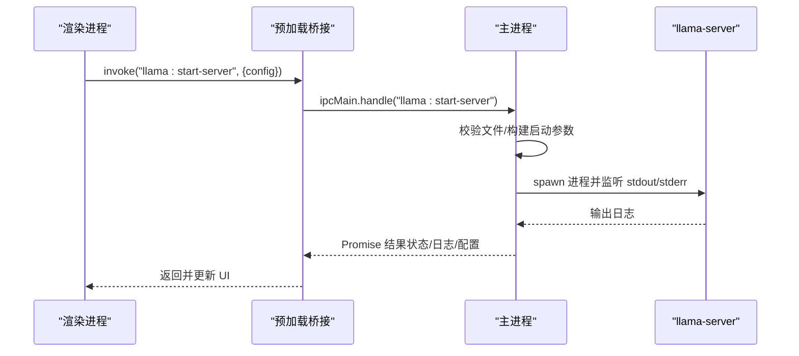
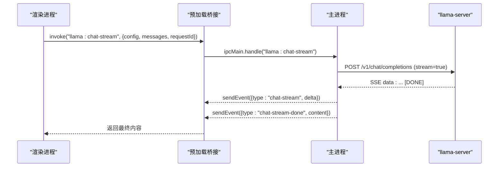
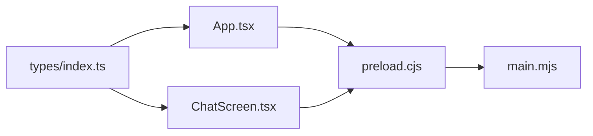

# IPC 通信机制

<cite>
**本文引用的文件**
- [desktop/main.mjs](file://desktop/main.mjs)
- [desktop/preload.cjs](file://desktop/preload.cjs)
- [renderer/src/App.tsx](file://renderer/src/App.tsx)
- [renderer/src/components/ChatScreen.tsx](file://renderer/src/components/ChatScreen.tsx)
- [renderer/src/types/index.ts](file://renderer/src/types/index.ts)
</cite>

## 目录
1. [简介](#简介)
2. [项目结构](#项目结构)
3. [核心组件](#核心组件)
4. [架构总览](#架构总览)
5. [详细组件分析](#详细组件分析)
6. [依赖关系分析](#依赖关系分析)
7. [性能考量](#性能考量)
8. [故障排查指南](#故障排查指南)
9. [结论](#结论)
10. [附录](#附录)

## 简介
本文件系统性阐述 illama-desktop 的 IPC 通信机制，聚焦主进程与渲染进程之间的事件通信体系。文档覆盖以下重点：
- 主进程与渲染进程的事件通信模式：ipcMain.handle/ipcMain.on 与 ipcRenderer.invoke/send 的使用规范
- 事件命名约定与参数传递规范
- 事件系统架构：事件类型定义、负载结构、错误传播与超时处理策略
- API 接口规范：服务器控制、配置管理、聊天接口（含流式）
- 数据序列化与反序列化的安全考虑：输入校验、类型检查与恶意数据防护
- 常见通信模式示例：同步调用、异步回调、流式数据传输与错误处理最佳实践

## 项目结构
illama-desktop 的 IPC 位于桌面层（desktop），通过 preload 桥接暴露给渲染进程，渲染进程通过统一的 API 接口与主进程交互。

图表来源
- [desktop/preload.cjs:1-32](file://desktop/preload.cjs#L1-L32)
- [desktop/main.mjs:1405-2159](file://desktop/main.mjs#L1405-L2159)
- [renderer/src/App.tsx:69-112](file://renderer/src/App.tsx#L69-L112)
- [renderer/src/components/ChatScreen.tsx:272-313](file://renderer/src/components/ChatScreen.tsx#L272-L313)
- [renderer/src/types/index.ts:1-51](file://renderer/src/types/index.ts#L1-L51)

章节来源
- [desktop/main.mjs:1405-2159](file://desktop/main.mjs#L1405-L2159)
- [desktop/preload.cjs:1-32](file://desktop/preload.cjs#L1-L32)
- [renderer/src/App.tsx:69-112](file://renderer/src/App.tsx#L69-L112)
- [renderer/src/components/ChatScreen.tsx:272-313](file://renderer/src/components/ChatScreen.tsx#L272-L313)
- [renderer/src/types/index.ts:1-51](file://renderer/src/types/index.ts#L1-L51)

## 核心组件
- 预加载桥接（preload.cjs）：通过 contextBridge 将主进程能力以 window.llamaDesktop 形式暴露给渲染进程，统一使用 ipcRenderer.invoke（同步调用）与 ipcRenderer.send（异步事件）。
- 主进程注册（main.mjs）：集中注册 ipcMain.handle/ipcMain.on，负责业务逻辑处理、状态管理、事件广播与错误传播。
- 渲染进程 API（App.tsx/ChatScreen.tsx）：通过 window.llamaDesktop.* 调用主进程能力，订阅事件并处理 UI 更新。
- 类型系统（types/index.ts）：定义 IPC 通信的输入/输出结构，确保前后端契约一致。

章节来源
- [desktop/preload.cjs:1-32](file://desktop/preload.cjs#L1-L32)
- [desktop/main.mjs:1405-2159](file://desktop/main.mjs#L1405-L2159)
- [renderer/src/App.tsx:69-112](file://renderer/src/App.tsx#L69-L112)
- [renderer/src/components/ChatScreen.tsx:272-313](file://renderer/src/components/ChatScreen.tsx#L272-L313)
- [renderer/src/types/index.ts:1-51](file://renderer/src/types/index.ts#L1-L51)

## 架构总览
illama-desktop 的 IPC 采用“主进程集中处理 + 渲染进程桥接调用”的模式。主进程通过 registerIpc() 统一注册所有 IPC 处理器；渲染进程通过 window.llamaDesktop.* 进行同步调用；主进程通过 sendEvent() 向渲染进程广播事件（如状态、日志、流式增量）。

图表来源
- [desktop/preload.cjs:3-31](file://desktop/preload.cjs#L3-L31)
- [desktop/main.mjs:1410-1524](file://desktop/main.mjs#L1410-L1524)
- [desktop/main.mjs:209-224](file://desktop/main.mjs#L209-L224)

章节来源
- [desktop/main.mjs:1405-2159](file://desktop/main.mjs#L1405-L2159)
- [desktop/preload.cjs:1-32](file://desktop/preload.cjs#L1-L32)

## 详细组件分析

### 事件系统与事件命名约定
- 事件通道命名：统一以 "llama:*" 前缀，区分同步调用（invoke）与异步事件（send/on）。
- 事件负载结构：主进程通过 sendEvent() 广播事件，负载包含 type 字段与具体数据（如 status、logs、chat-stream、chat-stream-done）。
- 事件订阅：渲染进程通过 window.llamaDesktop.onEvent(handler) 订阅事件，返回一个取消函数以便解绑。

图表来源
- [desktop/preload.cjs:26-30](file://desktop/preload.cjs#L26-L30)
- [desktop/main.mjs:209-224](file://desktop/main.mjs#L209-L224)

章节来源
- [desktop/preload.cjs:26-30](file://desktop/preload.cjs#L26-L30)
- [desktop/main.mjs:209-224](file://desktop/main.mjs#L209-L224)

### 同步调用（invoke）与异步事件（send/on）
- 同步调用：渲染进程使用 ipcRenderer.invoke，主进程使用 ipcMain.handle 注册处理器，返回 Promise 结果。典型场景：配置保存、服务器启停、健康检测、模型信息查询、聊天补全（非流式）、技能管理等。
- 异步事件：渲染进程使用 ipcRenderer.send 订阅主进程广播事件，典型场景：窗口控制（关闭/最小化/最大化/是否最大化）。

图表来源
- [desktop/preload.cjs:4-25](file://desktop/preload.cjs#L4-L25)
- [desktop/main.mjs:1419-1429](file://desktop/main.mjs#L1419-L1429)
- [desktop/main.mjs:1988-2006](file://desktop/main.mjs#L1988-L2006)

章节来源
- [desktop/preload.cjs:4-25](file://desktop/preload.cjs#L4-L25)
- [desktop/main.mjs:1419-1429](file://desktop/main.mjs#L1419-L1429)
- [desktop/main.mjs:1988-2006](file://desktop/main.mjs#L1988-L2006)

### 服务器控制 API
- llama:get-state：获取当前应用状态（配置、验证、启动详情、状态、日志）。
- llama:save-config：保存配置并返回标准化结果（含验证、状态、日志、启动详情）。
- llama:start-server：启动 llama-server（支持 direct/launcher 两种模式），记录启动日志，监控 stdout/stderr，进程退出后更新状态。
- llama:stop-server：停止服务器进程（Windows 使用 taskkill）。
- llama:test-health：测试服务健康状态（短超时）。
- llama:get-model-info：查询模型信息（结合 /v1/models 与 /props）。

图表来源
- [desktop/main.mjs:1419-1524](file://desktop/main.mjs#L1419-L1524)
- [desktop/main.mjs:1529-1536](file://desktop/main.mjs#L1529-L1536)
- [desktop/main.mjs:1541-1550](file://desktop/main.mjs#L1541-L1550)
- [desktop/main.mjs:1555-1607](file://desktop/main.mjs#L1555-L1607)

章节来源
- [desktop/main.mjs:1419-1524](file://desktop/main.mjs#L1419-L1524)
- [desktop/main.mjs:1529-1536](file://desktop/main.mjs#L1529-L1536)
- [desktop/main.mjs:1541-1550](file://desktop/main.mjs#L1541-L1550)
- [desktop/main.mjs:1555-1607](file://desktop/main.mjs#L1555-L1607)

### 配置管理 API
- llama:save-config：合并并规范化配置，写入 TOML 与桌面状态文件，返回标准化结果。
- llama:get-state：返回当前 appState（配置、验证、状态、日志、启动详情）。
- llama:test-health：快速探测服务可用性。
- llama:select-* / llama:pick-file：文件/目录选择器，返回路径或附件列表。

章节来源
- [desktop/main.mjs:1419-1429](file://desktop/main.mjs#L1419-L1429)
- [desktop/main.mjs:1414](file://desktop/main.mjs#L1414)
- [desktop/main.mjs:1541-1550](file://desktop/main.mjs#L1541-L1550)
- [desktop/main.mjs:1864-1911](file://desktop/main.mjs#L1864-L1911)
- [desktop/main.mjs:1970-1977](file://desktop/main.mjs#L1970-L1977)

### 聊天接口 API
- llama:chat-completion（非流式）：向 /v1/chat/completions 发送请求，支持消息与附件（文本/图片/其他文件），返回内容与原始响应。
- llama:chat-stream（流式）：开启流式对话，解析 SSE 数据行，逐条推送增量内容（chat-stream）与完成事件（chat-stream-done），并累积最终内容。
- llama:abort-chat：中断当前流式请求。
- 事件广播：主进程通过 sendEvent() 广播 status、logs、chat-stream、chat-stream-done 等事件。

图表来源
- [desktop/main.mjs:1612-1708](file://desktop/main.mjs#L1612-L1708)
- [desktop/main.mjs:1713-1848](file://desktop/main.mjs#L1713-L1848)
- [desktop/main.mjs:1853-1859](file://desktop/main.mjs#L1853-L1859)
- [desktop/main.mjs:209-224](file://desktop/main.mjs#L209-L224)

章节来源
- [desktop/main.mjs:1612-1708](file://desktop/main.mjs#L1612-L1708)
- [desktop/main.mjs:1713-1848](file://desktop/main.mjs#L1713-L1848)
- [desktop/main.mjs:1853-1859](file://desktop/main.mjs#L1853-L1859)
- [desktop/main.mjs:209-224](file://desktop/main.mjs#L209-L224)

### 窗口控制 API
- llama:window-close/minimize/maximize/is-maximized：通过 ipcRenderer.send/ipcRenderer.invoke 控制窗口行为，主进程对应 ipcMain.on/ipcMain.handle 处理。

章节来源
- [desktop/preload.cjs:22-25](file://desktop/preload.cjs#L22-L25)
- [desktop/main.mjs:1988-2006](file://desktop/main.mjs#L1988-L2006)

### 技能管理 API
- llama:skill-list/create/read/delete/generate：基于文件系统与 Markdown Front Matter 的技能管理，generate 使用本地 LLM 自动生成 SKILL.md。

章节来源
- [desktop/main.mjs:2030-2079](file://desktop/main.mjs#L2030-L2079)
- [desktop/main.mjs:2083-2157](file://desktop/main.mjs#L2083-L2157)

### 事件类型与负载结构
- 事件类型（主进程广播）：status、logs、chat-stream、chat-stream-done、error（由 setStatus/addLog 等逻辑间接触发）。
- 负载结构：
  - status：包含 state、message、url 等字段
  - logs：包含 at、source、line 等字段
  - chat-stream：包含 requestId、delta
  - chat-stream-done：包含 requestId、done、content

章节来源
- [desktop/main.mjs:220-224](file://desktop/main.mjs#L220-L224)
- [desktop/main.mjs:324-326](file://desktop/main.mjs#L324-L326)
- [desktop/main.mjs:1828-1847](file://desktop/main.mjs#L1828-L1847)
- [renderer/src/types/index.ts:105-125](file://renderer/src/types/index.ts#L105-L125)

### 错误传播机制
- 主进程在处理异常时抛出 Error，渲染进程通过 try/catch 捕获并转化为用户可读的提示。
- 健康检测与网络请求使用 AbortSignal.timeout 设置超时，避免阻塞。
- 服务器进程错误与退出由主进程监听并更新状态，同时广播日志。

章节来源
- [desktop/main.mjs:1444-1452](file://desktop/main.mjs#L1444-L1452)
- [desktop/main.mjs:1544-1549](file://desktop/main.mjs#L1544-L1549)
- [desktop/main.mjs:1696-1699](file://desktop/main.mjs#L1696-L1699)
- [desktop/main.mjs:1798-1801](file://desktop/main.mjs#L1798-L1801)

### 超时处理策略
- 健康检测：短超时（约 3.5 秒）
- 通用请求：基于配置的 request_timeout_ms，最小 30 秒，缺省 600 秒
- 流式读取：依赖 fetch 的读取循环与 SSE 解析，遇到 [DONE] 结束

章节来源
- [desktop/main.mjs:1544-1549](file://desktop/main.mjs#L1544-L1549)
- [desktop/main.mjs:951-954](file://desktop/main.mjs#L951-L954)
- [desktop/main.mjs:1795](file://desktop/main.mjs#L1795)

### 数据序列化与反序列化安全
- JSON 序列化：聊天请求体与响应体均使用 JSON.stringify/parse，确保跨进程传输一致性。
- 输入校验与类型检查：主进程对数值参数进行 toNumber/Boolean 规范化，对 TOML 值进行 parseTomlValue 解析，对 chat_template_kwargs 进行 JSON 对象校验。
- 恶意数据防护：对日志进行 ANSI 去除与重复过滤；对 SSE 数据行进行 try/catch 解析，忽略无效行；对附件内容进行长度截断与警告提示。

章节来源
- [desktop/main.mjs:1684-1701](file://desktop/main.mjs#L1684-L1701)
- [desktop/main.mjs:1786-1801](file://desktop/main.mjs#L1786-L1801)
- [desktop/main.mjs:396-412](file://desktop/main.mjs#L396-L412)
- [desktop/main.mjs:928-944](file://desktop/main.mjs#L928-L944)
- [desktop/main.mjs:245-291](file://desktop/main.mjs#L245-L291)

### 常见通信模式示例
- 同步调用（保存配置/启动服务）：渲染进程发起 invoke，主进程 handle 处理并返回标准化结果。
- 异步回调（事件订阅）：渲染进程订阅 onEvent，主进程通过 sendEvent 广播状态/日志/流式增量。
- 流式数据传输（聊天流）：主进程解析 SSE，逐条推送增量并最终汇总完成事件。
- 错误处理最佳实践：主进程抛出 Error，渲染进程捕获并显示友好提示，必要时回滚 UI 状态。

章节来源
- [renderer/src/App.tsx:69-112](file://renderer/src/App.tsx#L69-L112)
- [renderer/src/App.tsx:282-316](file://renderer/src/App.tsx#L282-L316)
- [renderer/src/App.tsx:438-477](file://renderer/src/App.tsx#L438-L477)
- [renderer/src/components/ChatScreen.tsx:272-313](file://renderer/src/components/ChatScreen.tsx#L272-L313)

## 依赖关系分析
- 预加载桥接依赖 Electron 的 contextBridge/ipcRenderer
- 主进程依赖 Electron 的 ipcMain、child_process、fs、fetch 等
- 渲染进程依赖预加载桥接暴露的 API 与类型系统

图表来源
- [desktop/preload.cjs:1-32](file://desktop/preload.cjs#L1-L32)
- [desktop/main.mjs:1405-2159](file://desktop/main.mjs#L1405-L2159)
- [renderer/src/App.tsx:69-112](file://renderer/src/App.tsx#L69-L112)
- [renderer/src/components/ChatScreen.tsx:272-313](file://renderer/src/components/ChatScreen.tsx#L272-L313)
- [renderer/src/types/index.ts:1-51](file://renderer/src/types/index.ts#L1-L51)

章节来源
- [desktop/preload.cjs:1-32](file://desktop/preload.cjs#L1-L32)
- [desktop/main.mjs:1405-2159](file://desktop/main.mjs#L1405-L2159)
- [renderer/src/App.tsx:69-112](file://renderer/src/App.tsx#L69-L112)
- [renderer/src/components/ChatScreen.tsx:272-313](file://renderer/src/components/ChatScreen.tsx#L272-L313)
- [renderer/src/types/index.ts:1-51](file://renderer/src/types/index.ts#L1-L51)

## 性能考量
- 流式传输：使用 fetch 的 ReadableStream 与 TextDecoder，按行解析 SSE，避免一次性缓冲大量数据。
- 日志压缩：过滤重复例行日志与 ANSI 转义，限制单行最大长度，减少 UI 渲染压力。
- 超时控制：健康检测与通用请求分别设置不同超时阈值，避免长时间阻塞。
- 进程管理：Windows 下使用 taskkill 精确终止进程，避免僵尸进程。

[本节为通用性能建议，不直接分析具体文件]

## 故障排查指南
- 服务启动失败：检查启动器/服务器/模型文件是否存在；查看日志中的错误信息；确认端口占用。
- 健康检测失败：确认 host/port 配置正确；检查网络与防火墙；缩短超时时间以定位问题。
- 聊天无响应：确认流式请求已开启；检查 SSE 解析是否正常；查看 [DONE] 是否到达。
- 事件未更新：确认 onEvent 订阅是否成功；检查 payload.type 是否匹配；确认主进程 sendEvent 是否被调用。

章节来源
- [desktop/main.mjs:1444-1452](file://desktop/main.mjs#L1444-L1452)
- [desktop/main.mjs:1544-1549](file://desktop/main.mjs#L1544-L1549)
- [desktop/main.mjs:1828-1847](file://desktop/main.mjs#L1828-L1847)
- [desktop/main.mjs:209-224](file://desktop/main.mjs#L209-L224)

## 结论
illama-desktop 的 IPC 通信机制以“预加载桥接 + 主进程集中处理”为核心，通过统一的事件命名与负载结构，实现了稳定可靠的主/渲染进程协作。同步调用与异步事件相结合，配合完善的错误传播与超时策略，满足本地 AI 服务的控制与交互需求。类型系统与输入校验进一步提升了通信的安全性与健壮性。

[本节为总结性内容，不直接分析具体文件]

## 附录
- 事件命名约定：llama:* 前缀，invoke 用于同步调用，send/on 用于异步事件
- 负载结构参考：Status、Validation、LogEntry、Attachment、Skill、ChatMessage 等类型定义
- API 调用示例：保存配置、启动服务、健康检测、模型信息、聊天补全（非流式/流式）、技能管理、窗口控制

章节来源
- [renderer/src/types/index.ts:105-222](file://renderer/src/types/index.ts#L105-L222)
- [desktop/preload.cjs:3-31](file://desktop/preload.cjs#L3-L31)
- [desktop/main.mjs:1419-1524](file://desktop/main.mjs#L1419-L1524)
- [desktop/main.mjs:1555-1607](file://desktop/main.mjs#L1555-L1607)
- [desktop/main.mjs:1612-1708](file://desktop/main.mjs#L1612-L1708)
- [desktop/main.mjs:1713-1848](file://desktop/main.mjs#L1713-L1848)
- [desktop/main.mjs:2030-2079](file://desktop/main.mjs#L2030-L2079)
- [desktop/main.mjs:2083-2157](file://desktop/main.mjs#L2083-L2157)