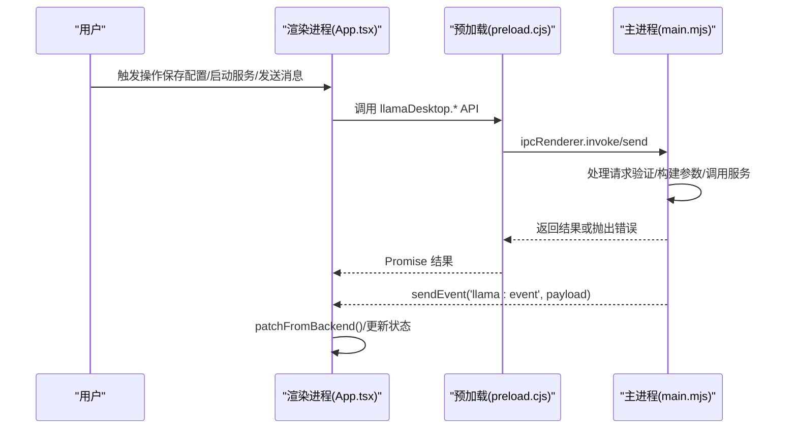
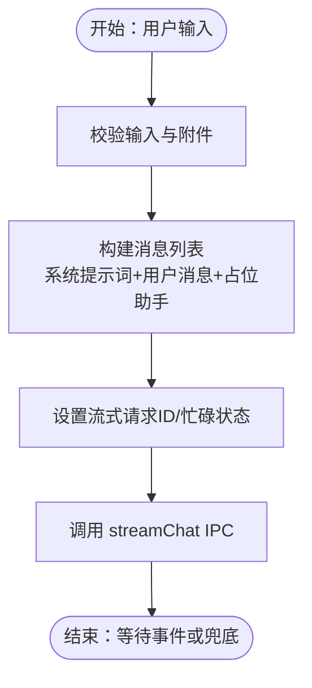
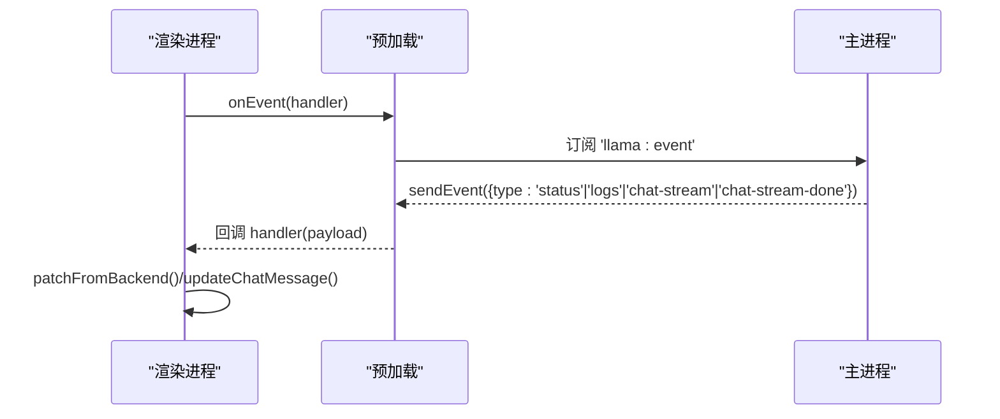
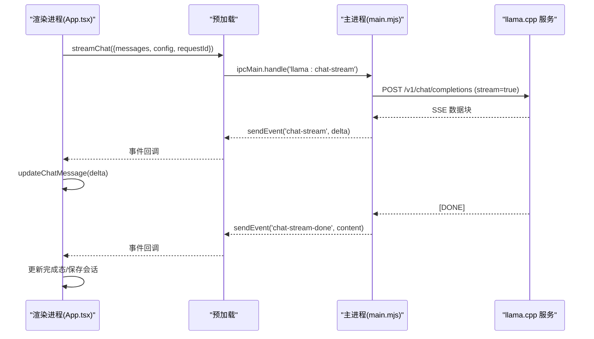
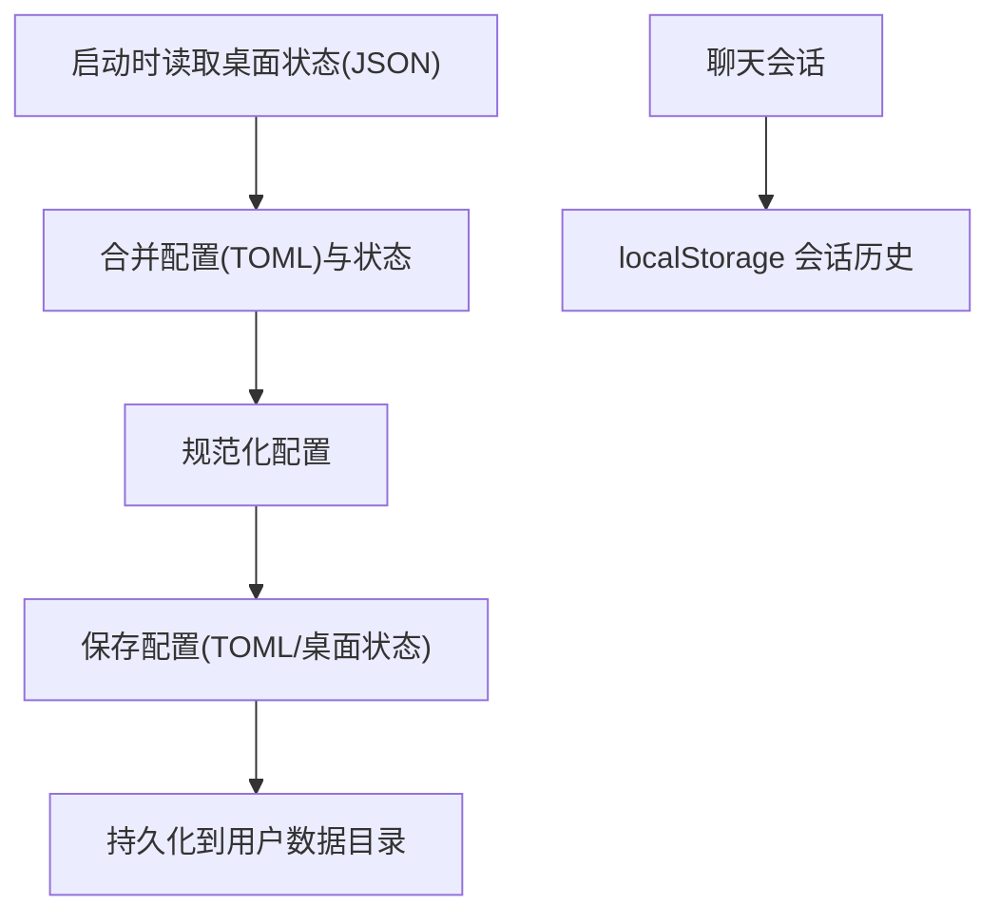
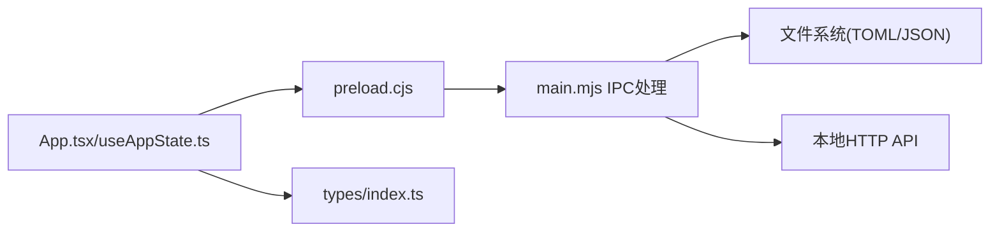

# 数据流架构

<cite>
**本文档引用的文件**
- [desktop/main.mjs](file://desktop/main.mjs)
- [desktop/preload.cjs](file://desktop/preload.cjs)
- [renderer/src/App.tsx](file://renderer/src/App.tsx)
- [renderer/src/hooks/useAppState.ts](file://renderer/src/hooks/useAppState.ts)
- [renderer/src/types/index.ts](file://renderer/src/types/index.ts)
- [config.toml](file://config.toml)
- [package.json](file://package.json)
</cite>

## 目录
1. [简介](#简介)
2. [项目结构](#项目结构)
3. [核心组件](#核心组件)
4. [架构总览](#架构总览)
5. [详细组件分析](#详细组件分析)
6. [依赖关系分析](#依赖关系分析)
7. [性能考量](#性能考量)
8. [故障排查指南](#故障排查指南)
9. [结论](#结论)
10. [附录](#附录)

## 简介
本文件系统性梳理 illama-desktop 的数据流架构，覆盖从用户交互到服务器响应的完整数据路径，包括用户输入捕获、状态更新、IPC 通信、服务器处理与响应返回。重点阐述单向数据流原则、状态提升策略、局部状态与全局状态的边界划分，以及配置、会话历史与桌面状态的持久化机制。同时给出数据验证与清洗流程、异常处理与一致性保障，并提供关键场景的数据流图与时序图。

## 项目结构
illama-desktop 采用 Electron 架构，分为主进程（desktop/main.mjs）与渲染进程（renderer/...）。主进程负责窗口管理、llama.cpp 服务生命周期、IPC 通信与系统托盘；渲染进程负责 UI 交互、状态管理与与主进程的双向通信。

```mermaid
graph TB
subgraph "渲染进程"
R_App["App.tsx<br/>应用入口与业务编排"]
R_State["useAppState.ts<br/>应用状态钩子"]
R_Types["types/index.ts<br/>类型定义"]
end
subgraph "主进程"
M_Main["main.mjs<br/>主进程入口与IPC处理"]
M_Preload["preload.cjs<br/>上下文桥接"]
end
subgraph "外部系统"
S_Server["llama.cpp 服务<br/>本地HTTP API"]
FS["文件系统<br/>TOML/JSON/本地存储"]
end
R_App --> R_State
R_App --> R_Types
R_App <- --> M_Preload
M_Preload <- --> M_Main
M_Main --> S_Server
M_Main --> FS
R_State --> FS
```

图表来源
- [desktop/main.mjs:1405-1550](file://desktop/main.mjs#L1405-L1550)
- [desktop/preload.cjs:1-32](file://desktop/preload.cjs#L1-L32)
- [renderer/src/App.tsx:1-120](file://renderer/src/App.tsx#L1-L120)
- [renderer/src/hooks/useAppState.ts:1-120](file://renderer/src/hooks/useAppState.ts#L1-L120)
- [renderer/src/types/index.ts:1-60](file://renderer/src/types/index.ts#L1-L60)

章节来源
- [package.json:1-51](file://package.json#L1-L51)
- [desktop/main.mjs:1405-1550](file://desktop/main.mjs#L1405-L1550)
- [desktop/preload.cjs:1-32](file://desktop/preload.cjs#L1-L32)
- [renderer/src/App.tsx:1-120](file://renderer/src/App.tsx#L1-L120)
- [renderer/src/hooks/useAppState.ts:1-120](file://renderer/src/hooks/useAppState.ts#L1-L120)
- [renderer/src/types/index.ts:1-60](file://renderer/src/types/index.ts#L1-L60)

## 核心组件
- 渲染进程应用层
  - App.tsx：集中编排聊天、设置、会话与事件监听，负责触发 IPC 并接收主进程事件。
  - useAppState.ts：集中管理应用状态（配置、会话、日志、状态等），提供状态提升与持久化能力。
  - types/index.ts：定义渲染进程与主进程通信的 API 类型、配置、状态、消息与会话等类型。
- 主进程服务层
  - main.mjs：注册 IPC 处理器、管理 llama.cpp 服务生命周期、构建命令行参数、解析 TOML、处理流式响应、维护运行时状态与日志。
  - preload.cjs：通过 contextBridge 暴露安全的 llamaDesktop API，供渲染进程调用。
- 配置与持久化
  - config.toml：默认配置文件，主进程解析并规范化。
  - 本地存储：会话历史持久化于 localStorage，桌面状态持久化于用户数据目录的 JSON 文件。

章节来源
- [renderer/src/App.tsx:1-120](file://renderer/src/App.tsx#L1-L120)
- [renderer/src/hooks/useAppState.ts:1-120](file://renderer/src/hooks/useAppState.ts#L1-L120)
- [renderer/src/types/index.ts:1-120](file://renderer/src/types/index.ts#L1-L120)
- [desktop/main.mjs:328-710](file://desktop/main.mjs#L328-L710)
- [desktop/preload.cjs:1-32](file://desktop/preload.cjs#L1-L32)
- [config.toml:1-27](file://config.toml#L1-L27)

## 架构总览
illama-desktop 的数据流遵循单向数据流原则：渲染进程通过 IPC 向主进程发起请求，主进程执行业务逻辑（启动/停止服务、构建参数、调用本地 API、解析响应），并将状态变更以事件形式回推渲染进程。渲染进程仅通过受控的 API 与主进程交互，确保状态一致性与安全性。



图表来源
- [desktop/preload.cjs:3-31](file://desktop/preload.cjs#L3-L31)
- [desktop/main.mjs:1410-1550](file://desktop/main.mjs#L1410-L1550)
- [renderer/src/App.tsx:656-728](file://renderer/src/App.tsx#L656-L728)

章节来源
- [desktop/preload.cjs:1-32](file://desktop/preload.cjs#L1-L32)
- [desktop/main.mjs:1405-1550](file://desktop/main.mjs#L1405-L1550)
- [renderer/src/App.tsx:656-728](file://renderer/src/App.tsx#L656-L728)

## 详细组件分析

### 用户输入捕获与状态更新
- 输入捕获
  - 聊天输入：App.tsx 的 sendChat 收集用户输入与附件，生成系统提示词与用户消息，创建占位助手消息并设置流式请求 ID。
  - 附件处理：支持图片（转 Base64）、文本（提取内容）、PDF/Word/Excel 等，超过阈值进行截断与警告。
- 状态更新
  - useAppState.ts 提供 addChatMessage/updateChatMessage/setChatMessages 等方法，确保消息列表的不可变更新。
  - 会话持久化：saveCurrentSession 将当前会话标题、消息与更新时间写入 localStorage，限制保留数量。



图表来源
- [renderer/src/App.tsx:209-320](file://renderer/src/App.tsx#L209-L320)
- [renderer/src/hooks/useAppState.ts:39-135](file://renderer/src/hooks/useAppState.ts#L39-L135)

章节来源
- [renderer/src/App.tsx:209-320](file://renderer/src/App.tsx#L209-L320)
- [renderer/src/hooks/useAppState.ts:39-135](file://renderer/src/hooks/useAppState.ts#L39-L135)

### IPC 通信与事件推送
- 预加载桥接
  - preload.cjs 暴露 llamaDesktop API，统一通过 ipcRenderer.invoke/send 与主进程通信，onEvent 订阅主进程事件。
- 主进程 IPC 处理
  - registerIpc 注册所有处理器：getState/saveConfig/startServer/stopServer/testHealth/chatCompletion/streamChat/abortChat 等。
  - sendEvent 将状态、日志、流式事件推送给渲染进程；setStatus 更新运行时状态并同步托盘菜单。
- 事件类型
  - status/logs：主进程状态与日志变更。
  - chat-stream/chat-stream-done：流式响应增量与完成事件。



图表来源
- [desktop/preload.cjs:26-31](file://desktop/preload.cjs#L26-L31)
- [desktop/main.mjs:209-224](file://desktop/main.mjs#L209-L224)
- [renderer/src/App.tsx:656-728](file://renderer/src/App.tsx#L656-L728)

章节来源
- [desktop/preload.cjs:1-32](file://desktop/preload.cjs#L1-L32)
- [desktop/main.mjs:1405-1550](file://desktop/main.mjs#L1405-L1550)
- [renderer/src/App.tsx:656-728](file://renderer/src/App.tsx#L656-L728)

### 服务器处理与响应返回
- 非流式聊天
  - 主进程将消息与附件转换为 llama.cpp API 的消息格式，调用 /v1/chat/completions，解析响应并返回内容。
- 流式聊天
  - 主进程以 stream:true 调用 /v1/chat/completions，逐行解析 SSE 数据，提取增量内容并通过 sendEvent 推送 chat-stream 事件；收到 [DONE] 后推送 chat-stream-done。
  - 渲染进程监听事件，即时更新助手消息内容，并在完成后计算 token、延迟与速度，触发定期保存。



图表来源
- [desktop/main.mjs:1713-1848](file://desktop/main.mjs#L1713-L1848)
- [renderer/src/App.tsx:669-721](file://renderer/src/App.tsx#L669-L721)

章节来源
- [desktop/main.mjs:1612-1848](file://desktop/main.mjs#L1612-L1848)
- [renderer/src/App.tsx:669-721](file://renderer/src/App.tsx#L669-L721)

### 数据持久化策略
- 配置持久化
  - TOML 文件：当 launch_mode=launcher 时，主进程将规范化配置写入 config.toml；同时写入桌面状态 JSON。
  - 桌面状态 JSON：存储在用户数据目录，包含 config_path、launch_mode、launcher_path 与完整配置。
- 会话历史持久化
  - localStorage：保存最近 80 条会话，包含标题、消息与更新时间；支持重命名、删除与导出。
- 桌面状态文件
  - 用于恢复应用初始状态（配置、验证、状态、日志、启动详情）。



图表来源
- [desktop/main.mjs:676-710](file://desktop/main.mjs#L676-L710)
- [renderer/src/hooks/useAppState.ts:42-55](file://renderer/src/hooks/useAppState.ts#L42-L55)
- [config.toml:1-27](file://config.toml#L1-L27)

章节来源
- [desktop/main.mjs:634-710](file://desktop/main.mjs#L634-L710)
- [renderer/src/hooks/useAppState.ts:42-55](file://renderer/src/hooks/useAppState.ts#L42-L55)
- [config.toml:1-27](file://config.toml#L1-L27)

### 数据验证与清洗流程
- 配置验证
  - 文件存在性检查：launch_mode、launcher_path、llama_server_path、model、mmproj。
  - 参数规范化：数值字段、布尔开关、可选参数、命令行拼装。
- 消息与附件清洗
  - 文本附件截断：根据上下文窗口大小计算最大长度，超过阈值截断并提示。
  - 多模态消息：图片附件转换为 Base64，PDF/Word/Excel 提取文本并限制长度。
  - 日志清洗：移除 ANSI 转义、压缩重复日志、截断过长行。
- 异常处理与一致性
  - 渲染进程：错误时移除空助手消息、添加系统错误消息、触发保存。
  - 主进程：流式解析异常忽略，进程退出与错误状态同步至 UI。

章节来源
- [desktop/main.mjs:977-985](file://desktop/main.mjs#L977-L985)
- [desktop/main.mjs:1215-1223](file://desktop/main.mjs#L1215-L1223)
- [desktop/main.mjs:226-326](file://desktop/main.mjs#L226-L326)
- [renderer/src/App.tsx:302-316](file://renderer/src/App.tsx#L302-L316)

## 依赖关系分析
- 渲染进程依赖
  - llamaDesktop API：通过 preload.cjs 暴露，封装所有 IPC 调用。
  - useAppState：集中状态管理，依赖 localStorage 进行会话持久化。
  - 类型系统：types/index.ts 为 IPC 与状态提供强类型约束。
- 主进程依赖
  - child_process/spawn：启动/终止 llama.cpp 服务。
  - fs/fs/promises：读写 TOML、JSON、桌面状态与附件。
  - fetch/AbortSignal：调用本地 API 与超时控制。
- 配置与环境
  - config.toml：默认配置来源。
  - 用户数据目录：桌面状态 JSON 存放位置。



图表来源
- [desktop/preload.cjs:1-32](file://desktop/preload.cjs#L1-L32)
- [desktop/main.mjs:1405-1550](file://desktop/main.mjs#L1405-L1550)
- [renderer/src/App.tsx:1-120](file://renderer/src/App.tsx#L1-L120)
- [renderer/src/hooks/useAppState.ts:1-120](file://renderer/src/hooks/useAppState.ts#L1-L120)
- [renderer/src/types/index.ts:1-60](file://renderer/src/types/index.ts#L1-L60)

章节来源
- [desktop/preload.cjs:1-32](file://desktop/preload.cjs#L1-L32)
- [desktop/main.mjs:1405-1550](file://desktop/main.mjs#L1405-L1550)
- [renderer/src/App.tsx:1-120](file://renderer/src/App.tsx#L1-L120)
- [renderer/src/hooks/useAppState.ts:1-120](file://renderer/src/hooks/useAppState.ts#L1-L120)
- [renderer/src/types/index.ts:1-60](file://renderer/src/types/index.ts#L1-L60)

## 性能考量
- 流式传输优化
  - SSE 增量推送，渲染进程即时更新，降低感知延迟。
  - 事件节流：流式过程中定期保存会话，避免频繁写入。
- 日志与内存
  - 日志保留上限与压缩策略，避免内存膨胀。
  - 会话历史限制数量，减少 DOM 与存储压力。
- 启动与参数
  - 命令行参数构建与校验，避免无效启动导致资源浪费。
  - 超时控制与中断机制，防止长时间阻塞。

## 故障排查指南
- 服务启动失败
  - 检查文件存在性与权限（launcher/llama_server/model/mmproj）。
  - 查看日志事件中的错误信息，定位具体问题。
- 流式响应异常
  - 确认本地 API 可达与超时设置合理。
  - 检查附件过大导致截断或解析失败。
- 状态不一致
  - 渲染进程通过 patchFromBackend 同步后端状态，若 UI 未更新，检查事件订阅与 requestId 匹配。
- 配置未生效
  - 确认 TOML 与桌面状态均正确写入，必要时手动检查用户数据目录中的 JSON 文件。

章节来源
- [desktop/main.mjs:1434-1524](file://desktop/main.mjs#L1434-L1524)
- [desktop/main.mjs:1850-1859](file://desktop/main.mjs#L1850-L1859)
- [renderer/src/App.tsx:656-728](file://renderer/src/App.tsx#L656-L728)

## 结论
illama-desktop 的数据流架构以 Electron 为基础，通过严格的单向数据流与状态提升策略，结合受控的 IPC 通信与事件推送，实现了从用户输入到服务器响应的高效闭环。配置与会话的双层持久化机制确保了可用性与一致性，而完善的验证、清洗与异常处理保障了系统的鲁棒性。该架构既满足易用性需求，又为扩展（如技能系统）提供了清晰的边界与接口。

## 附录
- 关键流程参考
  - 配置保存：App.tsx -> llamaDesktop.saveConfig -> main.mjs.saveConfig -> 写入 TOML/桌面状态 -> 事件回推 -> patchFromBackend
  - 启动服务：App.tsx -> llamaDesktop.startServer -> main.mjs.startServer -> 启动进程 -> stdout/stderr -> 日志事件 -> 状态更新
  - 聊天消息：App.tsx -> llamaDesktop.streamChat -> main.mjs.chat-stream -> SSE -> 事件推送 -> 渲染进程更新

章节来源
- [renderer/src/App.tsx:69-112](file://renderer/src/App.tsx#L69-L112)
- [desktop/main.mjs:1419-1524](file://desktop/main.mjs#L1419-L1524)
- [desktop/main.mjs:1713-1848](file://desktop/main.mjs#L1713-L1848)
- [renderer/src/App.tsx:656-728](file://renderer/src/App.tsx#L656-L728)