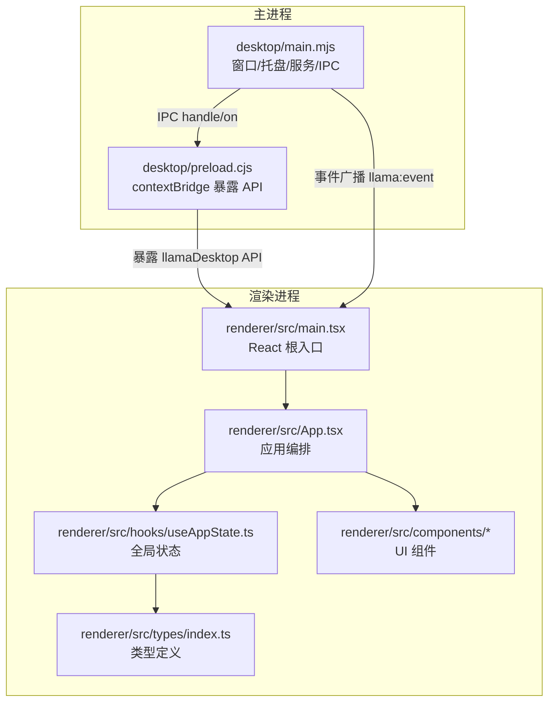
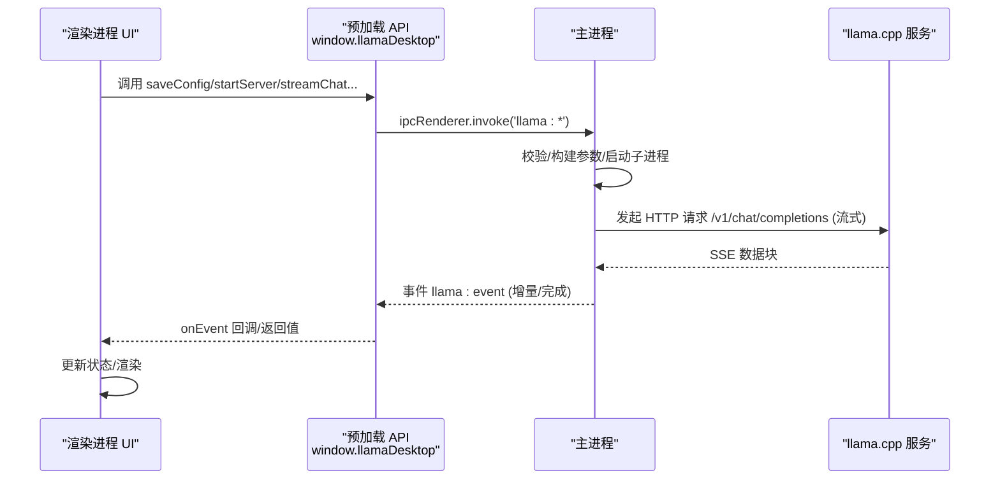
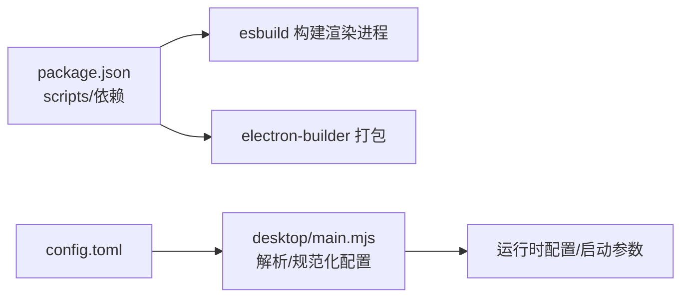
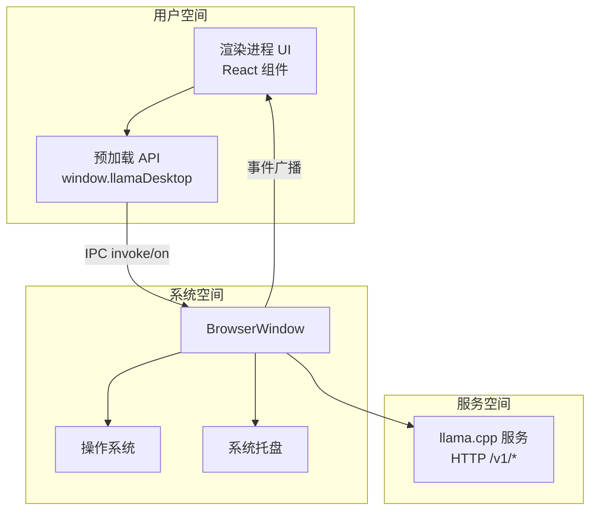

# 架构设计

<cite>
**本文引用的文件**
- [desktop/main.mjs](file://desktop/main.mjs)
- [desktop/preload.cjs](file://desktop/preload.cjs)
- [renderer/src/main.tsx](file://renderer/src/main.tsx)
- [renderer/src/App.tsx](file://renderer/src/App.tsx)
- [renderer/src/hooks/useAppState.ts](file://renderer/src/hooks/useAppState.ts)
- [renderer/src/types/index.ts](file://renderer/src/types/index.ts)
- [renderer/src/utils/index.ts](file://renderer/src/utils/index.ts)
- [renderer/src/components/ChatScreen.tsx](file://renderer/src/components/ChatScreen.tsx)
- [renderer/src/components/Toast.tsx](file://renderer/src/components/Toast.tsx)
- [package.json](file://package.json)
- [config.toml](file://config.toml)
</cite>

## 目录
1. [简介](#简介)
2. [项目结构](#项目结构)
3. [核心组件](#核心组件)
4. [架构总览](#架构总览)
5. [详细组件分析](#详细组件分析)
6. [依赖分析](#依赖分析)
7. [性能考量](#性能考量)
8. [故障排查指南](#故障排查指南)
9. [结论](#结论)
10. [附录](#附录)

## 简介
本文件面向 illama-desktop 的架构设计，围绕 Electron 双进程架构与 React 组件化体系，系统阐述主进程与渲染进程的职责边界、IPC 通信机制、事件系统与 API 规范、数据流路径、状态管理模式以及安全与性能权衡。目标是帮助开发者快速理解系统设计，并为后续扩展与维护提供清晰的参考。

## 项目结构
illama-desktop 采用标准 Electron 结构：
- 主进程入口负责窗口、系统托盘、llama.cpp 服务生命周期、IPC 注册与事件广播。
- 预加载脚本通过 contextBridge 暴露受控 API 至渲染进程。
- 渲染进程以 React 为核心，使用 Ant Design X 与 css-in-js，组件化组织聊天、设置、终端、侧边栏等功能模块。
- 类型系统统一定义 IPC API、配置、状态与消息结构，确保前后端契约一致。

图表来源
- [desktop/main.mjs](file://desktop/main.mjs)
- [desktop/preload.cjs](file://desktop/preload.cjs)
- [renderer/src/main.tsx](file://renderer/src/main.tsx)
- [renderer/src/App.tsx](file://renderer/src/App.tsx)
- [renderer/src/hooks/useAppState.ts](file://renderer/src/hooks/useAppState.ts)
- [renderer/src/types/index.ts](file://renderer/src/types/index.ts)

章节来源
- [package.json](file://package.json)
- [config.toml](file://config.toml)

## 核心组件
- 主进程（desktop/main.mjs）
  - 窗口与托盘管理、服务启动/停止、日志聚合、状态广播、IPC 处理器注册。
  - 提供 llama.cpp 服务的启动参数构建、命令行拼装、超时控制、流式 SSE 处理。
- 预加载脚本（desktop/preload.cjs）
  - 通过 contextBridge 将受限 API 暴露至渲染进程，统一事件订阅与调用约定。
- 渲染进程（renderer/src）
  - React 根入口与应用编排，组件化 UI，状态通过自研 Hook 管理，类型系统约束 IPC 与内部状态。
- 类型系统（renderer/src/types/index.ts）
  - 统一定义 LlamaDesktopAPI、Config、Status、Validation、LogEntry、Skill、Attachment、ChatMessage、Session、AppState 等接口，保障前后端契约一致性。

章节来源
- [desktop/main.mjs](file://desktop/main.mjs)
- [desktop/preload.cjs](file://desktop/preload.cjs)
- [renderer/src/main.tsx](file://renderer/src/main.tsx)
- [renderer/src/App.tsx](file://renderer/src/App.tsx)
- [renderer/src/hooks/useAppState.ts](file://renderer/src/hooks/useAppState.ts)
- [renderer/src/types/index.ts](file://renderer/src/types/index.ts)

## 架构总览
illama-desktop 采用 Electron 双进程架构：
- 主进程承担系统集成与安全边界，负责与操作系统、llama.cpp 服务交互，严格控制 IPC。
- 渲染进程专注 UI 与用户体验，通过受控 API 与主进程通信，实现配置、服务启停、聊天、日志、技能管理等能力。

图表来源
- [desktop/preload.cjs](file://desktop/preload.cjs)
- [desktop/main.mjs](file://desktop/main.mjs)
- [renderer/src/App.tsx](file://renderer/src/App.tsx)

## 详细组件分析

### 主进程：服务生命周期与 IPC
- 窗口与托盘
  - 创建 BrowserWindow，启用 contextIsolation，隐藏标题栏，最小化到托盘，托盘菜单动态更新服务状态。
- 服务启动/停止
  - 支持 direct 与 launcher 两种启动模式，构建启动详情 preview，记录启动日志，监控 stdout/stderr，进程退出后更新状态。
- IPC 注册
  - 统一注册 handle/on 处理器，覆盖状态查询、配置保存、服务启停、健康检查、模型信息、聊天补全（流式/非流式）、附件选择、窗口控制、技能管理等。
- 事件广播
  - 通过 webContents.send 广播 llama:event，渲染进程 onEvent 订阅，实现状态、日志、流式增量与完成事件的实时同步。

章节来源
- [desktop/main.mjs](file://desktop/main.mjs)

### 预加载脚本：安全桥接与 API 暴露
- 通过 contextBridge.exposeInMainWorld 暴露有限 API，包括：
  - 状态与配置：getState、saveConfig、startServer、stopServer、testHealth、getModelInfo
  - 聊天：streamChat、chatCompletion、abortChat
  - 附件与文件：pickFile、pickAttachments、saveFile、revealPath
  - 技能：listSkills、createSkill、generateSkillContent、readSkill、deleteSkill
  - 窗口控制：closeWindow、minimizeWindow、maximizeWindow、isWindowMaximized
  - 事件：onEvent
- 事件订阅与解绑：onEvent 返回解绑函数，避免内存泄漏。

章节来源
- [desktop/preload.cjs](file://desktop/preload.cjs)

### 渲染进程：React 组件化与状态管理
- 根入口与主题
  - main.tsx 使用 @ant-design/cssinjs 注入样式缓存，StrictMode 包裹，确保样式隔离与性能优化。
- 应用编排
  - App.tsx 聚合各功能模块（聊天、侧边栏、设置、终端、模型信息、系统提示词、Toast），通过 useAppState 管理全局状态，统一处理 IPC 调用与事件回调。
- 状态管理 Hook
  - useAppState.ts 提供会话生命周期管理（创建/打开/关闭/重命名/删除）、消息增删改、附件管理、聊天忙/流式请求 ID、视图切换、设置面板开关、日志与状态同步等。
- 类型系统
  - types/index.ts 定义 LlamaDesktopAPI、Config、Status、Validation、LogEntry、Skill、Attachment、ChatMessage、Session、AppState 等，确保前后端契约一致。
- 工具函数
  - utils/index.ts 提供 HTML 转义、字节格式化、token 估算、错误友好提示、状态标签映射、日志压缩与终端过滤等。

章节来源
- [renderer/src/main.tsx](file://renderer/src/main.tsx)
- [renderer/src/App.tsx](file://renderer/src/App.tsx)
- [renderer/src/hooks/useAppState.ts](file://renderer/src/hooks/useAppState.ts)
- [renderer/src/types/index.ts](file://renderer/src/types/index.ts)
- [renderer/src/utils/index.ts](file://renderer/src/utils/index.ts)

### 聊天组件与流式渲染
- ChatScreen.tsx
  - 负责消息列表渲染与输入区，使用 memo 优化非流式消息重渲染，避免流式输出时全量重绘。
  - 自动滚动到底部、拖拽滚动条暂停自动滚动、回到最新按钮等交互细节。
- 流式事件处理
  - 渲染进程 onEvent 监听 chat-stream/done 事件，即时更新消息内容与统计指标（token、耗时、速度），并在完成后持久化会话。

章节来源
- [renderer/src/components/ChatScreen.tsx](file://renderer/src/components/ChatScreen.tsx)
- [renderer/src/App.tsx](file://renderer/src/App.tsx)

### 技能管理与系统提示词
- 技能管理
  - 主进程扫描 skills 目录，解析 SKILL.md 前言块，提供 list/create/read/delete/generate 等 API。
  - 渲染进程设置面板中展示技能卡片，支持新建、编辑、删除与生成。
- 系统提示词
  - 支持会话级系统提示词与技能提示词优先级，发送消息前自动注入。

章节来源
- [desktop/main.mjs](file://desktop/main.mjs)
- [renderer/src/App.tsx](file://renderer/src/App.tsx)

### 终端与日志
- 终端面板
  - 展示服务日志，支持过滤与截断，区分来源（stdout/stderr/desktop）。
- 日志压缩与可见性
  - 主进程过滤例行日志、流式片段与冗余消息；渲染进程进一步压缩显示，避免干扰。

章节来源
- [renderer/src/utils/index.ts](file://renderer/src/utils/index.ts)
- [desktop/main.mjs](file://desktop/main.mjs)

## 依赖分析
- 运行时依赖
  - Electron、React 生态、Ant Design X、pdf-parse、xlsx、word-extractor 等。
- 构建与打包
  - 使用 esbuild 构建渲染进程，electron-builder 打包发布。
- 配置文件
  - config.toml 作为默认配置源，主进程解析并规范化为运行配置。

图表来源
- [package.json](file://package.json)
- [config.toml](file://config.toml)
- [desktop/main.mjs](file://desktop/main.mjs)

章节来源
- [package.json](file://package.json)
- [config.toml](file://config.toml)

## 性能考量
- 渲染性能
  - ChatScreen 使用 memo 与自定义浅比较，避免流式输出时全量重渲染；自动滚动采用 requestAnimationFrame 与被动事件提升流畅度。
  - CSS-in-JS 缓存与容器注入，减少样式抖动。
- IPC 与网络
  - 流式聊天采用 SSE，主进程逐块解析并增量广播，渲染进程即时更新，降低延迟。
  - 请求超时统一由主进程根据配置构造，避免长时间阻塞。
- 资源占用
  - 日志压缩与可见性过滤，减少 DOM 与内存压力；会话持久化限制数量，避免 localStorage 过载。
- 安全与隔离
  - contextIsolation 启用，Node 集成禁用，仅通过 contextBridge 暴露必要 API，降低攻击面。

## 故障排查指南
- 常见错误与提示
  - 友好错误提示：超时、上下文超限、JSON 校验失败、系统消息位置错误等，均通过 utils/friendlyErrorMessage 统一格式化。
  - 日志过滤：主/渲染两端均对冗余日志进行压缩与过滤，便于定位问题。
- IPC 与事件
  - onEvent 订阅需在组件卸载时解绑；若出现“事件未触发”，检查订阅返回的解绑函数是否被调用。
- 服务状态
  - 托盘菜单显示当前状态与 URL；可通过 testHealth 快速验证服务可用性。
- 会话与消息
  - 若消息为空或异常，检查系统提示词注入逻辑与附件内容长度限制；必要时降低 ctx_size/n_predict。

章节来源
- [renderer/src/utils/index.ts](file://renderer/src/utils/index.ts)
- [renderer/src/App.tsx](file://renderer/src/App.tsx)
- [desktop/main.mjs](file://desktop/main.mjs)

## 结论
illama-desktop 以 Electron 为基础，结合 React 组件化与严格的类型系统，实现了清晰的主/渲染进程边界与安全的 IPC 通信。通过流式事件驱动的数据流、完善的日志与错误处理、以及可扩展的技能与系统提示词机制，系统在性能、安全性与可维护性之间取得了良好平衡。建议后续持续优化：
- 增强 IPC 错误分类与重试策略；
- 引入更细粒度的组件懒加载与状态分片；
- 完善单元测试与 E2E 测试覆盖。

## 附录
- 系统边界图（概念示意）

[本图为概念示意，不对应具体源码文件，故无图表来源]