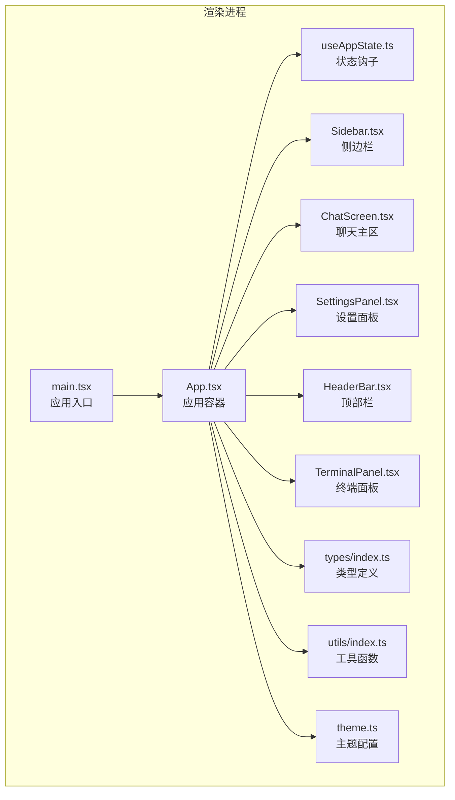
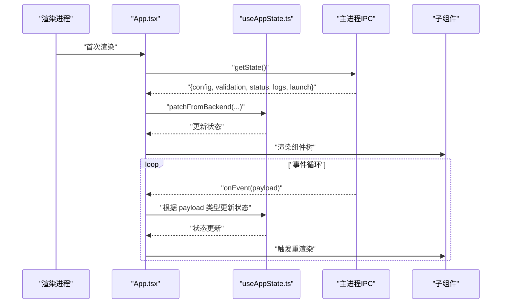
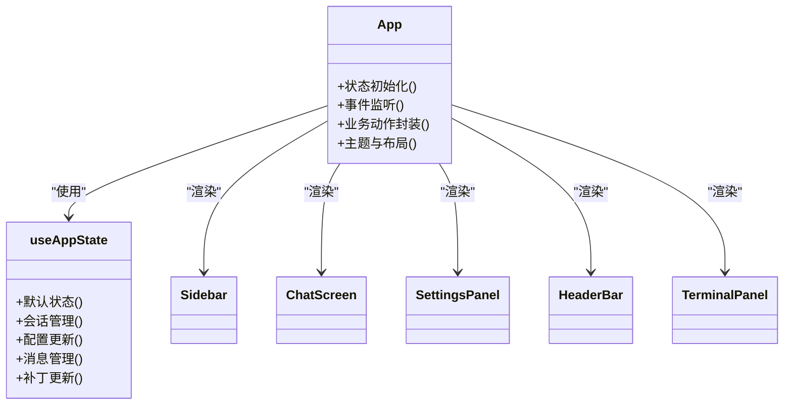
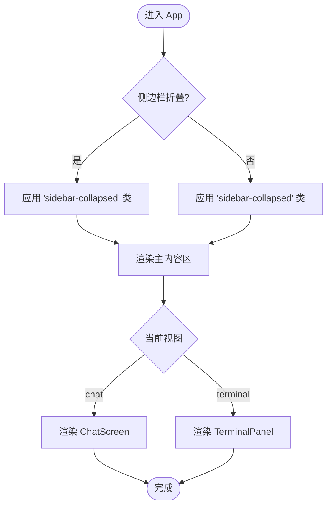
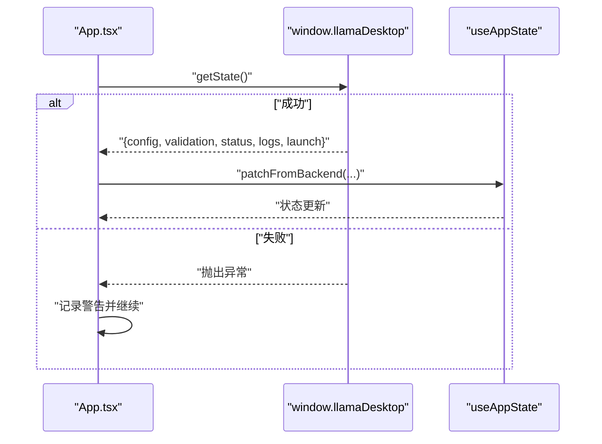
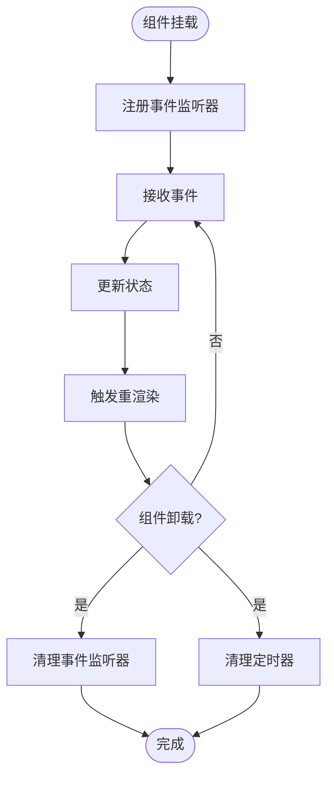
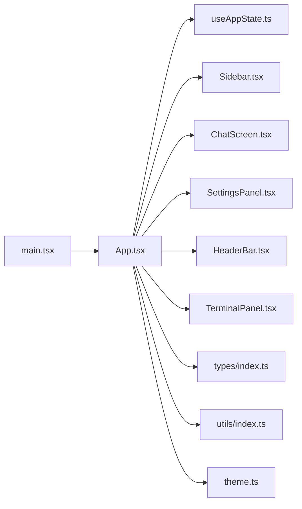

# 应用容器设计

<cite>
**本文档引用的文件**
- [App.tsx](file://renderer/src/App.tsx)
- [main.tsx](file://renderer/src/main.tsx)
- [useAppState.ts](file://renderer/src/hooks/useAppState.ts)
- [Sidebar.tsx](file://renderer/src/components/Sidebar.tsx)
- [SettingsPanel.tsx](file://renderer/src/components/SettingsPanel.tsx)
- [ChatScreen.tsx](file://renderer/src/components/ChatScreen.tsx)
- [HeaderBar.tsx](file://renderer/src/components/HeaderBar.tsx)
- [TerminalPanel.tsx](file://renderer/src/components/TerminalPanel.tsx)
- [index.ts](file://renderer/src/types/index.ts)
- [theme.ts](file://renderer/src/theme.ts)
- [utils/index.ts](file://renderer/src/utils/index.ts)
- [package.json](file://package.json)
</cite>

## 目录
1. [简介](#简介)
2. [项目结构](#项目结构)
3. [核心组件](#核心组件)
4. [架构总览](#架构总览)
5. [详细组件分析](#详细组件分析)
6. [依赖关系分析](#依赖关系分析)
7. [性能考量](#性能考量)
8. [故障排除指南](#故障排除指南)
9. [结论](#结论)

## 简介
本文件聚焦 illama-desktop 应用的“应用容器”设计，重点分析 App.tsx 作为主应用容器的设计模式与实现细节。文档涵盖组件树层次结构、职责分离原则、组件组合策略、整体布局架构（侧边栏、主内容区、设置面板）、响应式适配、状态初始化流程（从后端获取初始状态、错误处理与降级策略）、生命周期管理（事件监听器注册与清理、内存泄漏防护、性能优化），以及组件间通信与状态同步机制的具体示例路径。

## 项目结构
illama-desktop 采用 Electron + React 架构，渲染进程的入口为 main.tsx，根组件为 App.tsx。App.tsx 通过自定义 Hook useAppState 管理全局状态，并将状态与动作传递给子组件，形成清晰的单向数据流与职责分离。

图表来源
- [main.tsx:1-34](file://renderer/src/main.tsx#L1-L34)
- [App.tsx:1-810](file://renderer/src/App.tsx#L1-L810)
- [useAppState.ts:1-555](file://renderer/src/hooks/useAppState.ts#L1-L555)
- [Sidebar.tsx:1-228](file://renderer/src/components/Sidebar.tsx#L1-L228)
- [ChatScreen.tsx:1-376](file://renderer/src/components/ChatScreen.tsx#L1-L376)
- [SettingsPanel.tsx:1-778](file://renderer/src/components/SettingsPanel.tsx#L1-L778)
- [HeaderBar.tsx:1-77](file://renderer/src/components/HeaderBar.tsx#L1-L77)
- [TerminalPanel.tsx:1-53](file://renderer/src/components/TerminalPanel.tsx#L1-L53)
- [index.ts:1-222](file://renderer/src/types/index.ts#L1-L222)
- [utils/index.ts:1-165](file://renderer/src/utils/index.ts#L1-L165)
- [theme.ts:1-24](file://renderer/src/theme.ts#L1-L24)

章节来源
- [main.tsx:1-34](file://renderer/src/main.tsx#L1-L34)
- [package.json:1-51](file://package.json#L1-L51)

## 核心组件
- App.tsx：应用容器，负责：
  - 状态初始化与后端同步（getState）
  - 生命周期事件监听（onEvent）
  - 业务动作封装（保存配置、启动/停止服务、发送消息、中止、重试、变体切换、附件处理、系统提示词等）
  - 主题与布局控制（Ant Design X Provider、侧边栏折叠、视图切换）
- useAppState.ts：应用状态钩子，提供：
  - 默认状态与持久化（localStorage）
  - 会话管理（新建、打开、关闭、重命名、删除、保存）
  - 配置更新、聊天消息增删改、附件管理、视图与忙碌状态切换
  - 从后端补丁更新状态（patchFromBackend）
- Sidebar.tsx：侧边栏，负责历史会话列表、搜索、状态卡片、动作按钮（新会话、搜索、终端、设置、启动/停止）
- ChatScreen.tsx：主聊天区，负责消息渲染、滚动行为、变体切换、系统提示词入口
- SettingsPanel.tsx：设置面板，负责配置项展示与编辑、技能管理、日志查看、启动命令预览与复制
- HeaderBar.tsx：顶部栏，负责窗口控制按钮与侧边栏切换
- TerminalPanel.tsx：终端面板，负责 llama.cpp 服务日志展示与返回聊天

章节来源
- [App.tsx:21-810](file://renderer/src/App.tsx#L21-L810)
- [useAppState.ts:69-555](file://renderer/src/hooks/useAppState.ts#L69-L555)
- [Sidebar.tsx:48-228](file://renderer/src/components/Sidebar.tsx#L48-L228)
- [ChatScreen.tsx:100-376](file://renderer/src/components/ChatScreen.tsx#L100-L376)
- [SettingsPanel.tsx:299-778](file://renderer/src/components/SettingsPanel.tsx#L299-L778)
- [HeaderBar.tsx:8-77](file://renderer/src/components/HeaderBar.tsx#L8-L77)
- [TerminalPanel.tsx:10-53](file://renderer/src/components/TerminalPanel.tsx#L10-L53)

## 架构总览
App.tsx 作为应用容器，承担以下职责：
- 状态初始化：首次渲染后调用 window.llamaDesktop.getState 获取后端状态并 patch 到前端
- 事件监听：注册 window.llamaDesktop.onEvent，处理状态变更、日志、流式消息事件
- 动作封装：将业务动作（保存配置、启动/停止服务、发送消息、中止、重试、附件、系统提示词、变体切换、消息操作等）封装为回调，传递给子组件
- 布局与主题：通过 Ant Design X Provider 提供主题与国际化，控制侧边栏折叠与视图切换

图表来源
- [App.tsx:623-728](file://renderer/src/App.tsx#L623-L728)
- [useAppState.ts:95-102](file://renderer/src/hooks/useAppState.ts#L95-L102)

章节来源
- [App.tsx:623-728](file://renderer/src/App.tsx#L623-L728)
- [useAppState.ts:95-102](file://renderer/src/hooks/useAppState.ts#L95-L102)

## 详细组件分析

### App.tsx 应用容器设计
- 设计模式
  - 单一职责：集中处理状态初始化、事件监听、业务动作封装
  - 组合模式：将多个子组件组合为完整的应用界面
  - 命令模式：将复杂业务封装为回调，便于子组件调用
- 组件树层次
  - 根节点：App.tsx
  - 一级子节点：Sidebar、HeaderBar、ChatScreen/TerminalPanel、SettingsPanel、ModelInfoModal、SystemPromptModal、Toast
  - 二级子节点：ChatScreen 内部的消息气泡、输入框、提示词面板等
- 职责分离
  - 状态管理：useAppState.ts
  - 视图渲染：各子组件
  - 事件处理：App.tsx 注册与分发
  - 主题与国际化：Ant Design X Provider
- 组件组合策略
  - 通过 props 下发状态与回调，实现父子通信
  - 通过 ref 与 useMemo 缓存关键状态，避免闭包陷阱与过度重渲染
  - 通过 XProvider 提供统一主题与语言环境

图表来源
- [App.tsx:21-810](file://renderer/src/App.tsx#L21-L810)
- [useAppState.ts:69-555](file://renderer/src/hooks/useAppState.ts#L69-L555)
- [Sidebar.tsx:48-228](file://renderer/src/components/Sidebar.tsx#L48-L228)
- [ChatScreen.tsx:100-376](file://renderer/src/components/ChatScreen.tsx#L100-L376)
- [SettingsPanel.tsx:299-778](file://renderer/src/components/SettingsPanel.tsx#L299-L778)
- [HeaderBar.tsx:8-77](file://renderer/src/components/HeaderBar.tsx#L8-L77)
- [TerminalPanel.tsx:10-53](file://renderer/src/components/TerminalPanel.tsx#L10-L53)

章节来源
- [App.tsx:21-810](file://renderer/src/App.tsx#L21-L810)
- [useAppState.ts:69-555](file://renderer/src/hooks/useAppState.ts#L69-L555)

### 布局架构与响应式适配
- 布局结构
  - 侧边栏：左侧固定宽度，显示品牌、动作按钮、历史会话列表、搜索、设置与服务状态卡片
  - 主内容区：右侧区域，HeaderBar 顶部栏，ChatScreen 或 TerminalPanel 根据 view 切换
  - 设置面板：右侧抽屉式面板，支持多标签页与技能管理
- 响应式适配
  - 侧边栏折叠：通过 state.sidebarCollapsed 控制类名，影响布局宽度
  - 视图切换：state.view 控制显示聊天或终端
  - 滚动行为：ChatScreen 内部实现智能滚动与“回到最新”按钮

图表来源
- [App.tsx:736-770](file://renderer/src/App.tsx#L736-L770)
- [ChatScreen.tsx:327-374](file://renderer/src/components/ChatScreen.tsx#L327-L374)
- [TerminalPanel.tsx:23-51](file://renderer/src/components/TerminalPanel.tsx#L23-L51)

章节来源
- [App.tsx:736-770](file://renderer/src/App.tsx#L736-L770)
- [ChatScreen.tsx:327-374](file://renderer/src/components/ChatScreen.tsx#L327-L374)
- [TerminalPanel.tsx:23-51](file://renderer/src/components/TerminalPanel.tsx#L23-L51)

### 状态初始化流程与错误处理
- 初始化流程
  - 首次渲染后，App.tsx 调用 window.llamaDesktop.getState 获取后端状态
  - 通过 patchFromBackend 将后端状态合并到前端状态，覆盖 config、validation、status、logs、launch
  - 若后端 getState 失败，记录警告并继续运行（降级策略）
- 错误处理与降级
  - 初始化阶段捕获异常并记录日志，避免中断应用启动
  - 事件处理中对错误进行友好提示（friendlyErrorMessage），并在必要时保存当前会话

图表来源
- [App.tsx:623-646](file://renderer/src/App.tsx#L623-L646)
- [useAppState.ts:95-102](file://renderer/src/hooks/useAppState.ts#L95-L102)

章节来源
- [App.tsx:623-646](file://renderer/src/App.tsx#L623-L646)
- [useAppState.ts:95-102](file://renderer/src/hooks/useAppState.ts#L95-L102)

### 生命周期管理与内存泄漏防护
- 事件监听器注册与清理
  - 注册：useEffect 中调用 window.llamaDesktop.onEvent(handleEvent)，返回清理函数
  - 清理：组件卸载时执行清理函数，移除事件监听；同时清理定时器（保存会话防抖）
- 内存泄漏防护
  - 使用 useRef 保存 streamRequestId 与 chatMessages，避免闭包陷阱
  - 使用 useCallback 缓存回调，减少子组件重渲染
  - 使用 useMemo 缓存派生数据（如主题、当前会话提示词）
- 性能优化
  - ChatScreen 使用 memo 包裹消息项，避免流式输出时重渲染所有已生成消息
  - 滚动行为使用 requestAnimationFrame 与被动事件监听，避免阻塞主线程

图表来源
- [App.tsx:656-728](file://renderer/src/App.tsx#L656-L728)
- [ChatScreen.tsx:38-98](file://renderer/src/components/ChatScreen.tsx#L38-L98)

章节来源
- [App.tsx:656-728](file://renderer/src/App.tsx#L656-L728)
- [ChatScreen.tsx:38-98](file://renderer/src/components/ChatScreen.tsx#L38-L98)

### 组件间通信与状态同步机制
- 通信模式
  - 父子通信：App.tsx 通过 props 将状态与回调传递给子组件
  - 事件通信：主进程通过 window.llamaDesktop.onEvent 推送事件，App.tsx 统一分发
  - 状态同步：patchFromBackend 将后端状态合并到前端，确保 UI 与后端一致
- 具体示例路径
  - 状态初始化与后端同步：[App.tsx:623-646](file://renderer/src/App.tsx#L623-L646)、[useAppState.ts:95-102](file://renderer/src/hooks/useAppState.ts#L95-L102)
  - 事件监听与分发：[App.tsx:656-728](file://renderer/src/App.tsx#L656-L728)
  - 业务动作封装（保存配置、启动/停止服务、发送消息、中止、重试、附件、系统提示词、变体切换、消息操作）：[App.tsx:69-477](file://renderer/src/App.tsx#L69-L477)
  - 会话管理（新建、打开、关闭、重命名、删除、保存）：[useAppState.ts:268-339](file://renderer/src/hooks/useAppState.ts#L268-L339)
  - 消息渲染与滚动：[ChatScreen.tsx:100-376](file://renderer/src/components/ChatScreen.tsx#L100-L376)
  - 设置面板与技能管理：[SettingsPanel.tsx:299-778](file://renderer/src/components/SettingsPanel.tsx#L299-L778)

章节来源
- [App.tsx:69-477](file://renderer/src/App.tsx#L69-L477)
- [useAppState.ts:268-339](file://renderer/src/hooks/useAppState.ts#L268-L339)
- [ChatScreen.tsx:100-376](file://renderer/src/components/ChatScreen.tsx#L100-L376)
- [SettingsPanel.tsx:299-778](file://renderer/src/components/SettingsPanel.tsx#L299-L778)

## 依赖关系分析
- 外部依赖
  - React 与 Ant Design 生态：@ant-design/x、antd、@ant-design/cssinjs
  - PDF/Excel/Word 解析：pdf-parse、xlsx、word-extractor
- 内部依赖
  - 类型定义：types/index.ts
  - 工具函数：utils/index.ts
  - 主题配置：theme.ts
  - 应用入口：main.tsx
  - 状态钩子：useAppState.ts
  - 子组件：Sidebar、ChatScreen、SettingsPanel、HeaderBar、TerminalPanel

图表来源
- [App.tsx:1-810](file://renderer/src/App.tsx#L1-L810)
- [useAppState.ts:1-555](file://renderer/src/hooks/useAppState.ts#L1-L555)
- [Sidebar.tsx:1-228](file://renderer/src/components/Sidebar.tsx#L1-L228)
- [ChatScreen.tsx:1-376](file://renderer/src/components/ChatScreen.tsx#L1-L376)
- [SettingsPanel.tsx:1-778](file://renderer/src/components/SettingsPanel.tsx#L1-L778)
- [HeaderBar.tsx:1-77](file://renderer/src/components/HeaderBar.tsx#L1-L77)
- [TerminalPanel.tsx:1-53](file://renderer/src/components/TerminalPanel.tsx#L1-L53)
- [index.ts:1-222](file://renderer/src/types/index.ts#L1-L222)
- [utils/index.ts:1-165](file://renderer/src/utils/index.ts#L1-L165)
- [theme.ts:1-24](file://renderer/src/theme.ts#L1-L24)
- [main.tsx:1-34](file://renderer/src/main.tsx#L1-L34)

章节来源
- [index.ts:1-222](file://renderer/src/types/index.ts#L1-L222)
- [utils/index.ts:1-165](file://renderer/src/utils/index.ts#L1-L165)
- [theme.ts:1-24](file://renderer/src/theme.ts#L1-L24)
- [main.tsx:1-34](file://renderer/src/main.tsx#L1-L34)

## 性能考量
- 渲染性能
  - 使用 memo 包裹消息项，避免流式输出时重渲染所有已生成消息
  - 使用 requestAnimationFrame 实现平滑滚动，避免阻塞主线程
- 状态更新
  - 使用 useCallback 缓存回调，减少子组件重渲染
  - 使用 useMemo 缓存派生数据（主题、当前会话提示词）
- 事件处理
  - 使用 ref 保存关键状态，避免闭包陷阱
  - 事件监听器在卸载时清理，防止内存泄漏
- IO 与网络
  - 保存会话采用防抖（2 秒间隔）与延迟保存（300ms），平衡性能与一致性

## 故障排除指南
- 初始化失败
  - 现象：应用启动但状态未完全加载
  - 处理：检查后端 getState 是否抛错；查看控制台警告；确认后端服务可用
  - 参考路径：[App.tsx:623-646](file://renderer/src/App.tsx#L623-L646)
- 发送失败
  - 现象：消息发送报错
  - 处理：使用 friendlyErrorMessage 获取友好提示；检查上下文大小、超时、模板参数等配置
  - 参考路径：[utils/index.ts:50-66](file://renderer/src/utils/index.ts#L50-L66)
- 事件未触发
  - 现象：状态变更、日志、流式消息未更新
  - 处理：确认 onEvent 注册与清理逻辑；检查 requestId 一致性；确保组件未卸载
  - 参考路径：[App.tsx:656-728](file://renderer/src/App.tsx#L656-L728)
- 内存泄漏
  - 现象：长时间使用后内存占用上升
  - 处理：确认事件监听器清理；检查定时器清理；避免不必要的 ref 更新
  - 参考路径：[App.tsx:723-728](file://renderer/src/App.tsx#L723-L728)

章节来源
- [App.tsx:623-646](file://renderer/src/App.tsx#L623-L646)
- [utils/index.ts:50-66](file://renderer/src/utils/index.ts#L50-L66)
- [App.tsx:656-728](file://renderer/src/App.tsx#L656-L728)
- [App.tsx:723-728](file://renderer/src/App.tsx#L723-L728)

## 结论
App.tsx 作为应用容器，通过清晰的职责划分、严格的组件组合策略与完善的生命周期管理，实现了从后端状态初始化、事件驱动的状态同步、到复杂业务动作封装的完整闭环。其设计兼顾了可维护性与性能，适合在大型桌面应用中推广使用。建议在后续迭代中进一步完善错误边界与日志追踪，以提升可观测性与用户体验。