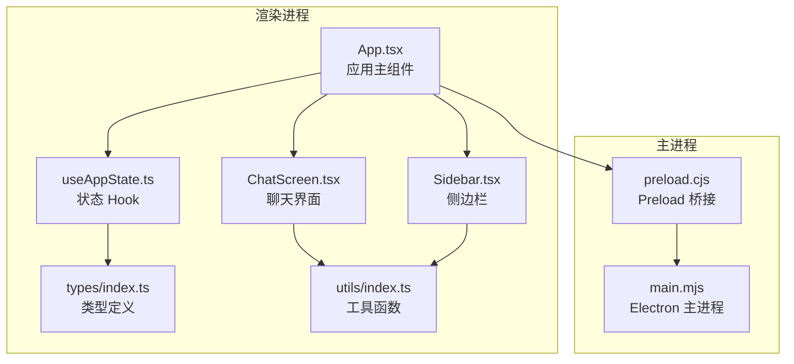
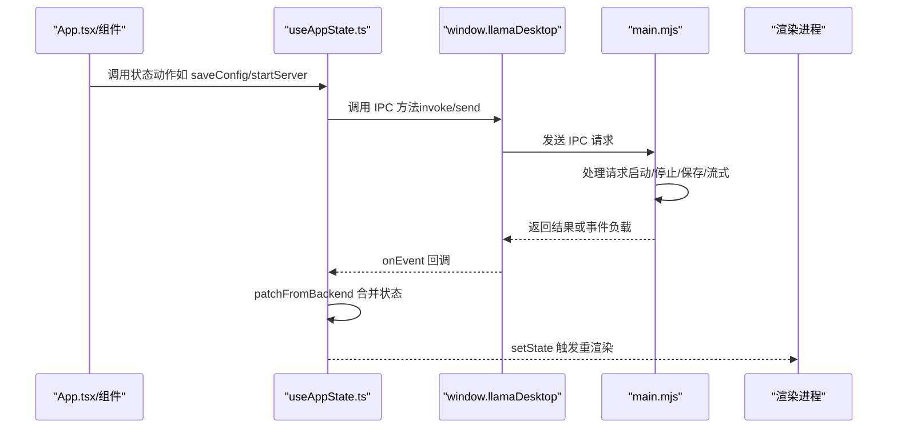
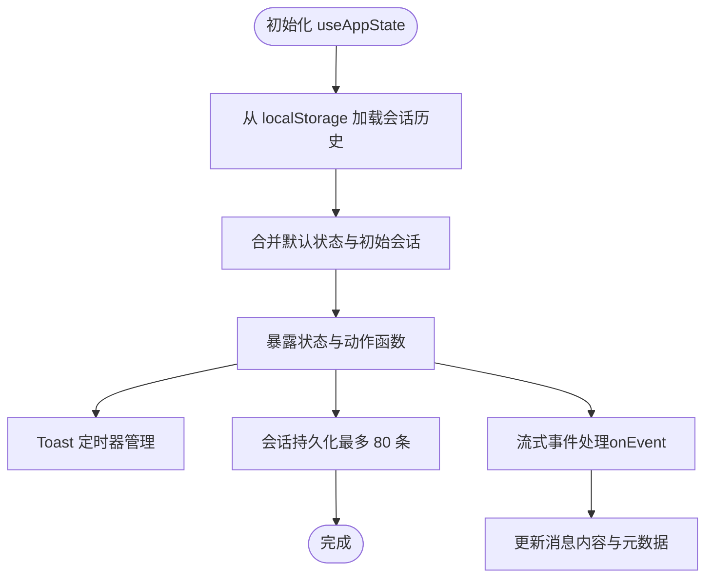
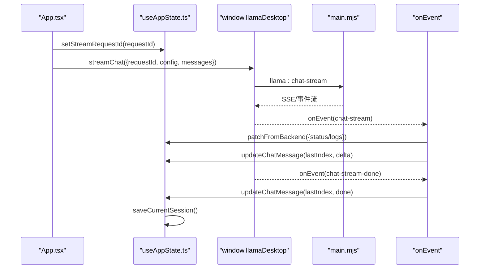
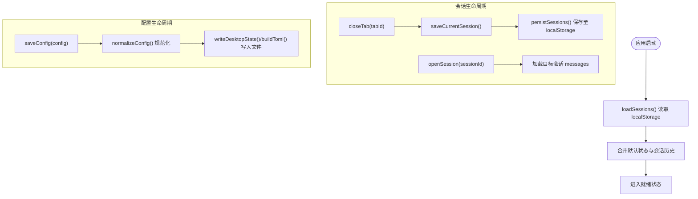
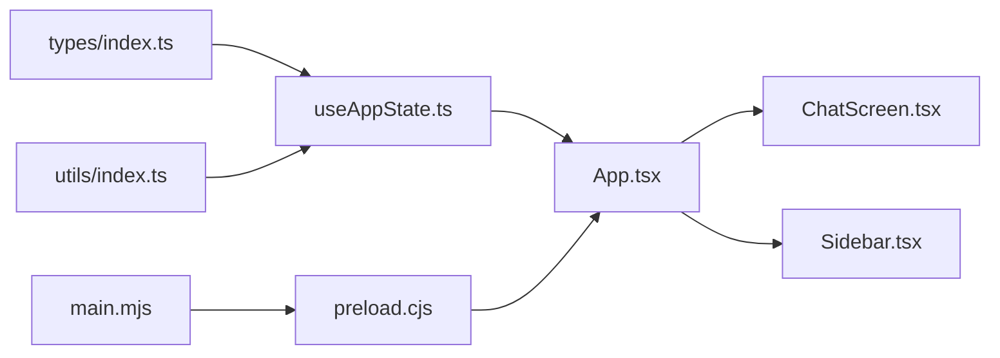

# 状态管理模式

<cite>
**本文档引用的文件**
- [useAppState.ts](file://renderer/src/hooks/useAppState.ts)
- [index.ts](file://renderer/src/types/index.ts)
- [App.tsx](file://renderer/src/App.tsx)
- [main.mjs](file://desktop/main.mjs)
- [preload.cjs](file://desktop/preload.cjs)
- [ChatScreen.tsx](file://renderer/src/components/ChatScreen.tsx)
- [Sidebar.tsx](file://renderer/src/components/Sidebar.tsx)
- [index.ts](file://renderer/src/utils/index.ts)
</cite>

## 目录
1. [简介](#简介)
2. [项目结构](#项目结构)
3. [核心组件](#核心组件)
4. [架构总览](#架构总览)
5. [详细组件分析](#详细组件分析)
6. [依赖分析](#依赖分析)
7. [性能考量](#性能考量)
8. [故障排查指南](#故障排查指南)
9. [结论](#结论)

## 简介
本文件系统性梳理 illama-desktop 的状态管理模式，重点围绕 useAppState Hook 的设计与实现，涵盖状态提升策略、副作用管理、性能优化、全局状态数据结构、状态更新触发机制（用户交互、IPC 事件、定时器）、状态持久化策略（localStorage 与桌面状态文件）、最佳实践（规范化、缓存与并发控制），并提供关键流程的时序与流程图示例，帮助开发者快速理解与扩展状态管理能力。

## 项目结构
illama-desktop 的状态管理横跨渲染进程与主进程：
- 渲染进程负责 UI 状态与用户交互，通过 useAppState Hook 统一管理 AppState，并通过 window.llamaDesktop API 与主进程通信。
- 主进程负责服务生命周期、日志、IPC 事件分发与状态持久化（桌面状态文件）。



图表来源
- [App.tsx:1-800](file://renderer/src/App.tsx#L1-L800)
- [useAppState.ts:1-555](file://renderer/src/hooks/useAppState.ts#L1-L555)
- [ChatScreen.tsx:1-376](file://renderer/src/components/ChatScreen.tsx#L1-L376)
- [Sidebar.tsx:1-228](file://renderer/src/components/Sidebar.tsx#L1-L228)
- [index.ts:1-222](file://renderer/src/types/index.ts#L1-L222)
- [index.ts:1-165](file://renderer/src/utils/index.ts#L1-L165)
- [main.mjs:1-800](file://desktop/main.mjs#L1-L800)
- [preload.cjs:1-32](file://desktop/preload.cjs#L1-L32)

章节来源
- [App.tsx:1-800](file://renderer/src/App.tsx#L1-L800)
- [useAppState.ts:1-555](file://renderer/src/hooks/useAppState.ts#L1-L555)
- [main.mjs:1-800](file://desktop/main.mjs#L1-L800)

## 核心组件
- useAppState Hook：集中管理 AppState，提供状态提升与动作派发，封装副作用与持久化。
- AppState 类型体系：Config、ChatMessage、Session、Status、Validation、LogEntry 等核心数据模型。
- App.tsx：应用主组件，协调用户交互、IPC 调用与事件监听，驱动状态更新。
- 主进程 main.mjs：维护运行时状态、日志、IPC 处理器与桌面状态文件持久化。

章节来源
- [useAppState.ts:68-555](file://renderer/src/hooks/useAppState.ts#L68-L555)
- [index.ts:53-222](file://renderer/src/types/index.ts#L53-L222)
- [App.tsx:21-800](file://renderer/src/App.tsx#L21-L800)
- [main.mjs:26-80](file://desktop/main.mjs#L26-L80)

## 架构总览
渲染进程与主进程通过 IPC 事件进行解耦通信：
- 渲染进程通过 window.llamaDesktop API 发起配置保存、服务启停、流式对话等请求。
- 主进程在 main.mjs 中注册 IPC 处理器，执行业务逻辑并推送状态变更事件。
- 渲染进程通过 onEvent 监听事件，使用 patchFromBackend 合并后端状态到 AppState。



图表来源
- [App.tsx:69-133](file://renderer/src/App.tsx#L69-L133)
- [useAppState.ts:95-102](file://renderer/src/hooks/useAppState.ts#L95-L102)
- [preload.cjs:3-31](file://desktop/preload.cjs#L3-L31)
- [main.mjs:1405-1460](file://desktop/main.mjs#L1405-L1460)

## 详细组件分析

### useAppState Hook 设计与实现
- 状态提升策略
  - 将 AppState 作为单一事实源，集中管理：配置、验证、服务状态、日志、视图、标签页、会话、聊天消息、附件、模型信息、忙碌状态等。
  - 通过 setState 的不可变更新与浅拷贝策略，确保 React 重渲染的可控性与性能。
- 副作用管理
  - Toast 定时器：setToast 使用 useRef 与 useEffect 清理，避免内存泄漏。
  - 会话保存：saveCurrentSession 在标签切换、会话打开、删除等场景触发，结合 localStorage 持久化。
  - 流式事件：通过 onEvent 监听主进程推送的 chat-stream/chat-stream-done，即时更新消息内容与元数据。
- 性能优化
  - useCallback 包装动作函数，避免子组件无谓重渲染。
  - ChatScreen 使用 memo 与自定义比较函数，避免流式输出期间对非流式消息的过度重渲染。
  - useRef 保存最新请求 ID 与消息列表，规避闭包陷阱，确保事件回调能读取最新状态。



图表来源
- [useAppState.ts:68-135](file://renderer/src/hooks/useAppState.ts#L68-L135)
- [useAppState.ts:436-551](file://renderer/src/hooks/useAppState.ts#L436-L551)

章节来源
- [useAppState.ts:68-555](file://renderer/src/hooks/useAppState.ts#L68-L555)

### 全局状态数据结构设计
- Config：llama-server 启动参数集合，包含路径、采样、上下文、设备、日志等字段。
- Status：服务状态（stopped/starting/running/stopping/error）与消息、URL。
- Validation：文件存在性校验（配置、启动器、服务器、模型）。
- LogEntry：日志条目（时间戳、来源、内容）。
- ChatMessage：消息实体，支持角色、内容、附件、时间戳、token、延迟、速度、流式标记、变体等。
- Session：会话实体，包含 id、title、messages、updatedAt、可选 systemPrompt。
- AppState：应用全局状态，聚合上述类型并扩展 UI 与交互状态。

```mermaid
classDiagram
class Config {
+string launch_mode
+string config_path
+string llama_server_path
+string llama_bin_dir
+string model
+string mmproj
+string chat_template_kwargs
+string host
+number port
+number ctx_size
+number n_predict
+number n_gpu_layers
+number request_timeout_ms
+number log_verbosity
+boolean verbose
+boolean webui
+boolean embeddings
+boolean continuous_batching
+number temp
+number top_k
+number top_p
+number min_p
+number presence_penalty
+number repeat_penalty
+number frequency_penalty
+number repeat_last_n
+number tfs_z
+number typical_p
+number dry_multiplier
+number dry_base
+number dry_allowed_length
+number dry_penalty_last_n
+number threads
+number threads_batch
+number batch_size
+number ubatch_size
+string split_mode
+string tensor_split
+string device
+number main_gpu
+number n_cpu_moe
+boolean cpu_moe
+boolean show_raw_output
+boolean show_thinking
+boolean expand_thinking
+string extra_args
}
class Status {
+string state
+string message
+string url
}
class Validation {
+boolean configExists
+boolean launcherExists
+boolean serverExists
+boolean modelExists
}
class LogEntry {
+string at
+string source
+string line
}
class Attachment {
+string kind
+string name
+string path
+number size
+string dataUrl
+string warning
+string error
}
class ChatMessage {
+string role
+string content
+Attachment[] attachments
+number createdAt
+number startedAt
+string model
+string|number tokens
+number estimatedTokens
+number latencyMs
+string speed
+boolean streaming
+boolean localOnly
+ChatMessageVariant[] variants
+number currentVariantIndex
}
class ChatMessageVariant {
+string content
+string|number tokens
+number latencyMs
+string speed
+number createdAt
}
class Session {
+string id
+string title
+ChatMessage[] messages
+number updatedAt
+string systemPrompt
}
class AppState {
+string active
+Config config
+Validation validation
+Record launch
+Status status
+LogEntry[] logs
+string view
+string sidebarPanel
+boolean sidebarCollapsed
+Session[] sessions
+string currentSessionId
+string[] openTabs
+string historySearch
+string historyMenuId
+Record historyDialog
+ChatMessage[] chatMessages
+string chatInput
+Attachment[] attachments
+boolean attachmentMenuOpen
+{left : number;top : number} attachmentMenuPosition
+string streamRequestId
+Record preview
+Record modelInfo
+boolean modelInfoOpen
+boolean chatBusy
+boolean dirty
+boolean busy
+boolean settingsOpen
+string toast
+boolean stickToBottom
}
```

图表来源
- [index.ts:53-222](file://renderer/src/types/index.ts#L53-L222)

章节来源
- [index.ts:53-222](file://renderer/src/types/index.ts#L53-L222)

### 状态更新触发机制
- 用户交互事件
  - 发送消息：App.tsx 中 sendChat 构造系统消息（会话提示词优先于技能）、用户消息与占位助手消息，随后调用 window.llamaDesktop.streamChat 并在事件回调中更新消息。
  - 中止对话：abortChat 调用主进程流式中止。
  - 重试消息：retryMessage 保存当前变体并发起新请求。
  - 附件与文件选择：pickAttachment、pickFile 更新附件与配置。
  - 会话管理：startFreshSession、openSession、closeTab、renameSession、deleteSession、setSessionSystemPrompt/clearSessionSystemPrompt。
- IPC 通信事件
  - onEvent 监听主进程推送的 status、logs、chat-stream、chat-stream-done，使用 patchFromBackend 合并状态。
  - 主进程 main.mjs 注册 llama:get-state、llama:save-config、llama:start-server、llama:chat-stream、llama:abort-chat 等处理器。
- 定时器事件
  - Toast 自动消失定时器。
  - 流式事件中的定期保存（防抖，每 2 秒保存一次）。



图表来源
- [App.tsx:208-320](file://renderer/src/App.tsx#L208-L320)
- [useAppState.ts:656-728](file://renderer/src/hooks/useAppState.ts#L656-L728)
- [preload.cjs:11-12](file://desktop/preload.cjs#L11-L12)
- [main.mjs:1823-1848](file://desktop/main.mjs#L1823-L1848)

章节来源
- [App.tsx:208-320](file://renderer/src/App.tsx#L208-L320)
- [useAppState.ts:656-728](file://renderer/src/hooks/useAppState.ts#L656-L728)
- [main.mjs:1823-1848](file://desktop/main.mjs#L1823-L1848)

### 状态持久化策略
- 会话持久化（localStorage）
  - loadSessions：从 localStorage 读取会话历史，兼容旧数据结构。
  - persistSessions：最多保留 80 条会话，按更新时间倒序存储。
  - saveCurrentSession：在标签切换、打开会话、删除会话等场景保存当前会话。
- 配置持久化（桌面状态文件）
  - 主进程 writeDesktopState：将配置与启动模式、启动器路径等写入 userData 下的 desktop-state.json。
  - saveConfig：规范化配置后写入 TOML（当使用 launcher 模式）与桌面状态文件。
- 会话恢复
  - 初始化时从 loadSessions 恢复会话列表，设置 currentSessionId 与 openTabs。
  - 打开历史会话时加载对应 messages 并清理流式标记。



图表来源
- [useAppState.ts:43-55](file://renderer/src/hooks/useAppState.ts#L43-L55)
- [useAppState.ts:104-135](file://renderer/src/hooks/useAppState.ts#L104-L135)
- [useAppState.ts:210-266](file://renderer/src/hooks/useAppState.ts#L210-L266)
- [useAppState.ts:137-208](file://renderer/src/hooks/useAppState.ts#L137-L208)
- [main.mjs:654-710](file://desktop/main.mjs#L654-L710)

章节来源
- [useAppState.ts:43-55](file://renderer/src/hooks/useAppState.ts#L43-L55)
- [useAppState.ts:104-135](file://renderer/src/hooks/useAppState.ts#L104-L135)
- [useAppState.ts:210-266](file://renderer/src/hooks/useAppState.ts#L210-L266)
- [useAppState.ts:137-208](file://renderer/src/hooks/useAppState.ts#L137-L208)
- [main.mjs:654-710](file://desktop/main.mjs#L654-L710)

### 最佳实践
- 状态规范化
  - normalizeConfig：统一数值、布尔、字符串与空值处理，确保配置一致性。
  - buildToml：根据配置生成 TOML 文本，便于 launcher 模式保存。
- 缓存策略
  - useRef 保存最新请求 ID 与消息列表，避免事件回调中的闭包陷阱。
  - ChatScreen.memo：针对非流式消息自定义比较，减少重渲染。
- 并发控制
  - setChatBusy/setStreamRequestId：严格控制并发请求，避免多流冲突。
  - abortChat：通过 AbortController 中止当前流式请求。
- 错误处理
  - friendlyErrorMessage：将底层错误映射为用户可读提示。
  - 事件兜底：IPC 返回值兜底，确保 done 事件未及时到达时仍能完成消息更新。

章节来源
- [index.ts:53-103](file://renderer/src/types/index.ts#L53-L103)
- [index.ts:50-66](file://renderer/src/utils/index.ts#L50-L66)
- [App.tsx:322-334](file://renderer/src/App.tsx#L322-L334)
- [App.tsx:302-316](file://renderer/src/App.tsx#L302-L316)

## 依赖分析
- 渲染进程依赖
  - useAppState 依赖 AppState 类型与工具函数。
  - App.tsx 依赖 useAppState、组件与工具函数。
  - ChatScreen/Sidebar 依赖类型与工具函数。
- 主进程依赖
  - main.mjs 依赖配置解析、TOML 生成、日志压缩、IPC 注册与事件发送。
  - preload.cjs 暴露 window.llamaDesktop API。



图表来源
- [index.ts:1-222](file://renderer/src/types/index.ts#L1-L222)
- [index.ts:1-165](file://renderer/src/utils/index.ts#L1-L165)
- [useAppState.ts:1-555](file://renderer/src/hooks/useAppState.ts#L1-L555)
- [App.tsx:1-800](file://renderer/src/App.tsx#L1-L800)
- [ChatScreen.tsx:1-376](file://renderer/src/components/ChatScreen.tsx#L1-L376)
- [Sidebar.tsx:1-228](file://renderer/src/components/Sidebar.tsx#L1-L228)
- [preload.cjs:1-32](file://desktop/preload.cjs#L1-L32)
- [main.mjs:1-800](file://desktop/main.mjs#L1-L800)

章节来源
- [index.ts:1-222](file://renderer/src/types/index.ts#L1-L222)
- [index.ts:1-165](file://renderer/src/utils/index.ts#L1-L165)
- [useAppState.ts:1-555](file://renderer/src/hooks/useAppState.ts#L1-L555)
- [App.tsx:1-800](file://renderer/src/App.tsx#L1-L800)
- [ChatScreen.tsx:1-376](file://renderer/src/components/ChatScreen.tsx#L1-L376)
- [Sidebar.tsx:1-228](file://renderer/src/components/Sidebar.tsx#L1-L228)
- [preload.cjs:1-32](file://desktop/preload.cjs#L1-L32)
- [main.mjs:1-800](file://desktop/main.mjs#L1-L800)

## 性能考量
- 渲染性能
  - ChatScreen.memo 与自定义比较函数避免非流式消息的重复渲染。
  - useRef 保存最新状态，减少闭包捕获带来的重渲染。
- 状态更新
  - useCallback 包装动作函数，降低子组件重渲染概率。
  - setState 的不可变更新策略，配合浅拷贝，减少深层比较成本。
- IO 与网络
  - 流式事件采用防抖保存（每 2 秒一次），平衡实时性与性能。
  - 日志压缩与过滤，减少渲染与传输压力。

[本节为通用性能建议，无需特定文件来源]

## 故障排查指南
- 服务状态异常
  - 检查主进程 addLog 与 setStatus 的日志与状态推送，确认服务监听与错误信息。
- 流式对话卡顿
  - 确认 onEvent 中的 delta 更新是否及时，以及 saveCurrentSession 的防抖逻辑是否导致保存延迟。
- 会话丢失或标题异常
  - 检查 loadSessions 与 persistSessions 的实现，确认 localStorage 键名与条目上限。
- 配置未生效
  - 确认 saveConfig 的 normalizeConfig 与 buildToml 流程，以及桌面状态文件写入路径。

章节来源
- [main.mjs:298-326](file://desktop/main.mjs#L298-L326)
- [main.mjs:220-224](file://desktop/main.mjs#L220-L224)
- [useAppState.ts:43-55](file://renderer/src/hooks/useAppState.ts#L43-L55)
- [useAppState.ts:104-135](file://renderer/src/hooks/useAppState.ts#L104-L135)
- [main.mjs:676-710](file://desktop/main.mjs#L676-L710)

## 结论
illama-desktop 的状态管理模式以 useAppState Hook 为核心，通过状态提升与动作封装实现了清晰的职责分离；借助 IPC 事件与主进程协同，完成了服务状态、日志与流式对话的实时更新；通过 localStorage 与桌面状态文件实现会话与配置的持久化；在渲染性能与并发控制方面采取了多项优化措施。该模式具备良好的可扩展性与可维护性，适合在复杂桌面应用中推广使用。