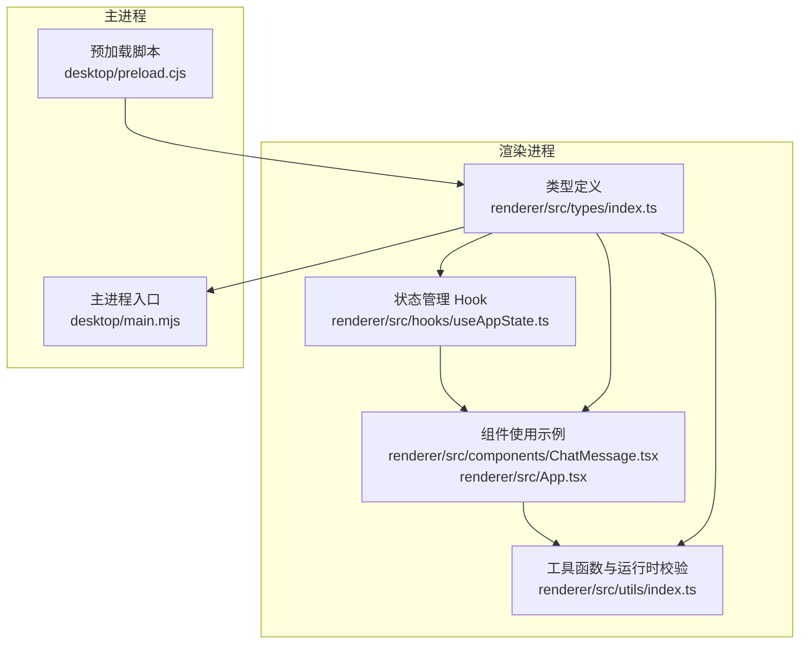
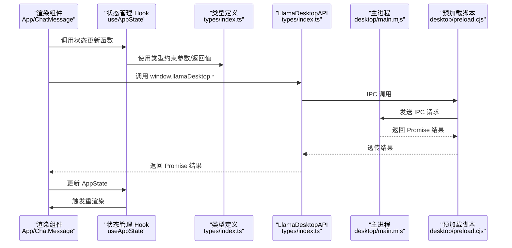

# 类型系统设计

<cite>
**本文档引用的文件**
- [renderer/src/types/index.ts](file://renderer/src/types/index.ts)
- [renderer/src/hooks/useAppState.ts](file://renderer/src/hooks/useAppState.ts)
- [renderer/src/components/ChatMessage.tsx](file://renderer/src/components/ChatMessage.tsx)
- [renderer/src/utils/index.ts](file://renderer/src/utils/index.ts)
- [renderer/src/App.tsx](file://renderer/src/App.tsx)
- [tsconfig.json](file://tsconfig.json)
- [.codeartsdoer/AGENTS.md](file://.codeartsdoer/AGENTS.md)
</cite>

## 目录
1. [简介](#简介)
2. [项目结构](#项目结构)
3. [核心组件](#核心组件)
4. [架构总览](#架构总览)
5. [详细组件分析](#详细组件分析)
6. [依赖关系分析](#依赖关系分析)
7. [性能考量](#性能考量)
8. [故障排除指南](#故障排除指南)
9. [结论](#结论)

## 简介
本文件系统性梳理 illama-desktop 的 TypeScript 类型系统设计，重点围绕渲染进程与主进程通信的类型契约、核心数据模型（Config、ChatMessage、Session、Skill）的字段定义与约束、类型继承与组合模式（可选属性、联合类型、泛型）、以及编译时类型安全与运行时类型验证策略。同时结合实际组件使用场景，说明类型推断、类型守卫、IDE 智能提示与开发体验优化，并提供最佳实践建议与排错指引。

## 项目结构
类型系统主要集中在渲染进程的类型定义文件中，配合 React Hooks 与组件实现类型驱动的开发体验。关键文件与职责如下：
- 类型定义：renderer/src/types/index.ts
- 应用状态管理：renderer/src/hooks/useAppState.ts
- 组件使用示例：renderer/src/components/ChatMessage.tsx、renderer/src/App.tsx
- 工具函数与运行时校验：renderer/src/utils/index.ts
- 编译配置：tsconfig.json
- 工程语言与严格模式：.codeartsdoer/AGENTS.md



图表来源
- [renderer/src/types/index.ts:1-222](file://renderer/src/types/index.ts#L1-L222)
- [renderer/src/hooks/useAppState.ts:1-555](file://renderer/src/hooks/useAppState.ts#L1-L555)
- [renderer/src/components/ChatMessage.tsx:1-237](file://renderer/src/components/ChatMessage.tsx#L1-L237)
- [renderer/src/App.tsx:1-200](file://renderer/src/App.tsx#L1-L200)
- [renderer/src/utils/index.ts:1-165](file://renderer/src/utils/index.ts#L1-L165)
- [desktop/main.mjs:190-2088](file://desktop/main.mjs#L190-L2088)
- [desktop/preload.cjs:21-31](file://desktop/preload.cjs#L21-L31)

章节来源
- [renderer/src/types/index.ts:1-222](file://renderer/src/types/index.ts#L1-L222)
- [tsconfig.json:1-18](file://tsconfig.json#L1-L18)
- [.codeartsdoer/AGENTS.md:1-14](file://.codeartsdoer/AGENTS.md#L1-L14)

## 核心组件
本节聚焦于核心类型定义及其设计原则，涵盖字段语义、约束条件、可选属性与联合类型的使用。

- LlamaDesktopAPI
  - 作用：定义渲染进程与主进程通信的接口契约，统一返回值结构，便于编译期类型检查与 IDE 智能提示。
  - 设计要点：统一返回 Promise<{ ok: boolean; ... }> 的结构，字段通过 Record<string, unknown> 与具体接口混合，兼顾灵活性与类型安全。
  - 示例路径：[LlamaDesktopAPI 定义:2-44](file://renderer/src/types/index.ts#L2-L44)

- Config
  - 作用：存储 llama-server 与应用的所有配置项，覆盖路径、模型、采样参数、设备与性能相关参数。
  - 设计要点：使用 [key: string]: unknown 作为兜底，确保未来新增字段不破坏现有类型；多数字段为可选，体现配置的渐进式生效。
  - 示例路径：[Config 接口:54-103](file://renderer/src/types/index.ts#L54-L103)

- Status
  - 作用：描述服务状态（stopped/starting/running/stopping/error）与状态消息、URL。
  - 设计要点：使用字面量联合类型限定状态枚举，确保状态值的编译期安全。
  - 示例路径：[Status 接口:106-110](file://renderer/src/types/index.ts#L106-L110)

- Validation
  - 作用：文件存在性验证（配置、启动器、服务器、模型）。
  - 设计要点：可选布尔字段，便于逐步验证与 UI 展示。
  - 示例路径：[Validation 接口:113-118](file://renderer/src/types/index.ts#L113-L118)

- LogEntry
  - 作用：日志条目，包含时间戳、来源与内容。
  - 设计要点：来源为字符串，便于区分 stdout/stderr/desktop 等。
  - 示例路径：[LogEntry 接口:121-125](file://renderer/src/types/index.ts#L121-L125)

- Skill
  - 作用：技能定义，包含元数据与正文。
  - 设计要点：raw 为可选，允许在读取时附带原始 Markdown；allowedTools 为可选字符串数组。
  - 示例路径：[Skill 接口:128-138](file://renderer/src/types/index.ts#L128-L138)

- Attachment
  - 作用：附件类型，支持 image/audio/text/pdf/system/mcp/file。
  - 设计要点：kind 为字面量联合类型，name/path/size/dataUrl/warning/error 均为可选，适配不同来源与大小。
  - 示例路径：[Attachment 接口:141-149](file://renderer/src/types/index.ts#L141-L149)

- ChatMessage
  - 作用：聊天消息，支持角色、内容、附件、令牌统计、延迟、速度、流式状态、变体等。
  - 设计要点：role 为字面量联合类型；tokens 支持 string|number；variants/currentVariantIndex 用于多回复变体切换；createdAt/startedAt 等时间戳字段。
  - 示例路径：[ChatMessage 接口:152-167](file://renderer/src/types/index.ts#L152-L167)

- ChatMessageVariant
  - 作用：消息变体，记录不同生成版本的统计信息。
  - 设计要点：与 ChatMessage 的 variants 字段配合使用。
  - 示例路径：[ChatMessageVariant 接口:170-176](file://renderer/src/types/index.ts#L170-L176)

- Session
  - 作用：会话容器，包含 id/title/messages/updatedAt/systemPrompt。
  - 设计要点：messages 为 ChatMessage[]；systemPrompt 可选，支持会话级系统提示词。
  - 示例路径：[Session 接口:179-185](file://renderer/src/types/index.ts#L179-L185)

- AppState
  - 作用：应用全局状态，包含视图、侧边栏、会话、聊天消息、附件、忙碌状态、模型信息等。
  - 设计要点：大量可选字段与复杂嵌套，体现桌面应用状态的多样性；Record<string, unknown> 用于灵活扩展。
  - 示例路径：[AppState 接口:188-219](file://renderer/src/types/index.ts#L188-L219)

- SettingsSectionId
  - 作用：设置面板分区 ID 的字面量联合类型。
  - 示例路径：[SettingsSectionId 类型](file://renderer/src/types/index.ts#L222)

章节来源
- [renderer/src/types/index.ts:2-222](file://renderer/src/types/index.ts#L2-L222)

## 架构总览
类型系统贯穿渲染进程与主进程通信的边界，通过 LlamaDesktopAPI 统一约定参数与返回值结构，确保跨进程调用的类型安全。应用状态通过 useAppState 管理，组件通过类型驱动的数据结构进行渲染与交互。



图表来源
- [renderer/src/App.tsx:69-133](file://renderer/src/App.tsx#L69-L133)
- [renderer/src/hooks/useAppState.ts:69-551](file://renderer/src/hooks/useAppState.ts#L69-L551)
- [renderer/src/types/index.ts:2-44](file://renderer/src/types/index.ts#L2-L44)
- [desktop/preload.cjs:21-31](file://desktop/preload.cjs#L21-L31)
- [desktop/main.mjs:190-2088](file://desktop/main.mjs#L190-L2088)

## 详细组件分析

### 类型继承与组合模式
- 可选属性（?）
  - Config、Validation、ChatMessage、Session 等广泛使用可选属性，体现配置与状态的渐进式生效与可扩展性。
  - 示例路径：[可选属性使用:56-103](file://renderer/src/types/index.ts#L56-L103)

- 联合类型（|）
  - role 使用 'user' | 'assistant' | 'system'，确保消息角色的编译期安全。
  - kind 使用 'image' | 'audio' | 'text' | 'pdf' | 'system' | 'mcp' | 'file'，限定附件类型。
  - tokens 使用 string | number，兼容不同统计来源。
  - 示例路径：[联合类型定义:153-154](file://renderer/src/types/index.ts#L153-L154)
  - 示例路径：[附件类型联合](file://renderer/src/types/index.ts#L142)

- 泛型与映射类型
  - 项目中未直接使用显式泛型类型参数，但在 React 组件中广泛使用泛型函数（如 useCallback 的泛型推断），通过类型约束提升参数安全性。
  - 示例路径：[泛型推断使用:396-411](file://renderer/src/hooks/useAppState.ts#L396-L411)

- Record<string, unknown>
  - Config 与部分返回值使用 Record<string, unknown> 作为兜底，平衡灵活性与类型安全。
  - 示例路径：[Record 兜底](file://renderer/src/types/index.ts#L55)
  - 示例路径：[API 返回值兜底](file://renderer/src/types/index.ts#L4)

章节来源
- [renderer/src/types/index.ts:54-103](file://renderer/src/types/index.ts#L54-L103)
- [renderer/src/hooks/useAppState.ts:396-411](file://renderer/src/hooks/useAppState.ts#L396-L411)

### 类型推断与类型守卫
- 类型推断
  - React 组件通过类型导入与 props 约束，实现 props 的自动推断与编译期检查。
  - 示例路径：[组件类型导入:1-8](file://renderer/src/components/ChatMessage.tsx#L1-L8)

- 类型守卫
  - 运行时校验通过工具函数实现，例如对日志行的过滤、错误信息的友好化处理，避免直接使用 any。
  - 示例路径：[运行时校验与错误处理:51-66](file://renderer/src/utils/index.ts#L51-L66)
  - 示例路径：[日志过滤与压缩:110-137](file://renderer/src/utils/index.ts#L110-L137)

- 编译时检查
  - tsconfig.json 启用 strict、isolatedModules、noEmit 等严格选项，确保类型安全与构建稳定性。
  - 示例路径：[编译配置:2-14](file://tsconfig.json#L2-L14)

章节来源
- [renderer/src/components/ChatMessage.tsx:1-68](file://renderer/src/components/ChatMessage.tsx#L1-L68)
- [renderer/src/utils/index.ts:51-137](file://renderer/src/utils/index.ts#L51-L137)
- [tsconfig.json:2-14](file://tsconfig.json#L2-L14)

### 核心类型定义与约束
- Config 字段约束
  - 路径类字段（config_path、launcher_path、llama_server_path、model、mmproj）为可选字符串，支持相对/绝对路径。
  - 采样与生成参数（temp、top_k、top_p、min_p、repeat_last_n 等）为数值，范围由运行时校验保障。
  - 性能参数（ctx_size、n_predict、threads、batch_size 等）为数值，影响上下文与吞吐。
  - 设备与硬件参数（device、main_gpu、n_gpu_layers、tensor_split 等）为字符串或数值，支持 GPU/CPU 切换。
  - 示例路径：[Config 字段:56-103](file://renderer/src/types/index.ts#L56-L103)

- ChatMessage 字段约束
  - role 必须为 'user' | 'assistant' | 'system'，content 为字符串，attachments 为可选数组。
  - tokens 支持 string|number，latencyMs/speed/estimatedTokens 为可选，streaming/localOnly/currentVariantIndex 等用于流式与变体管理。
  - 示例路径：[ChatMessage 字段:152-167](file://renderer/src/types/index.ts#L152-L167)

- Session 字段约束
  - id/title/messages/updatedAt 为核心字段；systemPrompt 可选，支持会话级系统提示词。
  - 示例路径：[Session 字段:179-185](file://renderer/src/types/index.ts#L179-L185)

- Skill 字段约束
  - dirName/filePath/name/description/body 必填；whenToUse/argumentHint/allowedTools/raw 可选。
  - 示例路径：[Skill 字段:128-138](file://renderer/src/types/index.ts#L128-L138)

章节来源
- [renderer/src/types/index.ts:54-185](file://renderer/src/types/index.ts#L54-L185)

### 实际应用场景与最佳实践
- 类型驱动的组件渲染
  - ChatMessage 组件根据 message.streaming、message.role、message.attachments 等字段进行差异化渲染，类型约束确保分支逻辑的完备性。
  - 示例路径：[消息渲染逻辑:10-68](file://renderer/src/components/ChatMessage.tsx#L10-L68)

- 应用状态管理
  - useAppState 通过类型约束更新函数的参数与返回值，确保状态变更的类型安全与一致性。
  - 示例路径：[状态更新函数:364-424](file://renderer/src/hooks/useAppState.ts#L364-L424)

- 跨进程通信
  - LlamaDesktopAPI 统一了 IPC 调用的参数与返回值结构，结合 Record<string, unknown> 与具体接口，既保证灵活性又提供编译期检查。
  - 示例路径：[IPC 接口定义:2-44](file://renderer/src/types/index.ts#L2-L44)

- 运行时类型验证与错误处理
  - 工具函数对错误信息进行友好化处理，避免直接抛出底层异常；对日志进行过滤与压缩，提升用户体验。
  - 示例路径：[错误处理:51-66](file://renderer/src/utils/index.ts#L51-L66)
  - 示例路径：[日志处理:110-165](file://renderer/src/utils/index.ts#L110-L165)

章节来源
- [renderer/src/components/ChatMessage.tsx:10-165](file://renderer/src/components/ChatMessage.tsx#L10-L165)
- [renderer/src/hooks/useAppState.ts:364-424](file://renderer/src/hooks/useAppState.ts#L364-L424)
- [renderer/src/types/index.ts:2-44](file://renderer/src/types/index.ts#L2-L44)
- [renderer/src/utils/index.ts:51-165](file://renderer/src/utils/index.ts#L51-L165)

## 依赖关系分析
类型系统与组件、Hook、工具函数之间的耦合关系如下：

```mermaid
classDiagram
class LlamaDesktopAPI {
+saveConfig(opts)
+startServer(opts)
+stopServer()
+testHealth(opts)
+getModelInfo(opts)
+pickAttachments(opts)
+pickFile(opts)
+streamChat(opts)
+abortChat()
+getState()
+listSkills()
+createSkill(payload)
+generateSkillContent(payload)
+readSkill(payload)
+deleteSkill(payload)
+onEvent(handler)
+setTheme(isDark)
+chatCompletion(payload)
+revealPath(filePath)
+saveFile(payload)
+closeWindow()
+minimizeWindow()
+maximizeWindow()
+isWindowMaximized()
}
class Config {
+[key : string] : unknown
+launch_mode?
+config_path?
+launcher_path?
+llama_server_path?
+model?
+mmproj?
+host?
+port?
+ctx_size?
+n_predict?
+n_gpu_layers?
+request_timeout_ms?
+log_verbosity?
+verbose?
+embeddings?
+continuous_batching?
+temp?
+top_k?
+top_p?
+min_p?
+presence_penalty?
+repeat_penalty?
+frequency_penalty?
+repeat_last_n?
+tfs_z?
+typical_p?
+dry_multiplier?
+dry_base?
+dry_allowed_length?
+dry_penalty_last_n?
+threads?
+threads_batch?
+batch_size?
+ubatch_size?
+split_mode?
+tensor_split?
+device?
+main_gpu?
+n_cpu_moe?
+cpu_moe?
+show_raw_output?
+show_thinking?
+expand_thinking?
+extra_args?
}
class Status {
+state : "stopped"|"starting"|"running"|"stopping"|"error"
+message : string
+url : string
}
class Validation {
+configExists?
+launcherExists?
+serverExists?
+modelExists?
}
class LogEntry {
+at : string
+source : string
+line : string
}
class Skill {
+dirName : string
+filePath : string
+raw?
+name : string
+description : string
+whenToUse?
+argumentHint?
+allowedTools?
+body : string
}
class Attachment {
+kind : "image"|"audio"|"text"|"pdf"|"system"|"mcp"|"file"
+name : string
+path?
+size?
+dataUrl?
+warning?
+error?
}
class ChatMessage {
+role : "user"|"assistant"|"system"
+content : string
+attachments?
+createdAt : number
+startedAt?
+model?
+tokens?
+estimatedTokens?
+latencyMs?
+speed?
+streaming?
+localOnly?
+variants?
+currentVariantIndex?
}
class ChatMessageVariant {
+content : string
+tokens?
+latencyMs?
+speed?
+createdAt : number
}
class Session {
+id : string
+title : string
+messages : ChatMessage[]
+updatedAt : number
+systemPrompt?
}
class AppState {
+active : string
+config : Config|null
+validation : Validation
+launch : Record<string, unknown>
+status : Status
+logs : LogEntry[]
+view : "chat"|"terminal"
+sidebarPanel : string
+sidebarCollapsed : boolean
+sessions : Session[]
+currentSessionId : string
+openTabs : string[]
+historySearch : string
+historyMenuId : string
+historyDialog : null|Record<string, unknown>
+chatMessages : ChatMessage[]
+chatInput : string
+attachments : Attachment[]
+attachmentMenuOpen : boolean
+attachmentMenuPosition : null|{left : number, top : number}
+streamRequestId : string
+preview : null|Record<string, unknown>
+modelInfo : null|{loading? : boolean, error? : string}|Record<string, unknown>
+modelInfoOpen : boolean
+chatBusy : boolean
+dirty : boolean
+busy : boolean
+settingsOpen : boolean
+toast : string
+stickToBottom : boolean
}
LlamaDesktopAPI --> Config : "使用"
LlamaDesktopAPI --> Status : "使用"
LlamaDesktopAPI --> Validation : "使用"
LlamaDesktopAPI --> LogEntry : "使用"
LlamaDesktopAPI --> Skill : "使用"
LlamaDesktopAPI --> Attachment : "使用"
LlamaDesktopAPI --> ChatMessage : "使用"
LlamaDesktopAPI --> Session : "使用"
AppState --> Config : "包含"
AppState --> Status : "包含"
AppState --> Validation : "包含"
AppState --> LogEntry : "包含"
AppState --> Skill : "包含"
AppState --> Attachment : "包含"
AppState --> ChatMessage : "包含"
AppState --> Session : "包含"
```

图表来源
- [renderer/src/types/index.ts:2-222](file://renderer/src/types/index.ts#L2-L222)

章节来源
- [renderer/src/types/index.ts:2-222](file://renderer/src/types/index.ts#L2-L222)

## 性能考量
- 类型安全与编译时检查
  - 严格模式与隔离模块编译选项有助于提前发现潜在问题，减少运行时错误带来的性能损耗。
  - 示例路径：[编译配置:2-14](file://tsconfig.json#L2-L14)

- 运行时类型验证
  - 工具函数对日志与错误进行过滤与压缩，避免渲染层处理冗余数据，提升 UI 响应速度。
  - 示例路径：[日志处理:110-165](file://renderer/src/utils/index.ts#L110-L165)

- 组件渲染优化
  - ChatMessage 组件在流式输出时避免频繁解析 Markdown，减少重排与重绘成本。
  - 示例路径：[流式渲染优化:38-41](file://renderer/src/components/ChatMessage.tsx#L38-L41)

## 故障排除指南
- 常见类型错误
  - 未满足联合类型约束：例如 role 必须为 'user' | 'assistant' | 'system'，否则编译报错。
  - 可选属性访问：在访问可选属性前进行判空或提供默认值，避免运行时访问 undefined。
  - 示例路径：[联合类型约束:153-154](file://renderer/src/types/index.ts#L153-L154)

- 运行时错误处理
  - 使用工具函数对错误信息进行友好化处理，避免直接显示底层异常。
  - 示例路径：[错误处理:51-66](file://renderer/src/utils/index.ts#L51-L66)

- IPC 调用问题
  - 确保 LlamaDesktopAPI 的返回值结构与类型定义一致，避免字段缺失导致的类型错误。
  - 示例路径：[IPC 接口定义:2-44](file://renderer/src/types/index.ts#L2-L44)

章节来源
- [renderer/src/types/index.ts:2-44](file://renderer/src/types/index.ts#L2-L44)
- [renderer/src/utils/index.ts:51-66](file://renderer/src/utils/index.ts#L51-L66)

## 结论
illama-desktop 的类型系统通过严格的接口定义、联合类型与可选属性的组合，实现了跨进程通信与应用状态管理的类型安全。结合运行时校验与组件层面的优化策略，既保证了开发体验（IDE 智能提示、编译期检查），也提升了运行时的稳定性与性能。建议在后续迭代中持续完善类型约束与错误处理，保持类型系统的演进与代码质量的同步提升。