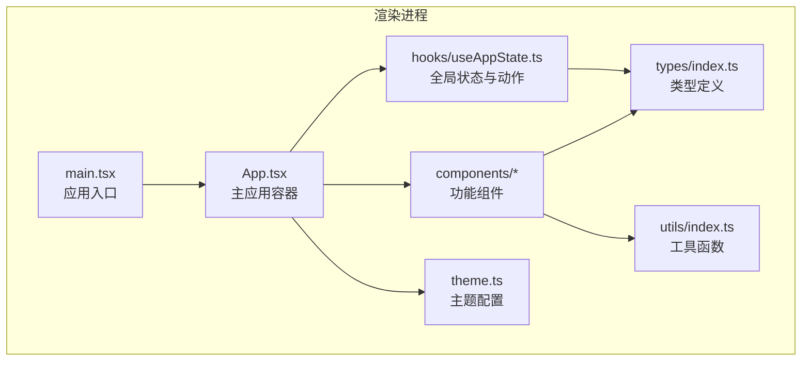
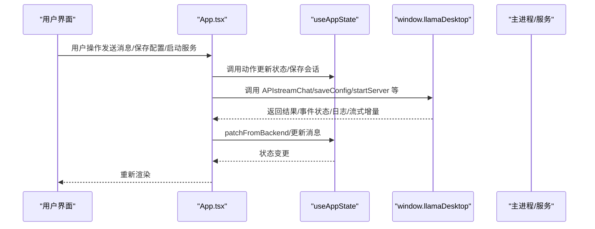
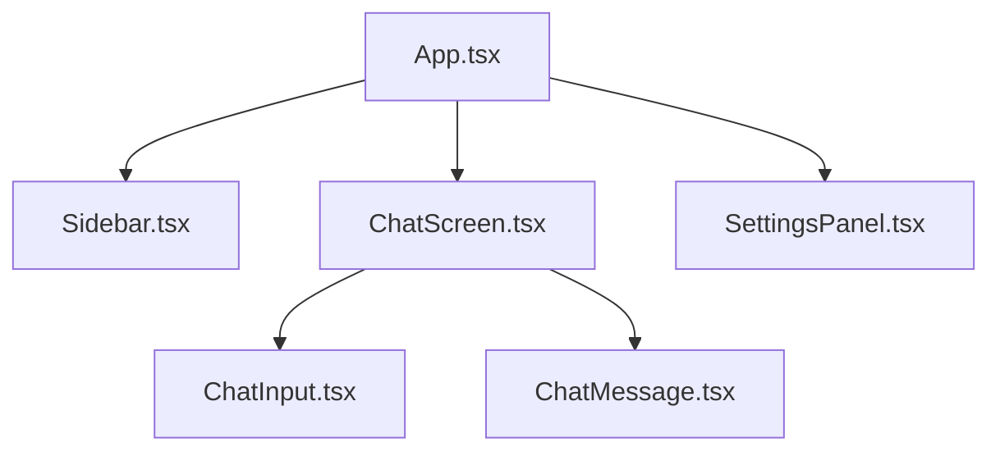
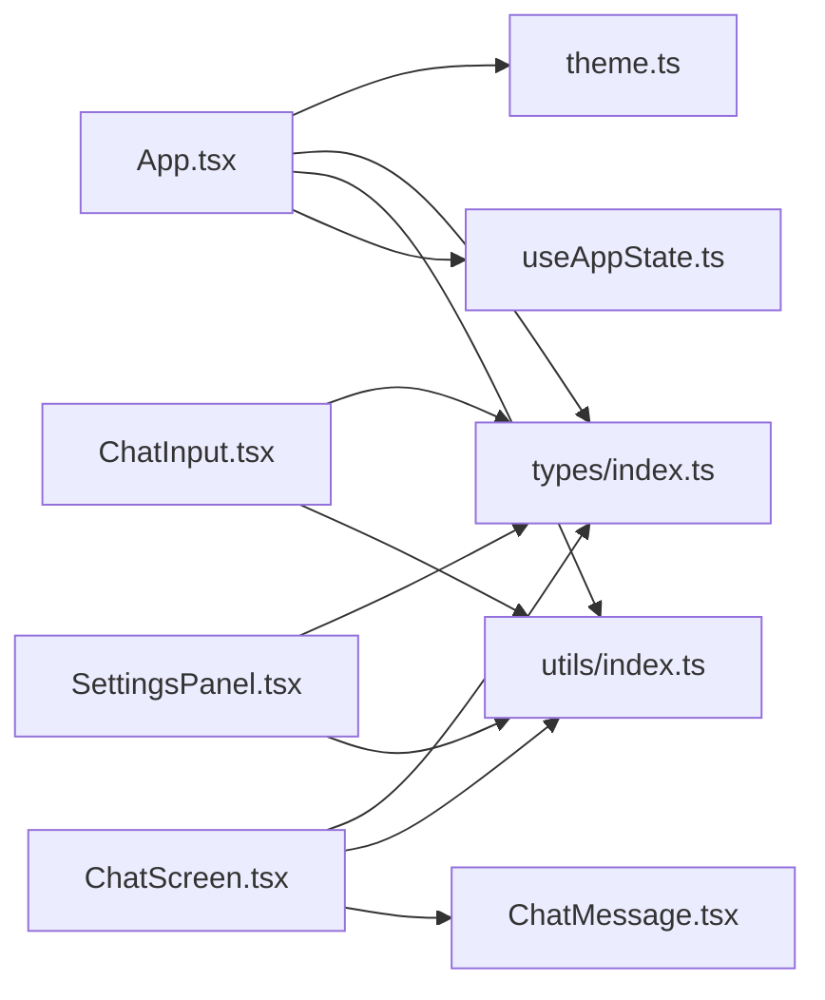

# 组件架构设计

<cite>
**本文档引用的文件**
- [App.tsx](file://renderer/src/App.tsx)
- [useAppState.ts](file://renderer/src/hooks/useAppState.ts)
- [index.ts](file://renderer/src/types/index.ts)
- [main.tsx](file://renderer/src/main.tsx)
- [ChatScreen.tsx](file://renderer/src/components/ChatScreen.tsx)
- [Sidebar.tsx](file://renderer/src/components/Sidebar.tsx)
- [SettingsPanel.tsx](file://renderer/src/components/SettingsPanel.tsx)
- [ChatMessage.tsx](file://renderer/src/components/ChatMessage.tsx)
- [ChatInput.tsx](file://renderer/src/components/ChatInput.tsx)
- [index.ts](file://renderer/src/utils/index.ts)
- [theme.ts](file://renderer/src/theme.ts)
</cite>

## 目录
1. [简介](#简介)
2. [项目结构](#项目结构)
3. [核心组件](#核心组件)
4. [架构总览](#架构总览)
5. [详细组件分析](#详细组件分析)
6. [依赖关系分析](#依赖关系分析)
7. [性能考量](#性能考量)
8. [故障排除指南](#故障排除指南)
9. [结论](#结论)

## 简介
本文件面向 illama-desktop 的渲染进程组件架构，围绕基于 React 的组件化设计理念进行系统化梳理。重点涵盖：
- App.tsx 作为主应用容器的设计模式、组件树层次结构与职责分离
- 状态管理模式：useAppState Hook 的设计思路、全局状态的数据流、状态更新触发机制与副作用处理
- 类型系统设计：TypeScript 接口定义、类型安全保证与编译时检查
- 组件间通信模式：Props 传递、事件冒泡、Context 使用与状态提升策略
- 组件可复用性设计原则：高阶组件、Render Props 与 Hooks 的使用场景

## 项目结构
渲染进程采用“按功能域划分”的组织方式，核心目录如下：
- renderer/src/main.tsx：应用入口，挂载根组件
- renderer/src/App.tsx：主应用容器，协调全局状态与子组件
- renderer/src/hooks/useAppState.ts：全局状态与动作聚合的 Hook
- renderer/src/types/index.ts：类型定义（API、配置、状态、消息、会话等）
- renderer/src/components/*：功能组件（聊天、侧边栏、设置面板、输入框、消息渲染等）
- renderer/src/utils/index.ts：通用工具函数（HTML 转义、Token 估算、日志过滤等）
- renderer/src/theme.ts：Ant Design 主题配置

图表来源
- [main.tsx:1-34](file://renderer/src/main.tsx#L1-L34)
- [App.tsx:1-810](file://renderer/src/App.tsx#L1-L810)
- [useAppState.ts:1-555](file://renderer/src/hooks/useAppState.ts#L1-L555)
- [index.ts:1-222](file://renderer/src/types/index.ts#L1-L222)
- [index.ts:1-165](file://renderer/src/utils/index.ts#L1-L165)
- [theme.ts:1-24](file://renderer/src/theme.ts#L1-L24)

章节来源
- [main.tsx:1-34](file://renderer/src/main.tsx#L1-L34)
- [App.tsx:1-810](file://renderer/src/App.tsx#L1-L810)

## 核心组件
本节聚焦 App.tsx 作为主应用容器的设计模式与职责边界，以及 useAppState Hook 的状态管理策略。

- 主应用容器 App.tsx
  - 职责：整合全局状态、协调各功能模块、处理 IPC 事件、封装业务流程（保存配置、启动/停止服务、发送消息、中止对话、附件处理、系统提示词、会话管理等）
  - 设计模式：容器组件 + 动作聚合，将复杂交互逻辑下沉至 Hook，组件层专注渲染与事件转发
  - 依赖注入：通过 useAppState Hook 获取状态与动作，避免跨层级传递

- 全局状态 Hook useAppState
  - 职责：集中管理 AppState，提供状态更新动作（会话、消息、配置、附件、视图、忙碌态、Toast 等），并持久化会话历史
  - 设计模式：单一数据源 + 函数式更新，确保状态变更可预测、可追踪
  - 副作用：定时器（Toast 自动消失）、本地存储（会话历史）、事件监听（组件卸载清理）

章节来源
- [App.tsx:21-810](file://renderer/src/App.tsx#L21-L810)
- [useAppState.ts:69-555](file://renderer/src/hooks/useAppState.ts#L69-L555)

## 架构总览
渲染进程采用“容器 + 组件 + Hook”的分层架构：
- 容器层：App.tsx 负责业务编排与 IPC 事件处理
- 组件层：ChatScreen、Sidebar、SettingsPanel 等负责 UI 与交互
- Hook 层：useAppState 负责状态与动作
- 类型层：types/index.ts 提供强类型约束
- 工具层：utils/index.ts 提供通用能力

图表来源
- [App.tsx:69-728](file://renderer/src/App.tsx#L69-L728)
- [useAppState.ts:96-102](file://renderer/src/hooks/useAppState.ts#L96-L102)

## 详细组件分析

### App.tsx：主应用容器
- 设计模式
  - 容器组件：聚合全局状态与动作，向下传递 Props
  - 业务编排：封装复杂流程（保存配置、启动/停止服务、流式对话、附件处理、系统提示词、会话管理）
  - 副作用管理：初始化状态、监听 IPC 事件、ref 保存最新状态避免闭包陷阱
- 关键特性
  - 状态提升：将状态与动作提升至 App.tsx，子组件通过回调更新
  - 事件驱动：监听主进程事件，即时更新状态并触发保存
  - 性能优化：useMemo/useCallback 缓存计算与回调，useRef 保存最新状态
- 数据流
  - 输入：用户交互、IPC 事件
  - 处理：状态更新、动作执行、副作用处理
  - 输出：渲染更新、IPC 调用

章节来源
- [App.tsx:21-810](file://renderer/src/App.tsx#L21-L810)

### useAppState：全局状态管理
- 设计思路
  - 单一状态源：AppState 集中管理所有 UI 状态
  - 动作聚合：将状态更新动作封装为 Hook 返回的方法，统一调用点
  - 持久化：会话历史本地存储，限制数量，避免无限增长
- 状态更新机制
  - 函数式更新：useState 的函数式更新确保并发更新正确性
  - 批量更新：同一渲染周期内多次 setState 合并为一次重渲染
  - 副作用：Toast 自动消失、组件卸载清理
- 副作用处理
  - 初始化：从 localStorage 加载会话历史
  - 清理：Toast 定时器清理
  - 事件：组件卸载时清理 IPC 监听

章节来源
- [useAppState.ts:69-555](file://renderer/src/hooks/useAppState.ts#L69-L555)

### 类型系统设计
- 类型安全保证
  - API 类型：LlamaDesktopAPI 明确与主进程通信的接口契约
  - 配置类型：Config 定义所有可配置参数，确保参数校验与提示
  - 状态类型：AppState 描述应用状态全集，避免遗漏字段
  - 消息类型：ChatMessage、ChatMessageVariant、Attachment、Session 等细化消息与附件模型
- 编译时检查
  - 严格模式：TypeScript 严格模式下对未定义字段进行检查
  - 泛型约束：泛型参数确保动作函数的类型安全
  - 接口继承：通过接口组合实现类型复用与扩展

章节来源
- [index.ts:1-222](file://renderer/src/types/index.ts#L1-L222)

### 组件间通信模式
- Props 传递
  - App.tsx 将状态与动作以 Props 下发给子组件，实现单向数据流
  - 子组件通过回调向上游传递事件，实现状态提升
- 事件冒泡
  - 子组件内部事件（如点击、键盘事件）在组件内处理，必要时通过回调向上冒泡
- Context 使用
  - 本项目未使用 React Context，主要通过 Props 传递实现状态共享
- 状态提升策略
  - 将共享状态提升至 App.tsx，子组件通过回调更新，避免跨层级传递

章节来源
- [App.tsx:731-800](file://renderer/src/App.tsx#L731-L800)
- [ChatScreen.tsx:100-123](file://renderer/src/components/ChatScreen.tsx#L100-L123)
- [Sidebar.tsx:48-72](file://renderer/src/components/Sidebar.tsx#L48-L72)
- [SettingsPanel.tsx:299-313](file://renderer/src/components/SettingsPanel.tsx#L299-L313)

### 组件可复用性设计原则
- 高阶组件（HOC）
  - 本项目未使用 HOC，主要通过 Hook 与 Props 实现复用
- Render Props
  - ChatScreen 使用自定义渲染函数（renderMessageContent/renderMessageMeta/renderMessageActions）实现消息渲染的可插拔
- Hooks
  - useAppState 将状态与动作抽象为可复用的 Hook，组件通过 Hook 获取状态与动作
  - 通用工具函数（utils/index.ts）提供可复用的能力（HTML 转义、Token 估算、日志过滤等）

章节来源
- [ChatMessage.tsx:10-68](file://renderer/src/components/ChatMessage.tsx#L10-L68)
- [index.ts:1-165](file://renderer/src/utils/index.ts#L1-L165)
- [useAppState.ts:69-555](file://renderer/src/hooks/useAppState.ts#L69-L555)

### 组件树与职责分离
- 主布局
  - App.tsx：应用外壳、主题提供者、全局 Toast、侧边栏、主内容区、设置面板、模型信息弹窗、系统提示词弹窗
- 主内容区
  - ChatScreen：消息列表渲染、输入框、滚动控制、变体切换、空状态提示
  - SettingsPanel：设置面板、标签页、字段组件、技能管理、日志展示
- 侧边栏
  - Sidebar：会话历史、搜索、状态卡片、动作按钮
- 输入与消息
  - ChatInput：输入框、附件菜单、技能菜单、系统提示词按钮、模型信息按钮
  - ChatMessage：消息内容渲染、元信息、头像、操作按钮

图表来源
- [App.tsx:731-800](file://renderer/src/App.tsx#L731-L800)
- [Sidebar.tsx:48-72](file://renderer/src/components/Sidebar.tsx#L48-L72)
- [ChatScreen.tsx:100-123](file://renderer/src/components/ChatScreen.tsx#L100-L123)
- [SettingsPanel.tsx:299-313](file://renderer/src/components/SettingsPanel.tsx#L299-L313)
- [ChatInput.tsx:25-41](file://renderer/src/components/ChatInput.tsx#L25-L41)
- [ChatMessage.tsx:10-68](file://renderer/src/components/ChatMessage.tsx#L10-L68)

## 依赖关系分析
- 组件依赖
  - App.tsx 依赖 useAppState、Ant Design X 主题、utils 工具函数
  - ChatScreen 依赖 ChatMessage 渲染函数、Ant Design X 组件
  - SettingsPanel 依赖 Ant Design 图标、utils 工具函数
  - ChatInput 依赖 Ant Design X Sender 组件
- 类型依赖
  - 所有组件依赖 types/index.ts 中的类型定义
- 工具依赖
  - utils/index.ts 为多个组件提供通用能力

图表来源
- [App.tsx:1-20](file://renderer/src/App.tsx#L1-L20)
- [useAppState.ts:1-5](file://renderer/src/hooks/useAppState.ts#L1-L5)
- [ChatScreen.tsx:1-12](file://renderer/src/components/ChatScreen.tsx#L1-L12)
- [ChatMessage.tsx:1-8](file://renderer/src/components/ChatMessage.tsx#L1-L8)
- [SettingsPanel.tsx:1-6](file://renderer/src/components/SettingsPanel.tsx#L1-L6)
- [ChatInput.tsx:1-5](file://renderer/src/components/ChatInput.tsx#L1-L5)
- [index.ts:1-3](file://renderer/src/utils/index.ts#L1-L3)
- [index.ts:1-222](file://renderer/src/types/index.ts#L1-L222)
- [theme.ts:1-24](file://renderer/src/theme.ts#L1-L24)

## 性能考量
- 渲染优化
  - ChatScreen 使用 memo 包裹消息项，避免流式输出时重渲染所有已生成消息
  - MessageItem 自定义比较函数，非流式消息忽略 totalSessionTokens 变化
- 状态更新
  - useCallback 缓存回调，减少子组件重渲染
  - useMemo 缓存计算结果（如总 Token 数、上下文大小）
- 副作用管理
  - useRef 保存最新状态，避免闭包陷阱
  - 定时器与事件监听在组件卸载时清理，防止内存泄漏
- IPC 事件处理
  - 防抖保存：流式增量内容定期保存，避免频繁写入
  - 请求 ID 对齐：确保事件与当前请求匹配，避免状态错乱

章节来源
- [ChatScreen.tsx:38-98](file://renderer/src/components/ChatScreen.tsx#L38-L98)
- [App.tsx:651-728](file://renderer/src/App.tsx#L651-L728)
- [useAppState.ts:505-512](file://renderer/src/hooks/useAppState.ts#L505-L512)

## 故障排除指南
- 常见问题
  - 系统消息位置错误：系统消息必须位于请求最前面，新版会自动整理历史消息
  - 请求超时：可在设置中调大“请求超时 ms”，或降低 ctx_size / n_predict
  - Chat Template Kwargs 非法 JSON：需确保为合法 JSON
  - 超过上下文限制：可在设置中增大“上下文大小 ctx_size”，或减少附件大小
- 友好提示
  - friendlyErrorMessage 将底层错误转换为中文提示，帮助用户快速定位问题
- 日志过滤
  - visibleLogs/compactLogLineForDisplay 过滤无意义日志，提高可读性

章节来源
- [index.ts:50-137](file://renderer/src/utils/index.ts#L50-L137)
- [App.tsx:302-314](file://renderer/src/App.tsx#L302-L314)

## 结论
illama-desktop 的渲染进程采用清晰的分层架构与组件化设计：
- App.tsx 作为主容器，承担业务编排与 IPC 事件处理
- useAppState 将状态与动作抽象为可复用的 Hook，确保状态一致性与可维护性
- 类型系统提供强类型约束，保障接口契约与编译时检查
- 组件间通过 Props 与回调实现通信，避免过度使用 Context
- 性能层面通过 memo、useCallback、useMemo 与副作用清理提升用户体验

该架构既满足功能需求，又具备良好的可扩展性与可维护性，适合在复杂桌面应用中推广使用。