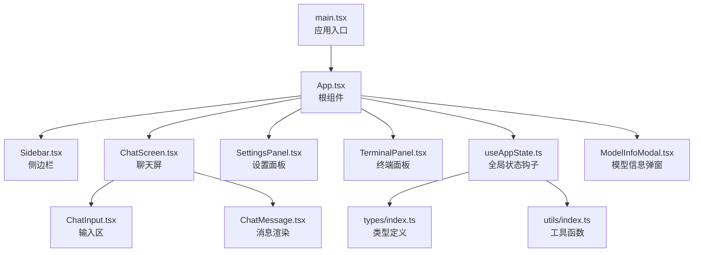
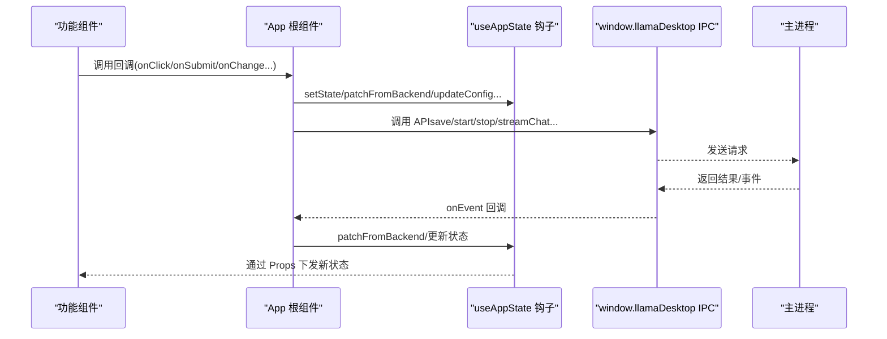
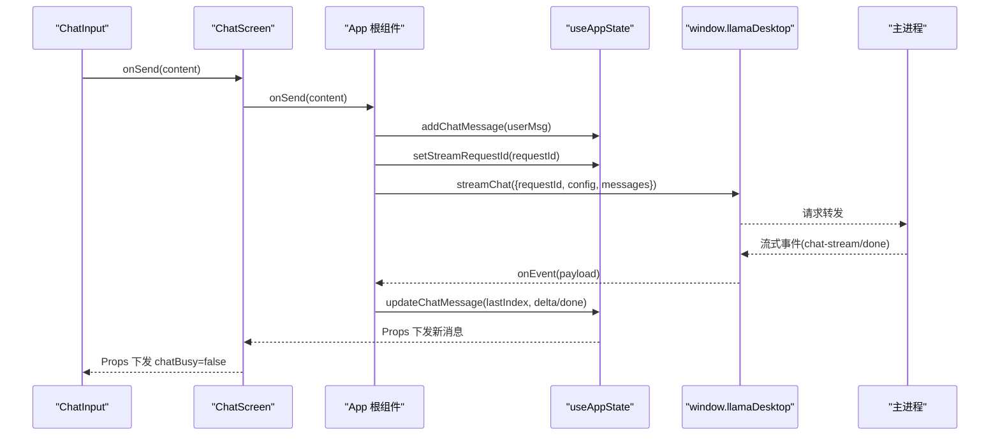
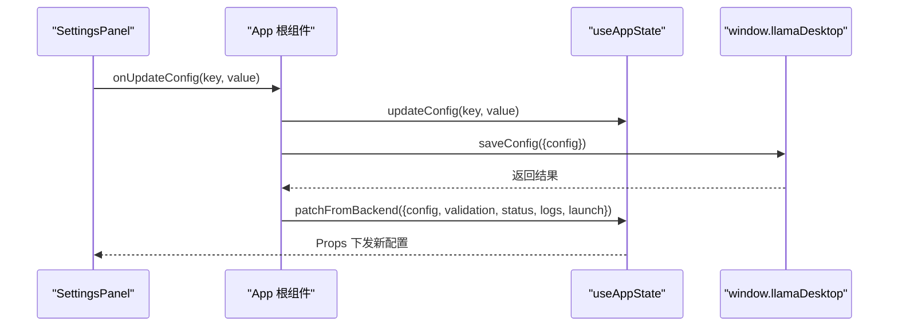
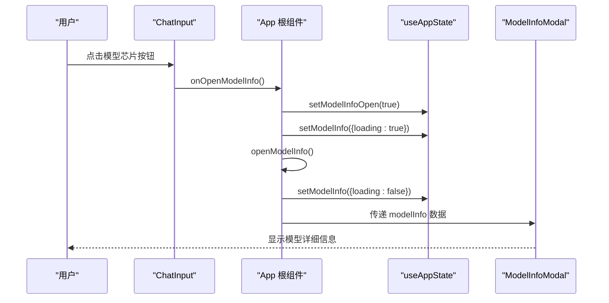
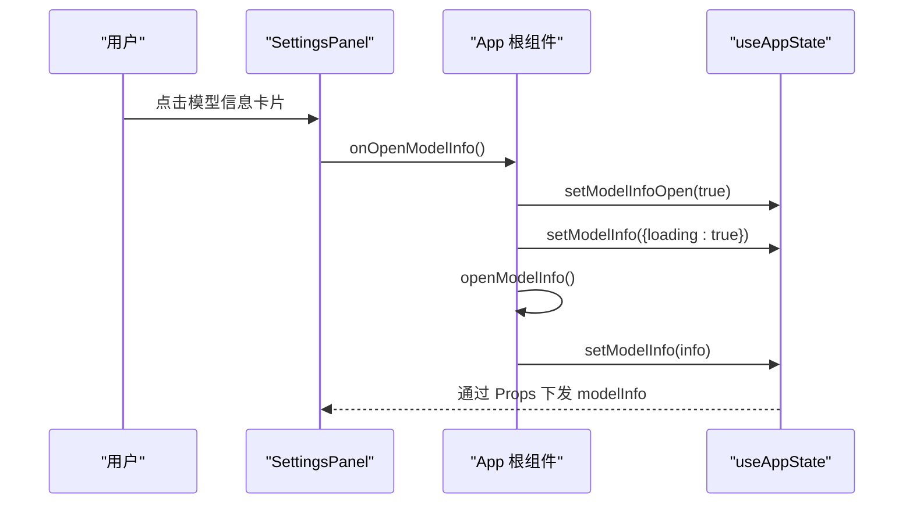
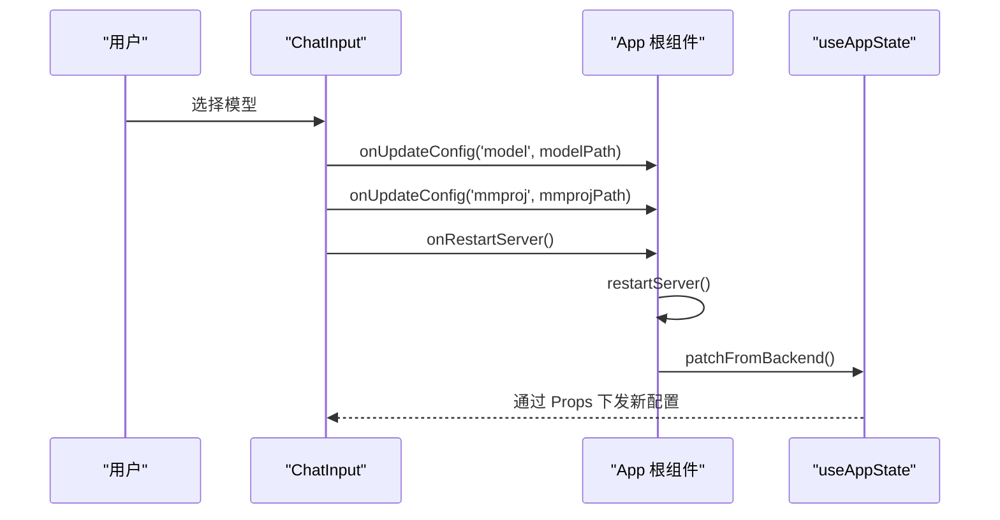
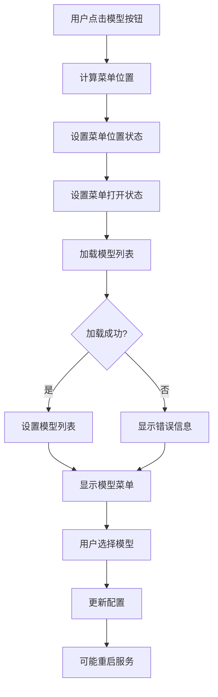
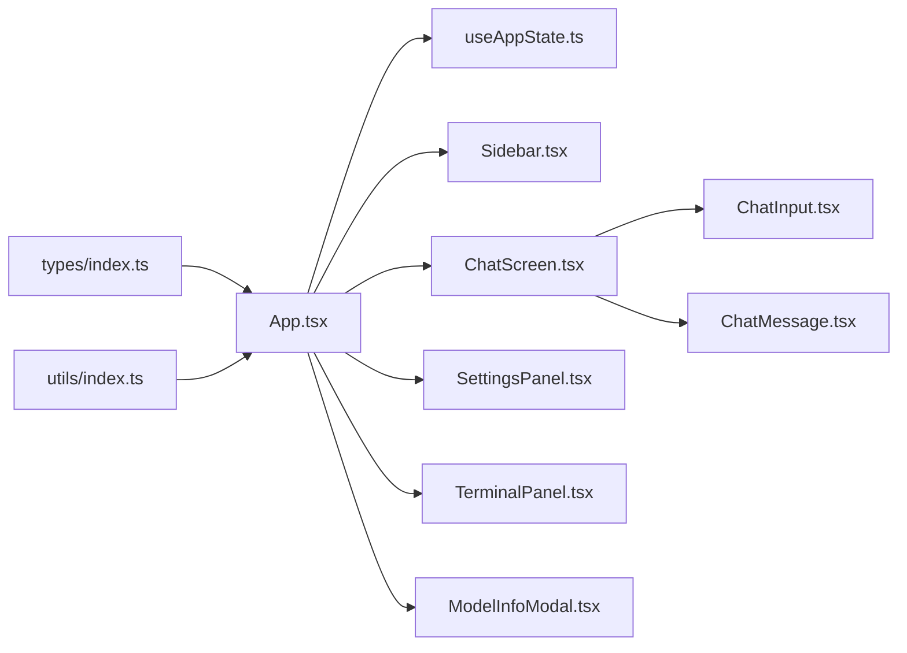

# 组件通信模式

<cite>
**本文档引用的文件**
- [App.tsx](file://renderer/src/App.tsx)
- [main.tsx](file://renderer/src/main.tsx)
- [useAppState.ts](file://renderer/src/hooks/useAppState.ts)
- [ChatScreen.tsx](file://renderer/src/components/ChatScreen.tsx)
- [ChatInput.tsx](file://renderer/src/components/ChatInput.tsx)
- [ChatMessage.tsx](file://renderer/src/components/ChatMessage.tsx)
- [Sidebar.tsx](file://renderer/src/components/Sidebar.tsx)
- [SettingsPanel.tsx](file://renderer/src/components/SettingsPanel.tsx)
- [TerminalPanel.tsx](file://renderer/src/components/TerminalPanel.tsx)
- [ModelInfoModal.tsx](file://renderer/src/components/ModelInfoModal.tsx)
- [index.ts](file://renderer/src/types/index.ts)
- [index.ts](file://renderer/src/utils/index.ts)
</cite>

## 更新摘要
**变更内容**
- 新增模型选择界面组件通信分析
- 增强 ChatInput 中模型芯片按钮的交互设计
- 新增 SettingsPanel 中模型信息卡片的展示机制
- 完善 ModelInfoModal 的详细信息展示流程
- 扩展组件间通信模式，包括模型选择与信息展示

## 目录
1. [简介](#简介)
2. [项目结构](#项目结构)
3. [核心组件](#核心组件)
4. [架构总览](#架构总览)
5. [详细组件分析](#详细组件分析)
6. [模型选择与信息展示通信模式](#模型选择与信息展示通信模式)
7. [依赖关系分析](#依赖关系分析)
8. [性能考量](#性能考量)
9. [故障排查指南](#故障排查指南)
10. [结论](#结论)
11. [附录](#附录)

## 简介
本文件系统性梳理 illama-desktop 渲染进程中的组件通信模式，围绕 Props 传递、事件回调、Context 使用与状态提升策略进行深入分析。重点覆盖：
- 父子组件通信：回调函数传递、事件处理器封装、数据流向控制
- 兄弟组件通信：通过共同父组件传递与状态提升
- 跨层级通信：通过全局状态钩子与主进程事件通道实现
- 模型选择界面通信：新增的模型芯片按钮与信息卡片交互
- 性能优化：避免不必要重渲染、事件绑定优化、内存泄漏防护
- 实战示例：结合具体文件路径定位实际应用场景

## 项目结构
渲染层采用"根组件聚合 + 自定义 Hook 管理全局状态 + 功能组件拆分"的组织方式。根组件负责状态聚合与事件桥接，功能组件通过 Props 接收状态与回调，形成清晰的数据流与控制流。

图表来源
- [main.tsx:1-34](file://renderer/src/main.tsx#L1-L34)
- [App.tsx:1-862](file://renderer/src/App.tsx#L1-L862)
- [Sidebar.tsx:1-228](file://renderer/src/components/Sidebar.tsx#L1-L228)
- [ChatScreen.tsx:1-392](file://renderer/src/components/ChatScreen.tsx#L1-L392)
- [ChatInput.tsx:1-369](file://renderer/src/components/ChatInput.tsx#L1-L369)
- [ChatMessage.tsx:1-237](file://renderer/src/components/ChatMessage.tsx#L1-L237)
- [SettingsPanel.tsx:1-811](file://renderer/src/components/SettingsPanel.tsx#L1-L811)
- [TerminalPanel.tsx:1-53](file://renderer/src/components/TerminalPanel.tsx#L1-L53)
- [ModelInfoModal.tsx:1-98](file://renderer/src/components/ModelInfoModal.tsx#L1-L98)
- [useAppState.ts:1-555](file://renderer/src/hooks/useAppState.ts#L1-L555)
- [index.ts:1-224](file://renderer/src/types/index.ts#L1-L224)
- [index.ts:1-165](file://renderer/src/utils/index.ts#L1-L165)

章节来源
- [main.tsx:1-34](file://renderer/src/main.tsx#L1-L34)
- [App.tsx:1-862](file://renderer/src/App.tsx#L1-L862)

## 核心组件
- 根组件 App：统一调度业务逻辑、状态同步、IPC 事件监听与派发，向下通过 Props 传递状态与回调。
- 自定义 Hook useAppState：集中管理应用状态与动作，提供稳定的全局状态访问点。
- 功能组件：Sidebar、ChatScreen、ChatInput、ChatMessage、SettingsPanel、TerminalPanel、ModelInfoModal 等，均通过 Props 与回调实现与父组件的通信。

章节来源
- [App.tsx:21-862](file://renderer/src/App.tsx#L21-L862)
- [useAppState.ts:69-555](file://renderer/src/hooks/useAppState.ts#L69-L555)

## 架构总览
渲染层通过"状态钩子 + 根组件桥接 + 主进程 IPC"实现跨层级通信与全局状态共享。事件流经主进程，再由根组件统一注入到各功能组件。

图表来源
- [App.tsx:624-728](file://renderer/src/App.tsx#L624-L728)
- [useAppState.ts:96-102](file://renderer/src/hooks/useAppState.ts#L96-L102)
- [index.ts:2-44](file://renderer/src/types/index.ts#L2-L44)

## 详细组件分析

### 父子组件通信：Props 传递与回调封装
- 父组件向子组件传递状态与回调，子组件通过回调触发父组件动作，形成单向数据流。
- 示例路径：
  - 根组件向聊天屏传递消息列表、输入框内容、附件、配置、忙碌状态与各类回调：[App.tsx:800-820](file://renderer/src/App.tsx#L800-L820)
  - 聊天屏向输入区传递输入值、附件、配置、忙碌状态与回调：[ChatScreen.tsx:104-131](file://renderer/src/components/ChatScreen.tsx#L104-L131)
  - 输入区向父组件传递发送、中止、附件选择、技能选择、模型信息打开等回调：[ChatInput.tsx:151-198](file://renderer/src/components/ChatInput.tsx#L151-L198)

章节来源
- [App.tsx:800-820](file://renderer/src/App.tsx#L800-L820)
- [ChatScreen.tsx:104-131](file://renderer/src/components/ChatScreen.tsx#L104-L131)
- [ChatInput.tsx:151-198](file://renderer/src/components/ChatInput.tsx#L151-L198)

### 事件回调与数据流向控制
- 回调封装：根组件将业务逻辑封装为 useCallback，确保回调引用稳定，避免子组件不必要重渲染。
  - 发送消息、中止、重试、变体切换、复制、编辑、删除等：[App.tsx:209-520](file://renderer/src/App.tsx#L209-L520)
- 数据流向：状态变更通过 Hook setState -> 根组件 patchFromBackend -> IPC -> 主进程，再由 IPC 事件回推至根组件，最终通过 Props 下发给子组件。
  - IPC 事件监听与处理：[App.tsx:656-728](file://renderer/src/App.tsx#L656-L728)
  - 状态钩子 patchFromBackend：[useAppState.ts:96-102](file://renderer/src/hooks/useAppState.ts#L96-L102)

章节来源
- [App.tsx:209-520](file://renderer/src/App.tsx#L209-L520)
- [App.tsx:656-728](file://renderer/src/App.tsx#L656-L728)
- [useAppState.ts:96-102](file://renderer/src/hooks/useAppState.ts#L96-L102)

### 兄弟组件通信：通过共同父组件与状态提升
- 兄弟组件之间无直接通信，通过共同父组件提升状态与回调实现协作。
  - 侧边栏与聊天屏：侧边栏负责历史会话选择与搜索，聊天屏负责消息展示与输入，二者通过 App 提升的状态与回调联动：[Sidebar.tsx:19-33](file://renderer/src/components/Sidebar.tsx#L19-L33)、[ChatScreen.tsx:100-123](file://renderer/src/components/ChatScreen.tsx#L100-L123)
  - 设置面板与聊天屏：设置面板负责配置更新，聊天屏根据配置渲染与行为调整，二者通过 App 提升的 config 与 updateConfig 协作：[SettingsPanel.tsx:18-21](file://renderer/src/components/SettingsPanel.tsx#L18-L21)、[ChatScreen.tsx:138-140](file://renderer/src/components/ChatScreen.tsx#L138-L140)

章节来源
- [Sidebar.tsx:19-33](file://renderer/src/components/Sidebar.tsx#L19-L33)
- [ChatScreen.tsx:100-123](file://renderer/src/components/ChatScreen.tsx#L100-L123)
- [SettingsPanel.tsx:18-21](file://renderer/src/components/SettingsPanel.tsx#L18-L21)

### 跨层级通信：Context 使用与全局状态共享
- 全局状态共享：通过 useAppState 钩子集中管理 AppState，所有组件通过该钩子访问与更新状态，实现跨层级共享。
  - 钩子导出状态与动作：[useAppState.ts:515-551](file://renderer/src/hooks/useAppState.ts#L515-L551)
  - 根组件解构 useAppState 并向下传递：[App.tsx:22-53](file://renderer/src/App.tsx#L22-L53)
- Context 使用：项目中未显式使用 React Context，而是通过自定义 Hook 与 Props 逐层传递实现类似效果，具备更好的可控性与可追踪性。

章节来源
- [useAppState.ts:515-551](file://renderer/src/hooks/useAppState.ts#L515-L551)
- [App.tsx:22-53](file://renderer/src/App.tsx#L22-L53)

### 组件通信序列：发送消息流程

图表来源
- [ChatInput.tsx:151-198](file://renderer/src/components/ChatInput.tsx#L151-L198)
- [ChatScreen.tsx:306-322](file://renderer/src/components/ChatScreen.tsx#L306-L322)
- [App.tsx:209-320](file://renderer/src/App.tsx#L209-L320)
- [App.tsx:656-728](file://renderer/src/App.tsx#L656-L728)
- [useAppState.ts:396-411](file://renderer/src/hooks/useAppState.ts#L396-L411)
- [index.ts:18-20](file://renderer/src/types/index.ts#L18-L20)

### 组件通信序列：设置面板与配置更新

图表来源
- [SettingsPanel.tsx:310-313](file://renderer/src/components/SettingsPanel.tsx#L310-L313)
- [useAppState.ts:364-370](file://renderer/src/hooks/useAppState.ts#L364-L370)
- [App.tsx:69-89](file://renderer/src/App.tsx#L69-L89)
- [index.ts:4-8](file://renderer/src/types/index.ts#L4-L8)

### 复杂逻辑组件：消息渲染与性能优化
- 消息渲染优化：通过 memo 包裹消息项，自定义比较逻辑避免流式输出时对非流式消息的过度重渲染。
  - MessageItem memo 与比较函数：[ChatScreen.tsx:38-98](file://renderer/src/components/ChatScreen.tsx#L38-L98)
- 流式输出处理：根组件监听 IPC 事件，增量更新消息内容，定期保存会话，避免频繁重渲染。
  - 事件处理与更新：[App.tsx:656-728](file://renderer/src/App.tsx#L656-L728)
- 附件与技能菜单：输入区通过状态控制菜单显示与位置，点击外部区域关闭菜单，避免全局事件泄漏。
  - 菜单状态与点击外部关闭：[ChatInput.tsx:42-59](file://renderer/src/components/ChatInput.tsx#L42-L59)

章节来源
- [ChatScreen.tsx:38-98](file://renderer/src/components/ChatScreen.tsx#L38-L98)
- [App.tsx:656-728](file://renderer/src/App.tsx#L656-L728)
- [ChatInput.tsx:42-59](file://renderer/src/components/ChatInput.tsx#L42-L59)

## 模型选择与信息展示通信模式

### 模型芯片按钮通信
新增的模型芯片按钮位于 ChatInput 组件中，提供直观的模型选择界面。该按钮通过 onOpenModelInfo 回调与根组件通信，实现模型信息的展示与选择。

图表来源
- [ChatInput.tsx:264-276](file://renderer/src/components/ChatInput.tsx#L264-L276)
- [App.tsx:168-179](file://renderer/src/App.tsx#L168-L179)
- [useAppState.ts:475-481](file://renderer/src/hooks/useAppState.ts#L475-L481)
- [ModelInfoModal.tsx:59-97](file://renderer/src/components/ModelInfoModal.tsx#L59-L97)

### 模型信息卡片通信
SettingsPanel 中的模型信息卡片提供模型文件的快速查看功能。用户点击卡片时触发 onOpenModelInfo 回调，实现与模型信息弹窗的通信。

图表来源
- [SettingsPanel.tsx:502-532](file://renderer/src/components/SettingsPanel.tsx#L502-L532)
- [App.tsx:168-179](file://renderer/src/App.tsx#L168-L179)
- [useAppState.ts:475-481](file://renderer/src/hooks/useAppState.ts#L475-L481)

### 模型选择流程
当用户从模型菜单中选择特定模型时，ChatInput 组件会通过 onUpdateConfig 回调更新配置，并可能触发服务重启以应用新的模型设置。

图表来源
- [ChatInput.tsx:140-165](file://renderer/src/components/ChatInput.tsx#L140-L165)
- [App.tsx:139-166](file://renderer/src/App.tsx#L139-L166)
- [useAppState.ts:364-370](file://renderer/src/hooks/useAppState.ts#L364-L370)

### 模型菜单状态管理
ChatInput 组件内部维护模型菜单的状态，包括菜单打开状态、位置计算、模型列表加载等。通过 useState 和 useEffect 实现完整的菜单交互逻辑。

图表来源
- [ChatInput.tsx:107-165](file://renderer/src/components/ChatInput.tsx#L107-L165)
- [ChatInput.tsx:123-136](file://renderer/src/components/ChatInput.tsx#L123-L136)

### 组件间通信模式总结
- **回调传递**：通过 onOpenModelInfo 回调实现跨组件通信
- **状态提升**：通过 useAppState 钩子集中管理模型信息状态
- **Props 下发**：根组件将 modelInfo 和 modelInfoOpen 状态通过 Props 下发给 ModelInfoModal
- **事件驱动**：用户交互触发事件，组件通过回调与根组件通信

章节来源
- [ChatInput.tsx:264-276](file://renderer/src/components/ChatInput.tsx#L264-L276)
- [SettingsPanel.tsx:502-532](file://renderer/src/components/SettingsPanel.tsx#L502-L532)
- [App.tsx:168-179](file://renderer/src/App.tsx#L168-L179)
- [ModelInfoModal.tsx:59-97](file://renderer/src/components/ModelInfoModal.tsx#L59-L97)

## 依赖关系分析
- 类型与工具：types/index.ts 定义了 IPC API、配置、状态、消息、会话等类型；utils/index.ts 提供转义、格式化、估算、日志过滤等工具。
- 组件依赖：ChatScreen 依赖 ChatInput 与 ChatMessage；Sidebar、SettingsPanel、TerminalPanel 与 App 通过 Props 通信；App 依赖 useAppState 与 types/utils；新增的 ModelInfoModal 与 App 通过 Props 通信。

图表来源
- [index.ts:1-224](file://renderer/src/types/index.ts#L1-L224)
- [index.ts:1-165](file://renderer/src/utils/index.ts#L1-L165)
- [App.tsx:1-862](file://renderer/src/App.tsx#L1-L862)
- [useAppState.ts:1-555](file://renderer/src/hooks/useAppState.ts#L1-L555)
- [Sidebar.tsx:1-228](file://renderer/src/components/Sidebar.tsx#L1-L228)
- [ChatScreen.tsx:1-392](file://renderer/src/components/ChatScreen.tsx#L1-L392)
- [ChatInput.tsx:1-369](file://renderer/src/components/ChatInput.tsx#L1-L369)
- [ChatMessage.tsx:1-237](file://renderer/src/components/ChatMessage.tsx#L1-L237)
- [SettingsPanel.tsx:1-811](file://renderer/src/components/SettingsPanel.tsx#L1-L811)
- [TerminalPanel.tsx:1-53](file://renderer/src/components/TerminalPanel.tsx#L1-L53)
- [ModelInfoModal.tsx:1-98](file://renderer/src/components/ModelInfoModal.tsx#L1-L98)

章节来源
- [index.ts:1-224](file://renderer/src/types/index.ts#L1-L224)
- [index.ts:1-165](file://renderer/src/utils/index.ts#L1-L165)

## 性能考量
- 避免不必要重渲染
  - 使用 memo 包裹消息项，自定义比较逻辑，减少流式输出时的重渲染：[ChatScreen.tsx:38-98](file://renderer/src/components/ChatScreen.tsx#L38-L98)
  - useCallback 封装回调，确保引用稳定，降低子组件重渲染概率：[App.tsx:209-520](file://renderer/src/App.tsx#L209-L520)
  - 模型信息弹窗使用条件渲染，避免不必要的 DOM 创建：[ModelInfoModal.tsx:60-61](file://renderer/src/components/ModelInfoModal.tsx#L60-L61)
- 事件绑定优化
  - 仅在需要时注册事件监听，使用 useRef 保存最新状态，避免闭包陷阱：[App.tsx:651-654](file://renderer/src/App.tsx#L651-L654)
  - 事件清理：在副作用返回中清理 IPC 监听与定时器，防止内存泄漏：[App.tsx:723-727](file://renderer/src/App.tsx#L723-L727)
  - 模型菜单的点击外部关闭事件在组件卸载时移除：[ChatInput.tsx:77-79](file://renderer/src/components/ChatInput.tsx#L77-L79)
- 内存泄漏防护
  - Toast 定时器在组件卸载时清理：[useAppState.ts:505-512](file://renderer/src/hooks/useAppState.ts#L505-L512)
  - 菜单点击外部关闭事件在组件卸载时移除：[ChatInput.tsx:77-79](file://renderer/src/components/ChatInput.tsx#L77-L79)
  - 模型信息弹窗的条件渲染避免长期占用内存：[ModelInfoModal.tsx:60-61](file://renderer/src/components/ModelInfoModal.tsx#L60-L61)

章节来源
- [ChatScreen.tsx:38-98](file://renderer/src/components/ChatScreen.tsx#L38-L98)
- [App.tsx:209-520](file://renderer/src/App.tsx#L209-L520)
- [App.tsx:651-654](file://renderer/src/App.tsx#L651-L654)
- [App.tsx:723-727](file://renderer/src/App.tsx#L723-L727)
- [useAppState.ts:505-512](file://renderer/src/hooks/useAppState.ts#L505-L512)
- [ChatInput.tsx:77-79](file://renderer/src/components/ChatInput.tsx#L77-L79)
- [ModelInfoModal.tsx:60-61](file://renderer/src/components/ModelInfoModal.tsx#L60-L61)

## 故障排查指南
- IPC 事件未生效
  - 检查 onEvent 注册与清理是否正确：[App.tsx:723-727](file://renderer/src/App.tsx#L723-L727)
  - 确认事件类型与 requestId 匹配：[App.tsx:662-721](file://renderer/src/App.tsx#L662-L721)
- 状态未更新
  - 确认 patchFromBackend 是否被调用以及 payload 结构是否正确：[useAppState.ts:96-102](file://renderer/src/hooks/useAppState.ts#L96-L102)
  - 检查 IPC 返回值是否包含所需字段：[index.ts:4-8](file://renderer/src/types/index.ts#L4-L8)
- 性能问题
  - 检查 memo 比较逻辑是否合理，避免遗漏关键属性：[ChatScreen.tsx:81-98](file://renderer/src/components/ChatScreen.tsx#L81-L98)
  - 避免在渲染期间创建新函数或对象，使用 useCallback/useMemo：[App.tsx:209-520](file://renderer/src/App.tsx#L209-L520)
- 模型选择问题
  - 检查 scanModels 调用是否成功：[ChatInput.tsx:123-136](file://renderer/src/components/ChatInput.tsx#L123-L136)
  - 确认 onUpdateConfig 回调是否正确更新配置：[ChatInput.tsx:140-165](file://renderer/src/components/ChatInput.tsx#L140-L165)
  - 验证服务重启逻辑是否正常执行：[App.tsx:139-166](file://renderer/src/App.tsx#L139-L166)

章节来源
- [App.tsx:723-727](file://renderer/src/App.tsx#L723-L727)
- [useAppState.ts:96-102](file://renderer/src/hooks/useAppState.ts#L96-L102)
- [index.ts:4-8](file://renderer/src/types/index.ts#L4-L8)
- [ChatScreen.tsx:81-98](file://renderer/src/components/ChatScreen.tsx#L81-L98)
- [App.tsx:209-520](file://renderer/src/App.tsx#L209-L520)
- [ChatInput.tsx:123-136](file://renderer/src/components/ChatInput.tsx#L123-L136)
- [ChatInput.tsx:140-165](file://renderer/src/components/ChatInput.tsx#L140-L165)
- [App.tsx:139-166](file://renderer/src/App.tsx#L139-L166)

## 结论
illama-desktop 的组件通信以"Props 传递 + 回调封装 + 全局状态钩子 + 主进程 IPC"为核心，实现了清晰的单向数据流与高效的跨层级通信。通过 useCallback、memo、事件清理与工具函数的配合，项目在保证功能完整性的同时兼顾了性能与稳定性。

新增的模型选择界面增强了用户体验，通过 ChatInput 中的模型芯片按钮和 SettingsPanel 中的模型信息卡片，用户可以直观地管理和查看模型信息。ModelInfoModal 提供了详细的模型参数展示，完善了整个模型管理生态。

兄弟组件间的协作通过共同父组件提升状态与回调实现，避免了 Context 的复杂性，提升了可维护性。模型选择与信息展示的通信模式体现了现代 React 应用的最佳实践，通过回调、状态提升和条件渲染实现了高效且可维护的组件通信。

## 附录
- 代码示例路径（不含具体代码内容）：
  - 发送消息回调封装与 IPC 调用：[App.tsx:209-320](file://renderer/src/App.tsx#L209-L320)
  - 事件监听与增量更新：[App.tsx:656-728](file://renderer/src/App.tsx#L656-L728)
  - 消息渲染优化（memo 与比较函数）：[ChatScreen.tsx:38-98](file://renderer/src/components/ChatScreen.tsx#L38-L98)
  - 设置面板配置更新流程：[SettingsPanel.tsx:310-313](file://renderer/src/components/SettingsPanel.tsx#L310-L313)
  - 侧边栏与聊天屏协作：[Sidebar.tsx:19-33](file://renderer/src/components/Sidebar.tsx#L19-L33)、[ChatScreen.tsx:100-123](file://renderer/src/components/ChatScreen.tsx#L100-L123)
  - 模型芯片按钮通信流程：[ChatInput.tsx:264-276](file://renderer/src/components/ChatInput.tsx#L264-L276)、[App.tsx:168-179](file://renderer/src/App.tsx#L168-L179)
  - 模型信息卡片交互：[SettingsPanel.tsx:502-532](file://renderer/src/components/SettingsPanel.tsx#L502-L532)、[ModelInfoModal.tsx:59-97](file://renderer/src/components/ModelInfoModal.tsx#L59-L97)
  - 模型选择与配置更新：[ChatInput.tsx:140-165](file://renderer/src/components/ChatInput.tsx#L140-L165)、[App.tsx:139-166](file://renderer/src/App.tsx#L139-L166)