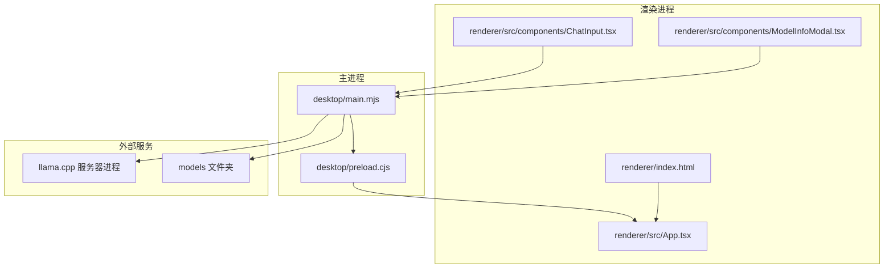
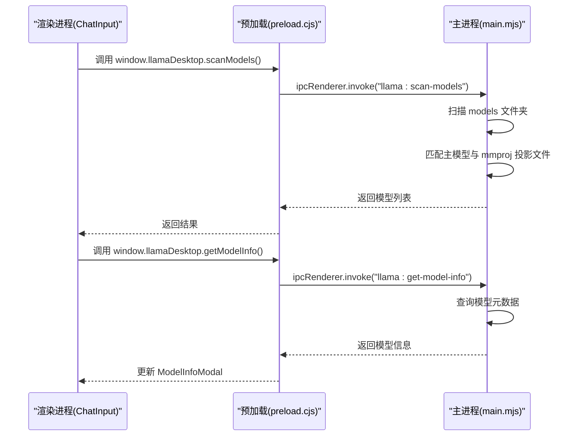
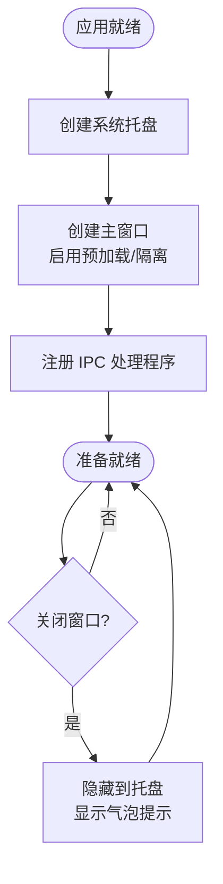
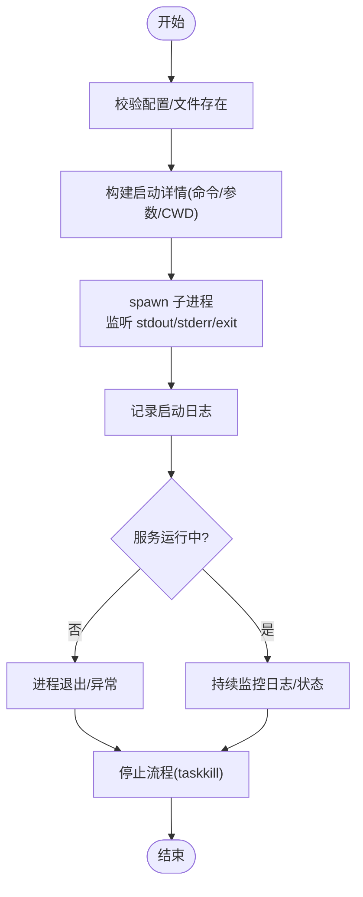
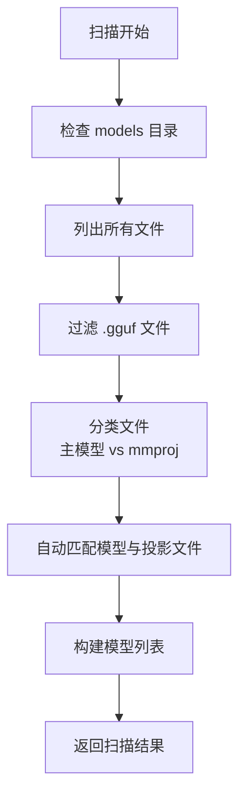
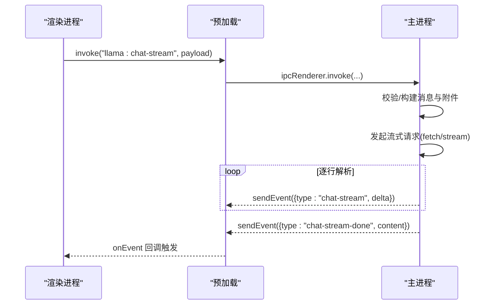
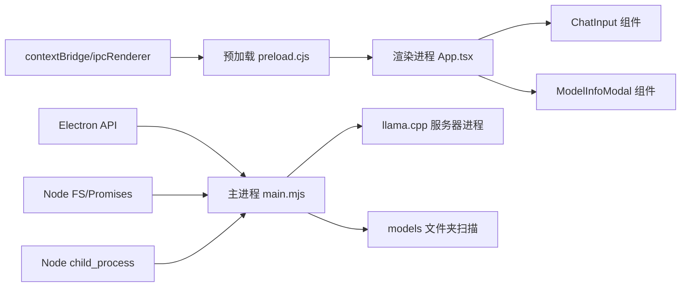

# 进程架构设计

<cite>
**本文引用的文件**
- [desktop/main.mjs](file://desktop/main.mjs)
- [desktop/preload.cjs](file://desktop/preload.cjs)
- [renderer/index.html](file://renderer/index.html)
- [renderer/src/App.tsx](file://renderer/src/App.tsx)
- [renderer/src/components/ChatInput.tsx](file://renderer/src/components/ChatInput.tsx)
- [renderer/src/components/ModelInfoModal.tsx](file://renderer/src/components/ModelInfoModal.tsx)
- [package.json](file://package.json)
</cite>

## 更新摘要
**变更内容**
- 新增模型扫描功能：主进程实现 models 文件夹扫描逻辑，自动匹配主模型与 mmproj 投影文件
- 新增模型选择界面：渲染进程 ChatInput 组件提供模型选择菜单和扫描功能
- 新增模型信息展示：ModelInfoModal 组件显示模型详细信息
- 增强 IPC 事件：新增 llama:scan-models 和 llama:get-model-info 事件处理

## 目录
1. [简介](#简介)
2. [项目结构](#项目结构)
3. [核心组件](#核心组件)
4. [架构总览](#架构总览)
5. [详细组件分析](#详细组件分析)
6. [依赖关系分析](#依赖关系分析)
7. [性能考量](#性能考量)
8. [故障排查指南](#故障排查指南)
9. [结论](#结论)

## 简介
本文件系统性梳理 illama-desktop 的进程架构设计，围绕基于 Electron 的双进程模型（主进程与渲染进程）进行深入分析。重点覆盖：
- 主进程职责与安全边界：窗口生命周期、系统托盘、llama.cpp 服务器进程管理、文件系统访问与权限控制
- 预加载脚本的安全隔离机制：如何在受限环境中暴露必要 API
- 进程间通信（IPC）安全模型：事件类型系统、参数校验与错误处理策略
- 内存管理与资源清理最佳实践：进程崩溃恢复与优雅退出
- **新增** 模型管理系统：主进程模型扫描逻辑与渲染进程模型选择界面
- 实际代码映射与可视化图示，帮助读者快速定位实现细节

## 项目结构
illama-desktop 采用标准 Electron 结构，主进程入口位于 desktop/main.mjs，预加载脚本位于 desktop/preload.cjs，渲染进程由 renderer/index.html 及其 React 应用组成。package.json 指定主进程入口为 desktop/main.mjs。

**图表来源**
- [desktop/main.mjs](file://desktop/main.mjs)
- [desktop/preload.cjs](file://desktop/preload.cjs)
- [renderer/index.html](file://renderer/index.html)
- [renderer/src/App.tsx](file://renderer/src/App.tsx)
- [renderer/src/components/ChatInput.tsx](file://renderer/src/components/ChatInput.tsx)
- [renderer/src/components/ModelInfoModal.tsx](file://renderer/src/components/ModelInfoModal.tsx)

**章节来源**
- [package.json](file://package.json)
- [desktop/main.mjs](file://desktop/main.mjs)
- [desktop/preload.cjs](file://desktop/preload.cjs)
- [renderer/index.html](file://renderer/index.html)
- [renderer/src/App.tsx](file://renderer/src/App.tsx)
- [renderer/src/components/ChatInput.tsx](file://renderer/src/components/ChatInput.tsx)
- [renderer/src/components/ModelInfoModal.tsx](file://renderer/src/components/ModelInfoModal.tsx)

## 核心组件
- 主进程（desktop/main.mjs）
  - 窗口生命周期管理（创建、显示、最小化至托盘、关闭行为）
  - 系统托盘创建与菜单更新（打开窗口、查看服务状态、停止服务、退出）
  - llama.cpp 服务器进程管理（启动、停止、日志采集、健康检查）
  - 文件系统访问与配置持久化（TOML 解析、桌面状态文件写入）
  - IPC 事件注册与处理（状态查询、配置保存、聊天补全、流式聊天、文件选择等）
  - **新增** 模型扫描功能（扫描 models 文件夹，自动匹配主模型与 mmproj 投影文件）
  - **新增** 模型信息查询（获取模型元数据和属性信息）
  - 技能（Skill）管理（列出、创建、读取、删除、生成）

- 预加载脚本（desktop/preload.cjs）
  - 通过 contextBridge 在渲染进程上下文中暴露受控 API
  - 以 invoke/send 形式封装 IPC 调用，统一事件命名空间（llama:*）

- 渲染进程（renderer/index.html + App.tsx）
  - 通过 window.llamaDesktop 调用主进程能力
  - 监听主进程推送的事件（状态、日志、流式聊天增量）
  - 管理 UI 状态、会话、附件、主题切换等
  - **新增** 模型选择界面（ChatInput 组件）
  - **新增** 模型信息展示（ModelInfoModal 组件）

**章节来源**
- [desktop/main.mjs](file://desktop/main.mjs)
- [desktop/preload.cjs](file://desktop/preload.cjs)
- [renderer/index.html](file://renderer/index.html)
- [renderer/src/App.tsx](file://renderer/src/App.tsx)
- [renderer/src/components/ChatInput.tsx](file://renderer/src/components/ChatInput.tsx)
- [renderer/src/components/ModelInfoModal.tsx](file://renderer/src/components/ModelInfoModal.tsx)

## 架构总览
双进程架构遵循 Electron 安全最佳实践：主进程拥有 Node.js 能力与系统权限，渲染进程仅通过预加载脚本暴露的 API 与主进程通信。主进程负责：
- 窗口与托盘生命周期
- llama.cpp 服务器进程生命周期与监控
- 文件系统与网络访问
- IPC 事件的类型化处理与错误传播
- **新增** 模型文件扫描与匹配
- **新增** 模型元数据查询

渲染进程负责：
- 用户交互与 UI 呈现
- 通过 window.llamaDesktop 调用主进程能力
- 实时接收主进程推送的状态、日志与流式聊天事件
- **新增** 模型选择与信息展示

**图表来源**
- [desktop/preload.cjs](file://desktop/preload.cjs)
- [desktop/main.mjs](file://desktop/main.mjs)
- [renderer/src/components/ChatInput.tsx](file://renderer/src/components/ChatInput.tsx)
- [renderer/src/components/ModelInfoModal.tsx](file://renderer/src/components/ModelInfoModal.tsx)

## 详细组件分析

### 主进程：窗口与托盘管理
- 窗口创建与行为
  - 创建 BrowserWindow，启用预加载脚本、禁用 Node 集成、开启上下文隔离
  - 关闭窗口时最小化到托盘，首次隐藏显示气泡提示
  - 禁用默认菜单，提供快捷键打开开发者工具
- 系统托盘
  - 创建托盘图标，右键菜单包含打开窗口、查看服务状态、停止服务、退出
  - 动态更新托盘提示与菜单项可用性

**图表来源**
- [desktop/main.mjs](file://desktop/main.mjs)

**章节来源**
- [desktop/main.mjs](file://desktop/main.mjs)

### 主进程：llama.cpp 服务器进程管理
- 启动流程
  - 校验配置与文件存在性（启动器/服务器/模型）
  - 构建启动详情（命令、参数、工作目录、预览命令）
  - spawn 子进程，设置环境变量（NO_COLOR、PATH），监听 stdout/stderr/exit
  - 记录启动日志与关键参数
- 停止流程
  - 通过 taskkill 终止子进程（Windows）
  - 更新状态并清理引用
- 健康检查
  - 通过 HTTP 请求探测服务端点，返回状态与 URL

**图表来源**
- [desktop/main.mjs](file://desktop/main.mjs)

**章节来源**
- [desktop/main.mjs](file://desktop/main.mjs)

### 主进程：模型扫描与管理
- 模型扫描功能
  - 扫描项目根目录下的 models 文件夹
  - 过滤 .gguf 文件，分离主模型和 mmproj 投影文件
  - 自动匹配主模型与对应的 mmproj 文件
  - 支持多种量化级别的模型文件识别
- 模型信息查询
  - 从服务器 API 和本地文件系统获取模型元数据
  - 提供模型名称、参数规模、量化级别、文件大小等详细信息
  - 支持从 /v1/models 和 /props 接口获取模型信息

**图表来源**
- [desktop/main.mjs](file://desktop/main.mjs)

**章节来源**
- [desktop/main.mjs](file://desktop/main.mjs)

### 主进程：IPC 事件与安全模型
- 事件类型系统
  - 统一以 "llama:*" 命名空间，区分同步（invoke）与异步（send）
  - 事件类型包括：状态查询、配置保存、服务器启停、健康检查、聊天补全、流式聊天、文件选择、窗口控制、技能管理、**模型扫描、模型信息查询**
- 参数校验与错误处理
  - 对输入参数进行类型转换与默认值处理（如数值、布尔、JSON）
  - 对文件路径、命令行参数进行严格校验与错误抛出
  - 对网络请求设置超时，捕获异常并返回结构化错误
- 事件推送
  - 主进程通过 sendEvent 向渲染进程推送状态、日志、流式聊天增量与完成事件
  - 渲染进程通过 onEvent 订阅并更新 UI

**图表来源**
- [desktop/preload.cjs](file://desktop/preload.cjs)
- [desktop/main.mjs](file://desktop/main.mjs)

**章节来源**
- [desktop/preload.cjs](file://desktop/preload.cjs)
- [desktop/main.mjs](file://desktop/main.mjs)

### 预加载脚本：安全隔离与 API 暴露
- 通过 contextBridge.exposeInMainWorld 暴露有限 API 集合
- 仅暴露必要方法（状态、配置、服务器启停、聊天、文件选择、窗口控制、技能管理、**模型扫描、模型信息查询**）
- 以 invoke/send 形式封装 IPC，统一事件命名空间，便于主进程侧集中处理

**章节来源**
- [desktop/preload.cjs](file://desktop/preload.cjs)

### 渲染进程：UI 与事件订阅
- 初始化阶段从主进程拉取初始状态
- 订阅主进程推送的事件（状态、日志、流式聊天增量/完成）
- 通过 window.llamaDesktop 调用主进程能力，驱动 UI 更新与业务逻辑
- **新增** 模型选择界面（ChatInput 组件）
- **新增** 模型信息展示（ModelInfoModal 组件）

**章节来源**
- [renderer/src/App.tsx](file://renderer/src/App.tsx)
- [renderer/index.html](file://renderer/index.html)

### 模型管理功能
- 模型扫描界面
  - ChatInput 组件提供模型选择按钮和菜单
  - 点击按钮时调用 scanModels API 扫描 models 文件夹
  - 支持加载状态显示和错误处理
- 模型信息展示
  - ModelInfoModal 组件显示模型详细信息
  - 包括模型名称、参数规模、量化级别、文件大小等字段
  - 支持中英文双语显示

**章节来源**
- [renderer/src/components/ChatInput.tsx](file://renderer/src/components/ChatInput.tsx)
- [renderer/src/components/ModelInfoModal.tsx](file://renderer/src/components/ModelInfoModal.tsx)

### 技能（Skill）管理
- 列出、创建、读取、删除、生成 SKILL.md
- 自动生成遵循固定 Frontmatter 格式的技能定义
- 通过本地 LLM 生成技能内容，支持流式与非流式两种模式

**章节来源**
- [desktop/main.mjs](file://desktop/main.mjs)

## 依赖关系分析
- 主进程依赖
  - Electron API：BrowserWindow、Tray、Menu、dialog、ipcMain、nativeImage、shell、app
  - Node.js：child_process（spawn）、fs/promises、path、url
  - **新增** 文件系统操作：readdir、stat 等用于模型扫描
- 预加载脚本依赖
  - Electron：contextBridge、ipcRenderer
- 渲染进程依赖
  - React 生态与 Ant Design X 组件库
  - 通过 window.llamaDesktop 调用主进程能力
  - **新增** 模型选择和信息展示组件

**图表来源**
- [desktop/main.mjs](file://desktop/main.mjs)
- [desktop/preload.cjs](file://desktop/preload.cjs)
- [renderer/src/App.tsx](file://renderer/src/App.tsx)
- [renderer/src/components/ChatInput.tsx](file://renderer/src/components/ChatInput.tsx)
- [renderer/src/components/ModelInfoModal.tsx](file://renderer/src/components/ModelInfoModal.tsx)

**章节来源**
- [desktop/main.mjs](file://desktop/main.mjs)
- [desktop/preload.cjs](file://desktop/preload.cjs)
- [renderer/src/App.tsx](file://renderer/src/App.tsx)
- [renderer/src/components/ChatInput.tsx](file://renderer/src/components/ChatInput.tsx)
- [renderer/src/components/ModelInfoModal.tsx](file://renderer/src/components/ModelInfoModal.tsx)

## 性能考量
- 流式聊天处理
  - 使用 fetch + ReadableStream 逐行解析 SSE，累积增量内容并实时推送
  - 对超长文本进行截断与警告提示，避免 UI 卡顿
- 日志压缩与去噪
  - 过滤重复例行日志、ANSI 转义序列、中间流片段，保留关键信息
- 进程资源管理
  - 子进程退出后及时清理引用，避免句柄泄漏
  - 优雅退出时停止服务器进程，确保资源回收
- **新增** 模型扫描优化
  - 异步扫描 models 文件夹，避免阻塞主线程
  - 缓存扫描结果，减少重复扫描开销

## 故障排查指南
- 服务器启动失败
  - 检查配置文件路径、模型路径、启动器路径是否存在
  - 查看主进程日志（logs）与状态（status），关注 stderr 输出
- 流式聊天无响应
  - 确认服务端点可达（health 检查）
  - 检查网络超时设置与请求参数（温度、top_p、max_tokens 等）
- 窗口关闭后无法恢复
  - 确认托盘菜单"打开"选项可用，点击恢复窗口
- 进程崩溃或卡死
  - 通过托盘菜单"停止服务"强制终止，或在任务管理器中结束进程
  - 重新启动服务并观察日志
- **新增** 模型扫描失败
  - 检查 models 文件夹是否存在且可读
  - 确认 .gguf 文件格式正确
  - 验证 mmproj 文件命名规范（包含 mmproj 关键字）
- **新增** 模型信息获取失败
  - 确认 llama.cpp 服务器正常运行
  - 检查 /v1/models 和 /props 接口是否可访问

**章节来源**
- [desktop/main.mjs](file://desktop/main.mjs)
- [renderer/src/App.tsx](file://renderer/src/App.tsx)
- [renderer/src/components/ChatInput.tsx](file://renderer/src/components/ChatInput.tsx)
- [renderer/src/components/ModelInfoModal.tsx](file://renderer/src/components/ModelInfoModal.tsx)

## 结论
illama-desktop 的双进程架构清晰地划分了职责边界：主进程承担系统级能力与安全控制，渲染进程专注 UI 与交互体验。通过预加载脚本的安全桥接与严格的 IPC 事件模型，系统在保证安全性的同时提供了丰富的本地推理能力。结合完善的日志压缩、流式处理与托盘管理，整体具备良好的可用性与可维护性。

**新增的模型管理系统进一步增强了应用的功能完整性**：主进程的模型扫描逻辑能够自动发现和匹配模型文件，渲染进程的模型选择界面为用户提供了直观的模型管理体验。这些功能与现有的聊天、技能管理等功能形成了完整的本地 AI 应用生态，为用户提供了从模型选择到实际使用的全流程支持。