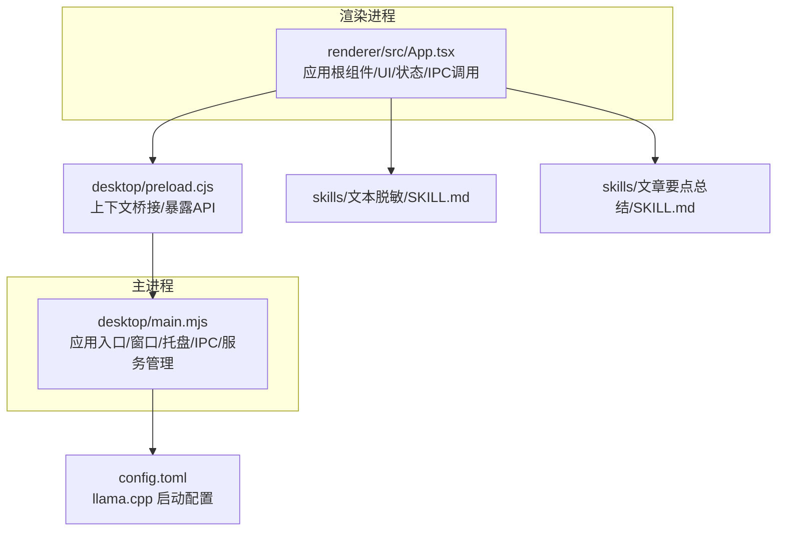
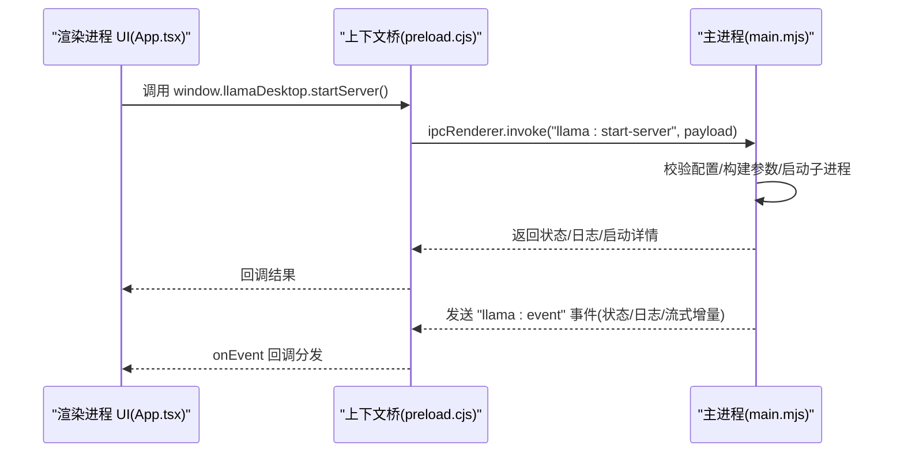
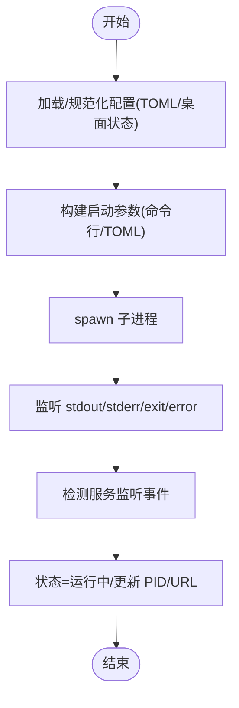
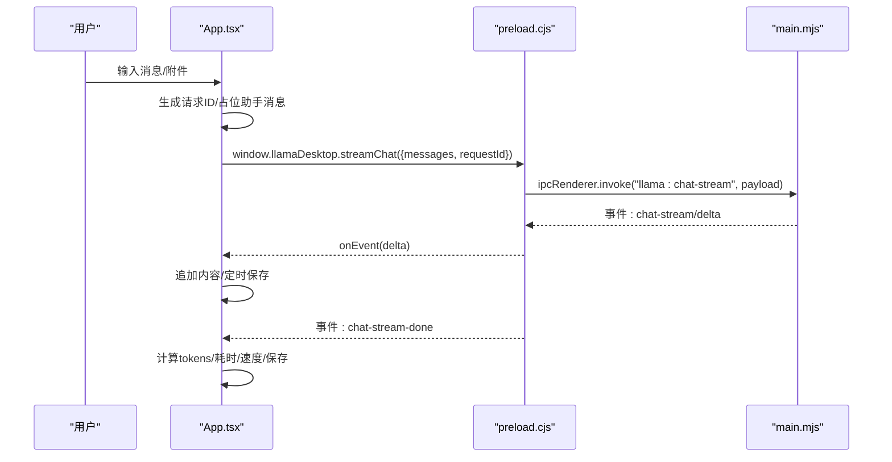
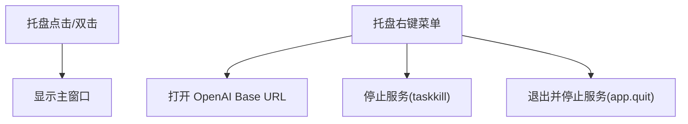
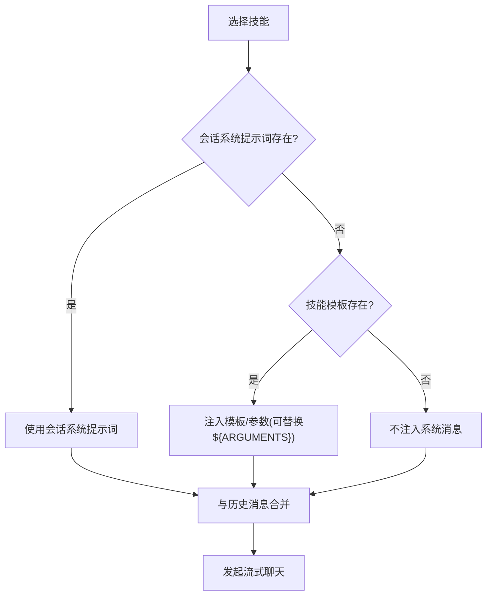
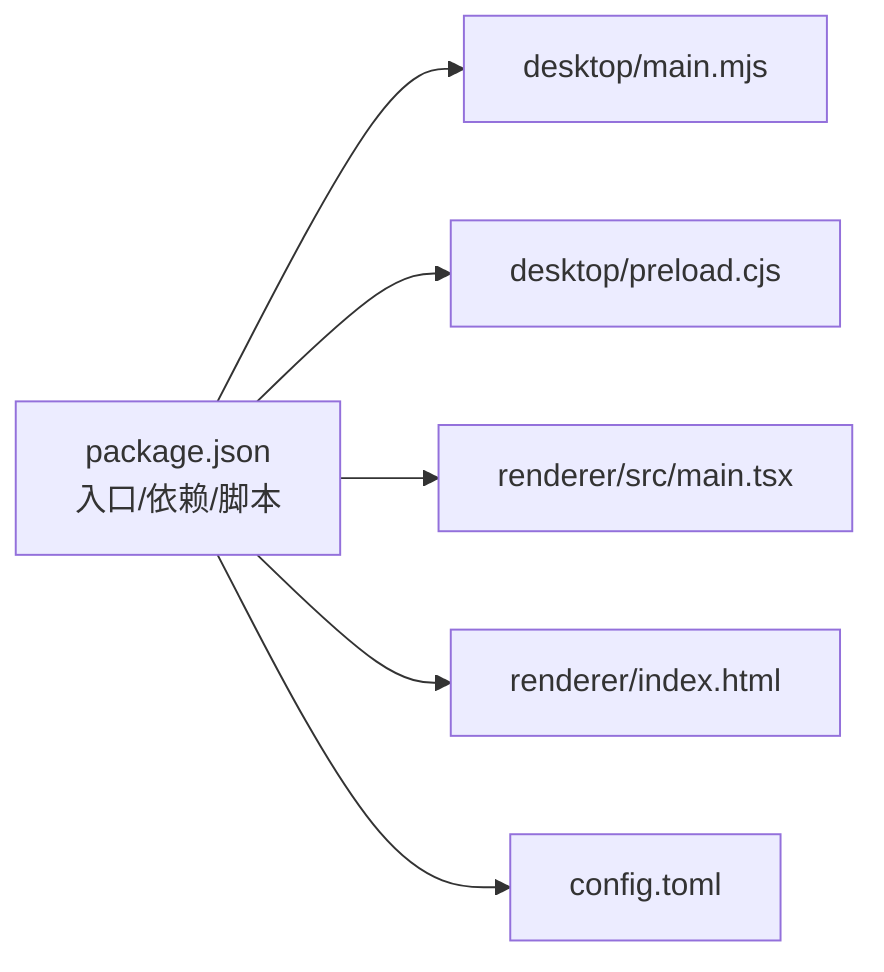

# 核心功能

<cite>
**本文引用的文件**
- [package.json](file://package.json)
- [main.mjs](file://desktop/main.mjs)
- [preload.cjs](file://desktop/preload.cjs)
- [App.tsx](file://renderer/src/App.tsx)
- [config.toml](file://config.toml)
- [skills/文本脱敏/SKILL.md](file://skills/文本脱敏/SKILL.md)
- [skills/文章要点总结/SKILL.md](file://skills/文章要点总结/SKILL.md)
</cite>

## 目录
1. [简介](#简介)
2. [项目结构](#项目结构)
3. [核心组件](#核心组件)
4. [架构总览](#架构总览)
5. [详细组件分析](#详细组件分析)
6. [依赖分析](#依赖分析)
7. [性能考虑](#性能考虑)
8. [故障排查指南](#故障排查指南)
9. [结论](#结论)
10. [附录](#附录)

## 简介
illama-desktop 是一个基于 Electron 的 Windows 桌面应用，提供本地 llama.cpp 服务的完整控制面板。其核心目标是让用户以简洁直观的方式运行和管理本地大语言模型服务，并通过内置的多模态聊天界面与模型交互，同时支持系统托盘后台运行与技能系统的扩展能力。本文档聚焦四大核心功能模块：llama.cpp 服务器管理、多模态聊天界面、系统托盘集成、技能系统，解释设计原理、实现方式、使用场景与协作关系，并给出性能优化与最佳实践建议。

## 项目结构
项目采用典型的 Electron 双进程架构：主进程负责窗口、系统托盘、llama.cpp 服务生命周期与 IPC；渲染进程负责 UI、状态管理与用户交互。配置文件通过 TOML 管理，技能系统以 Markdown 描述文件形式组织。

图示来源
- [main.mjs](file://desktop/main.mjs)
- [preload.cjs](file://desktop/preload.cjs)
- [App.tsx](file://renderer/src/App.tsx)
- [config.toml](file://config.toml)
- [skills/文本脱敏/SKILL.md](file://skills/文本脱敏/SKILL.md)
- [skills/文章要点总结/SKILL.md](file://skills/文章要点总结/SKILL.md)

章节来源
- [package.json](file://package.json)
- [main.mjs](file://desktop/main.mjs)
- [preload.cjs](file://desktop/preload.cjs)
- [App.tsx](file://renderer/src/App.tsx)
- [config.toml](file://config.toml)

## 核心组件
- 服务器管理：负责 llama.cpp 服务的启动、停止、健康检查、日志采集与状态上报，支持直接启动与外部启动器两种模式。
- 多模态聊天界面：提供会话管理、消息流式输出、附件上传（图片/PDF/文件）、系统提示词与技能注入、消息变体对比与重试。
- 系统托盘：提供最小化到托盘、托盘菜单快捷操作（打开窗口、访问 OpenAI 兼容接口、停止服务、退出）、状态提示。
- 技能系统：以技能描述文件驱动的提示词模板机制，支持按会话系统提示词优先、其次技能提示词的注入策略。

章节来源
- [main.mjs](file://desktop/main.mjs)
- [App.tsx](file://renderer/src/App.tsx)
- [preload.cjs](file://desktop/preload.cjs)
- [skills/文本脱敏/SKILL.md](file://skills/文本脱敏/SKILL.md)
- [skills/文章要点总结/SKILL.md](file://skills/文章要点总结/SKILL.md)

## 架构总览
应用通过 preload 暴露的 API 桥接渲染进程与主进程，渲染进程发起 IPC 请求，主进程执行实际逻辑并回传事件与结果。服务器状态、日志与流式聊天事件通过统一事件通道推送至渲染进程。

图示来源
- [App.tsx](file://renderer/src/App.tsx)
- [preload.cjs](file://desktop/preload.cjs)
- [main.mjs](file://desktop/main.mjs)

## 详细组件分析

### 1) llama.cpp 服务器管理
- 设计原理
  - 通过 Electron 的 child_process 启动 llama-server，支持直接执行与外部启动器两种模式，便于集成第三方封装。
  - 采用 TOML 配置文件集中管理启动参数，主进程负责解析、规范化与持久化，渲染进程负责展示与编辑。
  - 通过 IPC 提供启动/停止/健康检查/模型信息查询等能力，并将 stdout/stderr 日志与服务状态实时推送到 UI。
- 实现方式
  - 配置解析与生成：主进程提供 TOML 解析、值规范化、命令行参数构建与启动命令预览。
  - 服务生命周期：启动时创建子进程并监听输出/错误/退出事件；停止时使用 Windows taskkill 终止进程树。
  - 状态与日志：维护运行时状态对象与日志缓冲，过滤冗余日志，检测服务监听事件并更新状态。
- 使用场景
  - 首次部署：在设置中配置模型路径、端口、上下文大小、采样参数等，保存后启动服务。
  - 调优阶段：通过日志观察推理行为，调整温度、Top-K、Top-P 等参数。
  - 多模态：启用 mmproj 并上传图片进行视觉问答。
- 关键流程（启动）

图示来源
- [main.mjs](file://desktop/main.mjs)

章节来源
- [main.mjs](file://desktop/main.mjs)
- [config.toml](file://config.toml)

### 2) 多模态聊天界面
- 设计原理
  - 以会话为中心的状态机，支持多标签页、系统提示词、附件（图片/PDF/文件）与流式输出。
  - 提供消息变体对比与重试机制，便于探索不同采样参数下的回复差异。
  - 优先使用会话级系统提示词，其次使用技能注入的提示词，形成灵活的提示词优先级策略。
- 实现方式
  - 渲染进程通过 window.llamaDesktop 接口调用主进程能力，发起流式聊天请求并接收增量事件。
  - 事件处理：即时拼接增量内容，完成后计算 token、耗时与速度，触发定期保存会话。
  - 附件与多模态：选择图片时若未配置 mmproj，给出提示；支持大图仅记录路径避免内存压力。
- 使用场景
  - 日常问答：输入文本或上传图片，查看流式回复。
  - 任务型对话：设置会话系统提示词或选择技能，获得更稳定的任务导向回复。
  - 结果对比：通过变体切换与重试，比较不同参数下的回复质量。
- 关键流程（发送消息）

图示来源
- [App.tsx](file://renderer/src/App.tsx)
- [preload.cjs](file://desktop/preload.cjs)
- [main.mjs](file://desktop/main.mjs)

章节来源
- [App.tsx](file://renderer/src/App.tsx)
- [preload.cjs](file://desktop/preload.cjs)
- [main.mjs](file://desktop/main.mjs)

### 3) 系统托盘集成
- 设计原理
  - 在最小化时转入系统托盘，提供托盘图标、提示与右键菜单，支持快速打开窗口、访问 OpenAI 兼容接口、停止服务与退出。
  - 托盘菜单根据服务状态动态启用/禁用项，避免无效操作。
- 实现方式
  - 创建 Tray 实例，设置图标与点击行为；根据运行时状态动态构建菜单模板。
  - 通过 shell.openExternal 打开 http://127.0.0.1:8080/v1，便于外部工具对接。
  - 停止服务时调用 taskkill 终止进程树，确保资源释放。
- 使用场景
  - 长时间推理：最小化到托盘，后台持续运行。
  - 快速访问：双击托盘打开主窗口；右键菜单一键停止服务。
- 关键流程（托盘菜单）

图示来源
- [main.mjs](file://desktop/main.mjs)

章节来源
- [main.mjs](file://desktop/main.mjs)

### 4) 技能系统
- 设计原理
  - 技能以 Markdown 描述文件组织，包含名称、描述、使用时机、参数提示与工具权限等元信息，正文作为提示词模板。
  - 提示词注入遵循“会话系统提示词优先，其次技能提示词”的策略，支持将用户输入注入到模板中。
- 实现方式
  - 渲染进程在发送消息前，根据当前会话系统提示词与所选技能生成系统消息，再与历史消息合并发起流式请求。
  - 技能文件示例：文本脱敏与文章要点总结，分别覆盖隐私保护与内容提炼两类典型任务。
- 使用场景
  - 文本脱敏：对合同、日志等文本进行自动去标识化处理。
  - 文章总结：快速提炼文章的核心观点、关键论据与独到洞察。
- 关键流程（技能注入）

图示来源
- [App.tsx](file://renderer/src/App.tsx)
- [skills/文本脱敏/SKILL.md](file://skills/文本脱敏/SKILL.md)
- [skills/文章要点总结/SKILL.md](file://skills/文章要点总结/SKILL.md)

章节来源
- [App.tsx](file://renderer/src/App.tsx)
- [skills/文本脱敏/SKILL.md](file://skills/文本脱敏/SKILL.md)
- [skills/文章要点总结/SKILL.md](file://skills/文章要点总结/SKILL.md)

## 依赖分析
- 运行时依赖
  - Electron：提供跨平台桌面应用框架与主/渲染进程通信。
  - React/Ant Design：构建 UI 与组件生态。
  - pdf-parse、xlsx、word-extractor：支持 PDF/表格/文档附件解析。
- 构建与打包
  - esbuild、electron-builder：前端构建与应用打包。
- 项目入口与产物
  - 主进程入口：desktop/main.mjs
  - 渲染进程入口：renderer/src/main.tsx（由 package.json 指定）
  - 渲染进程 HTML：renderer/index.html（由 preload 引用）

图示来源
- [package.json](file://package.json)
- [main.mjs](file://desktop/main.mjs)
- [preload.cjs](file://desktop/preload.cjs)
- [App.tsx](file://renderer/src/App.tsx)
- [config.toml](file://config.toml)

章节来源
- [package.json](file://package.json)

## 性能考虑
- 服务器侧
  - 合理设置上下文大小与 GPU 分层数量，平衡推理质量与显存占用。
  - 开启连续批处理以提升吞吐，必要时调整线程与微批参数。
  - 控制日志详细程度，避免过多 I/O 影响性能。
- 客户端侧
  - 流式输出即时拼接，避免频繁重渲染；定期保存会话以降低丢失风险。
  - 大图附件仅记录路径，减少内存压力；多模态需配合 mmproj。
  - 适当降低采样噪声（如温度、Top-K）可提升稳定性与速度。
- 系统托盘
  - 保持服务常驻，避免频繁重启带来的冷启动开销。

## 故障排查指南
- 服务无法启动
  - 检查模型路径与 mmproj 配置是否正确；查看托盘菜单中的 URL 是否可访问。
  - 查看日志面板中的 stderr 输出，定位具体错误。
- 服务已退出
  - 观察退出码与错误信息；确认是否存在端口冲突或权限问题。
- 聊天无响应
  - 确认服务处于运行状态；检查网络代理与防火墙设置。
  - 若长时间无增量，尝试中止当前请求后重试。
- 图片无法识别
  - 确认已配置 mmproj；未配置时普通文本模型可能无法理解图片。
- 性能不佳
  - 调整上下文大小、采样参数与 GPU 分层；确保显卡驱动与 CUDA/cuDNN 版本匹配。

章节来源
- [main.mjs](file://desktop/main.mjs)
- [App.tsx](file://renderer/src/App.tsx)

## 结论
illama-desktop 通过清晰的模块划分与稳健的 IPC 通信，实现了本地 llama.cpp 服务的易用化管理与多模态聊天体验。系统托盘与技能系统进一步提升了可用性与扩展性。建议在生产环境中结合日志监控与参数调优，以获得稳定高效的本地推理体验。

## 附录
- 快速开始
  - 配置模型与端口：在设置中填写模型路径与端口，保存后启动服务。
  - 发送消息：在聊天区输入文本或上传图片，查看流式回复。
  - 托盘操作：最小化到托盘，右键菜单可快速停止服务或打开接口。
- 最佳实践
  - 优先使用会话系统提示词；需要特定任务时再选择技能模板。
  - 大文件与图片建议仅记录路径，避免内存峰值。
  - 定期备份 config.toml 与会话记录，防止意外丢失。