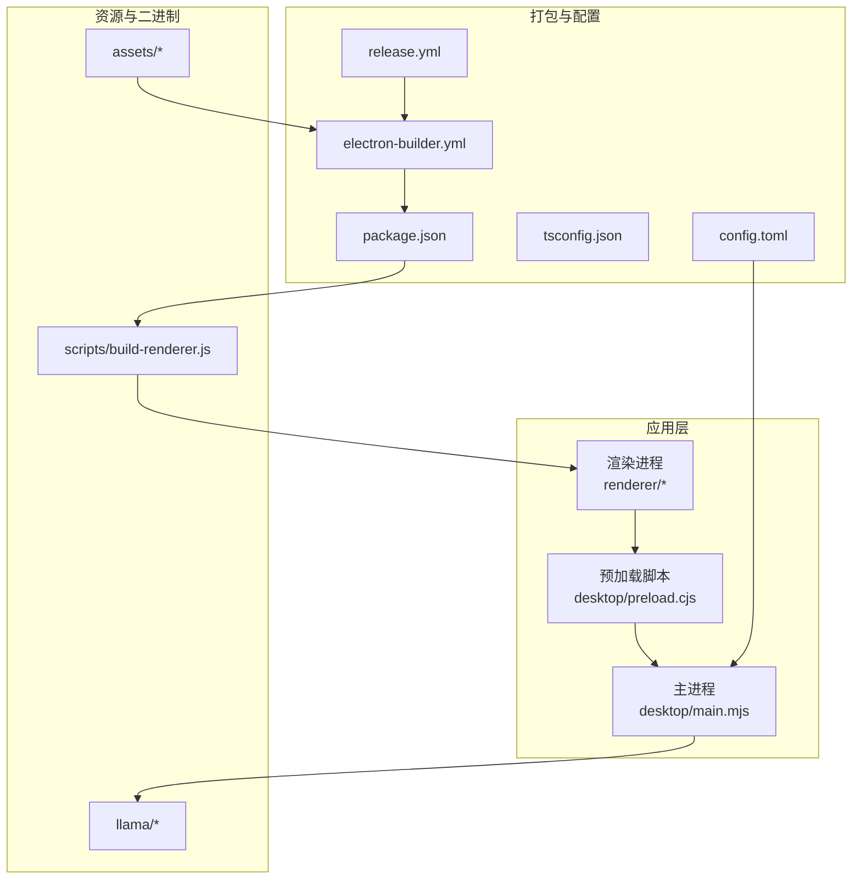
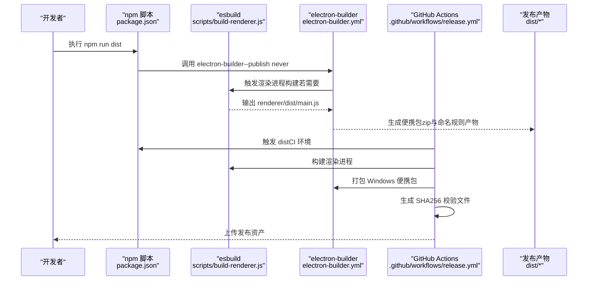
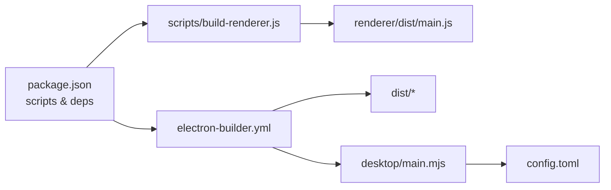

# 部署和打包

<cite>
**本文引用的文件**
- [electron-builder.yml](file://electron-builder.yml)
- [package.json](file://package.json)
- [.github/workflows/release.yml](file://.github/workflows/release.yml)
- [scripts/build-renderer.js](file://scripts/build-renderer.js)
- [desktop/main.mjs](file://desktop/main.mjs)
- [config.toml](file://config.toml)
- [tsconfig.json](file://tsconfig.json)
- [README.md](file://README.md)
</cite>

## 目录
1. [简介](#简介)
2. [项目结构](#项目结构)
3. [核心组件](#核心组件)
4. [架构总览](#架构总览)
5. [详细组件分析](#详细组件分析)
6. [依赖关系分析](#依赖关系分析)
7. [性能考量](#性能考量)
8. [故障排查指南](#故障排查指南)
9. [结论](#结论)
10. [附录](#附录)

## 简介
本文件面向 illama-desktop 的部署与打包，围绕 electron-builder 的配置、平台特定设置、签名与公证流程、发布流程、自动更新与版本管理、回滚策略、权限与安全、以及企业环境部署进行系统化说明。文档同时结合仓库现有配置与脚本，给出可落地的实施建议与最佳实践。

## 项目结构
illama-desktop 采用 Electron + React 的桌面应用架构，主要目录与职责如下：
- desktop：Electron 主进程与预加载脚本，负责窗口、IPC、服务生命周期、托盘、日志与配置管理等
- renderer：React 渲染进程，包含 UI 组件、样式与入口
- scripts：构建脚本（渲染进程打包）
- assets：图标与资源
- llama：llama.cpp 二进制与运行时依赖（需手动放置）
- 配置文件：electron-builder.yml、package.json、tsconfig.json、config.toml、GitHub Actions 发布工作流

图表来源
- [electron-builder.yml:1-17](file://electron-builder.yml#L1-L17)
- [package.json:1-51](file://package.json#L1-L51)
- [scripts/build-renderer.js:1-20](file://scripts/build-renderer.js#L1-L20)
- [desktop/main.mjs:1-25](file://desktop/main.mjs#L1-L25)
- [.github/workflows/release.yml:1-61](file://.github/workflows/release.yml#L1-L61)

章节来源
- [README.md:150-201](file://README.md#L150-L201)

## 核心组件
- electron-builder 配置：定义应用标识、产品名、输出目录、打包文件集合、Windows 平台目标与命名规则、asar 压缩与压缩等级等
- 打包脚本：通过 esbuild 构建渲染进程，生成打包产物
- 主进程：负责服务启动/停止、IPC 通信、托盘、日志、配置读写与 TOML 生成
- 发布工作流：GitHub Actions 自动构建 Windows 便携包并生成校验文件

章节来源
- [electron-builder.yml:1-17](file://electron-builder.yml#L1-L17)
- [package.json:23-27](file://package.json#L23-L27)
- [scripts/build-renderer.js:1-20](file://scripts/build-renderer.js#L1-L20)
- [desktop/main.mjs:676-710](file://desktop/main.mjs#L676-L710)
- [.github/workflows/release.yml:11-61](file://.github/workflows/release.yml#L11-L61)

## 架构总览
下面的序列图展示了从代码构建到发布的关键流程，映射到实际文件与脚本。

图表来源
- [package.json:23-27](file://package.json#L23-L27)
- [scripts/build-renderer.js:1-20](file://scripts/build-renderer.js#L1-L20)
- [electron-builder.yml:10-16](file://electron-builder.yml#L10-L16)
- [.github/workflows/release.yml:29-60](file://.github/workflows/release.yml#L29-L60)

## 详细组件分析

### electron-builder 配置与打包策略
- 应用标识与产品名：用于安装包与应用识别
- 输出目录与文件集合：指定打包时包含的资源（assets、desktop、renderer、package.json）
- Windows 平台目标：当前配置为 zip 便携包，便于分发与免安装
- 资源命名：artifactName 使用版本号与扩展名变量，便于自动化识别
- ASAR 与压缩：启用 ASAR 与普通压缩，兼顾安全性与体积

章节来源
- [electron-builder.yml:1-17](file://electron-builder.yml#L1-L17)

### 渲染进程构建脚本
- 使用 esbuild 对 renderer/src/main.tsx 进行打包，开启最小化、SourceMap、Tree Shaking
- 目标平台为浏览器，目标版本针对 Chrome 120
- 输出到 renderer/dist/main.js，供渲染进程使用

章节来源
- [scripts/build-renderer.js:1-20](file://scripts/build-renderer.js#L1-L20)
- [tsconfig.json:1-18](file://tsconfig.json#L1-L18)

### 主进程与配置管理
- 路径与图标：主进程集中管理图标、托盘图标、llama.cpp 目录与默认服务器路径
- 配置加载与保存：支持从桌面状态与 TOML 文件加载配置，并规范化参数
- TOML 生成：根据配置对象生成 TOML 文本，写入配置文件
- 服务启动参数构建：将配置映射为 llama-server 的命令行参数，支持开关型与数值型参数
- 日志与状态：压缩日志、过滤重复与噪声、上报运行状态与托盘菜单

章节来源
- [desktop/main.mjs:13-25](file://desktop/main.mjs#L13-L25)
- [desktop/main.mjs:676-710](file://desktop/main.mjs#L676-L710)
- [desktop/main.mjs:797-843](file://desktop/main.mjs#L797-L843)
- [desktop/main.mjs:298-326](file://desktop/main.mjs#L298-L326)

### 发布工作流（GitHub Actions）
- 触发条件：推送以 v 开头的标签
- 步骤：检出代码、安装依赖、构建便携包、生成 SHA256 校验文件、发布到 GitHub Releases
- 产物：zip 包与同名 .sha256 校验文件

章节来源
- [.github/workflows/release.yml:1-61](file://.github/workflows/release.yml#L1-L61)

### 自动更新与版本管理
- 当前配置未启用 electron-updater，发布流程通过 GitHub Releases 上传资产
- 若需启用自动更新，可在 electron-builder 中配置 update渠道与签名，或引入 electron-updater 并在主进程中初始化
- 版本号来源于 package.json 的 version 字段，artifactName 使用 ${version} 变量

章节来源
- [package.json:3-4](file://package.json#L3-L4)
- [electron-builder.yml:14](file://electron-builder.yml#L14)

### 回滚策略
- 便携包为 zip，可直接回退到上一个版本的 zip 包
- 若采用安装包，建议保留上一个安装包以便快速回滚
- 企业环境可采用灰度发布策略，先小范围发布，收集反馈后再全量

### 权限与安全
- Windows 平台免安装 zip 包，无需管理员权限；若改为安装包，需考虑安装权限与沙箱策略
- ASAR 启用可提升打包后资源的安全性，但需注意某些路径访问与资源解包
- 签名与公证：Windows 平台建议对安装包进行代码签名与公证，以降低安全告警与阻拦
- 配置文件与日志：主进程对配置文件与日志进行过滤与压缩，减少敏感信息泄露风险

章节来源
- [electron-builder.yml:15](file://electron-builder.yml#L15)
- [desktop/main.mjs:298-326](file://desktop/main.mjs#L298-L326)

### 企业环境部署
- 便携包适合企业内网分发，可结合软件分发系统批量推送
- 建议在企业环境中提供标准化的安装指引与配置模板（config.toml）
- 对于需要离线部署的场景，提前准备 llama.cpp 二进制与模型文件，确保网络与磁盘空间满足需求
- 安全合规：在企业内网部署时，应遵循组织的安全策略，必要时对安装包进行签名与公证

章节来源
- [README.md:62-70](file://README.md#L62-L70)
- [README.md:75-91](file://README.md#L75-L91)

## 依赖关系分析
electron-builder 与 package.json、脚本与主进程之间的依赖关系如下：

图表来源
- [package.json:23-27](file://package.json#L23-L27)
- [electron-builder.yml:3-9](file://electron-builder.yml#L3-L9)
- [scripts/build-renderer.js:1-20](file://scripts/build-renderer.js#L1-L20)
- [desktop/main.mjs:676-710](file://desktop/main.mjs#L676-L710)
- [config.toml:1-27](file://config.toml#L1-L27)

章节来源
- [package.json:23-27](file://package.json#L23-L27)
- [electron-builder.yml:3-9](file://electron-builder.yml#L3-L9)

## 性能考量
- 渲染进程构建：启用最小化与 Tree Shaking，有助于减小包体；SourceMap 便于调试但会增加体积
- ASAR：启用后可提升资源访问效率与安全性，但需注意某些动态路径访问
- 日志压缩：主进程对日志进行压缩与去噪，减少 UI 压力与磁盘占用
- 打包目标：Windows 便携包体积较小，便于分发；若改为安装包，需评估安装与启动时间

章节来源
- [scripts/build-renderer.js:1-20](file://scripts/build-renderer.js#L1-L20)
- [electron-builder.yml:15](file://electron-builder.yml#L15)
- [desktop/main.mjs:298-326](file://desktop/main.mjs#L298-L326)

## 故障排查指南
- 打包产物缺失或路径错误
  - 检查 electron-builder.yml 的 files 与 directories 配置是否包含所需资源
  - 确认 package.json 的 main 指向正确的主进程入口
- 渲染进程构建失败
  - 检查 scripts/build-renderer.js 的入口与目标平台配置
  - 确认 tsconfig.json 的 include 范围与模块解析策略
- Windows 便携包无法运行
  - 确认 llama.cpp 二进制与依赖文件已放置在 llama/ 目录
  - 检查 config.toml 的路径与参数是否正确
- 发布校验失败
  - 确认 GitHub Actions 中生成的 .sha256 文件与产物名一致
  - 检查 CI 环境的 Node.js 版本与缓存策略

章节来源
- [electron-builder.yml:3-9](file://electron-builder.yml#L3-L9)
- [package.json:8](file://package.json#L8)
- [scripts/build-renderer.js:1-20](file://scripts/build-renderer.js#L1-L20)
- [tsconfig.json:15-18](file://tsconfig.json#L15-L18)
- [config.toml:1-27](file://config.toml#L1-L27)
- [.github/workflows/release.yml:32-36](file://.github/workflows/release.yml#L32-L36)

## 结论
illama-desktop 的部署与打包以 electron-builder 为核心，结合 esbuild 构建渲染进程与 GitHub Actions 实现自动化发布。当前配置偏向便携式分发，具备良好的可移植性与易用性。为进一步完善企业级部署，建议补充安装包签名与公证、自动更新机制与版本回滚策略，并在企业环境中提供标准化的配置模板与分发流程。

## 附录

### 发布流程（从代码到发布）
- 本地构建
  - 安装依赖：npm ci 或 npm install
  - 构建渲染进程：npm run build
  - 打包便携包：npm run dist
- CI 发布
  - 推送以 v 开头的标签
  - GitHub Actions 自动执行构建与发布，生成 zip 与 .sha256 校验文件

章节来源
- [package.json:23-27](file://package.json#L23-L27)
- [.github/workflows/release.yml:11-61](file://.github/workflows/release.yml#L11-L61)

### Windows 平台部署要点
- 便携包：无需管理员权限，直接解压运行
- 安装包：需进行代码签名与公证，降低安全告警
- 依赖：确保 llama.cpp 二进制与 DLL 在运行机可用
- 配置：通过 config.toml 与主进程配置管理，确保路径与参数正确

章节来源
- [README.md:62-70](file://README.md#L62-L70)
- [README.md:75-91](file://README.md#L75-L91)
- [config.toml:1-27](file://config.toml#L1-L27)