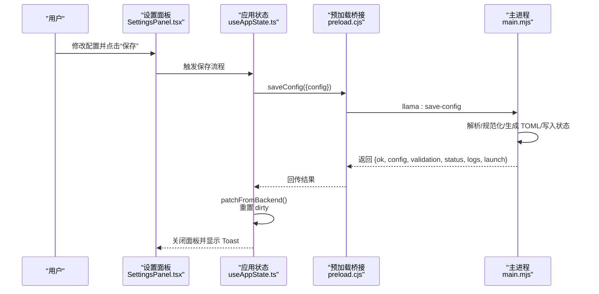
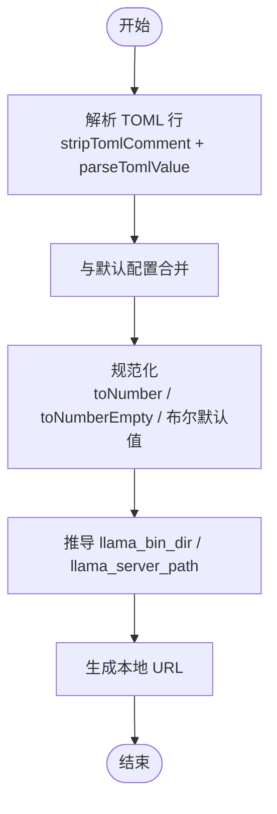
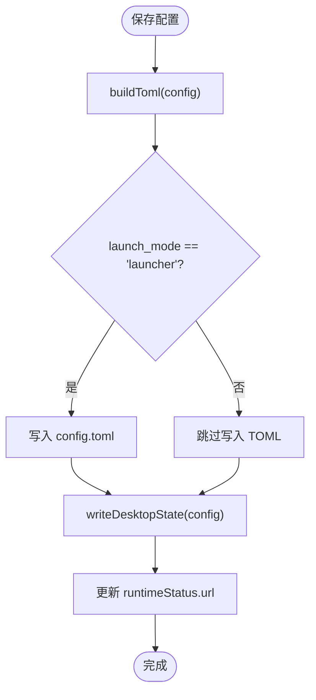
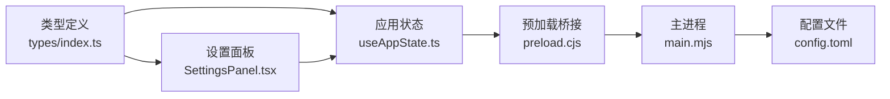

# 配置管理

<cite>
**本文引用的文件**
- [config.toml](file://config.toml)
- [desktop/main.mjs](file://desktop/main.mjs)
- [desktop/preload.cjs](file://desktop/preload.cjs)
- [renderer/src/components/SettingsPanel.tsx](file://renderer/src/components/SettingsPanel.tsx)
- [renderer/src/hooks/useAppState.ts](file://renderer/src/hooks/useAppState.ts)
- [renderer/src/App.tsx](file://renderer/src/App.tsx)
- [renderer/src/types/index.ts](file://renderer/src/types/index.ts)
- [.codeartsdoer/specs/settings-save-and-close-merge/spec.md](file://.codeartsdoer/specs/settings-save-and-close-merge/spec.md)
</cite>

## 目录
1. [简介](#简介)
2. [项目结构](#项目结构)
3. [核心组件](#核心组件)
4. [架构总览](#架构总览)
5. [详细组件分析](#详细组件分析)
6. [依赖关系分析](#依赖关系分析)
7. [性能考量](#性能考量)
8. [故障排除指南](#故障排除指南)
9. [结论](#结论)
10. [附录](#附录)

## 简介
本文件系统性梳理 illama-desktop 的配置管理系统，覆盖 TOML 配置文件格式、参数语义与约束、配置规范化与持久化、UI 设置面板、配置验证与热重载机制、迁移与版本兼容、备份与恢复策略，以及常见问题诊断与最佳实践。目标读者为系统管理员与高级用户。

## 项目结构
illama-desktop 的配置管理由三部分协同实现：
- 配置文件：TOML 格式，位于仓库根目录，用于持久化 llama.cpp 服务参数与 UI/功能开关。
- 主进程逻辑：负责解析/生成 TOML、规范化配置、构建启动命令、持久化桌面状态、监听服务日志与状态。
- 渲染进程 UI：提供设置面板，直观编辑配置并通过 IPC 与主进程交互，支持即时预览启动命令与验证状态。

```mermaid
graph TB
subgraph "渲染进程UI"
SP["设置面板<br/>SettingsPanel.tsx"]
UAP["应用状态钩子<br/>useAppState.ts"]
APP["应用入口<br/>App.tsx"]
end
subgraph "主进程配置与服务"
MJS["主逻辑<br/>desktop/main.mjs"]
PRE["预加载桥接<br/>desktop/preload.cjs"]
end
CFG["配置文件<br/>config.toml"]
SP --> UAP
UAP --> PRE
PRE --> MJS
MJS <- --> CFG
APP --> SP
```

图表来源
- [desktop/main.mjs](file://desktop/main.mjs)
- [desktop/preload.cjs](file://desktop/preload.cjs)
- [renderer/src/components/SettingsPanel.tsx](file://renderer/src/components/SettingsPanel.tsx)
- [renderer/src/hooks/useAppState.ts](file://renderer/src/hooks/useAppState.ts)
- [renderer/src/App.tsx](file://renderer/src/App.tsx)
- [config.toml](file://config.toml)

章节来源
- [desktop/main.mjs](file://desktop/main.mjs)
- [desktop/preload.cjs](file://desktop/preload.cjs)
- [renderer/src/components/SettingsPanel.tsx](file://renderer/src/components/SettingsPanel.tsx)
- [renderer/src/hooks/useAppState.ts](file://renderer/src/hooks/useAppState.ts)
- [renderer/src/App.tsx](file://renderer/src/App.tsx)
- [config.toml](file://config.toml)

## 核心组件
- TOML 配置文件：定义 llama.cpp 服务参数、UI 开关、采样与性能参数等。
- 配置规范化器：将 TOML 解析结果与默认值合并，统一类型与默认值，确保数值字段安全。
- TOML 生成器：根据当前配置生成可读性强的 TOML 文本，支持可选参数与注释。
- 桌面状态持久化：将配置路径、启动模式、启动器路径等状态写入用户数据目录下的 JSON 文件。
- 设置面板 UI：按“概览/展示/技能/采样/开发者/日志”分区组织，提供字段校验与启动命令预览。
- IPC 接口：通过 preload 暴露 saveConfig、startServer、stopServer、testHealth 等方法，供 UI 调用。

章节来源
- [desktop/main.mjs](file://desktop/main.mjs)
- [renderer/src/components/SettingsPanel.tsx](file://renderer/src/components/SettingsPanel.tsx)
- [renderer/src/types/index.ts](file://renderer/src/types/index.ts)
- [desktop/preload.cjs](file://desktop/preload.cjs)

## 架构总览
配置生命周期（保存与验证）如下：



图表来源
- [renderer/src/components/SettingsPanel.tsx](file://renderer/src/components/SettingsPanel.tsx)
- [renderer/src/hooks/useAppState.ts](file://renderer/src/hooks/useAppState.ts)
- [desktop/preload.cjs](file://desktop/preload.cjs)
- [desktop/main.mjs](file://desktop/main.mjs)

章节来源
- [renderer/src/components/SettingsPanel.tsx](file://renderer/src/components/SettingsPanel.tsx)
- [renderer/src/hooks/useAppState.ts](file://renderer/src/hooks/useAppState.ts)
- [desktop/preload.cjs](file://desktop/preload.cjs)
- [desktop/main.mjs](file://desktop/main.mjs)

## 详细组件分析

### TOML 配置文件格式与参数说明
- 位置与生成：文件位于仓库根目录，由主进程生成与更新。
- 关键参数类别：
  - 启动与服务：launch_mode、llama_server_path、model、host、port、ctx_size、n_predict、n_gpu_layers、request_timeout_ms、extra_args。
  - 对话模板与显示：chat_template_kwargs、show_thinking、expand_thinking、show_raw_output。
  - 采样与惩罚：temp、top_k、top_p、min_p、presence_penalty、repeat_penalty、frequency_penalty、repeat_last_n、tfs_z、typical_p、dry_* 系列。
  - 线程与批处理：threads、threads_batch、batch_size、ubatch_size。
  - GPU 与 MoE：device、split_mode、tensor_split、main_gpu、cpu_moe、n_cpu_moe。
  - 功能开关：verbose、log_verbosity、webui、embeddings、continuous_batching。
- 注释与可选参数：生成器会为可选数值参数输出注释行，便于阅读与迁移。

章节来源
- [config.toml](file://config.toml)
- [desktop/main.mjs](file://desktop/main.mjs)

### 配置解析与规范化
- 解析：逐行去除注释（保留字符串内 #）、按等号分割键值、识别布尔/数字/字符串。
- 规范化：与默认配置合并，强制类型转换（toNumber、toNumberEmpty），设置布尔默认值，计算 llama 二进制目录与路径。
- URL 生成：根据 host/port 生成本地访问 URL，0.0.0.0 自动映射为 127.0.0.1。



图表来源
- [desktop/main.mjs](file://desktop/main.mjs)

章节来源
- [desktop/main.mjs](file://desktop/main.mjs)

### TOML 生成与持久化
- 生成：按分组输出常用参数、采样、系统/GPU/MoE、日志与功能开关、额外参数，可选数值参数仅在有值时输出。
- 持久化：当启动模式为 launcher 时，写入 TOML；无论何种模式均写入桌面状态 JSON（包含 config_path、launch_mode、launcher_path、config）。



图表来源
- [desktop/main.mjs](file://desktop/main.mjs)

章节来源
- [desktop/main.mjs](file://desktop/main.mjs)

### 设置面板与参数约束
- 分区组织：概览（运行参数与命令预览）、展示（模型/模板/显示开关）、技能（自定义技能）、采样（温度/TopK/P/惩罚/DRY）、开发者（线程/GPU/批处理/附加参数/开关）、日志（服务输出）。
- 字段约束：
  - 数字字段最小值限制（如端口≥1、请求超时≥30000）。
  - 直接模式下隐藏 launcher 专属字段（config_path、launcher_path、llama_server_path），改用 llama_bin_dir。
  - 布尔开关默认值与可选项（如 show_thinking 默认 true）。
- 启动命令预览：保存后生成完整命令，支持复制，便于比对与排错。

章节来源
- [renderer/src/components/SettingsPanel.tsx](file://renderer/src/components/SettingsPanel.tsx)
- [renderer/src/types/index.ts](file://renderer/src/types/index.ts)

### 配置验证与状态检查
- 验证项：配置文件存在、启动器存在、llama-server 存在、模型文件存在。
- 状态更新：主进程监听服务日志，检测“server is listening”与错误关键字，更新状态与日志。
- UI 展示：设置面板顶部状态胶囊显示各项验证结果，日志面板展示 ANSI 过滤后的服务输出。

章节来源
- [renderer/src/components/SettingsPanel.tsx](file://renderer/src/components/SettingsPanel.tsx)
- [desktop/main.mjs](file://desktop/main.mjs)

### 配置热重载与使用场景
- 热重载机制：主进程在保存配置后，重新规范化并写入 TOML/状态，随后更新运行时 URL。渲染进程通过 IPC 获取最新状态与日志，UI 实时刷新。
- 使用场景：
  - 调优采样参数与上下文大小，快速验证效果。
  - 切换模型或 mmproj，确认模板参数与显示开关。
  - 调整线程/GPU/批处理参数，观察性能变化。
- 注意事项：热重载不会自动重启服务，如需生效某些参数（如上下文大小、GPU 分配），需手动重启服务。

章节来源
- [desktop/main.mjs](file://desktop/main.mjs)
- [renderer/src/hooks/useAppState.ts](file://renderer/src/hooks/useAppState.ts)

### 配置迁移与版本兼容
- 迁移策略：主进程加载顺序为“桌面状态 → TOML 文件”，若桌面状态缺失则回退默认路径；规范化阶段合并状态与 TOML，确保新老字段兼容。
- 版本兼容：通过默认配置与规范化器的“存在即覆盖”的合并策略，避免因新增字段导致的兼容性问题；必要时可在生成器中添加注释行，帮助用户迁移。
- 会话迁移参考：会话时间字段迁移示例展示了幂等性与回退策略，可借鉴到配置迁移中。

章节来源
- [desktop/main.mjs](file://desktop/main.mjs)
- [.codeartsdoer/specs/session-time-grouping-fix/design.md](file://.codeartsdoer/specs/session-time-grouping-fix/design.md)

### 持久化存储与备份恢复
- 存储位置：
  - TOML 配置：由 launcher 模式写入指定路径；默认路径位于应用基础目录。
  - 桌面状态：位于用户数据目录（desktop-state.json），包含 config_path、launch_mode、launcher_path、config。
- 备份建议：
  - 定期复制 config.toml 与 desktop-state.json。
  - 变更重大参数前先备份，以便快速回滚。
- 恢复步骤：
  - 停止服务。
  - 替换 config.toml 或恢复 desktop-state.json。
  - 重新加载配置并启动服务。

章节来源
- [desktop/main.mjs](file://desktop/main.mjs)

## 依赖关系分析
- 渲染进程依赖：
  - SettingsPanel.tsx 依赖 Config/Validation/Status/LogEntry 类型与工具函数。
  - useAppState.ts 通过 patchFromBackend 合并后端返回的配置与状态。
  - App.tsx 通过 window.llamaDesktop IPC 接口与主进程交互。
- 主进程依赖：
  - TOML 解析/生成与规范化逻辑集中在 main.mjs。
  - preload.cjs 暴露 saveConfig/startServer/stopServer/testHealth 等 IPC 方法。



图表来源
- [renderer/src/types/index.ts](file://renderer/src/types/index.ts)
- [renderer/src/components/SettingsPanel.tsx](file://renderer/src/components/SettingsPanel.tsx)
- [renderer/src/hooks/useAppState.ts](file://renderer/src/hooks/useAppState.ts)
- [desktop/preload.cjs](file://desktop/preload.cjs)
- [desktop/main.mjs](file://desktop/main.mjs)
- [config.toml](file://config.toml)

章节来源
- [renderer/src/types/index.ts](file://renderer/src/types/index.ts)
- [renderer/src/components/SettingsPanel.tsx](file://renderer/src/components/SettingsPanel.tsx)
- [renderer/src/hooks/useAppState.ts](file://renderer/src/hooks/useAppState.ts)
- [desktop/preload.cjs](file://desktop/preload.cjs)
- [desktop/main.mjs](file://desktop/main.mjs)
- [config.toml](file://config.toml)

## 性能考量
- 上下文大小（ctx_size）与 KV 缓存：超长上下文会显著增加内存占用，建议根据显存与系统内存合理设置。
- GPU 分配与批处理：合理设置 n_gpu_layers、threads、batch_size、ubatch_size 与 split_mode/tensor_split，避免显存不足或 CPU 瓶颈。
- 连续批处理（continuous_batching）：在多请求场景下更稳定，但可能增加内存压力。
- 日志级别（log_verbosity/verbose）：调试时开启详细日志，日常使用建议适度降低以减少 I/O。

## 故障排除指南
- 无法连接服务：
  - 检查 host/port 与防火墙；确认服务已启动且日志包含“server is listening”。
  - 使用“最终启动命令”对比实际命令行，确认参数正确。
- 配置保存失败：
  - 查看设置面板“保存”按钮是否处于加载态；确保未重复点击。
  - 若返回错误，保持面板打开重试，或检查 config.toml 权限。
- 参数无效或未生效：
  - 某些参数需重启服务才能生效（如 ctx_size、GPU 分配）。
  - 检查 extra_args 与本地 llama.cpp 版本兼容性。
- 显存不足或 OOM：
  - 降低 ctx_size、n_gpu_layers、batch_size；启用 MoE 放置 CPU（cpu_moe）。
- 日志过多影响性能：
  - 适当降低 log_verbosity 或关闭 verbose。

章节来源
- [renderer/src/components/SettingsPanel.tsx](file://renderer/src/components/SettingsPanel.tsx)
- [desktop/main.mjs](file://desktop/main.mjs)

## 结论
illama-desktop 的配置管理以 TOML 为核心，结合主进程的解析/规范化/生成与渲染进程的可视化设置面板，形成“所见即所得”的配置体验。通过桌面状态与 TOML 的双重持久化、严格的参数规范化与验证、以及完善的日志与命令预览，系统在易用性与可靠性之间取得平衡。建议在生产环境中定期备份配置，并在调整关键参数前做好变更记录与回滚准备。

## 附录

### 配置参数速查（按类别）
- 启动与服务
  - launch_mode：启动模式（direct/launcher）
  - llama_server_path：llama-server.exe 绝对路径
  - model/mmproj：模型与多模态投影文件
  - host/port：监听地址与端口
  - ctx_size/n_predict：上下文大小与最大输出
  - n_gpu_layers/request_timeout_ms：GPU 层数与请求超时
  - extra_args：追加到启动命令的参数
- 对话模板与显示
  - chat_template_kwargs：模板参数（JSON 字符串）
  - show_thinking/expand_thinking/show_raw_output：显示开关
- 采样与惩罚
  - temp/top_k/top_p/min_p：基础采样
  - presence_penalty/repeat_penalty/frequency_penalty/repeat_last_n：惩罚项
  - tfs_z/typical_p：高级采样
  - dry_*：DRY 采样系列
- 线程与批处理
  - threads/threads_batch/batch_size/ubatch_size：线程与批处理
- GPU 与 MoE
  - device/split_mode/tensor_split/main_gpu：GPU 分配
  - cpu_moe/n_cpu_moe：MoE 放置与专家数
- 功能开关
  - verbose/log_verbosity/webui/embeddings/continuous_batching：功能与日志

章节来源
- [config.toml](file://config.toml)
- [desktop/main.mjs](file://desktop/main.mjs)

### 保存流程与约束（DFX）
- 保存前 UI 检查 dirty 状态；保存中按钮进入忙状态，防止重复点击。
- 保存失败保持面板打开，显示错误提示；成功后重置 dirty 并关闭面板。
- IPC 接口与类型定义明确返回结构，便于前端统一处理。

章节来源
- [.codeartsdoer/specs/settings-save-and-close-merge/spec.md](file://.codeartsdoer/specs/settings-save-and-close-merge/spec.md)
- [renderer/src/types/index.ts](file://renderer/src/types/index.ts)
- [desktop/preload.cjs](file://desktop/preload.cjs)