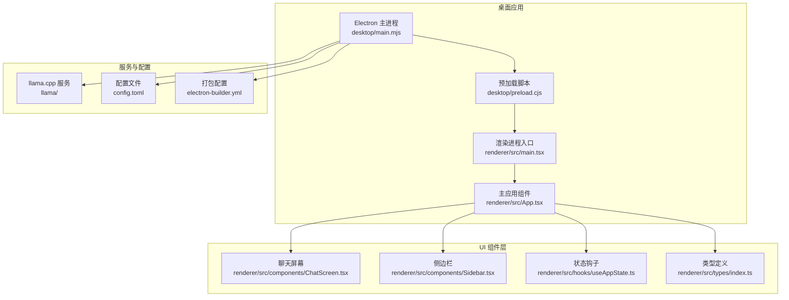
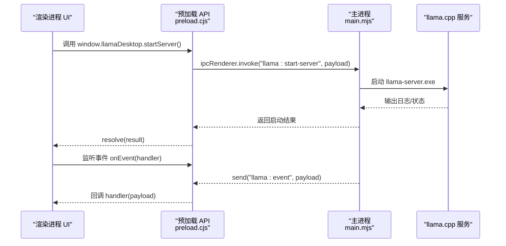
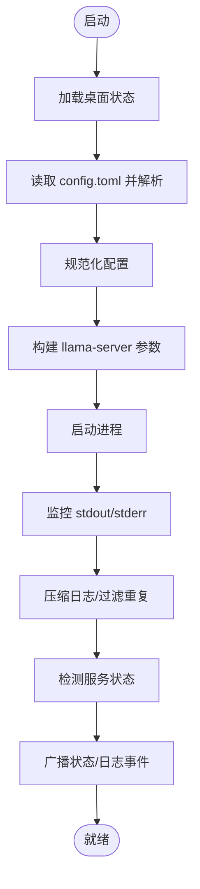
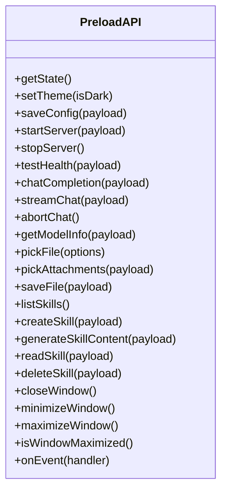
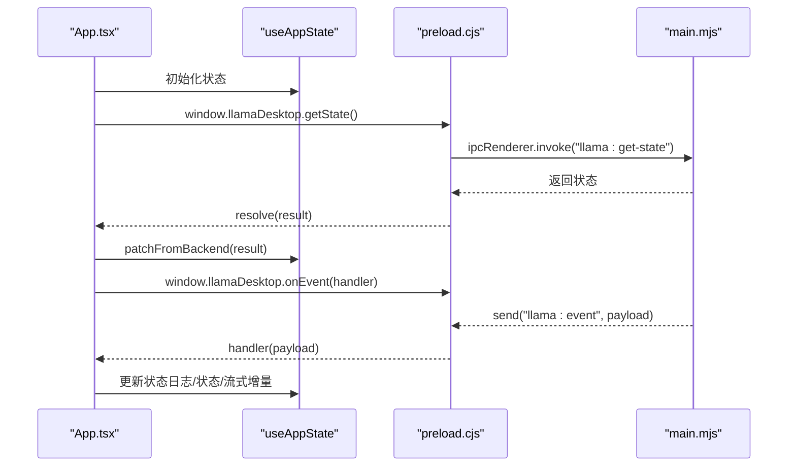
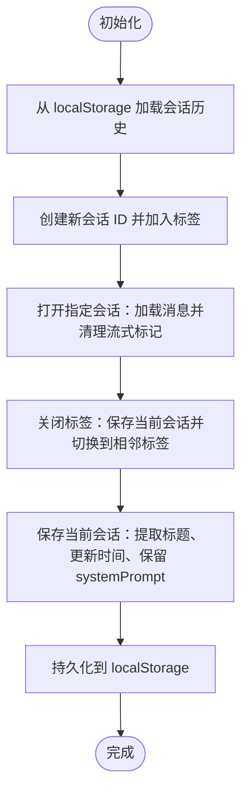
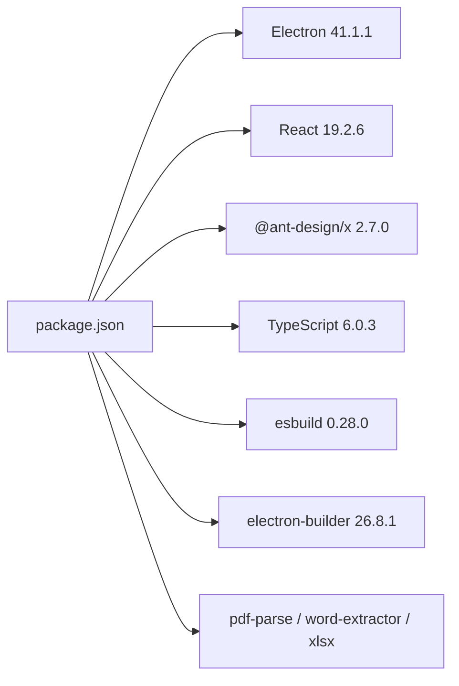

# 项目概述

<cite>
**本文档引用的文件**
- [package.json](file://package.json)
- [README.md](file://README.md)
- [config.toml](file://config.toml)
- [electron-builder.yml](file://electron-builder.yml)
- [desktop/main.mjs](file://desktop/main.mjs)
- [desktop/preload.cjs](file://desktop/preload.cjs)
- [renderer/src/App.tsx](file://renderer/src/App.tsx)
- [renderer/src/hooks/useAppState.ts](file://renderer/src/hooks/useAppState.ts)
- [renderer/src/types/index.ts](file://renderer/src/types/index.ts)
- [renderer/src/components/ChatScreen.tsx](file://renderer/src/components/ChatScreen.tsx)
- [renderer/src/components/Sidebar.tsx](file://renderer/src/components/Sidebar.tsx)
</cite>

## 目录
1. [简介](#简介)
2. [项目结构](#项目结构)
3. [核心组件](#核心组件)
4. [架构总览](#架构总览)
5. [详细组件分析](#详细组件分析)
6. [依赖关系分析](#依赖关系分析)
7. [性能考量](#性能考量)
8. [故障排查指南](#故障排查指南)
9. [结论](#结论)
10. [附录](#附录)

## 简介
illama-desktop 是一款基于 Electron 的 Windows 桌面应用程序，旨在为本地 llama.cpp 服务器提供一体化控制面板。项目以“无需命令行，即可管理本地 AI 服务”为核心目标，既是一个聊天界面，也是一个 OpenAI 兼容 API 的服务端，同时支持系统托盘后台运行、多模态聊天、会话管理与技能系统等高级特性。项目采用主进程-渲染进程分离的架构，结合 React UI 组件系统与 Ant Design X，提供现代化、可扩展的本地 AI 服务管理体验。

## 项目结构
项目采用典型的 Electron + React 结构，主要目录与职责如下：
- assets/：图标与静态资源
- desktop/：Electron 主进程与预加载脚本
- renderer/：React 渲染进程（组件、样式、类型、主题）
- llama/：llama.cpp 编译产物（需手动放置）
- skills/：技能 SKILL.md 文件存储目录
- scripts/：构建与打包脚本
- 配置文件：config.toml（llama.cpp 配置）、electron-builder.yml（打包配置）

图表来源
- [desktop/main.mjs](file://desktop/main.mjs)
- [desktop/preload.cjs](file://desktop/preload.cjs)
- [renderer/src/App.tsx](file://renderer/src/App.tsx)
- [renderer/src/components/ChatScreen.tsx](file://renderer/src/components/ChatScreen.tsx)
- [renderer/src/components/Sidebar.tsx](file://renderer/src/components/Sidebar.tsx)
- [renderer/src/hooks/useAppState.ts](file://renderer/src/hooks/useAppState.ts)
- [renderer/src/types/index.ts](file://renderer/src/types/index.ts)
- [config.toml](file://config.toml)
- [electron-builder.yml](file://electron-builder.yml)

章节来源
- [README.md: 152-201:152-201](file://README.md#L152-L201)
- [package.json: 1-51:1-51](file://package.json#L1-L51)

## 核心组件
- 主进程（desktop/main.mjs）：负责窗口管理、llama.cpp 服务启动/停止、IPC 通信、系统托盘管理、配置读写与日志处理。
- 预加载脚本（desktop/preload.cjs）：通过 contextBridge 暴露受控的 API 到渲染进程，封装 IPC 调用。
- 渲染进程（renderer/src/App.tsx）：整合所有功能模块，协调状态管理、事件监听与 UI 渲染。
- 状态管理（renderer/src/hooks/useAppState.ts）：集中管理应用状态（配置、会话、聊天消息、附件、视图等），并提供持久化能力。
- 类型系统（renderer/src/types/index.ts）：定义 IPC 接口、配置、状态、消息、会话、附件等类型，保证前后端契约一致。
- UI 组件（renderer/src/components/*）：基于 Ant Design X 的聊天屏幕、侧边栏、设置面板等组件，提供丰富的交互体验。

章节来源
- [desktop/main.mjs: 1-800:1-800](file://desktop/main.mjs#L1-L800)
- [desktop/preload.cjs: 1-32:1-32](file://desktop/preload.cjs#L1-L32)
- [renderer/src/App.tsx: 1-800:1-800](file://renderer/src/App.tsx#L1-L800)
- [renderer/src/hooks/useAppState.ts: 1-555:1-555](file://renderer/src/hooks/useAppState.ts#L1-L555)
- [renderer/src/types/index.ts: 1-222:1-222](file://renderer/src/types/index.ts#L1-L222)

## 架构总览
illama-desktop 采用 Electron 的主进程-渲染进程分离架构，配合 React 的组件化与状态管理，形成稳定的服务控制与用户交互体系。主进程负责与系统和 llama.cpp 交互，渲染进程负责 UI 与用户交互，二者通过预加载脚本提供的受控 API 进行通信。

图表来源
- [desktop/preload.cjs: 3-31:3-31](file://desktop/preload.cjs#L3-L31)
- [desktop/main.mjs: 209-224:209-224](file://desktop/main.mjs#L209-L224)
- [renderer/src/App.tsx: 624-728:624-728](file://renderer/src/App.tsx#L624-L728)

章节来源
- [desktop/main.mjs: 203-326:203-326](file://desktop/main.mjs#L203-L326)
- [desktop/preload.cjs: 3-31:3-31](file://desktop/preload.cjs#L3-L31)
- [renderer/src/App.tsx: 624-728:624-728](file://renderer/src/App.tsx#L624-L728)

## 详细组件分析

### 主进程（desktop/main.mjs）
- 职责与能力
  - 窗口管理与系统托盘集成
  - llama.cpp 服务生命周期管理（启动、停止、健康检测）
  - TOML 配置解析与生成、规范化
  - 日志采集与压缩、状态广播
  - 模型文件解析（量化级别、参数量级、模型家族）
  - 命令行参数构建与安全解析
  - 桌面状态持久化（用户数据目录）
- 关键流程
  - 配置加载：优先读取桌面状态，再读取 config.toml，合并后规范化
  - 服务启动：根据 launch_mode 选择 direct 或 launcher，构建参数并启动进程
  - 事件广播：将状态与日志通过 IPC 发送到渲染进程
  - 日志处理：ANSI 清洗、重复过滤、长度截断、状态检测

图表来源
- [desktop/main.mjs: 676-710:676-710](file://desktop/main.mjs#L676-L710)
- [desktop/main.mjs: 797-806:797-806](file://desktop/main.mjs#L797-L806)
- [desktop/main.mjs: 298-326:298-326](file://desktop/main.mjs#L298-L326)
- [desktop/main.mjs: 220-224:220-224](file://desktop/main.mjs#L220-L224)

章节来源
- [desktop/main.mjs: 86-136:86-136](file://desktop/main.mjs#L86-L136)
- [desktop/main.mjs: 329-484:329-484](file://desktop/main.mjs#L329-L484)
- [desktop/main.mjs: 676-710:676-710](file://desktop/main.mjs#L676-L710)

### 预加载脚本（desktop/preload.cjs）
- 职责与能力
  - 通过 contextBridge 暴露受控 API 到渲染进程
  - 统一封装 IPC invoke/send 调用
  - 提供事件订阅 onEvent，解绑回调
- API 能力清单（节选）
  - 应用状态：getState、setTheme
  - 配置与服务：saveConfig、startServer、stopServer、testHealth
  - 聊天与流式：streamChat、abortChat、chatCompletion
  - 模型与附件：getModelInfo、pickAttachments、pickFile、saveFile
  - 技能管理：listSkills、createSkill、generateSkillContent、readSkill、deleteSkill
  - 窗口控制：closeWindow、minimizeWindow、maximizeWindow、isWindowMaximized

图表来源
- [desktop/preload.cjs: 3-31:3-31](file://desktop/preload.cjs#L3-L31)

章节来源
- [desktop/preload.cjs: 3-31:3-31](file://desktop/preload.cjs#L3-L31)

### 渲染进程主应用（renderer/src/App.tsx）
- 职责与能力
  - 整合所有功能模块（聊天、设置、终端、模型信息、系统提示词、技能）
  - 状态初始化与事件监听（状态、日志、流式事件）
  - 服务控制（启动/停止/保存配置）
  - 会话管理（新建/打开/重命名/删除/导出）
  - 聊天交互（发送/中止/重试/变体切换/复制/编辑/删除）
  - 附件与多模态支持（图片/音频/文本/PDF/文件）
  - 技能系统（选择/注入/持久化）
  - 系统提示词（会话级注入与可视化）
- 关键流程
  - 初始化：调用 getState 获取初始状态并填充
  - 事件监听：注册 onEvent，处理 status/logs/chat-stream 等事件
  - 流式聊天：构造消息列表（含系统提示词/技能），调用 streamChat，增量更新 UI
  - 会话持久化：定期保存（防抖）与手动保存

图表来源
- [renderer/src/App.tsx: 624-728:624-728](file://renderer/src/App.tsx#L624-L728)
- [desktop/preload.cjs: 26-30:26-30](file://desktop/preload.cjs#L26-L30)
- [desktop/main.mjs: 209-224:209-224](file://desktop/main.mjs#L209-L224)

章节来源
- [renderer/src/App.tsx: 21-133:21-133](file://renderer/src/App.tsx#L21-L133)
- [renderer/src/App.tsx: 175-334:175-334](file://renderer/src/App.tsx#L175-L334)
- [renderer/src/App.tsx: 336-477:336-477](file://renderer/src/App.tsx#L336-L477)
- [renderer/src/App.tsx: 624-728:624-728](file://renderer/src/App.tsx#L624-L728)

### 状态管理（renderer/src/hooks/useAppState.ts）
- 职责与能力
  - 默认状态与持久化（localStorage 会话历史）
  - 会话生命周期管理（新建/打开/关闭/重命名/删除/导出）
  - 配置与聊天状态（输入、附件、消息、忙碌状态、流式请求 ID）
  - 模型信息与设置面板状态
  - Toast 提示与定时清理
- 关键点
  - 会话标题提取：从第一条用户消息生成
  - 会话持久化：最多保留 80 条，按更新时间排序
  - 流式消息：支持变体（重试生成的不同回复）与当前变体索引

图表来源
- [renderer/src/hooks/useAppState.ts: 42-55:42-55](file://renderer/src/hooks/useAppState.ts#L42-L55)
- [renderer/src/hooks/useAppState.ts: 104-135:104-135](file://renderer/src/hooks/useAppState.ts#L104-L135)
- [renderer/src/hooks/useAppState.ts: 210-266:210-266](file://renderer/src/hooks/useAppState.ts#L210-L266)
- [renderer/src/hooks/useAppState.ts: 137-208:137-208](file://renderer/src/hooks/useAppState.ts#L137-L208)

章节来源
- [renderer/src/hooks/useAppState.ts: 68-552:68-552](file://renderer/src/hooks/useAppState.ts#L68-L552)

### UI 组件（ChatScreen.tsx 与 Sidebar.tsx）
- ChatScreen.tsx
  - 聊天消息渲染：基于 Ant Design X Bubble 组件，支持 Markdown 渲染、代码高亮、元数据与操作区
  - 性能优化：memo 包裹消息项，避免流式输出时全量重渲染
  - 滚动行为：吸底/拖拽滚动条/回到最新按钮
  - 上下文使用率：基于 tokens 计算使用率并可视化
- Sidebar.tsx
  - 会话历史：按时间分组（今天/昨天/上周/更早），支持搜索与菜单操作
  - 服务状态卡片：点击保存并启动/停止服务
  - 侧边栏动作：新聊天、搜索对话、终端日志

章节来源
- [renderer/src/components/ChatScreen.tsx: 1-200:1-200](file://renderer/src/components/ChatScreen.tsx#L1-L200)
- [renderer/src/components/Sidebar.tsx: 1-200:1-200](file://renderer/src/components/Sidebar.tsx#L1-L200)

### 类型系统（renderer/src/types/index.ts）
- LlamaDesktopAPI：定义渲染进程可用的 IPC 方法签名，涵盖配置、服务、聊天、技能、窗口控制等
- Config/Status/Validation/LogEntry/Skill/Attachment/ChatMessage/Session/AppState：统一前后端契约，确保类型安全

章节来源
- [renderer/src/types/index.ts: 1-222:1-222](file://renderer/src/types/index.ts#L1-L222)

## 依赖关系分析
- 技术栈
  - Electron 41.1.1：跨平台桌面应用框架
  - React 19.2.6 + Ant Design X 2.7.0：UI 组件与主题系统
  - TypeScript 6.0.3：类型安全
  - esbuild 0.28.0：渲染进程构建工具
  - electron-builder 26.8.1：打包工具
  - 其他：pdf-parse、word-extractor、xlsx 等文件解析库
- 项目依赖与脚本
  - 启动：npm start（构建渲染进程并启动 Electron）
  - 构建：npm run build（仅构建渲染进程）
  - 打包：npm run dist（便携版 zip，asar 压缩）

图表来源
- [package.json: 28-49:28-49](file://package.json#L28-L49)
- [README.md: 203-216:203-216](file://README.md#L203-L216)

章节来源
- [package.json: 23-27:23-27](file://package.json#L23-L27)
- [package.json: 28-49:28-49](file://package.json#L28-L49)
- [README.md: 203-216:203-216](file://README.md#L203-L216)

## 性能考量
- 渲染性能
  - ChatScreen 使用 memo 优化消息项渲染，避免流式输出时全量重渲染
  - 滚动行为优化：拖拽滚动条时暂停吸底，释放后自动吸底
  - 定期保存：流式输出期间每 2 秒保存一次，降低丢失风险
- 主进程性能
  - 日志压缩与重复过滤，减少 IPC 传输与 UI 渲染压力
  - TOML 解析与参数构建采用安全与健壮的实现，避免异常导致崩溃
- 资源占用
  - 通过 ctx_size、n_gpu_layers 等参数控制内存与显存占用
  - 连续批处理与线程参数可调，平衡吞吐与延迟

[本节为通用性能讨论，无需具体文件分析]

## 故障排查指南
- 服务启动失败
  - 检查 config.toml 是否存在有效路径与端口
  - 查看终端日志面板，关注错误信息与启动状态
  - 确认 llama.cpp 二进制文件与依赖库齐全
- 聊天无响应或卡顿
  - 检查网络与代理设置，确保 127.0.0.1:8080 可访问
  - 减少 ctx_size 与 n_gpu_layers，观察性能变化
  - 关闭不必要的标签与会话，释放内存
- 多模态图片无效
  - 确认已配置 mmproj 投影文件
  - 检查图片大小与格式，必要时转为小图或 PDF
- 技能未生效
  - 确认技能已在当前会话中选择并持久化
  - 检查 SKILL.md 格式与 ${ARGUMENTS} 占位符替换

章节来源
- [desktop/main.mjs: 298-326:298-326](file://desktop/main.mjs#L298-L326)
- [renderer/src/App.tsx: 214-219:214-219](file://renderer/src/App.tsx#L214-L219)
- [README.md: 116-148:116-148](file://README.md#L116-L148)

## 结论
illama-desktop 通过 Electron + React 的组合，为本地 llama.cpp 服务提供了直观、高效、可扩展的控制面板。其主进程-渲染进程分离、受控 IPC、完善的类型系统与组件化 UI，使得项目在易用性与可维护性之间取得良好平衡。无论是初学者还是有经验的开发者，都能快速上手并深入定制功能，满足从个人使用到团队协作的多样化需求。

[本节为总结性内容，无需具体文件分析]

## 附录
- 快速开始
  - 方式一：直接使用（下载发布包，运行 Llama.cpp Desktop.exe，配置模型后启动服务）
  - 方式二：源码运行（克隆项目，安装依赖，执行 npm start）
- 配置说明
  - 主要参数：host、port、ctx_size、n_predict、n_gpu_layers、temp、top_p、top_k、mmproj 等
  - 启动模式：Direct（直接启动 llama-server.exe）与 Launcher（通过启动器）
- 技能系统
  - 支持 Claude Code SKILL.md 格式，提供自动生成、选择注入、会话级隔离与持久化

章节来源
- [README.md: 73-148:73-148](file://README.md#L73-L148)
- [README.md: 238-273:238-273](file://README.md#L238-L273)
- [README.md: 254-258:254-258](file://README.md#L254-L258)